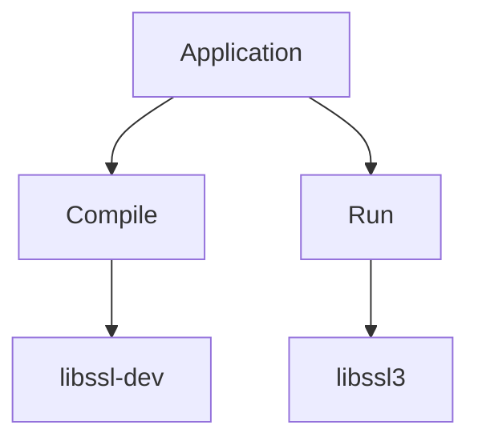
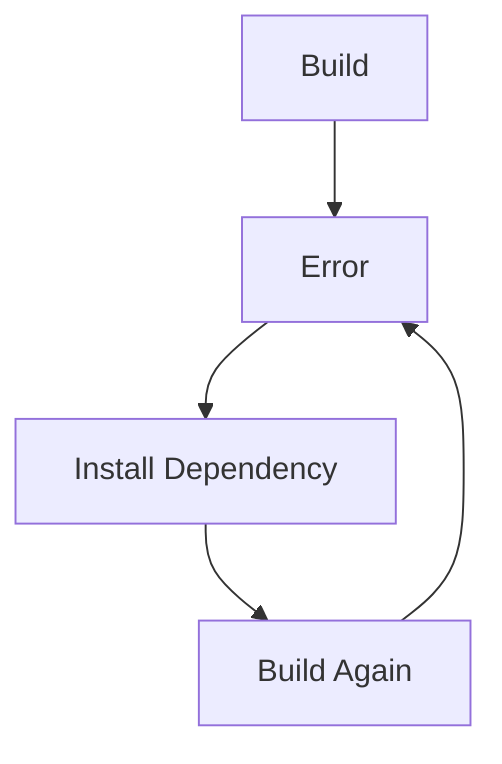
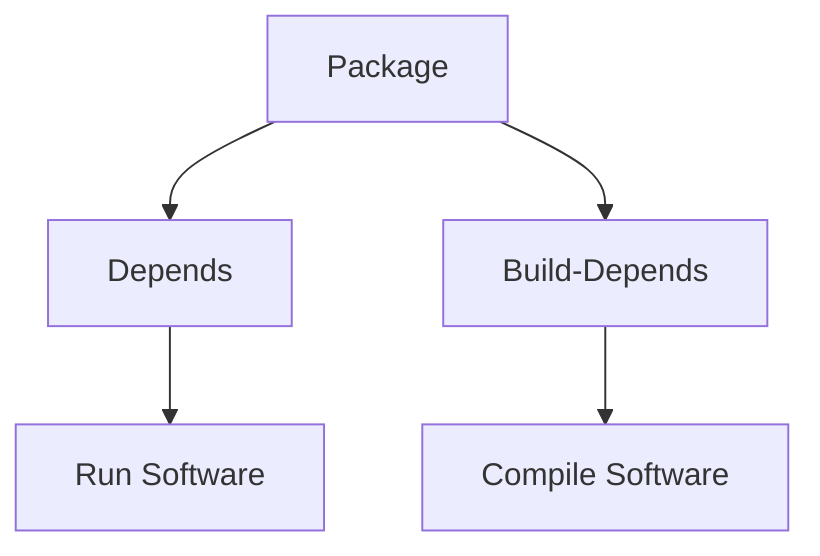
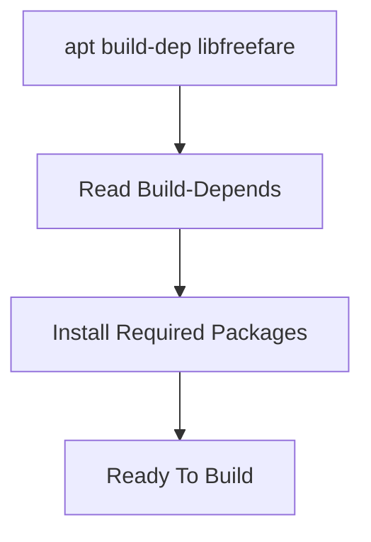
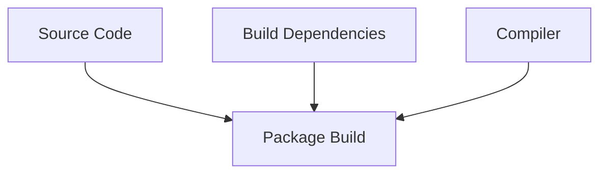
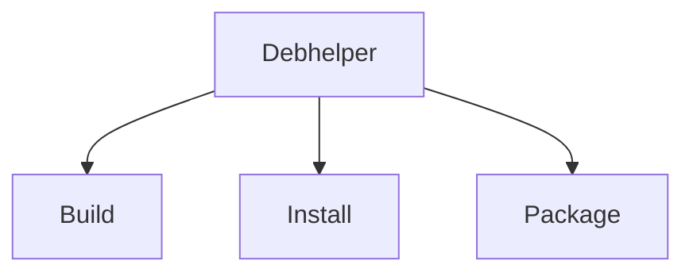
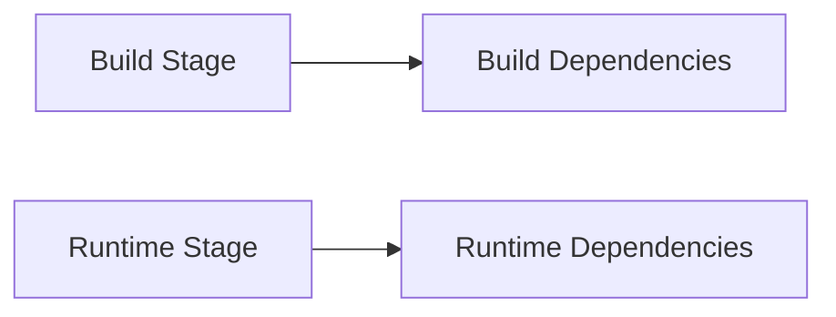
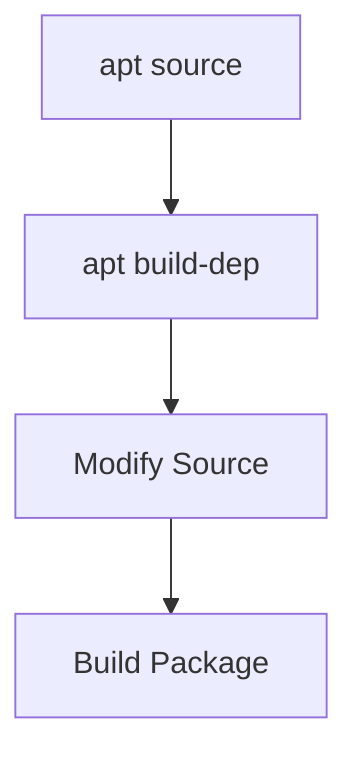
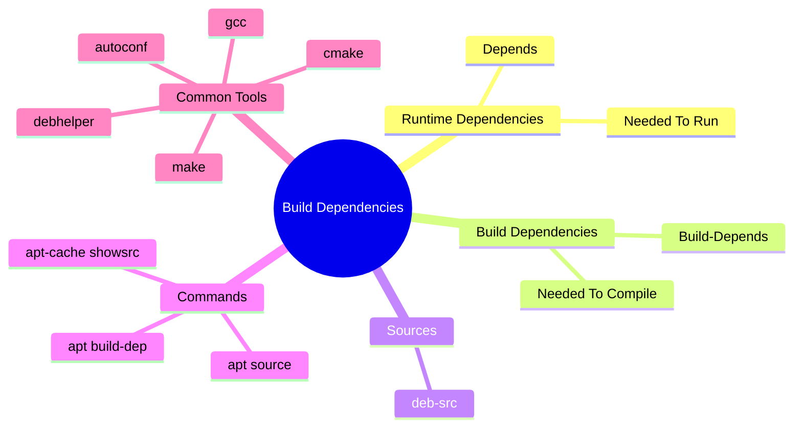

# Section 10.1.2 — Installing Build Dependencies

You now have the source code:

```text
libfreefare/

├── src/
├── tests/
├── README
└── debian/
```

So naturally you think:

```bash
cd libfreefare
make
```

and you're done.

---

## Reality

Most software depends on:

```text
Libraries

Header Files

Compilers

Build Tools

Code Generators
```

Without them:

```bash
make
```

usually explodes.

---

# Example Failure

Suppose source code contains:

```c
#include <openssl/ssl.h>
```

Compiler runs:

```bash
gcc test.c
```

Error:

```text
openssl/ssl.h: No such file or directory
```

---

# Why?

Because:

```text
openssl library installed
```

does NOT mean:

```text
openssl development headers installed
```

---

# Runtime vs Development Package

This is one of the most important Linux concepts.

---

## Runtime Package

Used when running software.

Example:

```text
libssl3
```

Contains:

```text
Compiled Libraries
```

Example:

```text
/usr/lib/libssl.so
```

---

## Development Package

Used when compiling software.

Example:

```text
libssl-dev
```

Contains:

```text
Header Files

Development Libraries
```

Example:

```text
/usr/include/openssl/ssl.h
```

---



---

# Traditional Linux Pain

Before package managers helped:

Developer sees:

```text
Missing openssl header
```

---

Installs:

```bash
apt install libssl-dev
```

---

Next build error:

```text
Missing libusb header
```

---

Installs:

```bash
apt install libusb-dev
```

---

Next error:

```text
Missing zlib header
```

---

Repeat forever.

---



This was extremely painful.

---

# Debian's Solution

The package maintainer already knows:

```text
Everything required to build package
```

So they record it.

---

# Build-Depends

Inside:

```text
debian/control
```

you'll find:

```text
Build-Depends:
 debhelper
 libssl-dev
 zlib1g-dev
 libusb-dev
 gcc
```

---

Think:

```text
Depends
=
Needed To Run

Build-Depends
=
Needed To Compile
```

---



---

# Viewing Build Dependencies

Open:

```bash
cat debian/control
```

Example:

```text
Build-Depends:
 debhelper-compat (=13),
 libssl-dev,
 libusb-dev
```

---

# Manual Installation

You could install them one by one:

```bash
sudo apt install \
libssl-dev \
libusb-dev \
debhelper
```

But that's annoying.

---

# Debian Magic

Use:

```bash
sudo apt build-dep package-name
```

Example:

```bash
sudo apt build-dep libfreefare
```

---

APT reads:

```text
Build-Depends
```

and installs everything automatically.

---



---

# What Happens Internally?

Suppose:

```text
Build-Depends:

gcc
make
libssl-dev
zlib1g-dev
```

---

APT translates to:

```bash
sudo apt install \
gcc \
make \
libssl-dev \
zlib1g-dev
```

automatically.

---

# Why Doesn't Everyone Use build-dep?

Because:

```text
APT needs source repositories enabled
```

Remember:

```text
deb
```

for binary packages.

---

and:

```text
deb-src
```

for source packages.

---

Without:

```text
deb-src
```

APT cannot read:

```text
Build-Depends
```

information.

---

# Common Error

```bash
sudo apt build-dep nmap
```

Error:

```text
You must put some source URIs
in your sources.list
```

---

Meaning:

```text
deb-src missing
```

---

# Fix

Edit:

```text
/etc/apt/sources.list
```

Add:

```text
deb-src http://http.kali.org/kali kali-rolling main contrib non-free
```

Then:

```bash
sudo apt update
```

---

Now:

```bash
sudo apt build-dep nmap
```

works.

---

# Build Environment

Once dependencies are installed:



---

# Typical Build Dependencies

Almost every package needs some combination of:

```text
gcc

g++

make

debhelper

pkg-config

autoconf

automake

cmake
```

---

# What Is debhelper?

You'll see this everywhere.

Example:

```text
Build-Depends:
 debhelper-compat (=13)
```

---

Think:

```text
Package Building Framework
```

---

Instead of manually writing:

```text
Install Files

Compress Docs

Generate Metadata

Create Package
```

Debhelper automates it.

---



---

# Build Dependencies vs Normal Dependencies

Example:

```text
Wireshark
```

---

Build Dependencies:

```text
gcc
qt-dev
libpcap-dev
cmake
```

Needed only during compilation.

---

Runtime Dependencies:

```text
libpcap
qt libraries
```

Needed after installation.

---



---

# Checking Build Dependencies

APT command:

```bash
apt-cache showsrc package-name
```

Example:

```bash
apt-cache showsrc nmap
```

---

Output includes:

```text
Build-Depends:
```

section.

---

# Developer Workflow So Far

## Step 1

Get source:

```bash
apt source package
```

---

## Step 2

Install build dependencies:

```bash
sudo apt build-dep package
```

---

## Step 3

Modify source code.

---

## Step 4

Build package.

---



---

# Real Example

Suppose you want to modify:

```text
nmap
```

Workflow:

```bash
apt source nmap

sudo apt build-dep nmap

cd nmap-*
```

Edit code:

```text
src/
```

Then later:

```bash
dpkg-buildpackage
```

(we'll learn this next)

---

# Mindmap Summary



---

# The Mental Model

```text
Depends
=
Software needs this AFTER installation

Build-Depends
=
Developer needs this BEFORE compilation

apt install
=
Install runtime dependencies

apt build-dep
=
Install build dependencies
```

---

# Next Section: Understanding the `debian/` Directory

Now that you have:

```text
Source Code ✓

Build Dependencies ✓
```

the next question becomes:

```text
What is inside:

debian/

control
rules
changelog
copyright
patches
source
```

That directory is the heart of Debian packaging, and once you understand it, you'll understand how Debian turns source code into `.deb` packages.