# Section 10.1.4 — Building Your First Debian Package

Up to now you've done:

```bash
apt source nmap
```

Downloaded source.

---

```bash
apt build-dep nmap
```

Installed build dependencies.

---

Modified code.

Now comes the important part:

```text
Turn Source Code

Into

.deb Package
```

---

# Big Picture

Before:

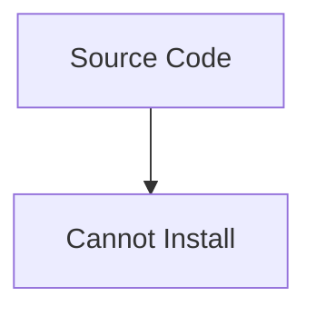

---

After build:

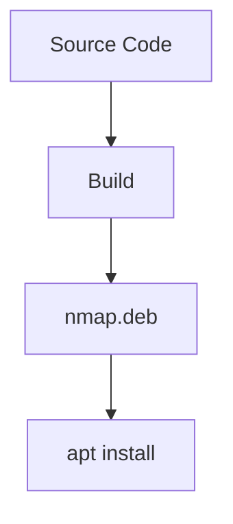

---

# The Main Tool

Most Debian packages are built with:

```bash
dpkg-buildpackage
```

Think:

```text
gcc builds programs

dpkg-buildpackage builds packages
```

---

# What Happens Internally?

When you run:

```bash
dpkg-buildpackage
```

Debian performs:

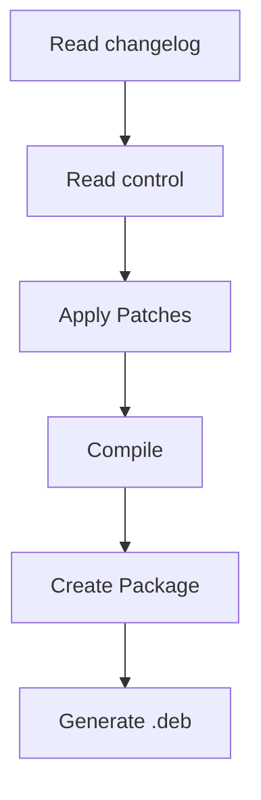

---

# Typical Workflow

Move into source directory:

```bash
cd nmap-7.95
```

Build:

```bash
dpkg-buildpackage
```

---

Output:

```text
../nmap_7.95-1_amd64.deb
```

---

# Why Build Happens Outside Directory

Suppose:

```text
nmap-7.95/
```

---

Result:

```text
nmap-7.95/

../nmap_7.95-1_amd64.deb
```

---

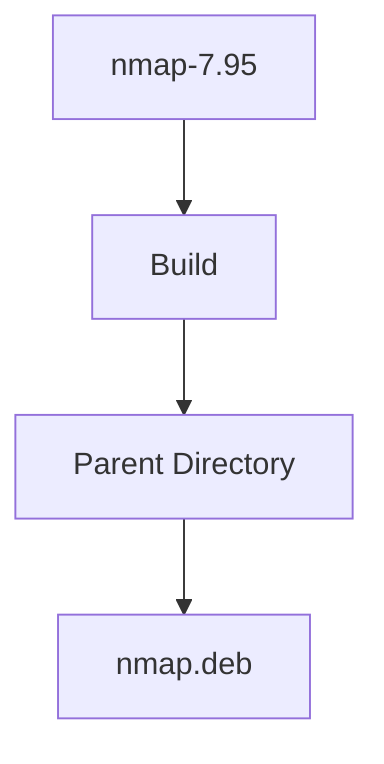

---

# Important Files Produced

After build:

```text
nmap_7.95-1_amd64.deb

nmap_7.95-1.dsc

nmap_7.95.orig.tar.gz

nmap_7.95.debian.tar.xz

.buildinfo

.changes
```

---

# What Are These?

## .deb

Binary package.

Installable.

```bash
sudo dpkg -i package.deb
```

---

## .dsc

Source package description.

---

## .changes

Summary of build results.

Used when uploading packages.

---

## .buildinfo

Records:

```text
Compiler Version

Libraries

Build Environment
```

Useful for reproducible builds.

---

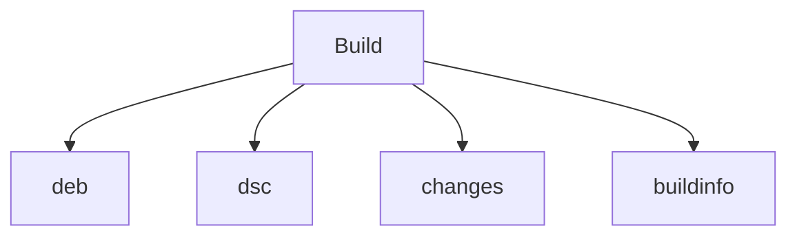

---

# Common Problem #1

Build Stops Immediately

Example:

```text
dpkg-checkbuilddeps:
Unmet build dependencies
```

---

Meaning:

```text
Build Dependency Missing
```

---

Fix:

```bash
sudo apt build-dep package
```

---

# Common Problem #2

Permission Errors

Example:

```text
cannot create file
permission denied
```

---

Why?

Because package creation normally needs:

```text
root ownership
```

inside package metadata.

But you shouldn't compile as root.

---

# Enter fakeroot

This is one of Debian's coolest tools.

---

# Problem

Package contains:

```text
root owned files
```

---

But you're normal user:

```text
user = kali
```

---

How can build pretend files belong to root?

---

Solution:

```bash
fakeroot
```

---

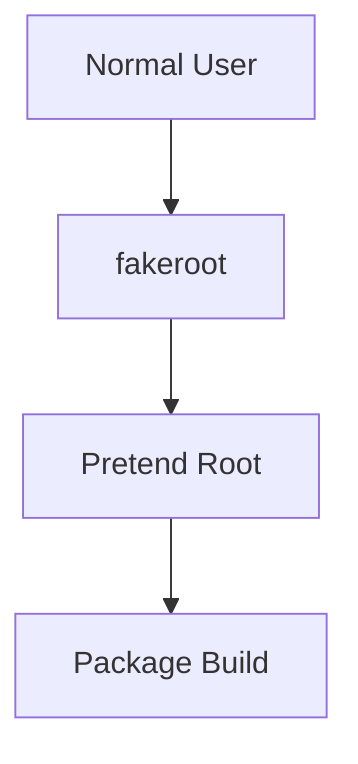

---

# Example

Instead of:

```bash
sudo dpkg-buildpackage
```

use:

```bash
fakeroot dpkg-buildpackage
```

---

Much safer.

---

# Why Not Build As Root?

Imagine build system contains:

```makefile
rm -rf /
```

bug.

---

Running as root:

```text
Disaster
```

---

Running as user:

```text
Contained Damage
```

---

# Modern Shortcut

Most developers use:

```bash
dpkg-buildpackage -rfakeroot
```

---

Meaning:

```text
Use fakeroot automatically
```

---

# Build Options

---

## Build Binary Package

```bash
dpkg-buildpackage -b
```

Produces:

```text
.deb
```

only.

---

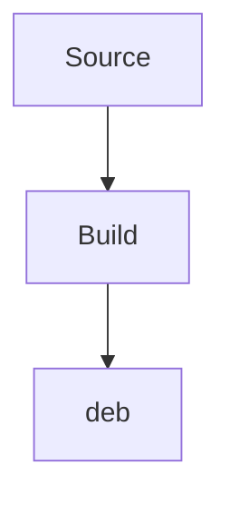

---

## Build Source Package

```bash
dpkg-buildpackage -S
```

Produces:

```text
.dsc
.orig.tar.gz
.debian.tar.xz
```

---

Useful for sharing source.

---

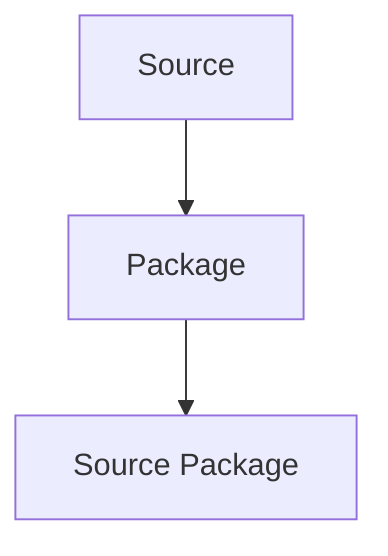

---

## Build Everything

```bash
dpkg-buildpackage
```

Produces:

```text
Binary Package

Source Package
```

---

# What Does rules Do?

Remember:

```text
debian/rules
```

is package recipe.

---

During build:

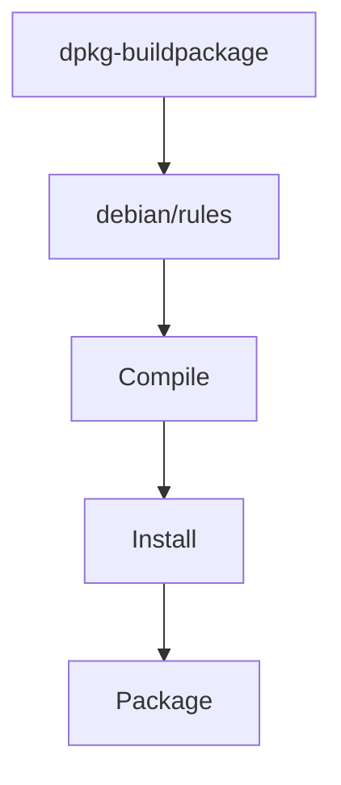

---

# Modern Rules File

Most packages:

```makefile
#!/usr/bin/make -f

%:
	dh $@
```

---

Meaning:

```text
Ask debhelper
to do everything
```

---

# The dh Tool

Think:

```text
Master Packaging Robot
```

---

Instead of manually:

```text
Compile

Install Files

Compress Docs

Create Package
```

---

One command:

```text
dh
```

handles it.

---

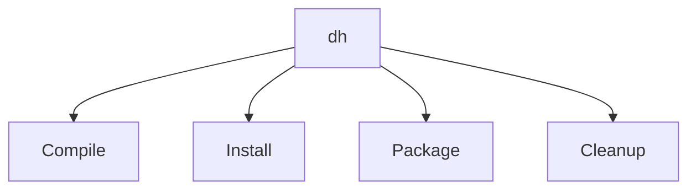

---

# Build Sequence

Internally Debian executes many stages.

---

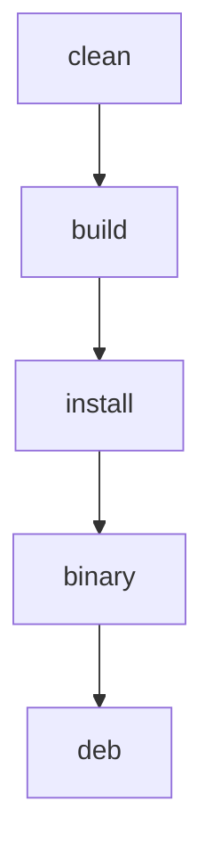

---

# Think Like A Factory

```text
clean
=
Empty Factory

build
=
Manufacture Product

install
=
Arrange Product

binary
=
Create Package Layout

deb
=
Seal Shipping Box
```

---

# debuild

Many developers prefer:

```bash
debuild
```

instead of:

```bash
dpkg-buildpackage
```

---

Why?

Because it wraps:

```text
dpkg-buildpackage

Checks

Signing

Validation
```

---

Think:

```text
debuild
=
Professional Builder
```

---

# Typical Developer Workflow

Download source:

```bash
apt source nmap
```

---

Install build dependencies:

```bash
sudo apt build-dep nmap
```

---

Modify source.

---

Update version:

```bash
dch -i
```

_(updates changelog)_

---

Build:

```bash
debuild -us -uc
```

---

Result:

```text
nmap_custom.deb
```

---

# Understanding -us -uc

Normally Debian expects signatures.

---

Skip source signing:

```bash
-us
```

---

Skip changelog signing:

```bash
-uc
```

---

Useful for local builds.

---

# Complete Build Lifecycle

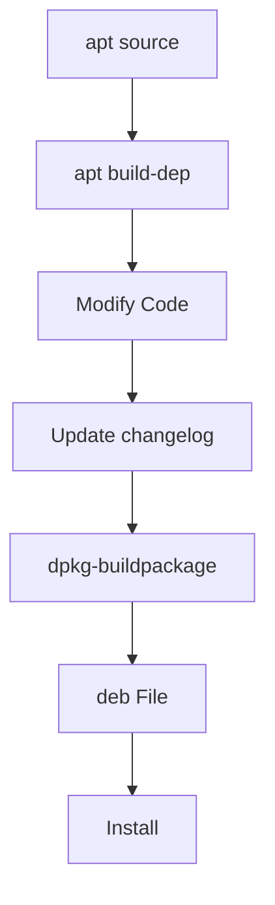

---

# Real Example

Modify:

```text
libfreefare
```

---

Download:

```bash
apt source libfreefare
```

---

Dependencies:

```bash
sudo apt build-dep libfreefare
```

---

Build:

```bash
cd libfreefare*

dpkg-buildpackage -rfakeroot
```

---

Result:

```text
../libfreefare_0.4.0_amd64.deb
```

---

Install:

```bash
sudo dpkg -i ../libfreefare*.deb
```

---

# Mindmap Summary

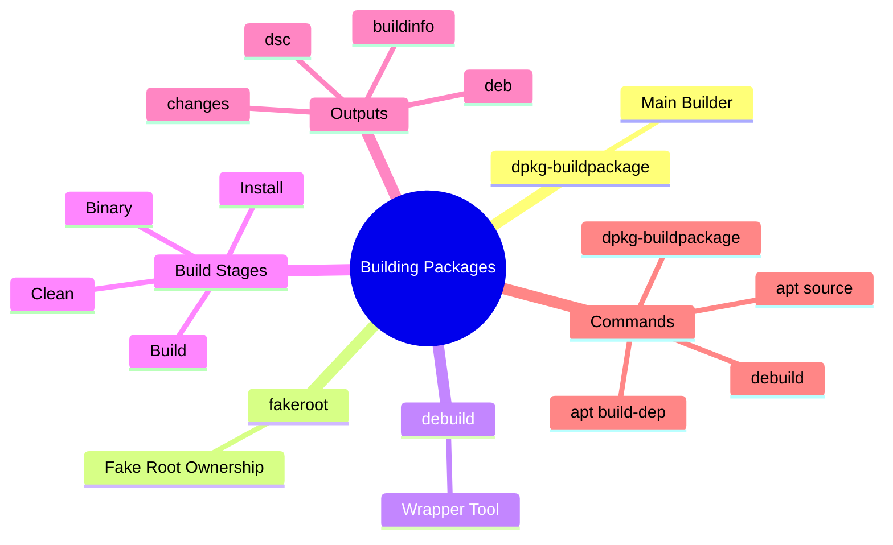

---

# The Mental Model

```text
Source Code
        +
debian/
        +
Build Dependencies
        ↓

dpkg-buildpackage

        ↓

.deb Package

        ↓

dpkg -i

        ↓

Installed Software
```

---

## Before Next Section

So far you've learned:

```text
Get Source ✓

Install Build Dependencies ✓

Understand debian/ ✓

Build Package ✓
```

The next section is where Debian becomes really powerful:

```text
Patches

Quilt

Maintaining Modifications

Updating Packages Across Versions
```

This is how Debian can maintain thousands of package fixes without permanently modifying upstream source code. That's the part most Kali and Debian maintainers use daily