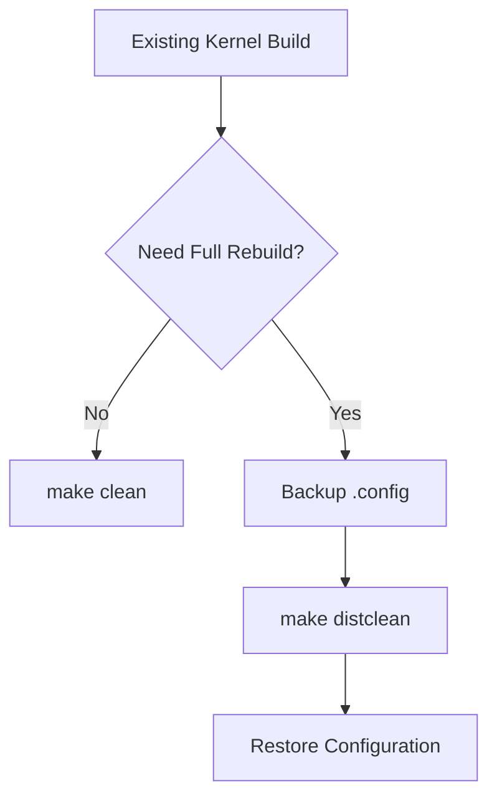
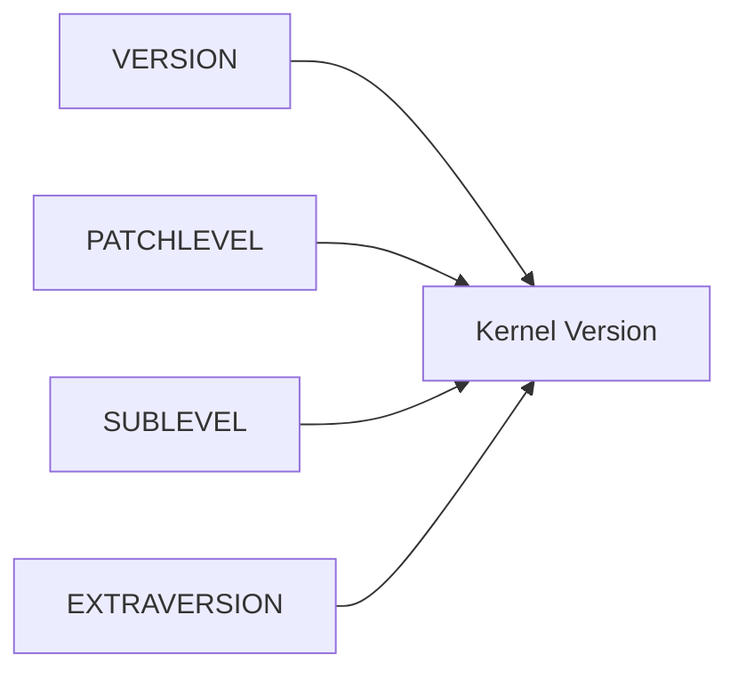
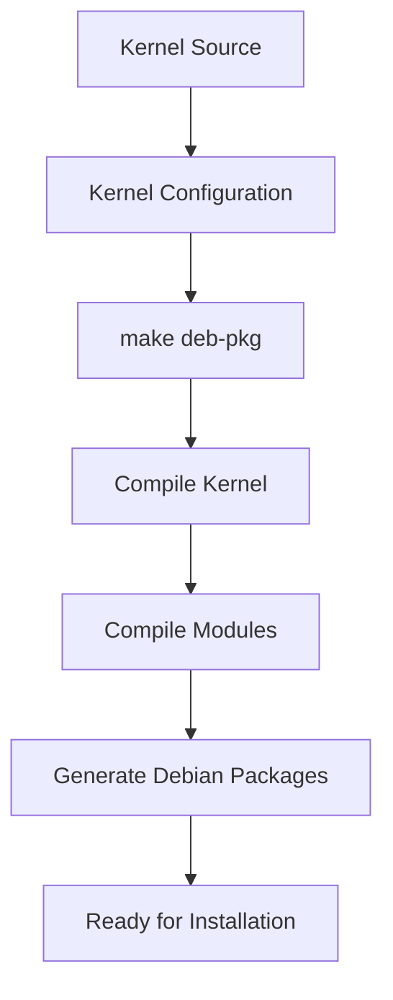
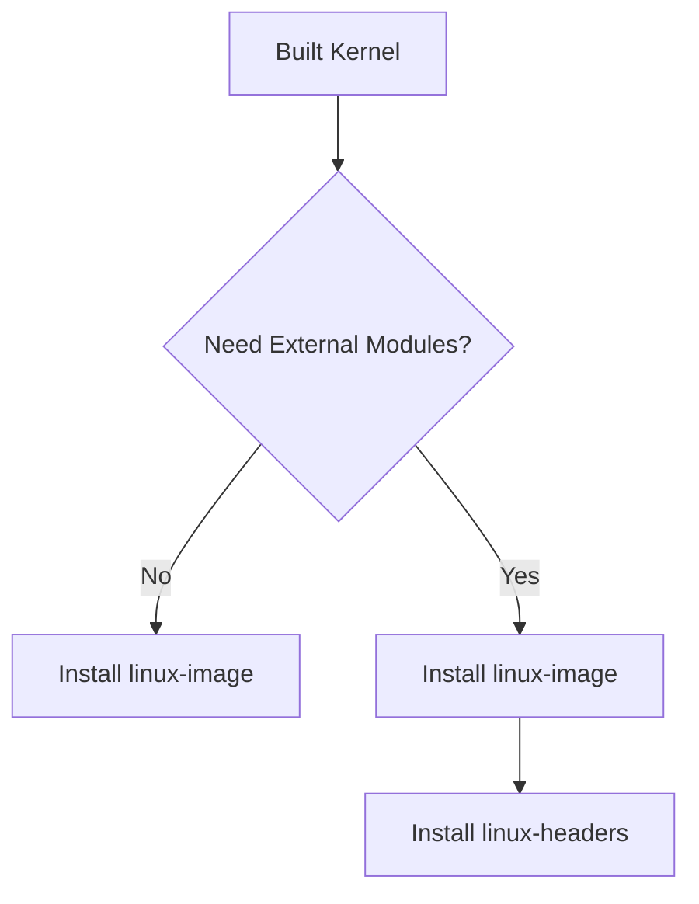
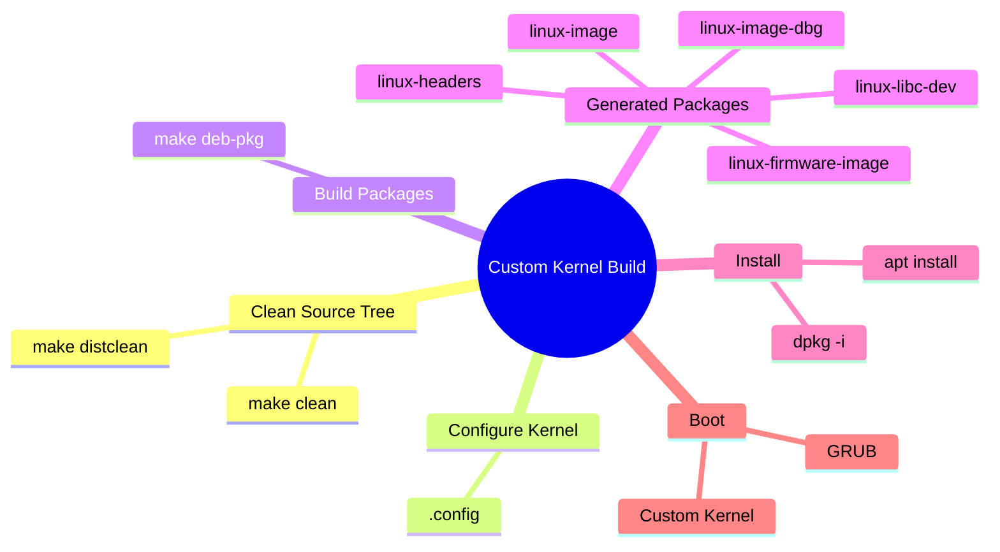

# Section 2 — Compiling and Building a Custom Linux Kernel Package

> After configuring the Linux kernel, the final stage is compilation and packaging. Rather than producing a raw kernel image manually, Debian and Kali provide tooling that builds installable `.deb` packages. This integrates the custom kernel into the package management system, making installation, upgrades, and removal predictable and maintainable.

---

# Why Build the Kernel as a Package?

A kernel can be compiled manually, but doing so creates management challenges.

Instead, Kali recommends building Debian packages.

### Benefits

|Manual Build|Debian Package Build|
|---|---|
|Difficult to track|Managed by dpkg/apt|
|Manual installation|Standard package installation|
|Harder upgrades|Versioned packages|
|Harder rollback|Easy rollback|
|No dependency tracking|Integrated with package manager|

---

# Step 1 — Clean Previous Build Artifacts

Before rebuilding, remove old compiled files.

Kernel source trees accumulate:

- Object files (`*.o`)
    
- Compiled modules
    
- Temporary build artifacts
    
- Generated files
    

These can interfere with a fresh build.

---

## Basic Cleanup

```bash
make clean
```

Removes:

```text
Compiled object files
Temporary build files
Generated binaries
```

Keeps:

```text
.config
```

---

## Deep Cleanup

```bash
make distclean
```

Removes:

```text
Compiled files
Temporary files
Generated files
.config
```

⚠️ Important:

Always back up `.config` before running:

```bash
cp .config ~/kernel-config-backup
```

---

## Build Cleanup Workflow



---

# Step 2 — Build Debian Packages

Once kernel configuration is complete:

```bash
make deb-pkg
```

This command does **much more** than compiling the kernel.

It:

1. Compiles kernel source
    
2. Builds modules
    
3. Creates package metadata
    
4. Generates installable Debian packages
    

---

# What Gets Generated?

A kernel build can generate up to five packages.

---

## Package 1 — linux-image

### Purpose

Contains:

```text
Kernel Image
Kernel Modules
Boot Files
```

Example:

```text
linux-image-4.9.0-kali1-custom
```

### Required?

✅ Yes

This is the package that actually boots the system.

---

## Package 2 — linux-headers

### Purpose

Contains:

```text
Kernel Header Files
Build Interfaces
```

Used by:

```text
DKMS Modules
NVIDIA Drivers
VirtualBox Modules
VMware Modules
WireGuard (older systems)
```

Example:

```text
linux-headers-4.9.0-kali1-custom
```

### Required?

Only if external kernel modules must be built.

---

## Package 3 — linux-firmware-image

### Purpose

Contains firmware required by hardware drivers.

Examples:

```text
Wi-Fi firmware
Bluetooth firmware
GPU firmware
NIC firmware
```

### Important

This package may not always be generated.

Particularly when building from:

```text
Debian sources
Kali sources
```

---

## Package 4 — linux-image-dbg

### Purpose

Contains:

```text
Kernel Debug Symbols
Module Debug Symbols
```

Used for:

```text
Kernel crash analysis
Tracing
Debugging
Development
```

### Required?

Usually no.

---

## Package 5 — linux-libc-dev

### Purpose

Contains:

```text
Userspace kernel headers
```

Required by:

```text
glibc
Certain development tools
```

### Required?

Usually no.

---

# Understanding Kernel Versioning

Kernel package names are automatically generated.

Version construction follows:



Example:

```text
VERSION=4
PATCHLEVEL=9
SUBLEVEL=2
```

Produces:

```text
4.9.2
```

---

# LOCALVERSION

Custom suffixes can be added.

Example:

```bash
LOCALVERSION=-custom
```

Result:

```text
4.9.0-kali1-custom
```

This makes your kernel easily identifiable.

---

## Why Use LOCALVERSION?

Without it:

```text
4.9.0-kali1
```

With it:

```text
4.9.0-kali1-custom
```

Useful when:

- Testing kernels
    
- Building multiple variants
    
- Avoiding confusion with official kernels
    

---

# KDEB_PKGVERSION

Controls package version numbering.

Example:

```bash
KDEB_PKGVERSION=$(make kernelversion)-1
```

Produces:

```text
4.9.2-1
```

instead of relying on automatically incremented revisions.

---

# Recommended Build Command

```bash
make deb-pkg \
LOCALVERSION=-custom \
KDEB_PKGVERSION=$(make kernelversion)-1
```

---

# Build Process Overview



---

# Example Output

After a successful build:

```bash
ls ../*.deb
```

Output:

```text
linux-headers-4.9.0-kali1-custom_4.9.2-1_amd64.deb

linux-image-4.9.0-kali1-custom_4.9.2-1_amd64.deb

linux-image-4.9.0-kali1-custom-dbg_4.9.2-1_amd64.deb

linux-libc-dev_4.9.2-1_amd64.deb
```

---

# Step 3 — Install the Kernel

Install generated packages.

Minimum required package:

```text
linux-image
```

Installation:

```bash
sudo dpkg -i linux-image-*.deb
```

---

# When Are Headers Needed?

Check for DKMS packages:

```bash
dpkg -l "*-dkms" | grep ^ii
```

Example output:

```text
nvidia-dkms
virtualbox-dkms
```

If any exist:

Install headers too.

```bash
sudo dpkg -i linux-headers-*.deb
```

---

# Kernel Installation Decision Tree



---

# Which Packages Should You Install?

|Package|Typical User|
|---|---|
|linux-image|Required|
|linux-headers|Only if DKMS/modules are needed|
|linux-firmware-image|Usually optional|
|linux-image-dbg|Developers only|
|linux-libc-dev|Developers only|

---

# Important Real-World Tip

When testing a custom kernel:

**Never remove the working kernel immediately.**

Keep at least one known-good kernel installed.

This provides a recovery path if:

- Kernel fails to boot
    
- Driver crashes occur
    
- Hardware becomes unsupported
    

Recommended layout:

```text
linux-image-kali-official
linux-image-custom
```

GRUB will allow selection of either kernel at boot.

---

# Mental Model



---

# Section 2 Summary

### Cleanup Commands

```bash
make clean
make distclean
```

### Build Command

```bash
make deb-pkg
```

### Recommended Build

```bash
make deb-pkg \
LOCALVERSION=-custom \
KDEB_PKGVERSION=$(make kernelversion)-1
```

### Most Important Package

```text
linux-image
```

### Install Headers Only If

```bash
dpkg -l "*-dkms" | grep ^ii
```

returns installed DKMS packages.

### Key Takeaway

The kernel build process in Kali is designed to produce **standard Debian packages**, allowing a custom kernel to be managed just like any other package in the operating system. This preserves the reliability, upgradeability, and maintainability of the system while still allowing deep kernel customization.