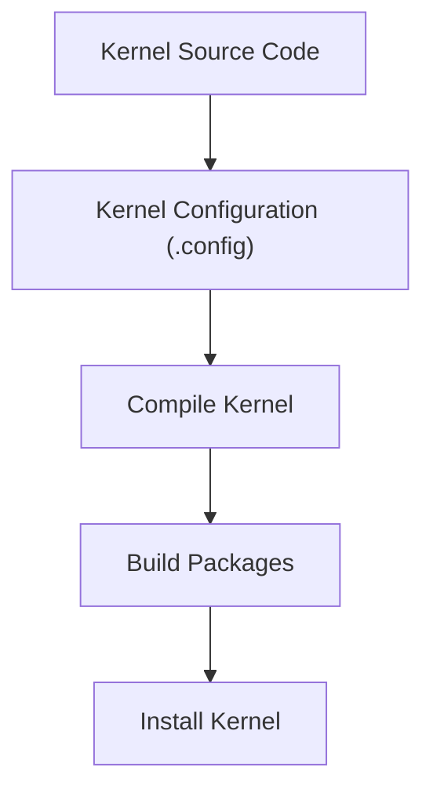
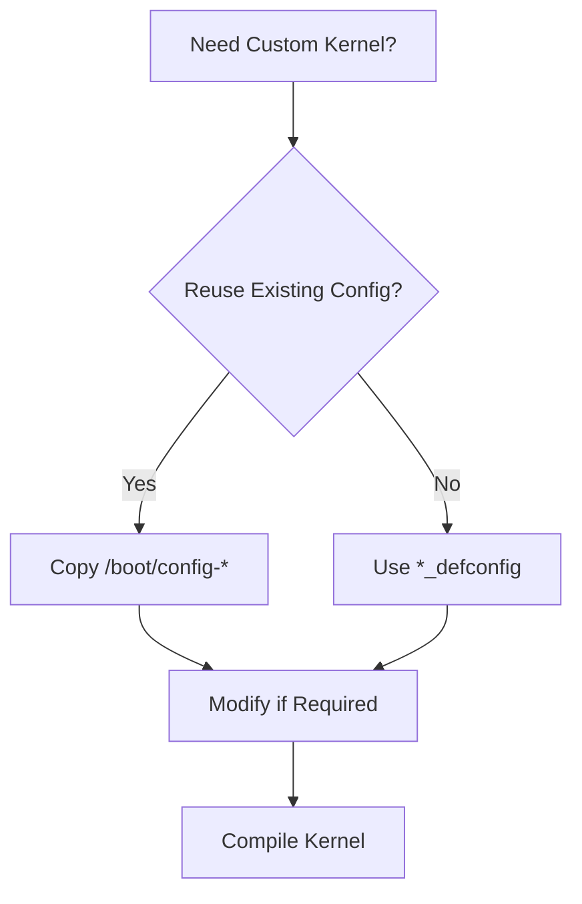
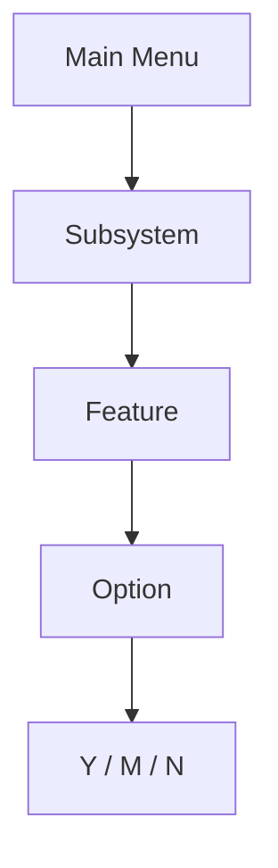
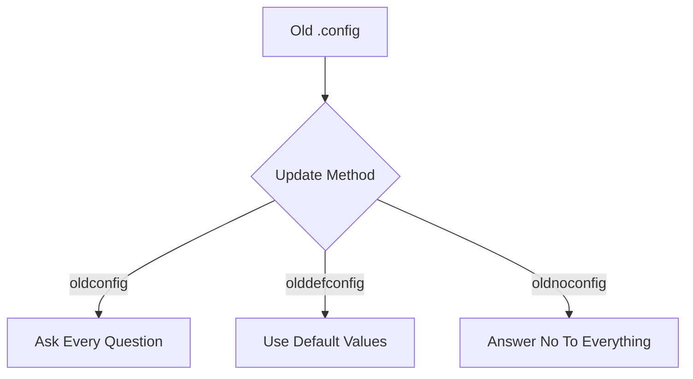
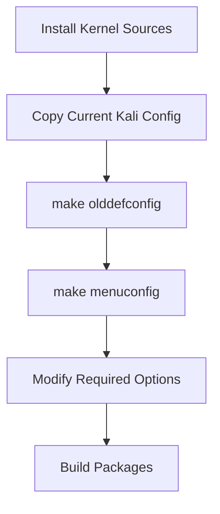

# Section 2 — Configuring the Linux Kernel

> Before a kernel can be compiled, it must be configured. The Linux kernel contains thousands of configurable options controlling CPU support, drivers, filesystems, networking features, security mechanisms, debugging capabilities, and much more. The configuration phase determines exactly what functionality will be included in the final kernel image.

---

# Why Kernel Configuration Matters

The Linux kernel is designed to support an enormous range of hardware and use cases.

A single source tree can produce kernels for:

- Servers
    
- Workstations
    
- Laptops
    
- Embedded devices
    
- Virtual machines
    
- Routers
    
- Security appliances
    

Configuration determines:

```text
What hardware is supported
What drivers are included
What filesystems are available
What security features are enabled
What debugging capabilities exist
```

---

# The Kernel Build Dependency Chain

Before compilation can begin:



Without a valid `.config` file:

```text
No kernel build is possible.
```

---

# The .config File

The kernel configuration is stored in:

```bash
.config
```

located in the root of the kernel source tree.

Example:

```text
linux-source-4.9/
├── Makefile
├── arch/
├── drivers/
├── fs/
├── net/
└── .config
```

---

# Recommended Approach: Reuse Kali's Configuration

Most administrators do **not** configure a kernel from scratch.

Instead:

```text
Start with Kali's working configuration.
Modify only what is necessary.
```

This ensures:

- Hardware support remains intact
    
- Security settings remain consistent
    
- Stability remains close to official kernels
    

---

# Finding the Current Kernel Configuration

Kali stores the active kernel configuration in:

```text
/boot
```

First determine the running kernel:

```bash
uname -r
```

Example:

```text
4.9.0-kali1-amd64
```

---

## Copy Existing Configuration

```bash
cp /boot/config-4.9.0-kali1-amd64 \
~/kernel/linux-source-4.9/.config
```

Result:


This is the most common workflow.

---

# Alternative: Use Architecture Defaults

The kernel source tree contains predefined configurations.

Location:

```text
arch/<architecture>/configs/
```

Examples:

```text
arch/x86/configs/
arch/arm/configs/
arch/arm64/configs/
```

---

## For 64-bit Systems

```bash
make x86_64_defconfig
```

Generates:

```text
.config
```

with default settings for x86-64 systems.

---

## For 32-bit Systems

```bash
make i386_defconfig
```

Generates:

```text
.config
```

for 32-bit x86 hardware.

---

# Configuration Strategy



---

# When Can You Skip Configuration?

If:

- You copied Kali's configuration
    
- No changes are required
    

Then:

```text
You can immediately proceed to kernel compilation.
```

No further configuration work is necessary.

---

# Interactive Kernel Configuration Tools

When changes are required, the kernel provides several interfaces.

All are launched using:

```bash
make <target>
```

---

# Option 1 — make menuconfig

This is the most widely used configuration interface.

Launch:

```bash
make menuconfig
```

---

## What It Looks Like

A text-based interface running inside the terminal.

Example hierarchy:

```text
General Setup
 ├── Networking Support
 ├── Device Drivers
 ├── File Systems
 └── Security Options
```

---

## Requirements

```bash
libncurses5-dev
```

must be installed.

---

## Navigation Controls

|Key|Action|
|---|---|
|↑ ↓ ← →|Move around|
|Space|Change option|
|Enter|Select|
|Esc|Return|
|Help|Show detailed explanation|

---

## Configuration States

Most options have three possible states.

```text
Y = Built into kernel
M = Build as module
N = Disabled
```

---

## Visual Representation


Pressing:

```text
Space
```

cycles through available values.

---

# Understanding Built-In vs Module

This is one of the most important kernel concepts.

---

## Built Into Kernel

```text
Y
```

Feature becomes part of:

```text
vmlinuz
```

Advantages:

- Always available
    
- No module loading required
    

Disadvantages:

- Larger kernel image
    
- Requires reboot after rebuild
    

---

## Loadable Module

```text
M
```

Produces:

```text
module.ko
```

Advantages:

- Smaller kernel
    
- Load/unload dynamically
    

Examples:

```bash
modprobe e1000e
modprobe nf_conntrack
```

---

## Disabled

```text
N
```

Feature not compiled.

Consumes:

```text
Zero memory
Zero disk space
```

---

# menuconfig Navigation Model



---

# Option 2 — make xconfig

Graphical Qt interface.

Launch:

```bash
make xconfig
```

---

## Requirements

```bash
libqt4-dev
```

---

## Advantages

- Search capabilities
    
- Easier navigation
    
- Modern GUI
    

---

## Typical Usage

Preferred on:

```text
Desktop systems
Workstations
```

---

# Option 3 — make gconfig

GTK-based graphical interface.

Launch:

```bash
make gconfig
```

---

## Requirements

```bash
libglade2-dev
libgtk2.0-dev
```

---

## Characteristics

Provides functionality similar to:

```text
make xconfig
```

but uses GTK instead of Qt.

---

# Configuration Interface Comparison

|Tool|Interface|Dependencies|
|---|---|---|
|menuconfig|Text UI|libncurses5-dev|
|xconfig|Qt GUI|libqt4-dev|
|gconfig|GTK GUI|libglade2-dev, libgtk2.0-dev|

---

# Working with Older Configuration Files

One of the most common real-world situations.

You copy:

```text
.config
```

from:

```text
Kernel 5.x
```

and attempt to build:

```text
Kernel 6.x
```

The new kernel introduces:

```text
New drivers
New security features
New filesystems
New networking options
```

Your old configuration knows nothing about them.

---

# Updating an Older Configuration

Kernel provides specialized tools.

---

## make oldconfig

```bash
make oldconfig
```

Behavior:

```text
Reads old .config
Detects new options
Asks questions interactively
```

Example:

```text
Enable New Security Feature? (Y/n/?)
```

You answer each question manually.

---

## make olddefconfig

```bash
make olddefconfig
```

Behavior:

```text
Reads old .config
Automatically chooses default values
```

No user interaction.

---

## make oldnoconfig

```bash
make oldnoconfig
```

Behavior:

```text
Reads old .config
Answers No to every new option
```

Useful when you want a minimal kernel.

---

# Comparing Update Methods



---

# Which Method Should You Use?

|Method|Recommended For|
|---|---|
|oldconfig|Learning and full control|
|olddefconfig|Most administrators|
|oldnoconfig|Minimal/custom kernels|

---

# Practical Kali Workflow

In real environments, most administrators follow:



This preserves:

- Kali defaults
    
- Hardware support
    
- Stability
    

while still allowing customization.

---

# Important Kernel Configuration Concepts

### Rule #1

Start from Kali's configuration whenever possible.

---

### Rule #2

Only modify options you understand.

A disabled storage or filesystem driver can make the system unbootable.

---

### Rule #3

Use modules (`M`) whenever practical.

This keeps the kernel:

```text
Smaller
More flexible
Easier to maintain
```

---

### Rule #4

When upgrading between kernel versions:

```bash
make olddefconfig
```

is usually the safest option.

---

# Section Summary

### Reuse Existing Configuration

```bash
uname -r

cp /boot/config-$(uname -r) .config
```

### Default Configurations

```bash
make x86_64_defconfig
make i386_defconfig
```

### Interactive Configuration

```bash
make menuconfig
```

### GUI Alternatives

```bash
make xconfig
make gconfig
```

### Update Old Configurations

```bash
make oldconfig
make olddefconfig
make oldnoconfig
```

### Key Takeaway

The `.config` file is the blueprint of the kernel. Every driver, subsystem, security feature, filesystem, and networking capability included in the final kernel is determined during this phase. Most Kali users should begin with the currently running kernel's configuration and make only targeted changes before proceeding to compilation.