# Section 3 — Building Custom Kali Live ISO Images

> Kali Linux can be customized far beyond installing packages after deployment. By modifying the live-build configuration, administrators can create completely customized ISO images containing specific tools, configurations, files, desktop environments, automated setup logic, and even custom boot-time behavior. This allows Kali to be transformed into a purpose-built operating system for a particular mission or environment. 

---

# Why Build a Custom Kali ISO?

The official Kali ISO is designed to satisfy the majority of users.

However, many situations benefit from a specialized image.

Examples include:

* Red Team appliances
* Wireless assessment platforms
* Forensics workstations
* Training environments
* CTF distributions
* Corporate penetration testing builds
* Automated deployment images

---

# Real Examples

The book mentions projects such as:

```text
Kali ISO of Doom
Kali Evil Wireless Access Point
```

These are not separate operating systems.

They are customized Kali builds.

---

# The Big Idea

Instead of:

```text
Install Kali
↓
Install 50 Packages
↓
Copy Custom Scripts
↓
Change Configuration
↓
Repeat on Every Machine
```

You can build:

```text
Custom ISO
↓
Boot
↓
Everything Already Configured
```

---

# High-Level Architecture

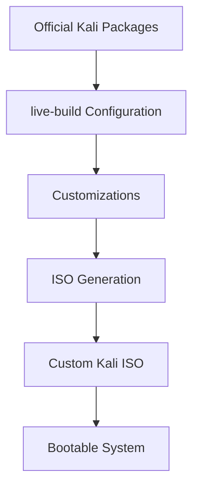

---

# What is live-build?

Kali uses:

```text
live-build
```

to create official ISO images.

---

## Definition

live-build is a framework that:

```text
Downloads Packages
Creates Filesystem
Applies Customizations
Generates Boot Media
Builds ISO Images
```

---

## Important Concept

Official Kali ISOs are built using the same mechanism.

You are not creating a "hack."

You are using the same workflow Kali developers use.

---

# Understanding the Build Configuration Repository

Kali provides a Git repository containing:

```text
live-build configuration
helper scripts
customization templates
```

Repository:

```text
live-build-config
```

---

# Build System Overview

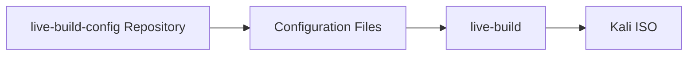

---

# Prerequisites

Before building images install:

```bash
sudo apt install curl git live-build
```

---

## Why These Packages?

| Package    | Purpose                           |
| ---------- | --------------------------------- |
| curl       | Download files                    |
| git        | Retrieve configuration repository |
| live-build | ISO build framework               |

---

# Downloading the Configuration

Clone Kali's repository:

```bash
git clone https://gitlab.com/kalilinux/build-scripts/live-build-config.git
```

Move into it:

```bash
cd live-build-config
```

---

# Repository Layout

```bash
ls
```

Output:

```text
auto
bin
build_all.sh
build.sh
kali-config
README.md
simple-cdd
```

---

# Directory Overview

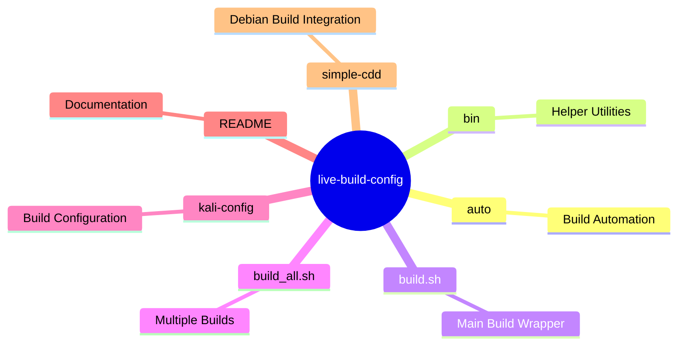

---

# Building an Unmodified ISO

Without changing anything:

```bash
./build.sh --verbose
```

---

## What Happens?

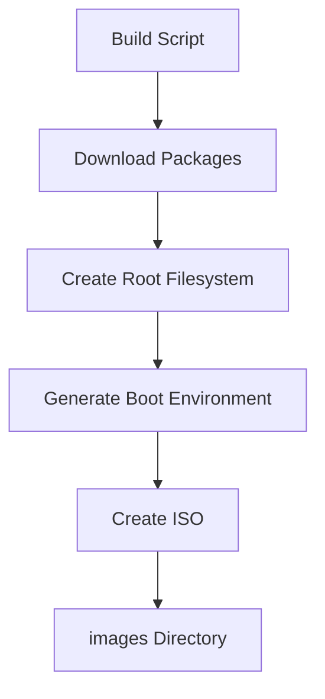

---

# Output Location

After completion:

```text
images/
```

contains:

```text
kali-linux-custom.iso
```

(or similar depending on configuration)

---

# Understanding Variants

The build wrapper supports:

```text
--variant
```

which selects a predefined configuration.

---

# Configuration Composition

The build process combines:

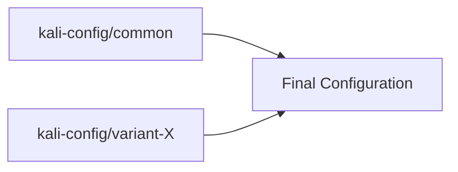

---

# Default Variant

If no variant is specified:

```bash
./build.sh
```

Kali automatically uses:

```text
default
```

---

# Desktop Environment Variants

The repository contains multiple desktop environments.

| Variant | Desktop Environment |
| ------- | ------------------- |
| e17     | Enlightenment       |
| gnome   | GNOME               |
| i3wm    | i3 Window Manager   |
| kde     | KDE Plasma          |
| lxde    | LXDE                |
| mate    | Mate                |
| xfce    | Xfce                |

---

# Building a KDE ISO

Example:

```bash
./build.sh --variant kde --verbose
```

---

# Variant Selection Flow

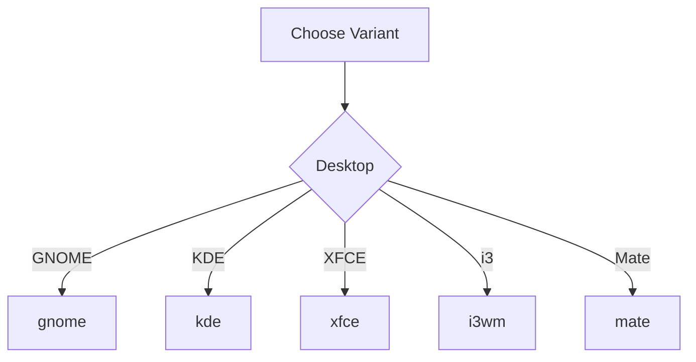

---

# Package Customization

One of the most common customizations is changing installed packages.

---

# Where Packages Are Defined

Location:

```text
package-lists/*.list.chroot
```

---

# Default Package List

Kali includes:

```text
package-lists/kali.list.chroot
```

which installs:

```text
kali-linux-default
```

---

# How Package Installation Works

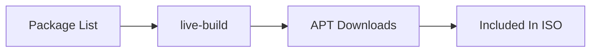

---

# Replacing Kali Default Packages

You can replace:

```text
kali-linux-default
```

with:

```text
kali-tools-top10
```

for a smaller image.

Or:

```text
kali-linux-everything
```

for a huge image.

---

# Understanding Kali Metapackages

A metapackage contains almost no files.

Its job is to install other packages.

---

# Metapackage Concept

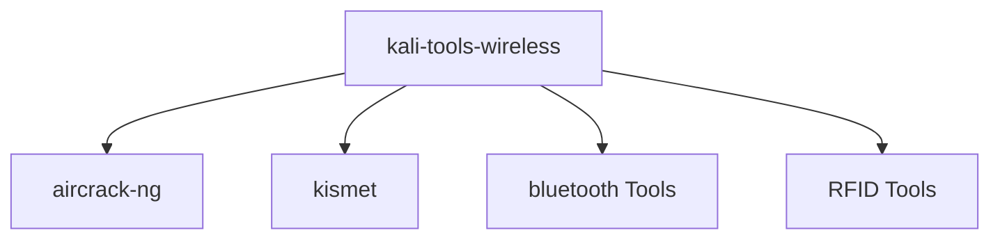

---

# Important Kali Metapackages

## Minimal System

```text
kali-linux-core
```

Contains:

```text
Base Operating System
```

---

## CLI-Focused System

```text
kali-linux-headless
```

Contains:

```text
Command-Line Tools
No GUI
```

---

## Standard Installation

```text
kali-linux-default
```

Contains:

```text
GUI
Common Tools
Default Experience
```

---

## Expanded Toolkit

```text
kali-linux-large
```

Contains:

```text
More Tools
Less Common Utilities
```

---

## Everything

```text
kali-linux-everything
```

Contains:

```text
Almost Every Kali Package
```

⚠ Extremely large.

---

# Specialized Metapackages

| Package              | Purpose              |
| -------------------- | -------------------- |
| kali-tools-web       | Web testing          |
| kali-tools-passwords | Password attacks     |
| kali-tools-wireless  | Wireless assessments |
| kali-tools-forensics | Digital forensics    |
| kali-tools-bluetooth | Bluetooth testing    |
| kali-tools-rfid      | RFID attacks         |
| kali-tools-sdr       | SDR testing          |
| kali-tools-voip      | VoIP assessments     |
| kali-tools-gpu       | GPU acceleration     |
| kali-tools-hardware  | Hardware attacks     |

---

# Including Custom Packages

Package lists only install software from Kali repositories.

For your own packages:

Place:

```text
mytool.deb
```

inside:

```text
packages.chroot/
```

Example:

```text
kali-config/config-gnome/packages.chroot/
```

---

# Package Inclusion Model

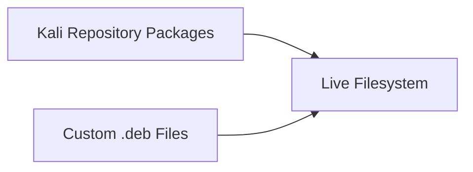

---

# Debconf Preseeding

Packages often ask questions during installation.

Example:

```text
Timezone
Keyboard Layout
Network Settings
```

---

# Solution

Provide:

```text
preseed/*.cfg
```

files.

---

# Result

Packages are automatically configured during image creation.

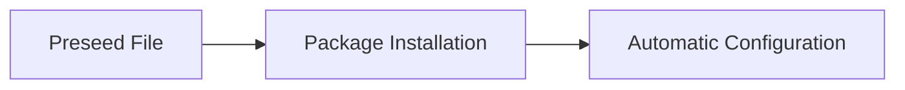

---

# Hooks: Automating Customizations

Hooks are scripts executed during the build process.

Think of them as:

```text
Automation Points
```

inside the ISO build workflow.

---

# Chroot Hooks

Location:

```text
hooks/live/*.chroot
```

---

## When Do They Run?

Inside the live filesystem during construction.

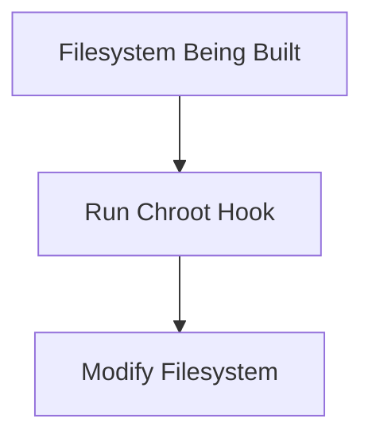

---

## Typical Uses

* Install files
* Modify configuration
* Create users
* Enable services
* Apply hardening

---

# Understanding Chroot

A chroot environment behaves like:

```text
A miniature operating system root filesystem
```

Processes see:

```text
/
```

inside the image.

They cannot see the host filesystem.

---

# Binary Hooks

Location:

```text
hooks/live/*.binary
```

---

## When Do They Run?

After ISO generation.

---

## What Can They Modify?

```text
Bootloader
ISO Contents
Menu Entries
Background Images
```

---

## What Can They NOT Modify?

```text
Live Filesystem
```

because it already exists.

---

# Hook Execution Timeline

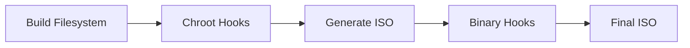

---

# Adding Files to the Live Filesystem

Place files under:

```text
includes.chroot/
```

---

# Example

File:

```text
includes.chroot/usr/local/bin/myscript
```

becomes:

```text
/usr/local/bin/myscript
```

inside the running live system.

---

# Filesystem Mapping

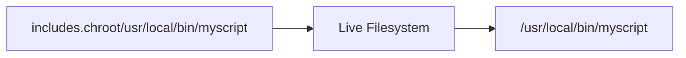

---

# Live-Boot Hooks

Special scripts stored as:

```text
/lib/live/config/XXXX-name
```

---

## Purpose

Executed during boot.

Not during build.

---

## Common Uses

* Configure networking
* Create users
* Set passwords
* Parse custom boot parameters
* Initialize services

---

# Boot Sequence

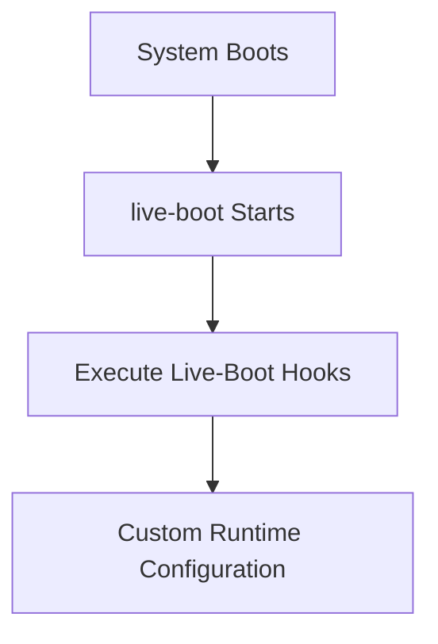

---

# Adding Files to the ISO Itself

Place files under:

```text
includes.binary/
```

---

# Example

File:

```text
includes.binary/isolinux/splash.png
```

becomes:

```text
/isolinux/splash.png
```

inside the ISO image.

---

# ISO File Mapping


---

# Complete Custom ISO Build Pipeline

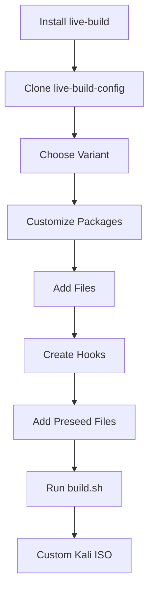

---

# Section Summary

### Install Prerequisites

```bash
apt install curl git live-build
```

### Clone Build Repository

```bash
git clone https://gitlab.com/kalilinux/build-scripts/live-build-config.git
```

### Build ISO

```bash
./build.sh --verbose
```

### Select Desktop Environment

```bash
./build.sh --variant kde
```

### Customize Packages

```text
package-lists/*.list.chroot
```

### Include Custom Packages

```text
packages.chroot/
```

### Add Files to Live System

```text
includes.chroot/
```

### Add Files to ISO

```text
includes.binary/
```

### Run Scripts During Build

```text
hooks/live/*.chroot
hooks/live/*.binary
```

### Key Takeaway

A custom Kali ISO is built by combining package selections, filesystem modifications, automation hooks, desktop environment variants, and boot-time customizations through the live-build framework. The same mechanism is used to produce Kali's official releases, making it a powerful and scalable way to create purpose-built penetration testing distributions.
