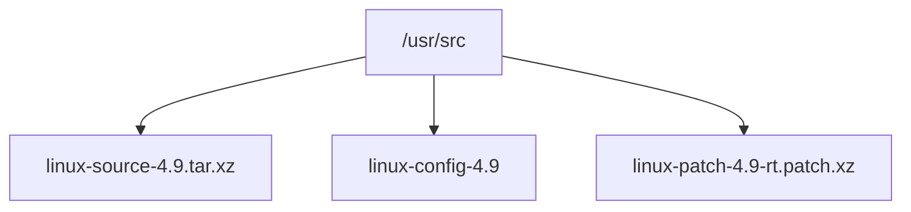
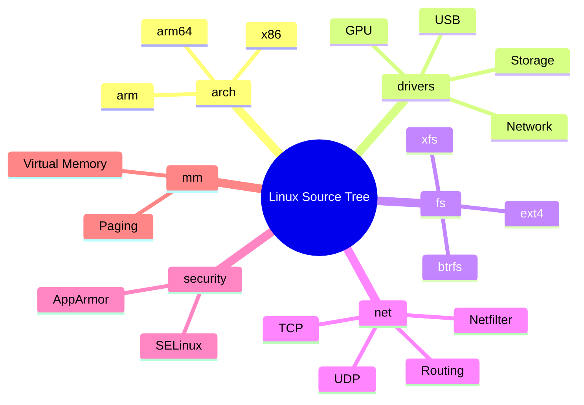
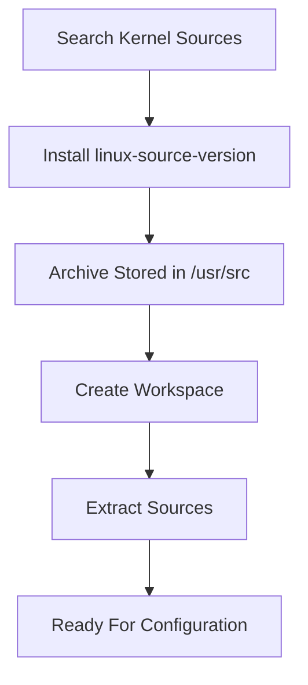

# Section 1 — Getting the Linux Kernel Sources

> Before a kernel can be configured, modified, or compiled, the source code must be obtained. Kali distributes Linux kernel sources as installable packages, allowing administrators and developers to work with the same source tree used by the distribution while still benefiting from Debian package management.

---

# Why Do We Need the Kernel Sources?

The running kernel is only a compiled binary.

It contains:

```text
Machine code
Loaded modules
Runtime data structures
```

It does **not** contain:

```text
Source code
Build scripts
Configuration templates
Documentation
```

To:

- Modify kernel behavior
    
- Add features
    
- Enable debugging
    
- Compile custom kernels
    
- Build custom modules
    

you need the complete source tree.

---

# Where Do Kali Kernel Sources Come From?

The Linux kernel originates from the upstream Linux project maintained by Linus Torvalds.

However, Kali does not ship the kernel exactly as released upstream.

The kernel packaged by Kali typically contains:

```text
Upstream Linux Source
+
Debian Patches
+
Kali Patches
+
Backported Features
+
Backported Drivers
+
Backported Security Fixes
```

---

# Kernel Source Flow


---

# Important Concept

Many newcomers assume:

```text
linux-source = exact upstream kernel
```

This is not necessarily true.

Distribution kernels often include:

### Backported Fixes

A fix from:

```text
Linux 6.12
```

may be inserted into:

```text
Linux 6.8
```

without upgrading the entire kernel.

---

### Backported Drivers

New hardware support can appear in older kernels.

---

### Distribution-Specific Features

Debian or Kali may include:

```text
Security enhancements
Hardware compatibility fixes
Packaging improvements
```

that do not yet exist upstream.

---

# Finding Available Kernel Source Packages

Search available source packages:

```bash
apt-cache search ^linux-source
```

Example output:

```text
linux-source-6.12
linux-source-6.13
linux-source-rolling
```

The newest package is typically the preferred choice.

---

# Installing Kernel Sources

Install the desired source package.

Example:

```bash
sudo apt install linux-source-4.9
```

---

# What Gets Installed?

The package manager may install supporting tools.

Example:

```text
bc
libreadline7
linux-source-4.9
```

---

# Why Is bc Installed?

Kernel build scripts perform arithmetic calculations.

Example uses:

```text
Version calculations
Configuration processing
Build scripts
```

---

# After Installation

Inspect:

```bash
ls /usr/src
```

Example:

```text
linux-config-4.9
linux-patch-4.9-rt.patch.xz
linux-source-4.9.tar.xz
```

---

# Understanding the Installed Files

## linux-source-4.9.tar.xz

This is the actual kernel source archive.

```text
Compressed Linux source tree
```

---

## linux-config-4.9

Contains configuration examples.

Used as references when building kernels.

---

## linux-patch-4.9-rt.patch.xz

A Real-Time kernel patch.

Used when building kernels requiring:

```text
Low latency
Real-time scheduling
Deterministic timing
```

Common in:

```text
Industrial systems
Audio processing
Scientific equipment
```

---

# Visualizing /usr/src



---

# Why Not Build Directly Inside /usr/src?

A common beginner mistake:

```bash
cd /usr/src
tar -xaf linux-source-4.9.tar.xz
```

This works.

But it is not recommended.

---

## Problems

### Requires Elevated Permissions

Many operations would need:

```bash
sudo
```

---

### Accidental System Modifications

Mixing source code with system directories creates confusion.

---

### Harder Cleanup

Removing experimental builds becomes risky.

---

# Recommended Workspace

Create a working directory in your home folder.

Example:

```bash
mkdir ~/kernel
cd ~/kernel
```

---

# Extracting the Sources

```bash
tar -xaf /usr/src/linux-source-4.9.tar.xz
```

---

## What Happens?


---

# Resulting Directory Structure

After extraction:

```text
~/kernel/
└── linux-source-4.9/
    ├── Makefile
    ├── arch/
    ├── block/
    ├── crypto/
    ├── drivers/
    ├── fs/
    ├── include/
    ├── init/
    ├── kernel/
    ├── mm/
    ├── net/
    ├── security/
    └── ...
```

---

# Understanding Major Source Directories

|Directory|Purpose|
|---|---|
|arch/|Architecture-specific code|
|drivers/|Device drivers|
|fs/|Filesystems|
|net/|Networking stack|
|mm/|Memory management|
|kernel/|Core kernel functionality|
|security/|Security frameworks|
|include/|Header files|

---

# Kernel Source Tree Overview



---

# Source Package vs Source Tree

This distinction is important.

---

## Source Package

Installed through APT.

Example:

```text
linux-source-4.9.tar.xz
```

Compressed archive.

---

## Source Tree

After extraction:

```text
linux-source-4.9/
```

Actual working directory.

All future operations occur here.

---

# Typical Workflow So Far



---

# Practical Kali Workflow

In practice:

```bash
apt-cache search ^linux-source

sudo apt install linux-source-<version>

mkdir ~/kernel

cd ~/kernel

tar -xaf /usr/src/linux-source-<version>.tar.xz

cd linux-source-<version>
```

After this point, the source tree is ready for the next stage:

```text
Kernel Configuration
```

which is where the `.config` file is created and customized before compilation.

---

# Section Summary

### Find Available Sources

```bash
apt-cache search ^linux-source
```

### Install Sources

```bash
sudo apt install linux-source-version
```

### Kernel Sources Are Stored As

```text
/usr/src/linux-source-version.tar.xz
```

### Recommended Workspace

```text
~/kernel/
```

### Extract Sources

```bash
tar -xaf /usr/src/linux-source-version.tar.xz
```

### Important Takeaway

The kernel sources distributed by Kali are not necessarily identical to upstream Linux. They often include Debian and Kali patches, hardware enablement changes, security fixes, and backported functionality. Once extracted, the source tree becomes the foundation for all subsequent kernel customization, configuration, and compilation activities.