# Section 10.1.1 — Getting the Sources

Before modifying a package, you need its source code.

Sounds obvious.

But Debian packages are different from GitHub projects.

Most beginners think:

```text
Package Source
=
One tar.gz file
```

Not true.

A Debian source package is actually made of multiple files working together.

---

# Binary Package vs Source Package

You already know:

```text
nmap.deb
```

is a binary package.

Contains:

```text
Compiled Program

Documentation

Metadata
```

Ready to install.

---

Source package contains:

```text
Source Code

Packaging Instructions

Patches

Build Rules
```

---

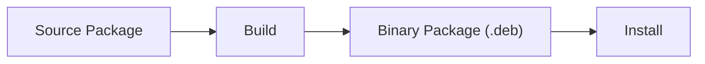

---

# Why Source Packages Exist

Suppose Kali ships:

```text
SET 7.4.4
```

You want:

```text
SET 7.4.5
```

Need source package.

---

Or:

```text
Enable Debug Logging
```

Need source package.

---

Or:

```text
Apply GitHub Patch
```

Need source package.

---

# Anatomy of a Source Package

Usually consists of:

```text
.dsc

.orig.tar.gz

.debian.tar.xz
```

or older formats like:

```text
.diff.gz
```

---

# Visualizing Source Package

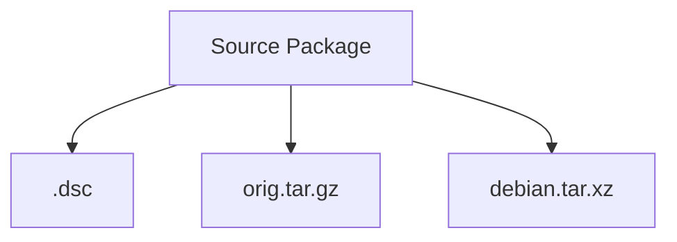

---

# What Is .dsc?

The most important file.

Think:

```text
Package Manifest
```

or

```text
Table Of Contents
```

---

It tells Debian:

```text
Package Name

Version

Checksums

Associated Files
```

---

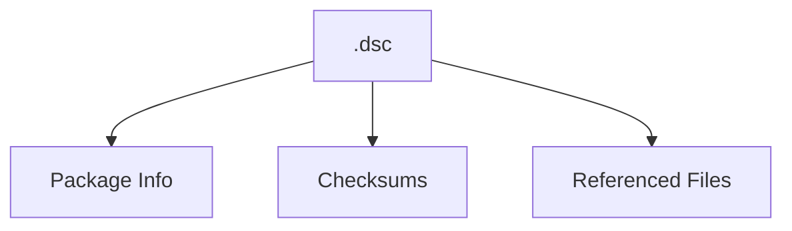

---

# What Is orig.tar.gz?

Contains:

```text
Original Upstream Source Code
```

Meaning:

```text
Exactly what developer released
```

---

Example:

```text
social-engineer-toolkit-7.4.5
```

from GitHub.

---

Think:

```text
Vendor Code
```

---

# What Is debian.tar.xz?

Contains:

```text
Debian Packaging Files
```

such as:

```text
debian/control

debian/rules

debian/changelog

debian/patches
```

---

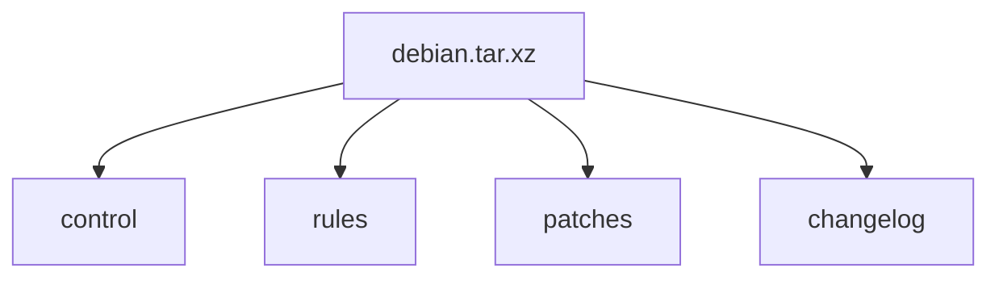

---

# Easy Analogy

Imagine a car.

---

Original car:

```text
Toyota Factory Car
```

=

```text
orig.tar.gz
```

---

Dealer customization:

```text
Local Accessories

Stickers

Documentation
```

=

```text
debian.tar.xz
```

---

Master inventory sheet:

```text
Everything Listed
```

=

```text
.dsc
```

---

# How Do We Download Sources?

APT has a special command:

```bash
apt source package-name
```

Example:

```bash
apt source libfreefare
```

---

# What Happens Internally?

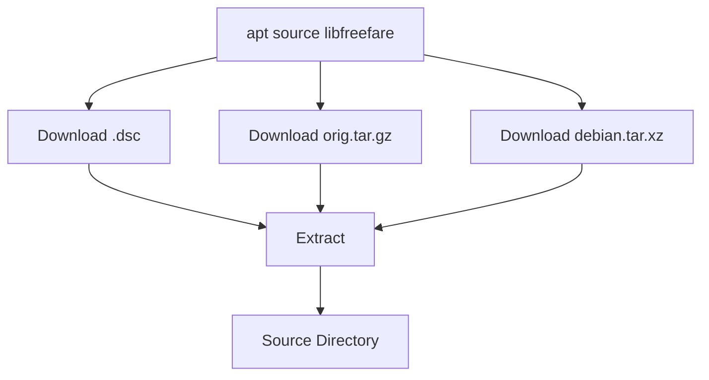

---

# Real Example

Command:

```bash
apt source libfreefare
```

APT downloads:

```text
libfreefare.dsc

libfreefare.orig.tar.gz

libfreefare.debian.tar.xz
```

Then automatically extracts them.

---

# Result

You get:

```text
libfreefare-0.4.0/
```

directory.

---

Inside:

```text
AUTHORS
README
Makefile
configure.ac
src/
test/
debian/
```

---

# Why Is debian/ Important?

Because everything packaging-related lives there.

---

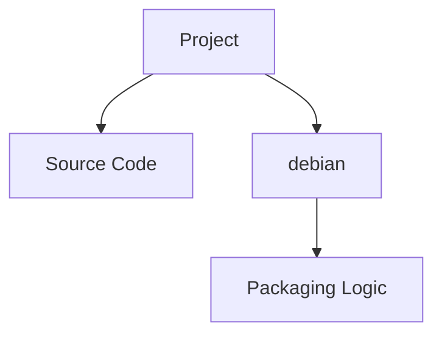

---

# Typical debian Directory

```text
debian/

├── changelog
├── control
├── copyright
├── rules
├── source
├── patches
```

---

# Mental Model

Source Tree:

```text
Project Files
+
debian/
```

---

Where:

```text
Project Files
=
Software
```

and

```text
debian/
=
How To Package Software
```

---

# Why Doesn't apt source Work Sometimes?

Because APT normally downloads:

```text
Binary Packages
```

only.

Not source packages.

---

Need:

```text
deb-src
```

repository enabled.

---

# Repository Types

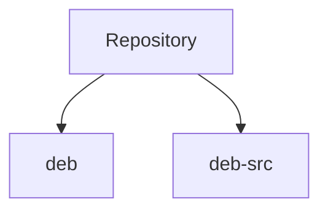

---

# deb

Contains:

```text
Binary Packages
```

Example:

```text
nmap.deb
```

---

# deb-src

Contains:

```text
Source Packages
```

Example:

```text
nmap.dsc
nmap.orig.tar.gz
nmap.debian.tar.xz
```

---

# Why Kali Disables deb-src

Most users only need:

```text
Install Software
```

not:

```text
Modify Software
```

Therefore:

```text
deb enabled

deb-src disabled
```

by default.

---

# Enabling Source Repositories

In:

```text
/etc/apt/sources.list
```

add:

```text
deb-src http://http.kali.org/kali kali-rolling main contrib non-free
```

Then:

```bash
sudo apt update
```

---

Now:

```bash
apt source nmap
```

works.

---

# What If You Need An Older Version?

APT may only know latest version.

---

Example:

```text
Need old libfreefare version
```

---

Can use:

```text
pkg.kali.org
```

to find source package URL.

Then:

```bash
dget URL
```

---

# What Is dget?

Think:

```text
Advanced Source Downloader
```

---

Normal:

```bash
apt source package
```

downloads current version.

---

dget:

```bash
dget some-package.dsc
```

downloads exactly that version.

---

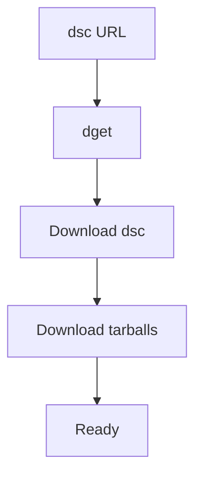

---

# Signature Verification

Source packages are signed.

When downloading:

```text
PGP Signature Checked
```

---

Possible error:

```text
Can't check signature

No public key
```

---

# What Does That Mean?

Not:

```text
Package Malicious
```

---

It means:

```text
You Don't Have Maintainer's Public Key
```

---

# Extraction Tool

If needed:

```bash
dpkg-source -x package.dsc
```

Extracts source manually.

---

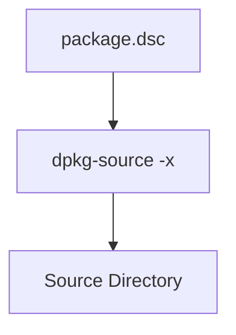

---

# Another Way: Git

Many packages are maintained in Git.

APT source may show:

```text
Git Repository Available
```

---

Example:

```bash
git clone https://gitlab.com/kalilinux/packages/kali-meta.git
```

---

Result:

```text
kali-meta/

└── debian/
```

---

# Important Difference

## apt source

Gets:

```text
Source Code

Patches Applied
```

---

## git clone

Gets:

```text
Raw Repository

Patches Often Unapplied
```

---

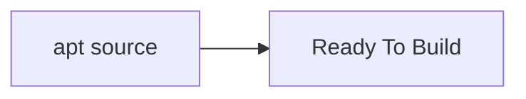

---

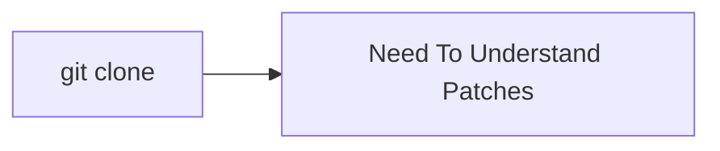

---

# When Should You Use Which?

|Situation|Tool|
|---|---|
|Modify package quickly|`apt source`|
|Contribute to Kali package|`git clone`|
|Build package locally|`apt source`|
|Package development workflow|`git clone`|

---

# What You Should Remember

```text
Source Package
=
.dsc
+
orig.tar.gz
+
debian.tar.xz

apt source
=
Download + Extract

deb-src
=
Required

debian/
=
Packaging Logic

Git Repository
=
Alternative Source Retrieval Method
```

---

# Before Next Section

Once sources are downloaded:

```text
Source Code ✓

Packaging Files ✓
```

You still cannot build.

Why?

Because you're missing:

```text
Compilers

Libraries

Development Headers

Build Tools
```

The next section (**10.1.2 Installing Build Dependencies**) explains:

```text
Build-Depends

apt build-dep

Why gcc sometimes fails

How Debian automatically installs
everything needed to compile
a package
```

and that's where the packaging workflow starts to become practical.