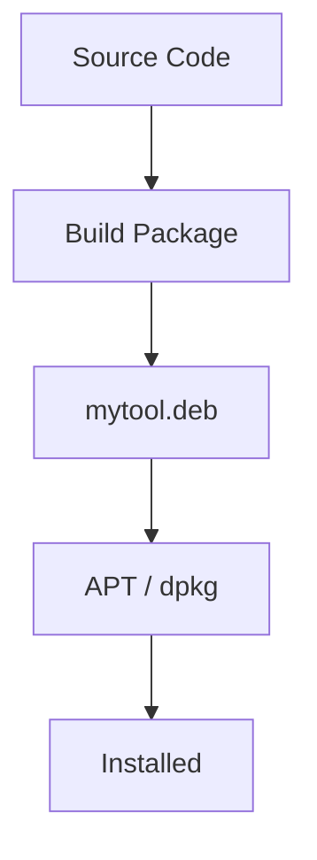
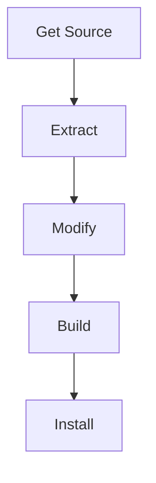
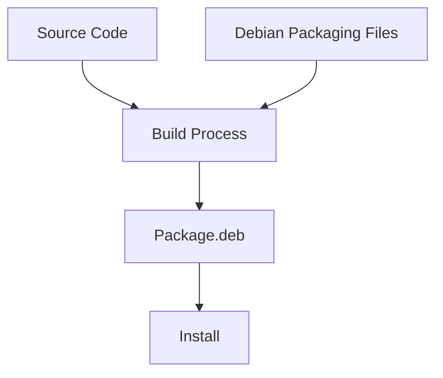
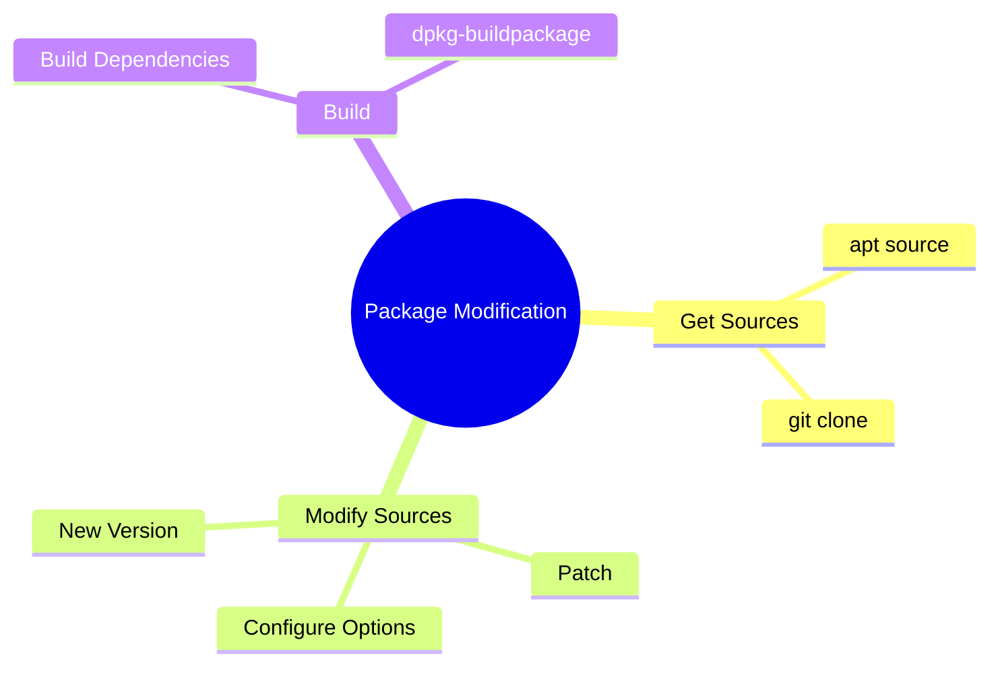

# Section 10.0 — Why Modify Packages At All?

Before learning:

```text
apt source
dpkg-buildpackage
debian/control
debian/rules
patches
```

you need to understand the problem Debian packaging solves.

---

# Life Without Packages

Imagine you want a newer version of SET.

Normal Linux developer approach:

```bash
git clone https://github.com/trustedsec/social-engineer-toolkit.git

cd social-engineer-toolkit

python3 setoolkit
```

Works.

---

But what if software requires:

```bash
./configure
make
sudo make install
```

?

Now files get copied everywhere:

```text
/usr/bin
/usr/lib
/etc
/usr/share
```

---

# Problem

Linux now has files installed that:

```text
APT does not know about

dpkg does not know about

No dependency tracking

No easy uninstall
```

---

# Example

You install manually:

```bash
sudo make install
```

Files copied:

```text
/usr/bin/mytool
/usr/lib/libmytool.so
/etc/mytool.conf
```

Six months later:

```text
Where did these files come from?
```

You don't know.

---

# Package Manager Approach

Instead:



Now dpkg knows:

```text
Every file installed

Dependencies

Version

Configuration files

Upgrade path

Removal path
```

---

# Why Would You Modify A Package?

The chapter gives 3 examples.

---

## Scenario 1

New version released.

Kali package:

```text
SET 7.4.4
```

Upstream:

```text
SET 7.4.5
```

You don't want to wait.

---


Build package yourself.

---

## Scenario 2

Need debugging output.

Example:

```text
libfreefare
```

Normally:

```text
Debug Disabled
```

You want:

```text
Debug Enabled
```

Need package rebuild.

---

## Scenario 3

Found a bug fix.

GitHub contains:

```text
Fix Commit
```

Kali package doesn't.

You want:

```text
Current Package
+
Fix Commit
```

Then rebuild.

---

# Universal Workflow

Regardless of what change you're making:



This entire chapter is just teaching different parts of this workflow.

---

# Big Picture

Think of a Debian package as:



---

# What Are Debian Packaging Files?

Inside source code you'll often find:

```text
debian/
```

directory.

---

Example:

```text
project/

├── source code
├── Makefile
└── debian/
```

---

The magic happens in:

```text
debian/
```

---

# Think Of It Like This

Source code answers:

```text
How does software work?
```

---

Debian packaging answers:

```text
How do we turn this into a .deb package?
```

---

# Real World Analogy

Imagine making a phone.

---

Source code:

```text
Phone Components
```

---

Debian packaging:

```text
Box
Label
Manual
Instructions
Barcode
Shipping Details
```

---

Without packaging:

```text
You can build phone
```

---

With packaging:

```text
You can ship phone
Install phone
Upgrade phone
Track phone
Remove phone
```

---

# The Three Things You Need To Learn

The rest of Chapter 10 is basically:



---

# Before Continuing

Make sure this mental model is clear:

```text
Source Code
    +
Debian Packaging Files
    =
Debian Source Package

Debian Source Package
    +
Build Process
    =
.deb Package

.deb Package
    +
dpkg
    =
Installed Software
```

That's the foundation.

The next section (**10.1.1 Getting the Sources**) is where we'll answer:

```text
What exactly is a source package?

What is .dsc?

Why are there .orig.tar.gz files?

What does apt source actually download?

Why do source packages look completely different from .deb packages?
```

and that part becomes much easier once this model is understood.