# Section 10.1.5 — Patches and Quilt (The Debian Way of Modifying Source Code)

This is the section where most people get confused because they think:

```text
Need to modify source?

Open file

Edit file

Build package
```

Why do we need:

```text
patches
quilt
series
```

at all?

---

# First Understand The Problem

Suppose Debian packages:

```text
nmap 7.95
```

You find a bug.

You directly edit:

```text
src/output.cc
```

and fix it.

---

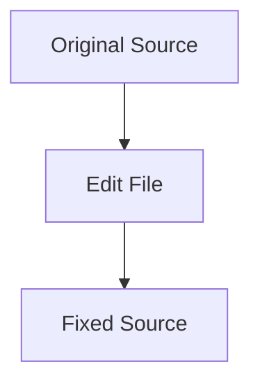

Looks fine.

---

# Six Months Later...

Upstream releases:

```text
nmap 7.96
```

You download it.

Your modifications disappear.

---

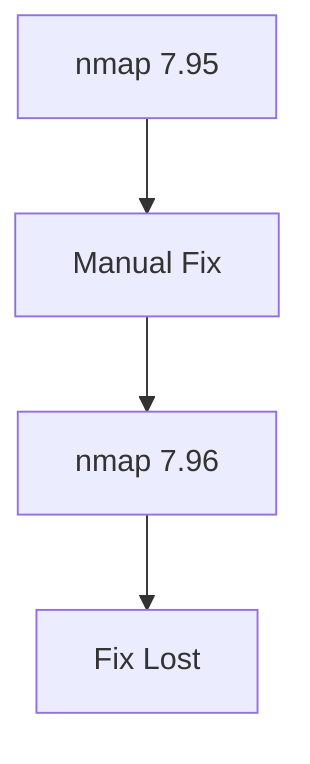

---

# Debian's Solution

Instead of changing source directly:

Store changes separately.

---

Think:

```text
Original Source

+

Patch File

=

Modified Source
```

---

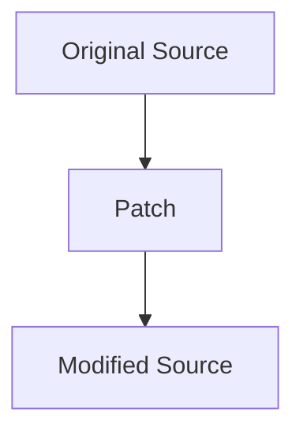

---

# What Is A Patch?

A patch is simply:

```text
Difference Between

Old File

and

New File
```

---

Example

Original:

```c
printf("Hello");
```

Modified:

```c
printf("Hello World");
```

Patch stores only:

```text
Remove:
Hello

Add:
Hello World
```

---

# Why Is This Awesome?

Instead of storing:

```text
Entire Source Tree
```

Debian stores:

```text
Only Changes
```

---

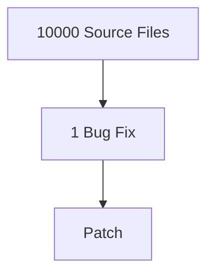

---

# Where Are Patches Stored?

Inside:

```text
debian/patches/
```

---

Example:

```text
debian/

└── patches/

    fix-crash.patch

    security-fix.patch

    improve-logging.patch

    series
```

---

# What Is series?

This is extremely important.

It tells Debian:

```text
Apply Patch 1

Then Patch 2

Then Patch 3
```

---

Example:

```text
fix-crash.patch
security-fix.patch
improve-logging.patch
```

---

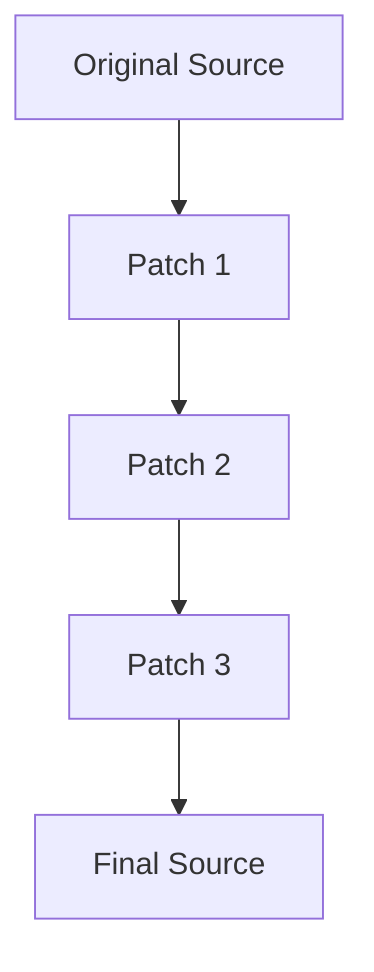

---

# Why Multiple Patches?

Imagine:

```text
Patch 1
Fixes Memory Leak

Patch 2
Adds Logging

Patch 3
Fixes Security Issue
```

Keeping them separate makes maintenance easier.

---

# Enter Quilt

Quilt is Debian's patch management tool.

Think:

```text
Git

for

Package Patches
```

(Not exactly Git, but similar idea.)

---

# What Does Quilt Do?

Without Quilt:

```text
Create Patch

Apply Patch

Remove Patch

Manage Patch Order

Manually
```

Painful.

---

With Quilt:

```text
Automated
```

---

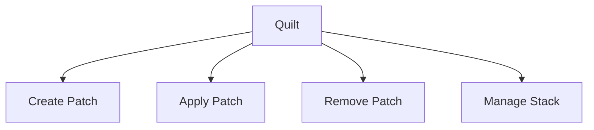

---

# Viewing Existing Patches

Inside source directory:

```bash
quilt series
```

Output:

```text
fix-crash.patch
security.patch
logging.patch
```

---

Meaning:

```text
These patches exist

in this order
```

---

# See Applied Patches

```bash
quilt applied
```

---

Output:

```text
fix-crash.patch
security.patch
```

---

Meaning:

```text
Already Applied
```

---

# See Unapplied Patches

```bash
quilt unapplied
```

---

Output:

```text
logging.patch
```

---

Meaning:

```text
Still Waiting
```

---

# Applying All Patches

```bash
quilt push -a
```

---

Think:

```text
Apply Everything
```

---

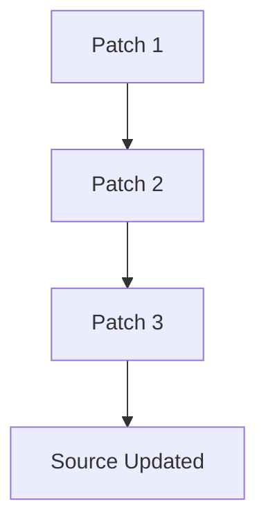

---

# Removing All Patches

```bash
quilt pop -a
```

---

Think:

```text
Return To Original Source
```

---

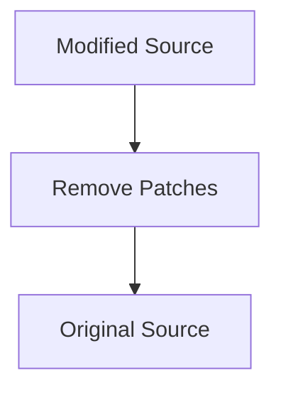

---

# Creating Your Own Patch

This is the workflow you'll actually use.

---

## Step 1

Create patch:

```bash
quilt new my-fix.patch
```

---

Now Quilt knows:

```text
A new patch is being created
```

---

## Step 2

Tell Quilt which file you will edit.

Example:

```bash
quilt add src/main.c
```

---

Meaning:

```text
Track changes
to this file
```

---

## Step 3

Edit file.

Example:

```c
printf("Hello");
```

becomes:

```c
printf("Hello World");
```

---

## Step 4

Save changes.

Then:

```bash
quilt refresh
```

---

Quilt generates:

```text
my-fix.patch
```

automatically.

---

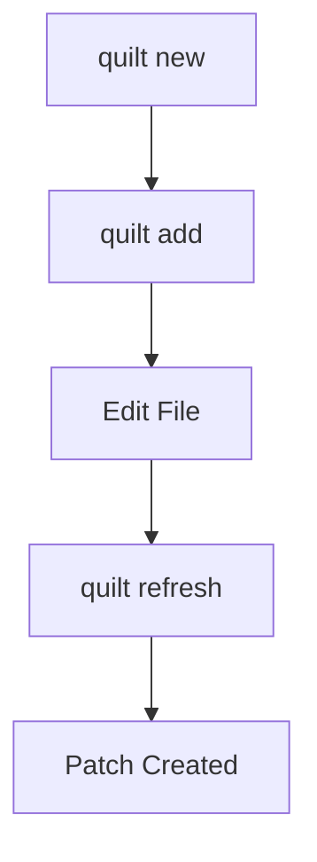

---

# Viewing Patch Contents

```bash
quilt diff
```

---

Output:

```diff
- printf("Hello");
+ printf("Hello World");
```

---

This is literally what a patch is.

---

# Why Debian Uses Quilt

Imagine Debian maintains:

```text
500 Changes
```

to Firefox.

---

Instead of changing source directly:

```text
500 Separate Patches
```

can be:

```text
Applied

Removed

Reordered

Reviewed
```

independently.

---

# Real Debian Workflow

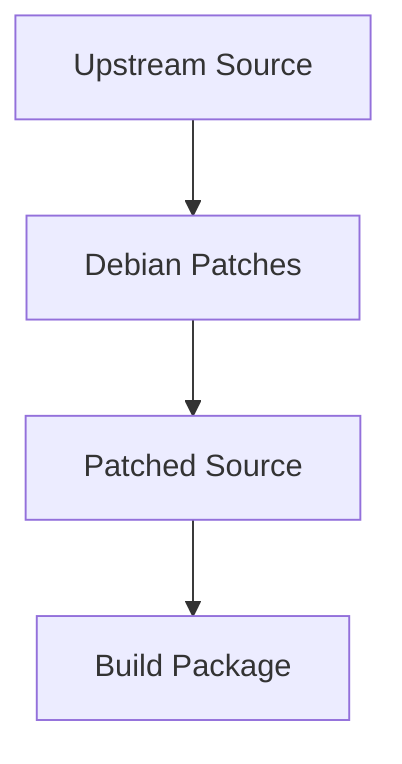

---

# Upgrading To New Version

This is where Quilt shines.

---

Suppose:

```text
nmap 7.95
```

contains:

```text
10 Debian Patches
```

---

New release:

```text
nmap 7.96
```

arrives.

---

Debian simply:

```text
Apply Existing Patches
```

to new source.

---

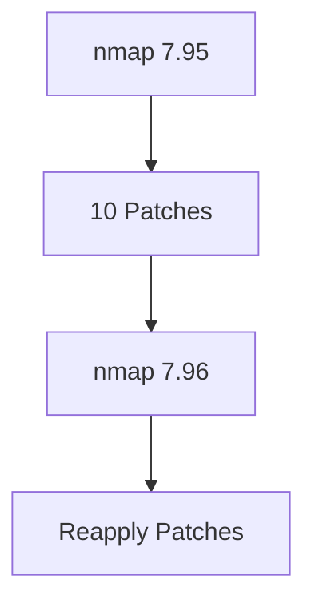

---

# Patch Failure

Sometimes:

```text
Source Changed Too Much
```

---

Patch no longer matches.

---

Example:

```text
Old Function Removed
```

Patch tries to modify it.

---

Result:

```text
Patch Failed
```

---

This is called:

```text
Patch Conflict
```

---

Exactly like:

```text
Git Merge Conflict
```

---

# Typical Developer Workflow

Download source:

```bash
apt source package
```

---

Apply existing patches:

```bash
quilt push -a
```

---

Create patch:

```bash
quilt new fix.patch
```

---

Track file:

```bash
quilt add src/file.c
```

---

Edit file.

---

Generate patch:

```bash
quilt refresh
```

---

Build package:

```bash
dpkg-buildpackage -rfakeroot
```

---

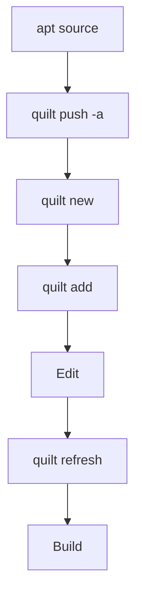

---

# Most Important Commands

Show patches:

```bash
quilt series
```

---

Show applied patches:

```bash
quilt applied
```

---

Apply all:

```bash
quilt push -a
```

---

Remove all:

```bash
quilt pop -a
```

---

Create patch:

```bash
quilt new fix.patch
```

---

Track file:

```bash
quilt add file.c
```

---

Save patch:

```bash
quilt refresh
```

---

Show patch differences:

```bash
quilt diff
```

---

# Mental Model

```text
Original Source
        +
Patch Files
        ↓

Patched Source
        ↓

dpkg-buildpackage
        ↓

.deb Package
```

---

# Mindmap Summary

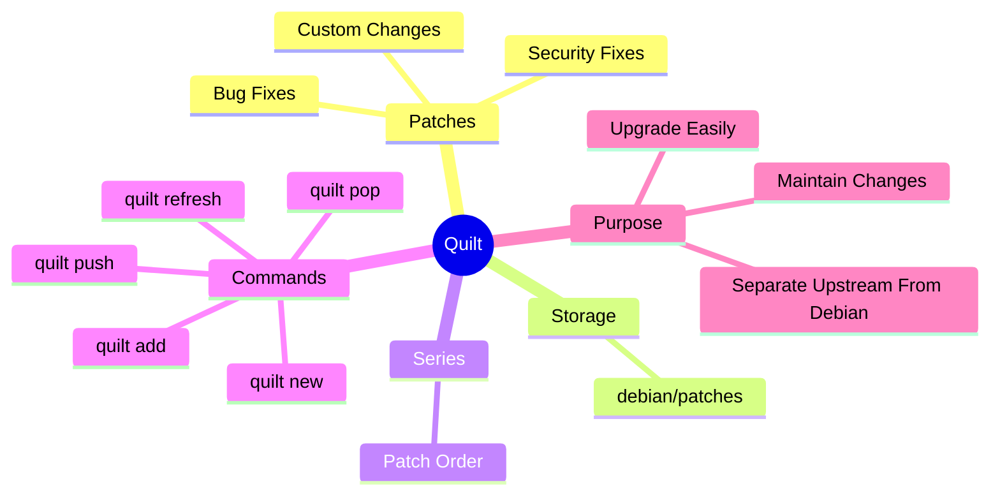

---

At this point you now understand the **complete Debian maintainer workflow**:

```text
Get Source
↓
Install Build Dependencies
↓
Understand debian/
↓
Create/Manage Patches
↓
Build Package
↓
Generate .deb
↓
Install/Test
```

This is the same workflow used by Kali and Debian maintainers when they customize upstream software into Debian packages.