# Section 4 — Kali Live USB Persistence

> A live system is normally ephemeral. Every file created, every package installed, and every configuration change disappears after a reboot. Kali solves this limitation through the persistence feature of the live-boot subsystem, allowing selected or all filesystem changes to survive reboots.

---

# The Problem: Why Persistence Exists

A standard Kali Live USB behaves like this:

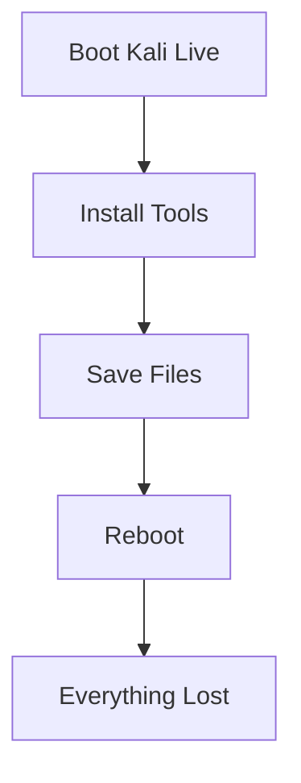

Examples of lost data:

```text
Downloaded files
SSH keys
Custom scripts
Installed packages
Configuration changes
Browser bookmarks
```

This behavior is intentional because Live systems are designed to be temporary.

---

# What is Persistence?

Persistence allows a Live USB to retain selected data between reboots.

With persistence enabled:

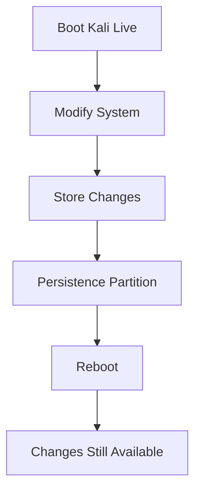

---

# The Component Responsible

Persistence is implemented by:

```text
live-boot
```

not by the kernel itself.

---

# How Persistence Is Activated

Persistence becomes active when the kernel boot parameters include:

```text
persistence
```

Example:

```text
boot=live persistence
```

Without this parameter:

```text
Persistence is ignored.
```

---

# Kali Persistence Boot Entries

Kali already includes persistence boot options.

Boot menu:

```text
Live System
Live USB Persistence
Live USB Encrypted Persistence
```

---

# Persistence Discovery Process

When persistence mode is enabled:

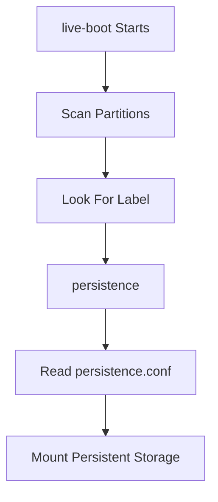

---

# The Magic Label

By default, live-boot searches for filesystems labeled:

```text
persistence
```

Example:

```bash
mkfs.ext4 -L persistence /dev/sdb3
```

---

# Custom Labels

You can override the default label:

```text
persistence-label=mydata
```

Example:

```text
boot=live persistence persistence-label=work
```

Now live-boot searches for:

```text
work
```

instead of:

```text
persistence
```

---

# The persistence.conf File

The partition must contain:

```text
persistence.conf
```

Without this file:

```text
Persistence will not work.
```

---

# Purpose of persistence.conf

This file tells live-boot:

```text
What directories should persist?
```

---

# Example: Full Persistence

File content:

```text
/ union
```

---

# Meaning of "/ union"

This is the most important persistence setting.

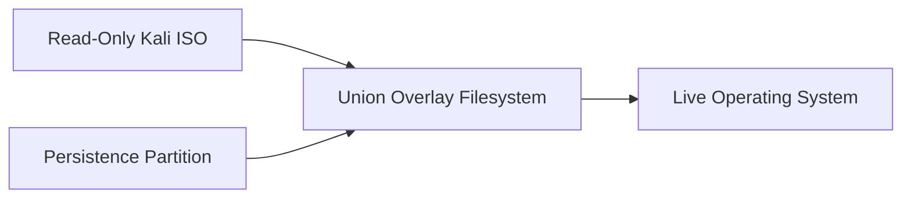

---

# What Is a Union Filesystem?

A union filesystem combines:

```text
Read-Only Base System
+
Writable Persistence Storage
```

into a single filesystem view.

---

## Example

Original ISO:

```text
/etc/hosts
```

Modified during session:

```text
/etc/hosts
```

actually becomes:

```text
Persistence Storage Copy
```

while the ISO remains untouched.

---

# Overlay Filesystem Concept

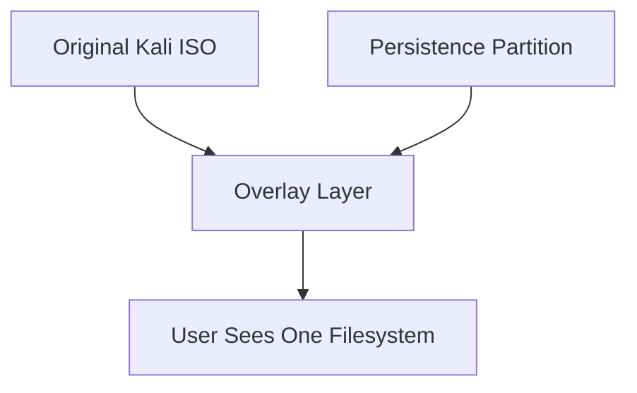

Only modifications are stored.

This is very space-efficient.

---

# Setting Up Unencrypted Persistence

---

## Initial Assumptions

USB device:

```text
/dev/sdb
```

Existing partitions:

```text
/dev/sdb1
/dev/sdb2
```

Live ISO already copied.

---

# Step 1 — Examine Current Partition Layout

```bash
parted /dev/sdb print
```

Example:

```text
Partition 1
Partition 2
```

occupy the ISO area.

---

# Why Measure the ISO Size?

The persistence partition must start after the ISO image.

Determine image size:

```bash
start=$(du --block-size=1MB kali-linux-2020.3-live-amd64.iso | awk '{print $1}')
```

Display result:

```bash
echo "Size of image is $start MB"
```

Example:

```text
3518 MB
```

---

# Step 2 — Create Persistence Partition

```bash
parted -a optimal /dev/sdb mkpart primary "${start}MB" 100%
```

---

# Result

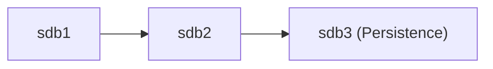

Example:

```text
sdb1 = Live ISO
sdb2 = Boot Support
sdb3 = Persistence Data
```

---

# Step 3 — Create Filesystem

Format partition:

```bash
mkfs.ext4 -L persistence /dev/sdb3
```

Important:

```text
-L persistence
```

creates the required label.

---

# Step 4 — Create persistence.conf

Mount partition:

```bash
mount /dev/sdb3 /mnt
```

Create configuration:

```bash
echo "/ union" > /mnt/persistence.conf
```

Verify:

```bash
ls -l /mnt
```

Expected:

```text
lost+found
persistence.conf
```

---

# Step 5 — Unmount

```bash
umount /mnt
```

Done.

Boot using:

```text
Live USB Persistence
```

---

# Unencrypted Persistence Workflow

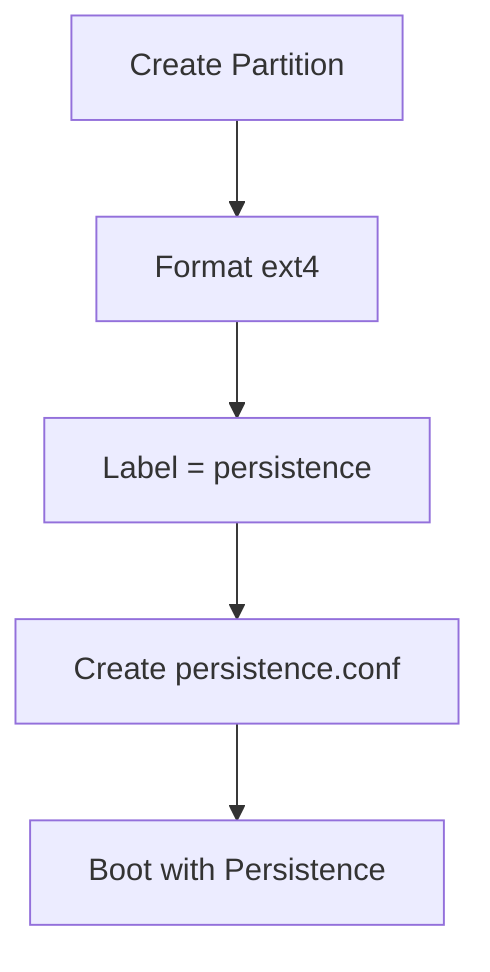

---

# Why Use Encryption?

Imagine storing:

```text
Customer data
Reports
Exploitation results
Credentials
VPN configurations
```

on a penetration testing USB.

If lost:

```text
Major security incident
```

---

# Encrypted Persistence

Instead of:

```text
ext4
```

directly on:

```text
/dev/sdb3
```

we place:

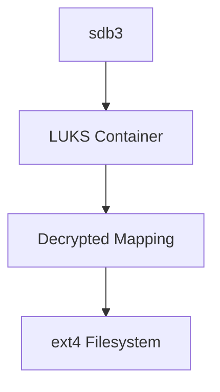

---

# What is LUKS?

LUKS stands for:

```text
Linux Unified Key Setup
```

It is the standard Linux disk encryption format.

---

# Step 1 — Initialize LUKS Container

```bash
cryptsetup --verbose --verify-passphrase luksFormat /dev/sdb3
```

You will:

```text
Confirm YES
Enter passphrase
Verify passphrase
```

---

# Step 2 — Open Encrypted Container

```bash
cryptsetup luksOpen /dev/sdb3 kali_persistence
```

Creates:

```text
/dev/mapper/kali_persistence
```

---

# Understanding Device Mapping

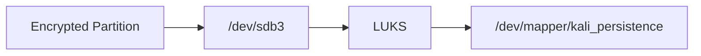

The mapped device represents decrypted content.

---

# Step 3 — Create Filesystem

Format the mapped device:

```bash
mkfs.ext4 -L persistence /dev/mapper/kali_persistence
```

---

# Step 4 — Create persistence.conf

```bash
mount /dev/mapper/kali_persistence /mnt

echo "/ union" > /mnt/persistence.conf

umount /mnt
```

---

# Step 5 — Close Container

```bash
cryptsetup luksClose /dev/mapper/kali_persistence
```

---

# Encrypted Persistence Workflow

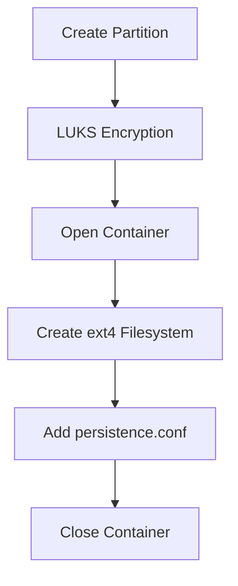

---

# Multiple Persistence Stores

One USB can contain multiple persistence partitions.

Example:

```text
Demo Environment
Work Environment
Training Environment
Customer A
Customer B
```

Each with separate storage.

---

# Why Multiple Stores?

Consider a consultant.

Requirements:

|Environment|Security|
|---|---|
|Demonstration Data|Unencrypted|
|Customer Data|Encrypted|

Using separate persistence stores keeps them isolated.

---

# Selecting Persistence Stores

Boot parameter:

```text
persistence-label=
```

Example:

```text
persistence-label=demo
```

or

```text
persistence-label=work
```

---

# Custom Boot Menu Entries

Kali's persistence menu can be modified.

Example boot entry:

```text
Live USB with Demo Data
```

Uses:

```text
persistence-label=demo
```

---

Second entry:

```text
Live USB with Work Data
```

Uses:

```text
persistence-label=work
persistence-encryption=luks
```

---

# Multi-Persistence Architecture

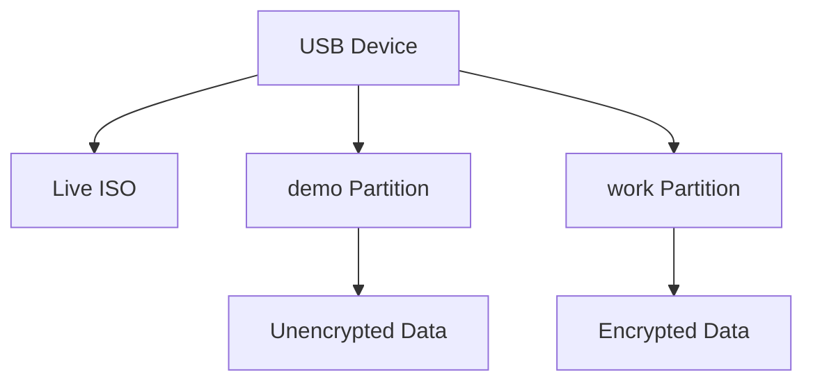

---

# Example Multi-Persistence Setup

Create partitions:

```bash
parted /dev/sdb mkpart primary 3000MB 55%
parted /dev/sdb mkpart primary 55% 100%
```

Result:

```text
sdb3 -> demo
sdb4 -> work
```

---

# Demo Persistence

```bash
mkfs.ext4 -L demo /dev/sdb3
```

Create:

```bash
echo "/ union" > /mnt/persistence.conf
```

---

# Work Persistence

Encrypt:

```bash
cryptsetup luksFormat /dev/sdb4
```

Open:

```bash
cryptsetup luksOpen /dev/sdb4 kali_persistence
```

Format:

```bash
mkfs.ext4 -L work /dev/mapper/kali_persistence
```

Create:

```bash
echo "/ union" > /mnt/persistence.conf
```

Close:

```bash
cryptsetup luksClose /dev/mapper/kali_persistence
```

---

# Persistence Label Selection Flow

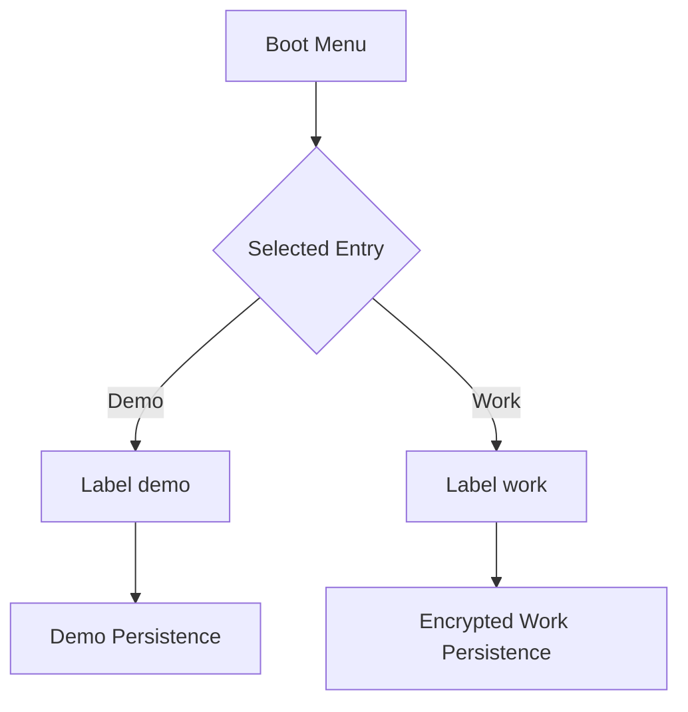

---

# Nuke Password (Important Security Feature)

Kali provides:

```text
cryptsetup-nuke-password
```

---

# What Does It Do?

A special password can be configured.

When entered:

```text
DOES NOT decrypt the drive
```

Instead:

```text
Destroys encryption keys
```

---

# Effect

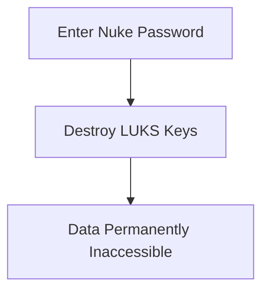

---

# Why Use It?

Useful when:

```text
Crossing borders
High-risk travel
Physical compromise risk
Red team operations
```

---

# Configure Nuke Password

Install package and run:

```bash
dpkg-reconfigure cryptsetup-nuke-password
```

---

# Critical Warning

After key destruction:

```text
Recovery is impossible
```

unless you previously backed up:

```text
LUKS key material
```

---

# Complete Persistence Architecture

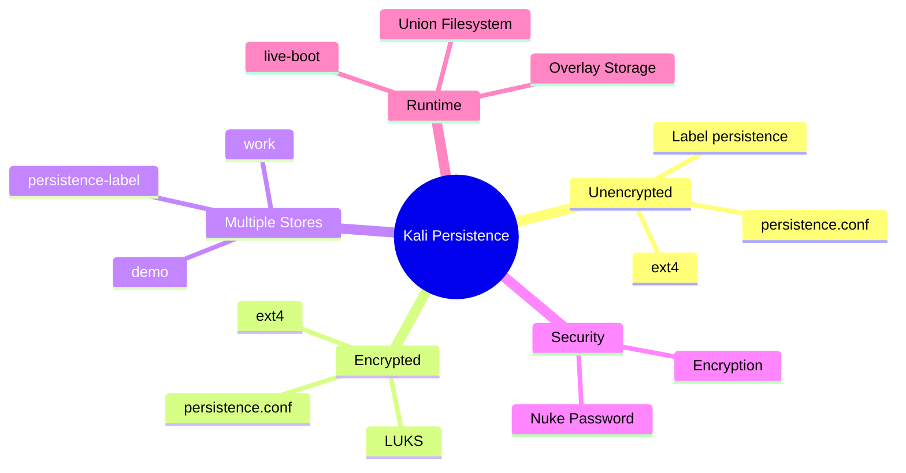

---

# Section Summary

### Enable Persistence

```text
boot=live persistence
```

### Required Label

```text
persistence
```

(or custom label via `persistence-label=`)

### Required File

```text
persistence.conf
```

### Full Persistence

```text
/ union
```

### Create Unencrypted Persistence

```bash
mkfs.ext4 -L persistence /dev/sdb3
```

### Create Encrypted Persistence

```bash
cryptsetup luksFormat /dev/sdb3
cryptsetup luksOpen /dev/sdb3 kali_persistence
mkfs.ext4 -L persistence /dev/mapper/kali_persistence
```

### Multiple Persistence Stores

```text
persistence-label=demo
persistence-label=work
```

### Emergency Data Destruction

```bash
dpkg-reconfigure cryptsetup-nuke-password
```

### Key Takeaway

Kali persistence transforms a stateless Live USB into a portable working environment. By combining live-boot, persistence partitions, overlay filesystems, optional LUKS encryption, custom boot entries, and even nuke-password support, a single USB device can securely host multiple independent operating environments while preserving data across reboots.