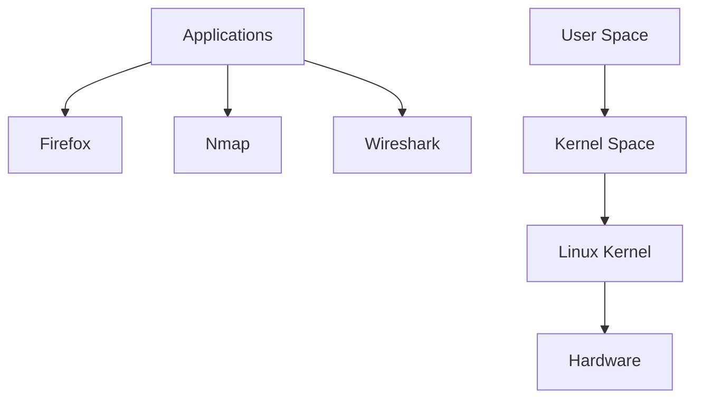
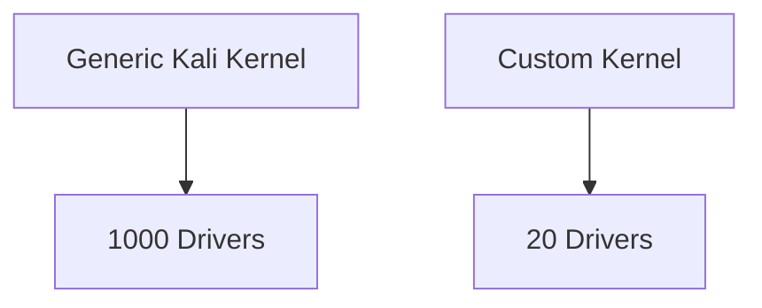
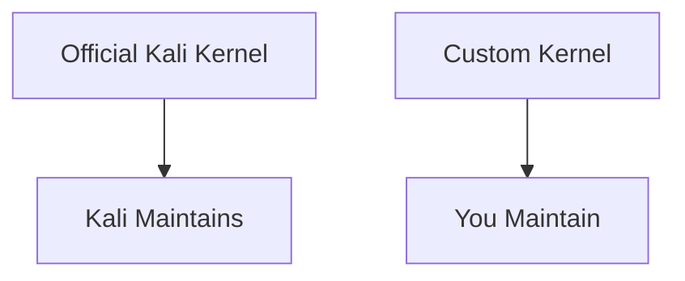
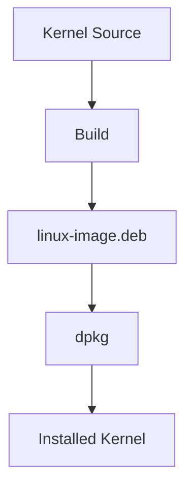

Perfect. Let's do this **slowly, section by section**, and fill in all the missing background that the book assumes you already know.

---

# Section 10.2 — Recompiling the Linux Kernel

Before touching commands, let's answer:

## What is the Linux Kernel?

Think of Linux as two worlds:



The kernel is the **middleman between software and hardware**.

When Nmap wants to:

```text
Open network socket
Read network card
Send packet
Allocate memory
Read disk
```

it asks the kernel.

---

# Why Does Kali Ship Huge Kernels?

When Kali releases a kernel, they don't know whether you are using:

```text
Dell Laptop
MacBook
VMware VM
ThinkPad
Raspberry Pi
Cloud Server
Gaming PC
```

So Kali enables:

```text
Thousands of Drivers
Hundreds of Features
Many Filesystems
Many Network Modules
```

to ensure it works everywhere.

---

# What Is A Driver?

A driver is simply:

```text
Kernel Code
that knows how to talk
to specific hardware
```

Example:


Without the driver:

```text
Hardware Exists

Kernel Cannot Use It
```

---

# Why Recompile The Kernel?

The book gives two major reasons.

---

## Reason 1 — Reduce Memory Usage

Suppose Kali kernel contains:

```text
1000 Drivers
```

but your laptop uses:

```text
20 Drivers
```

---

Then:

```text
980 Drivers
```

are mostly useless to you.

Some of that code occupies RAM.

---

### Analogy

Imagine carrying:

```text
50 screwdrivers
20 hammers
10 saws
```

to fix one laptop.

Technically works.

Not efficient.

---

Custom kernel:

```text
Keep only tools needed
```

---



---

## Reason 2 — Reduce Attack Surface

Security people love this idea.

If a driver isn't present:

```text
It cannot contain an exploitable bug
```

---

Example:

You don't have:

```text
Bluetooth
```

---

Why keep:

```text
Bluetooth Driver
Bluetooth Protocol Stack
Bluetooth Features
```

loaded?

---

Less code:

```text
Less Bugs
Less Vulnerabilities
Less Risk
```

---

# Why Most People DON'T Recompile Kernels

Because Kali warns you:

```text
Once you build your own kernel,

Kali cannot maintain it for you.
```

---

Normally:

```bash
apt upgrade
```

gives:

```text
New Kernel
Security Fixes
Bug Fixes
```

automatically.

---

Custom kernel:

```text
YOU become the maintainer.
```

---



---

# Another Reason: Patches

Sometimes people want features:

```text
Not Yet In Mainline Linux
```

Example:

```text
Experimental Driver
Research Feature
Custom Security Patch
```

Only way:

```text
Modify Source
Compile New Kernel
```

---

# The Important Mindset

The kernel is just another program.

The only difference:

```text
Firefox runs in User Space

Kernel runs in Kernel Space
```

---

And because it's just software:

```text
Source Code
+
Compiler
=
Kernel
```

Exactly like:

```text
C Program
+
gcc
=
Executable
```

---

# What Debian/Kali Changed

Historically Linux admins did:

```bash
make
make modules
make install
```

directly.

Messy.

---

Debian said:

```text
Everything should be a package.
```

Even the kernel.

---

So today:



---

This gives huge advantages:

```text
Clean Installation
Clean Removal
Version Tracking
Dependency Tracking
Automatic Bootloader Updates
```

---

# What We'll Learn Next

The next subsection (**10.2.1 Introduction and Prerequisites**) explains:

```text
What tools are needed
Why build-essential exists
Why fakeroot is needed
Why libncurses5-dev is needed
```

and most importantly:

```text
How kernel compilation is actually just another Debian package build.
```

That's the foundation before we download any kernel source.