# Section 10.2.1 — Introduction and Prerequisites

Now that you understand:

```text
Kernel = Just Software

Source Code + Compiler = Kernel
```

the next question is:

```text
What do I need before compiling a kernel?
```

The book gives this command:

```bash
apt install build-essential libncurses5-dev fakeroot
```

Let's understand **why each package is needed**, not just memorize the command.

---

# Big Picture

Kernel compilation is basically:

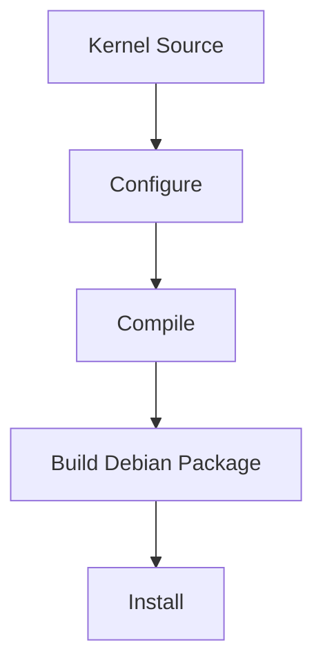

Each stage needs tools.

---

# Tool 1 — build-essential

This is probably the most important package.

---

## What Beginners Think

```text
build-essential
=
One Program
```

Wrong.

---

It is actually a **metapackage**.

Remember from the previous chapter:

```text
Metapackage

=

Package containing dependencies
```

---

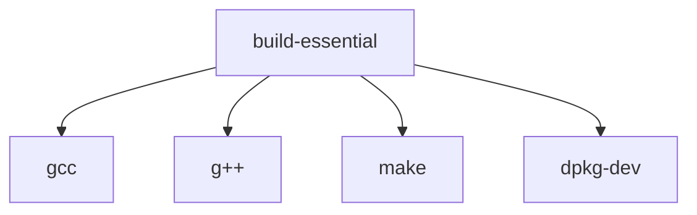

---

# Why Do We Need gcc?

Kernel source is written mostly in:

```text
C
```

Example:

```c
int main() {
    return 0;
}
```

Computers cannot run C directly.

---

Need:

```text
Source Code
↓
gcc
↓
Machine Code
```

---

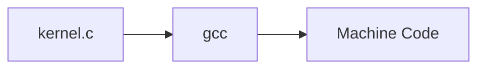

---

# Why Do We Need make?

Imagine kernel source contains:

```text
30,000+ source files
```

Would you run:

```bash
gcc file1.c
gcc file2.c
gcc file3.c
```

thousands of times?

No.

---

Instead:

```bash
make
```

reads instructions from:

```text
Makefile
```

and automates everything.

---

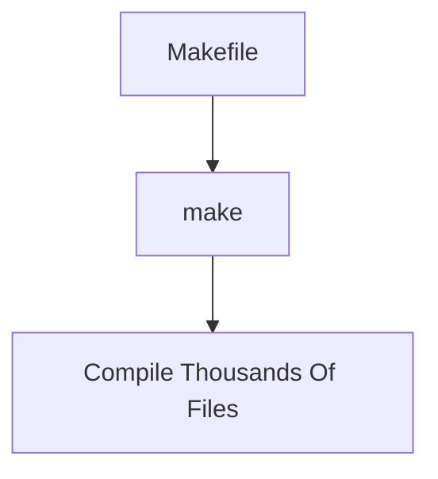

---

# So What Is build-essential?

Think:

```text
Basic Construction Tools
```

for compiling software.

---

Without it:

```text
No Compiler

No Build Tools

No Package Build
```

---

# Tool 2 — libncurses5-dev

This one confuses everyone.

---

# First: What Is ncurses?

Have you seen interfaces like:

```text
┌──────────────────────────┐
│ Kernel Configuration     │
├──────────────────────────┤
│ [*] Networking           │
│ [ ] Bluetooth            │
│ [*] USB Support          │
└──────────────────────────┘
```

inside terminals?

---

That interface is often built using:

```text
ncurses
```

---

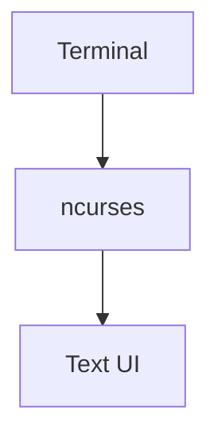

---

# Why Does Kernel Need It?

Later you'll run:

```bash
make menuconfig
```

---

This launches:

```text
Text-Based Configuration Menu
```

for selecting kernel options.

---

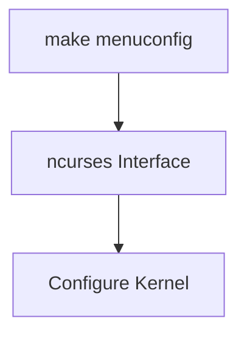

---

Without:

```text
libncurses5-dev
```

the menu cannot be built.

---

# Why Does It End With -dev?

Remember from earlier:

---

Runtime package:

```text
libncurses5
```

used when running programs.

---

Development package:

```text
libncurses5-dev
```

contains:

```text
Headers

Development Libraries
```

needed when compiling programs.

---

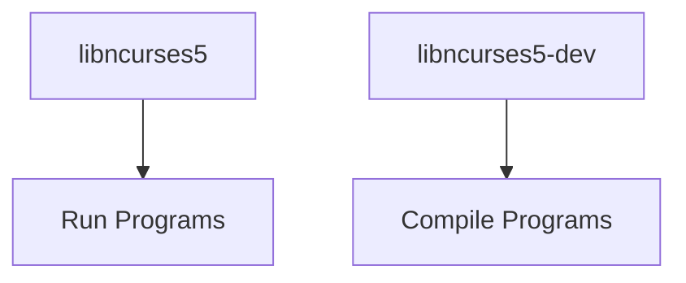

---

# Tool 3 — fakeroot

This is one of the coolest Linux tools.

---

# The Problem

Kernel build eventually creates:

```text
linux-image.deb
```

Package metadata may contain:

```text
Owner = root

Group = root
```

---

But you're not root.

---

How do we create package files that appear owned by root?

---

Solution:

```bash
fakeroot
```

---

# What fakeroot Does

It lies.

😂

Not maliciously.

---

It creates a fake environment where:

```text
You Look Like Root
```

to the packaging tools.

---

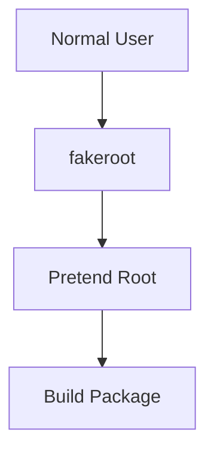

---

# Example

Real ownership:

```text
user = kali
```

---

fakeroot tells package tools:

```text
Pretend:

owner = root
group = root
```

---

Package gets built correctly.

---

Actual system remains unchanged.

---

# Why Not Use sudo?

Bad idea.

Imagine:

```makefile
rm -rf /
```

inside a broken build script.

---

Running as root:

```text
Catastrophic
```

---

Running as user:

```text
Much Safer
```

---

Therefore Debian packaging strongly prefers:

```bash
fakeroot
```

instead of:

```bash
sudo make
```

---

# The Required Packages Together

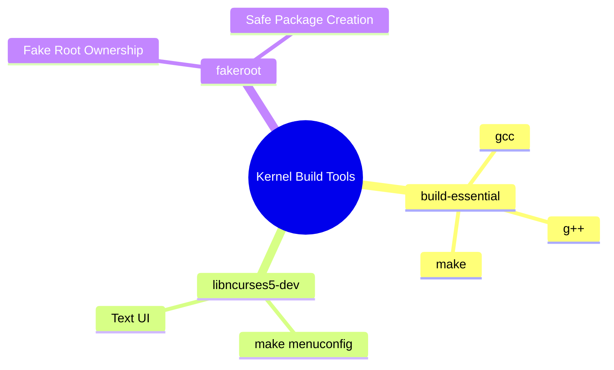

---

# What Debian Is Really Doing

Notice something interesting.

The book is NOT teaching:

```bash
gcc kernel.c
```

---

Instead it's teaching:

```text
Build Debian Package
```

---

Because Debian wants:

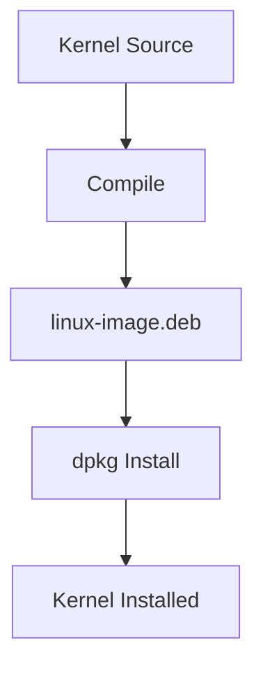

rather than:

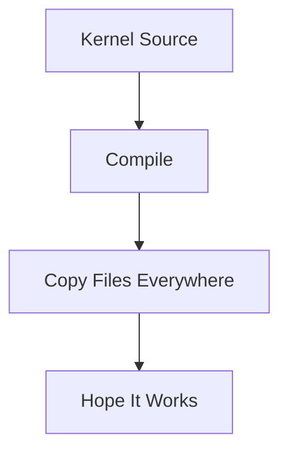

---

# Commands To Remember

Install prerequisites:

```bash
sudo apt install build-essential libncurses5-dev fakeroot
```

---

Compiler:

```bash
gcc
```

---

Build system:

```bash
make
```

---

Kernel menu configuration:

```bash
make menuconfig
```

---

Package-safe root simulation:

```bash
fakeroot
```

---

# Mental Model

```text
build-essential
=
Tools To Compile

libncurses5-dev
=
Tools To Configure

fakeroot
=
Tools To Package

Together

↓

Kernel Source
↓

Kernel Debian Package
```

---

Next we'll do **Section 10.2.2 — Getting the Sources**, where the book suddenly introduces:

```text
linux-source-4.9

/usr/src

linux-source-4.9.tar.xz

Why apt install downloads source code

Difference between:
linux source package
and
linux-source binary package
```

That section confuses many people, so we'll unpack it carefully.