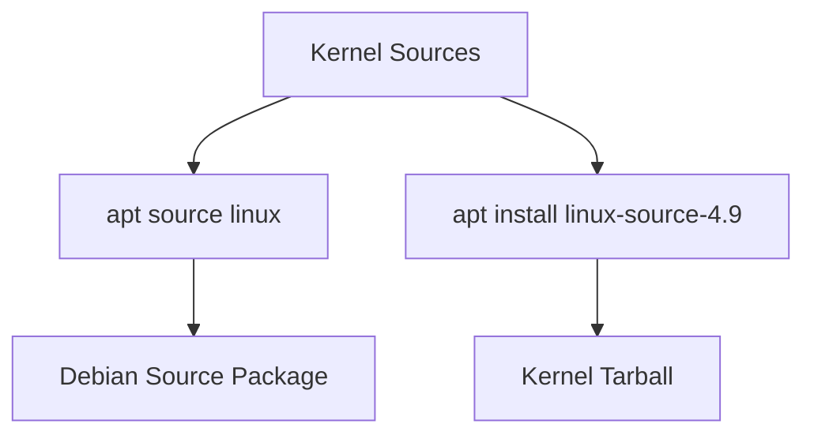
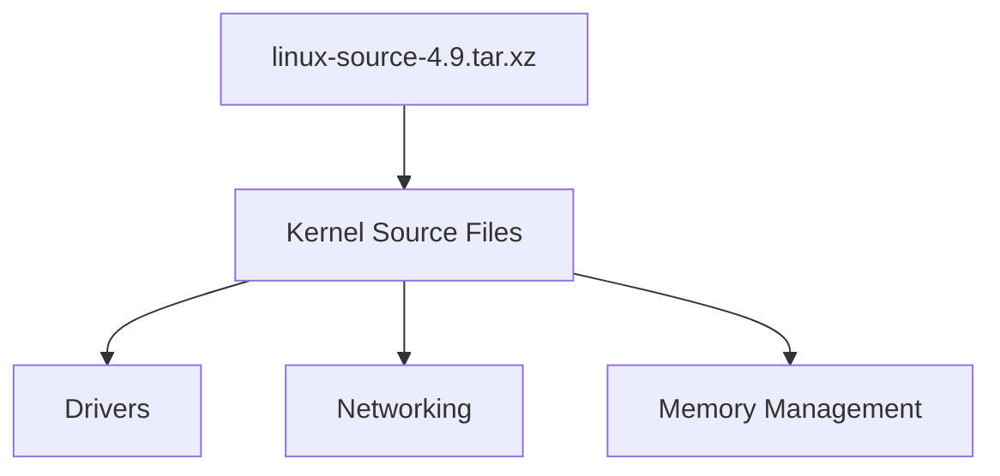
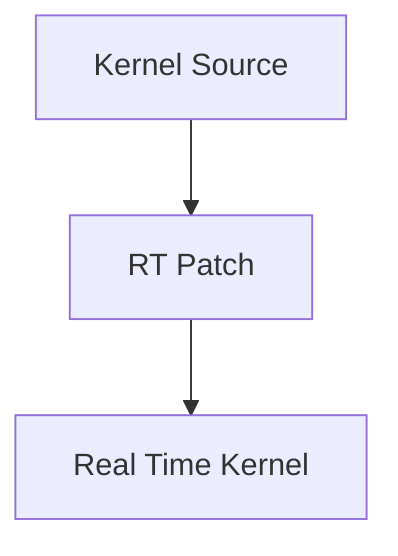
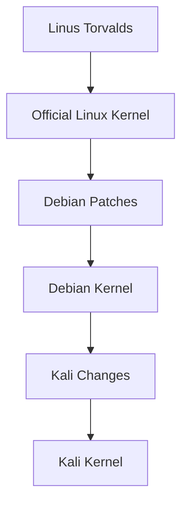
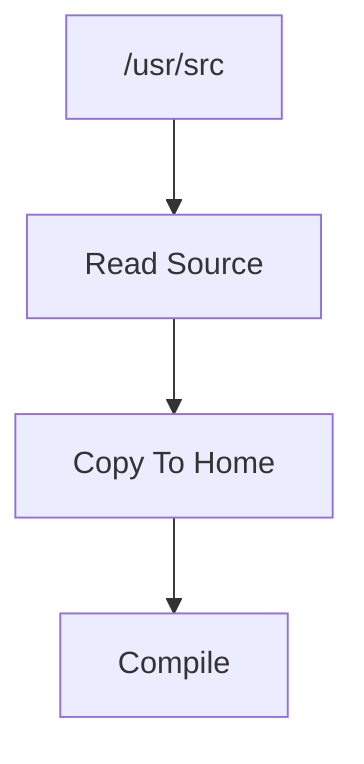
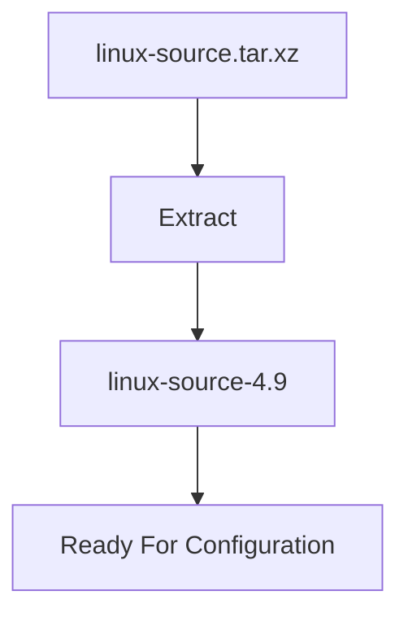
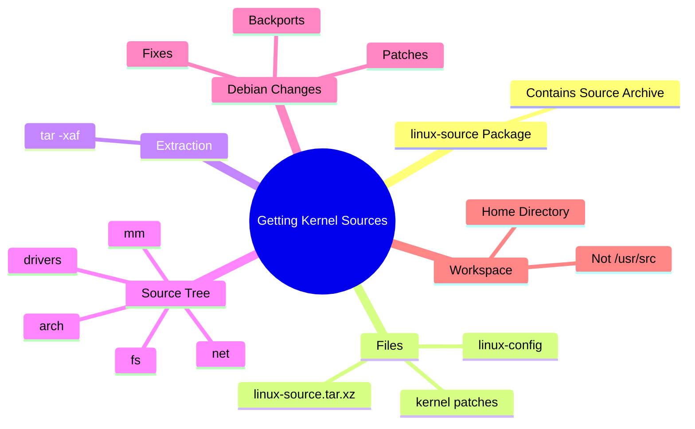

# Section 10.2.2 — Getting the Kernel Sources

Now we have the tools:

```bash
build-essential
libncurses5-dev
fakeroot
```

Next question:

```text
Where do we get the Linux kernel source code?
```

---

# First Important Confusion

The book says:

```bash
apt install linux-source-4.9
```

Most people think:

```text
APT only installs software.

Why is it installing source code?
```

Good question.

---

# Remember: Debian Packages Can Contain Anything

Earlier we learned:

```text
.deb
=
Archive
+
Metadata
```

A package can contain:

```text
Programs

Documentation

Source Code

Images

Configuration Files

Anything
```

---

So Debian created a package called:

```text
linux-source-4.9
```

whose purpose is:

```text
Store Linux Source Code
```

---

# Don't Confuse These Two Things

This is where many people get lost.

---

## Option 1

```bash
apt source linux
```

Downloads:

```text
Debian Source Package
```

Contains:

```text
.dsc
.orig.tar
.debian.tar
```

Used by package maintainers.

---

## Option 2

```bash
apt install linux-source-4.9
```

Installs:

```text
Compressed Linux Source Archive
```

into:

```text
/usr/src/
```

Used by kernel builders.

---



---

# What Does linux-source Package Install?

Example:

```bash
apt install linux-source-4.9
```

---

After installation:

```bash
ls /usr/src
```

might show:

```text
linux-config-4.9

linux-patch-4.9-rt.patch.xz

linux-source-4.9.tar.xz
```

---

# Let's Understand Each File

---

## linux-source-4.9.tar.xz

This is the big one.

Contains:

```text
Entire Linux Kernel Source Tree
```

---

Think:

```text
Compressed Source Code
```

---



---

# What Is Inside The Tarball?

After extraction:

```text
linux-source-4.9/

├── arch/
├── block/
├── crypto/
├── drivers/
├── fs/
├── include/
├── kernel/
├── mm/
├── net/
└── Makefile
```

---

# Quick Explanation

## drivers/

Contains:

```text
Hardware Drivers
```

Example:

```text
WiFi
USB
Bluetooth
Graphics
```

---

## fs/

Contains:

```text
Filesystem Code
```

Examples:

```text
ext4
xfs
btrfs
fat
ntfs
```

---

## net/

Contains:

```text
Networking Stack
```

Examples:

```text
TCP
UDP
IPv4
IPv6
Routing
```

---

## mm/

Contains:

```text
Memory Management
```

---

## arch/

Contains:

```text
CPU Architecture Specific Code
```

Examples:

```text
x86
ARM
MIPS
PowerPC
```

---

# What Is linux-config-4.9?

Contains:

```text
Kernel Configuration Files
```

---

Remember:

Kernel has thousands of options.

Example:

```text
Enable Bluetooth?

Enable USB?

Enable EXT4?

Enable IPv6?
```

---

The configuration files help Debian build kernels consistently.

---

# What Is linux-patch-4.9-rt.patch.xz?

A patch.

Remember from Quilt section:

```text
Patch
=
Difference
```

---

This specific patch adds:

```text
Real-Time Kernel Features
```

---



---

# Why Doesn't Debian Use Upstream Source Directly?

This is extremely important.

The book says:

```text
The source code does not exactly match
Linus Torvalds' source tree.
```

---

# Why?

Because Debian applies patches.

---

Think:

```text
Linux Developers
↓
Release Kernel

Debian
↓
Adds Fixes

Kali
↓
Adds More Fixes
```

---



---

# What Kind Of Changes?

Examples:

---

## Backported Fixes

Suppose:

```text
Linux 6.9
```

contains:

```text
Critical Security Fix
```

---

Current Debian kernel:

```text
Linux 6.6
```

---

Debian may:

```text
Copy Fix

Apply To 6.6
```

without upgrading whole kernel.

---

# Why Is This Useful?

Instead of:

```text
Huge Upgrade
```

you get:

```text
Small Safe Fix
```

---

# Why Extract Into Home Directory?

Book says:

```bash
mkdir ~/kernel
cd ~/kernel

tar -xaf /usr/src/linux-source-4.9.tar.xz
```

---

Many beginners ask:

```text
Why not build inside /usr/src?
```

---

Because:

```text
/usr/src
```

is owned by root.

---

Compilation doesn't need root.

---

Better:

```text
/home/user/kernel/
```

---



---

# What Does tar -xaf Mean?

Command:

```bash
tar -xaf linux-source-4.9.tar.xz
```

---

## tar

Archive utility.

---

## x

```text
Extract
```

---

## a

```text
Automatically Detect Compression
```

---

## f

```text
Use File
```

---

Think:

```text
Extract Archive File
```

---

# After Extraction

Directory becomes:

```text
~/kernel/

└── linux-source-4.9/
```

---

Inside:

```text
Thousands of Source Files
```

---



---

# Why Not Just Download From kernel.org?

You absolutely can.

Example:

```text
kernel.org
```

provides:

```text
Official Linux Source
```

---

But Debian prefers:

```text
linux-source package
```

because:

```text
Version Matches Debian

Debian Patches Included

Easier Support
```

---

# Mental Model

```text
linux-source Package

↓

Compressed Kernel Source

↓

Extract

↓

Kernel Source Tree

↓

Configure

↓

Compile

↓

Build Package
```

---

# Commands To Remember

Find available source packages:

```bash
apt-cache search ^linux-source
```

---

Install source:

```bash
sudo apt install linux-source-4.9
```

---

See source archive:

```bash
ls /usr/src
```

---

Create workspace:

```bash
mkdir ~/kernel
```

---

Extract source:

```bash
tar -xaf /usr/src/linux-source-4.9.tar.xz
```

---

# Mindmap Summary



---

## The Most Important Thing To Remember

There are **two completely different "source" concepts**:

```text
apt source linux
=
Debian Source Package
(.dsc, .orig.tar, .debian.tar)

apt install linux-source-<version>
=
Kernel Source Tarball
inside /usr/src
```

Most people confuse these for months.

---

Next we'll do **10.2.3 Configuring the Kernel**, which is where you'll finally understand:

```text
What .config is

Why /boot/config-* exists

make menuconfig

make oldconfig

make olddefconfig

Built-in vs Module vs Disabled
```

That section is the heart of kernel customization.