# Section 10.2.3 — Configuring the Kernel

At this point you have:

```text
Kernel Source ✓

Build Tools ✓
```

Now comes the most important step:

```text
What exactly should be included
inside the kernel?
```

This is called:

```text
Kernel Configuration
```

---

# Why Configuration Exists

Imagine Linux developers supported:

```text
Bluetooth
WiFi
USB
NFS
EXT4
NTFS
Docker
IPv6
Sound
Graphics
Thousands of Drivers
```

Should every computer load everything?

No.

Different systems need different features.

---

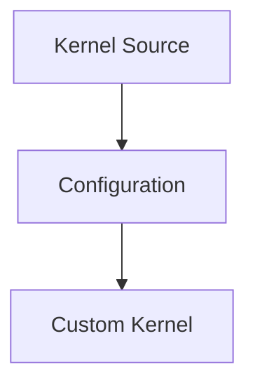

---

# Think Of It Like Building A Car

Suppose a car factory offers:

```text
Sunroof
Sports Package
Heated Seats
GPS
Leather Seats
```

Every customer chooses differently.

---

Linux kernel is similar.

Configuration decides:

```text
Include Feature?

Exclude Feature?

Build As Module?
```

---

# The Most Important File: `.config`

Inside the kernel source tree you'll eventually find:

```text
.config
```

This file is:

```text
The Blueprint
For Your Kernel
```

---

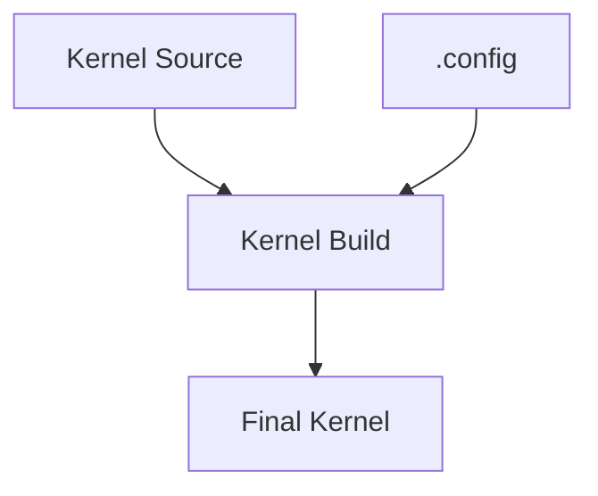

---

# What Does .config Contain?

Thousands of lines like:

```text
CONFIG_USB=y

CONFIG_BLUETOOTH=m

CONFIG_FIREWIRE=n
```

---

These three letters are everything.

---

# Option 1 — y

```text
Built Into Kernel
```

Example:

```text
CONFIG_USB=y
```

Meaning:

```text
Always Present
```

inside kernel image.

---


---

# Option 2 — m

```text
Build As Module
```

Example:

```text
CONFIG_BLUETOOTH=m
```

Meaning:

```text
Compile Separately

Load Only When Needed
```

---


---

# Option 3 — n

```text
Disabled
```

Example:

```text
CONFIG_FIREWIRE=n
```

Meaning:

```text
Do Not Compile
```

---


---

# Built-In vs Module

This is the single biggest kernel concept.

---

## Built-In

```text
Inside Kernel Image
```

Advantages:

```text
Always Available

No Loading Required
```

Disadvantages:

```text
Larger Kernel
```

---

## Module

```text
Separate File
```

Advantages:

```text
Smaller Kernel

Load On Demand
```

Disadvantages:

```text
Must Be Loaded
```

---

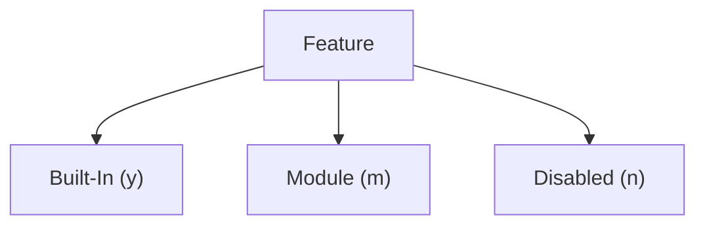

---

# Real Example

Suppose:

```text
Laptop Has WiFi
```

You probably want:

```text
CONFIG_WIFI=m
```

because:

```text
Load Driver When Needed
```

---

Suppose:

```text
Root Filesystem = EXT4
```

You usually want:

```text
CONFIG_EXT4=y
```

Why?

Because kernel must read filesystem during boot.

---

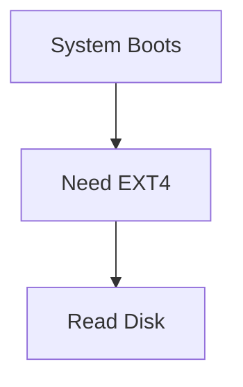

---

# Where Does Current Configuration Come From?

Most people do NOT start from scratch.

That would be insane.

Modern kernels contain:

```text
15,000+ Options
```

---

Instead:

Use your current kernel configuration.

---

# Look In /boot

Example:

```bash
ls /boot/config*
```

Output:

```text
/boot/config-6.12.13-amd64
```

---

This file contains:

```text
Configuration Used
To Build Current Kernel
```

---

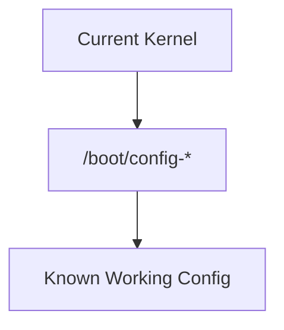

---

# Copy Existing Configuration

Inside source directory:

```bash
cp /boot/config-$(uname -r) .config
```

---

Meaning:

```text
Start With
Current Working Configuration
```

Instead of:

```text
Starting From Zero
```

---

# What Does uname -r Mean?

Command:

```bash
uname -r
```

Example:

```text
6.12.13-amd64
```

---

Meaning:

```text
Current Running Kernel Version
```

---

# The Famous make menuconfig

Now we reach the tool everyone talks about.

---

Command:

```bash
make menuconfig
```

---

This launches:

```text
Terminal-Based Configuration Menu
```

built using ncurses.

---

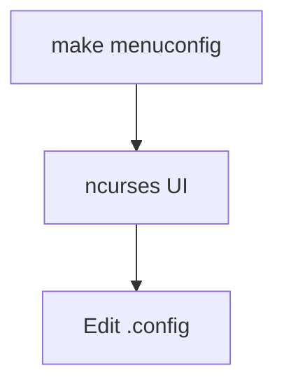

---

# What Does It Look Like?

Something similar to:

```text
┌────────────────────────────┐
│ Kernel Configuration       │
├────────────────────────────┤
│ Device Drivers             │
│ Networking                 │
│ File Systems               │
│ Security Options           │
└────────────────────────────┘
```

---

# What Happens When You Save?

The menu updates:

```text
.config
```

file.

Nothing compiled yet.

Only configuration changes.

---

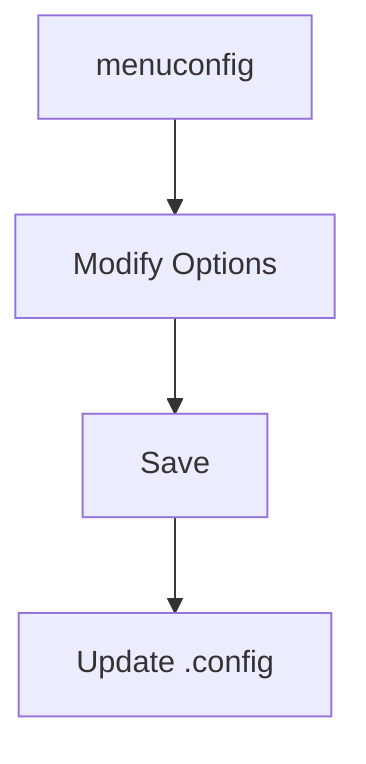

---

# Why Not Edit .config Directly?

You can.

Example:

```text
CONFIG_BLUETOOTH=m
```

to:

```text
CONFIG_BLUETOOTH=n
```

---

But:

```text
15,000+ Settings
```

is painful.

Menuconfig is safer.

---

# make oldconfig

Very important during upgrades.

---

Scenario:

```text
Old Config
+
New Kernel Version
```

---

New kernel introduces:

```text
50 New Options
```

---

What should happen?

---

Command:

```bash
make oldconfig
```

---

Kernel asks:

```text
New Feature X?

(y/n/m)
```

for every new option.

---

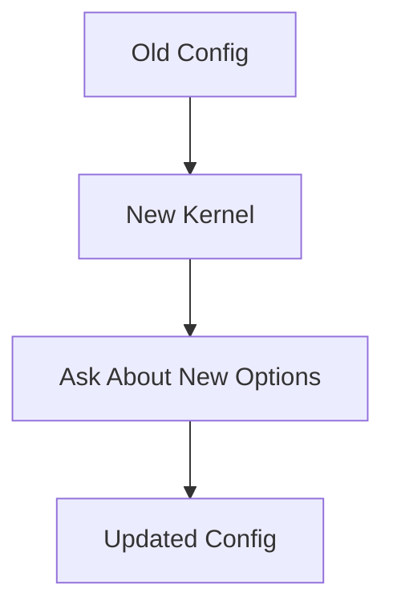

---

# Problem With oldconfig

Suppose:

```text
100 New Options
```

You'll answer:

```text
y/n/m
```

100 times.

Annoying.

---

# make olddefconfig

Modern preferred option.

---

Command:

```bash
make olddefconfig
```

---

Meaning:

```text
Keep Existing Settings

Automatically Accept Defaults
For New Options
```

---

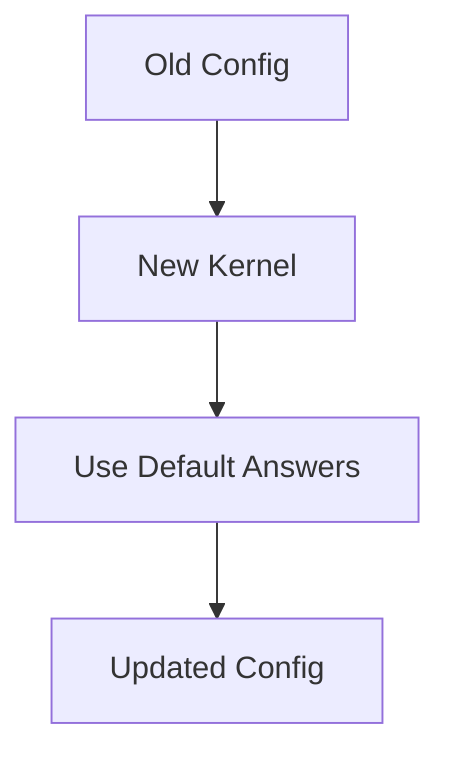

---

# Typical Workflow

Use existing config:

```bash
cp /boot/config-$(uname -r) .config
```

---

Update for new kernel:

```bash
make olddefconfig
```

---

Customize:

```bash
make menuconfig
```

---

Save.

---

Ready to compile.

---

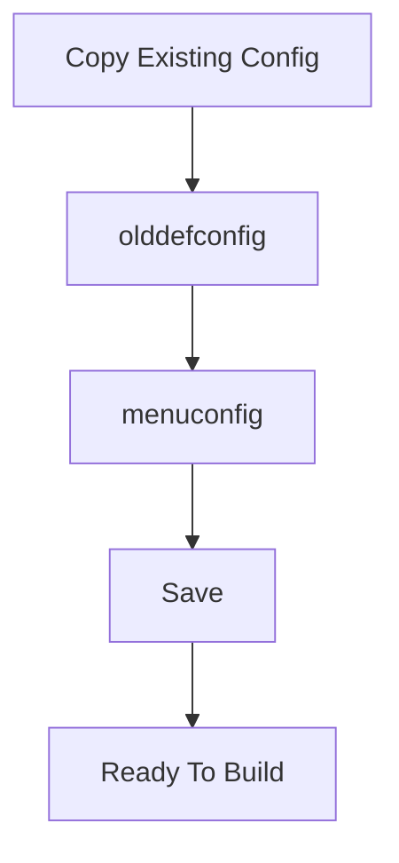

---

# Security Perspective

Remember why we started?

Custom kernel can reduce:

```text
Unused Drivers

Unused Protocols

Unused Features
```

---

Example:

Disable:

```text
Bluetooth

FireWire

Legacy Filesystems
```

if your system never uses them.

---

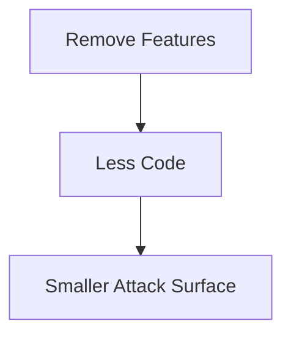

---

# Commands To Remember

Check running kernel:

```bash
uname -r
```

---

Find current config:

```bash
ls /boot/config*
```

---

Copy current config:

```bash
cp /boot/config-$(uname -r) .config
```

---

Update old config:

```bash
make oldconfig
```

---

Auto-update old config:

```bash
make olddefconfig
```

---

Interactive configuration:

```bash
make menuconfig
```

---

# Mental Model

```text
Kernel Source
        +
.config
        ↓

Build System

        ↓

Custom Kernel
```

The `.config` file is essentially the **recipe that tells the kernel build system exactly what features, drivers, filesystems, and security options should exist in the final kernel**.

---

### Before the Next Section

Now we have:

```text
Kernel Source ✓

Build Tools ✓

Kernel Configuration ✓
```

Next comes the exciting part:

```text
Actually compiling the kernel
```

where we'll finally see:

```bash
make
make modules
make bindeb-pkg
fakeroot
```

and understand what all those commands are really doing behind the scenes.