# Section 10.2.4 — Compiling and Packaging the Kernel

You now have:

```text
Kernel Source ✓

Build Dependencies ✓

.config ✓
```

Now we finally build the kernel.

---

# First: What Does "Building The Kernel" Actually Mean?

Many people imagine:

```text
One Source File
↓
One Executable
```

Like:

```bash
gcc hello.c -o hello
```

---

The kernel is MUCH larger.

A modern Linux kernel contains roughly:

```text
30,000+ source files
Millions of lines of code
Thousands of drivers
```

---

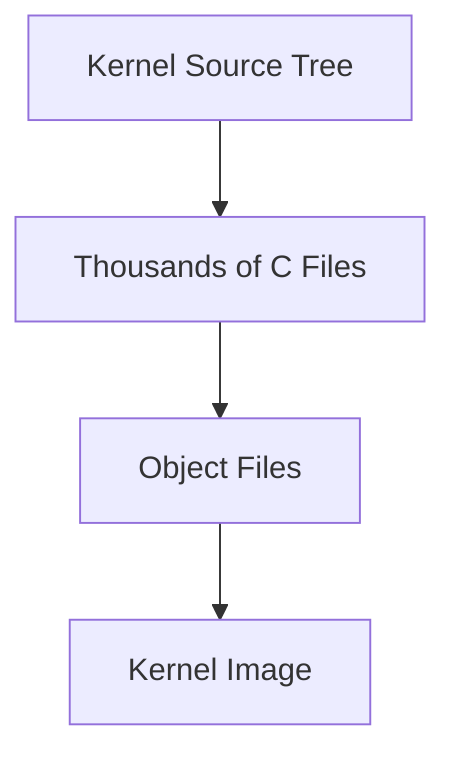

---

# Traditional Linux Kernel Build

Historically Linux admins did:

```bash
make
make modules
make modules_install
make install
```

---

Let's understand each step.

---

# Step 1 — make

Command:

```bash
make
```

---

What happens?

```text
Compile Source Code

Compile Drivers

Compile Networking

Compile Filesystems

Compile Memory Manager
```

---

Produces:

```text
Object Files (.o)
```

and eventually:

```text
vmlinuz
```

(kernel image)

---

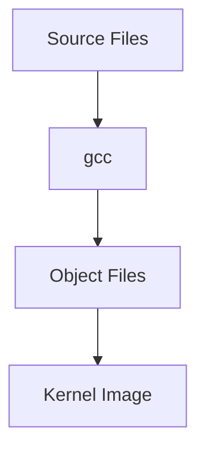

---

# What Is vmlinuz?

You'll see:

```text
vmlinuz
```

everywhere.

Example:

```text
/boot/vmlinuz-6.12.13-amd64
```

---

This is:

```text
Compressed Linux Kernel
```

---

Think:

```text
kernel.exe
```

if you're coming from Windows.

---

# Step 2 — make modules

Remember:

```text
CONFIG_BLUETOOTH=m
```

means:

```text
Build As Module
```

---

Those modules are compiled separately.

Command:

```bash
make modules
```

---

Produces:

```text
*.ko files
```

---

Example:

```text
bluetooth.ko
usb-storage.ko
```

---

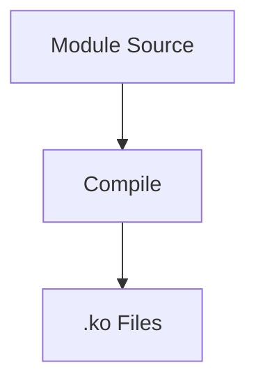

---

# What Is .ko?

```text
Kernel Object
```

Think:

```text
DLL for Linux Kernel
```

(Not exactly, but close enough.)

---

Example:

```bash
modprobe bluetooth
```

loads:

```text
bluetooth.ko
```

into running kernel.

---

# Step 3 — make modules_install

Command:

```bash
make modules_install
```

---

Copies modules into:

```text
/lib/modules/<kernel-version>/
```

---

Example:

```text
/lib/modules/6.12.13/
```

---

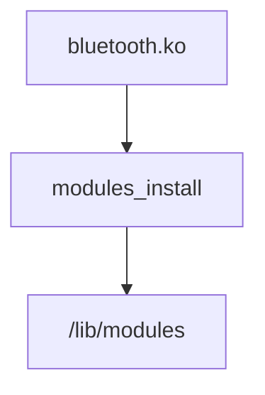

---

# Step 4 — make install

Command:

```bash
make install
```

---

Copies:

```text
Kernel Image

System.map

Configuration
```

into:

```text
/boot
```

---

Example:

```text
/boot/vmlinuz
/boot/initrd
/boot/System.map
```

---

Updates bootloader.

---

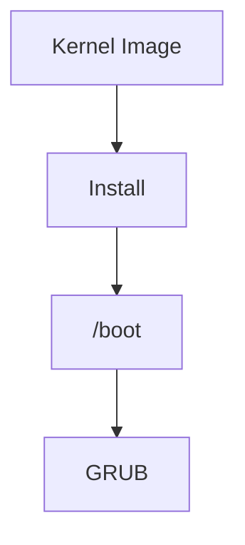

---

# Why Debian Doesn't Like This Method

Problem:

```text
Files copied manually

APT unaware

dpkg unaware

Hard to remove
```

---

Remember Debian philosophy:

```text
Everything Should Be A Package
```

---

# Debian's Better Approach

Instead of:

```bash
make install
```

Debian prefers:

```bash
make bindeb-pkg
```

---

This creates:

```text
.deb packages
```

---

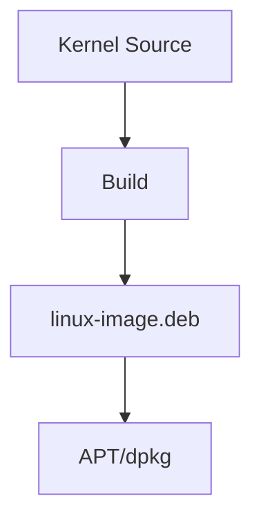

---

# What Does make bindeb-pkg Do?

Think:

```text
Compile Kernel

+

Create Debian Packages
```

---

Command:

```bash
make bindeb-pkg
```

---

Result:

```text
linux-image.deb

linux-headers.deb
```

---

instead of:

```text
Random Files Copied Everywhere
```

---

# Why Kernel Headers Package Exists

You'll often see:

```text
linux-image
linux-headers
```

---

Many beginners ask:

```text
Why two packages?
```

---

# linux-image

Contains:

```text
Actual Kernel
```

---

Example:

```text
vmlinuz
modules
boot files
```

---

# linux-headers

Contains:

```text
Header Files
```

used when compiling:

```text
Drivers
VirtualBox Modules
VMware Modules
NVIDIA Drivers
```

---

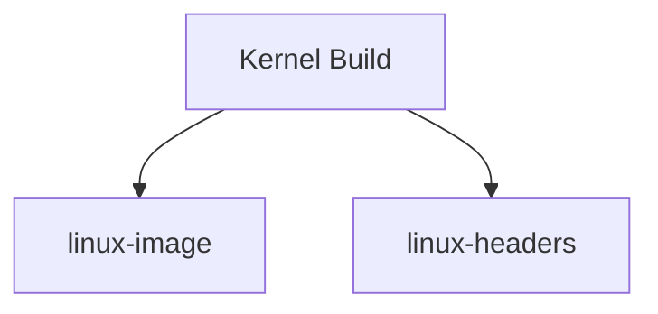

---

# Why fakeroot Appears Again

Kernel package contains files that should appear:

```text
root:root
```

owned.

---

You don't want:

```bash
sudo make bindeb-pkg
```

---

Instead:

```bash
fakeroot make bindeb-pkg
```

---

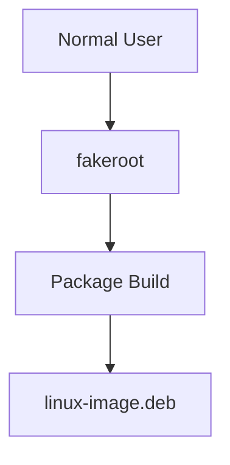

---

# Typical Debian Kernel Build Command

The book uses:

```bash
fakeroot make -j $(nproc) bindeb-pkg
```

Let's break it down.

---

# What Is -j ?

Without:

```bash
make
```

uses:

```text
One CPU Core
```

---

Modern CPUs have:

```text
4
8
16
32
```

cores.

---

# Example

```bash
make -j 8
```

means:

```text
Use 8 Jobs Simultaneously
```

---

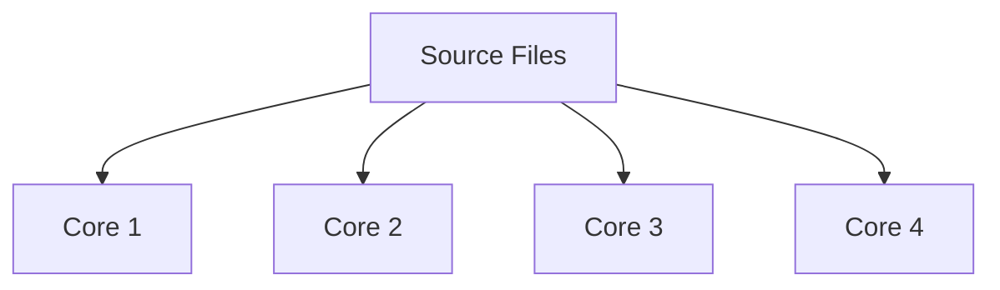

---

# What Is $(nproc)?

Command:

```bash
nproc
```

Example output:

```text
8
```

---

Meaning:

```text
Number Of CPU Cores
```

---

So:

```bash
make -j $(nproc)
```

becomes:

```bash
make -j 8
```

automatically.

---

# Why This Matters

Kernel compilation can take:

```text
30+ minutes
```

on one core.

---

Using all cores:

```text
Much Faster
```

---

# Build Output

After successful build:

Parent directory contains:

```text
linux-image-xxxx.deb

linux-headers-xxxx.deb

linux-libc-dev-xxxx.deb
```

---

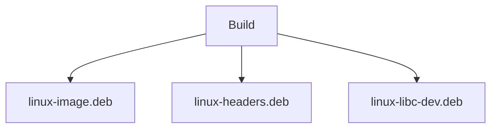

---

# Installing The New Kernel

Just like any package:

```bash
sudo dpkg -i linux-image*.deb
```

---

or:

```bash
sudo apt install ./linux-image*.deb
```

---

Notice:

```text
Kernel
=
Normal Debian Package
```

now.

---

# What Happens After Installation?

APT installs:

```text
Kernel Image

Modules

Boot Files
```

---

Updates:

```text
GRUB
```

automatically.

---

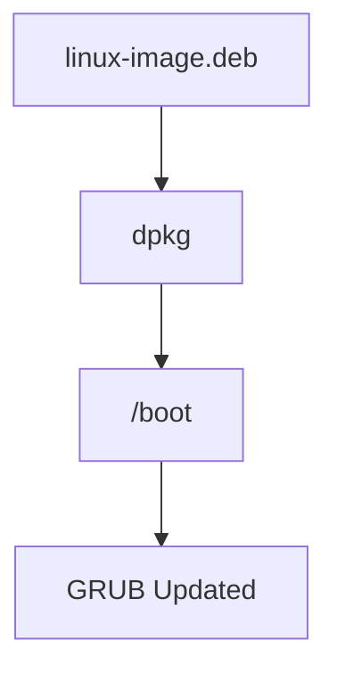

---

# Reboot Required

Kernel is special.

Unlike:

```bash
apt install nmap
```

you cannot immediately switch kernels.

---

Need:

```bash
reboot
```

---

Then:

```bash
uname -r
```

should show:

```text
New Kernel Version
```

---

# How To Verify New Kernel

Command:

```bash
uname -r
```

Example:

```text
6.12.13-custom
```

---

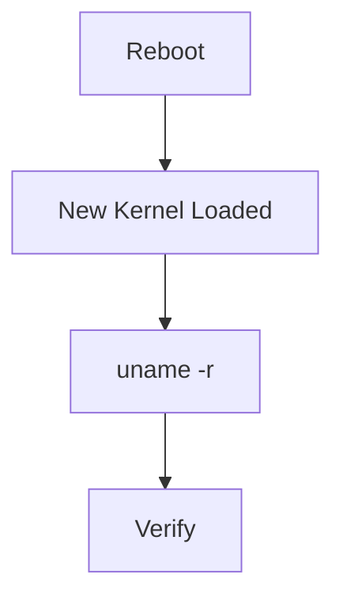

---

# Common Beginner Fear

```text
What if my kernel doesn't boot?
```

Good news:

Debian usually keeps:

```text
Old Kernel
+
New Kernel
```

installed.

---

GRUB menu allows:

```text
Boot Previous Working Kernel
```

---

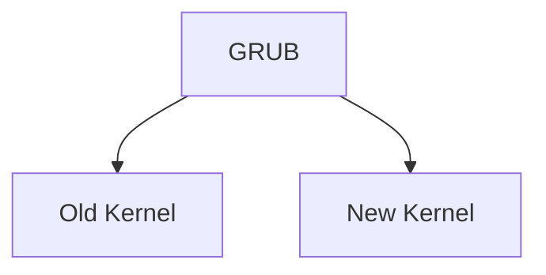

---

# The Real Mental Model

Forget all the commands for a second.

The whole process is:

```text
Kernel Source
        +
.config
        ↓

Compile

        ↓

Kernel Image
        +
Modules

        ↓

Package Into
linux-image.deb

        ↓

Install With dpkg

        ↓

Reboot

        ↓

Running Custom Kernel
```

---

# Commands To Remember

Show CPU count:

```bash
nproc
```

---

Compile kernel:

```bash
make
```

---

Compile modules:

```bash
make modules
```

---

Create Debian packages:

```bash
make bindeb-pkg
```

---

Recommended:

```bash
fakeroot make -j $(nproc) bindeb-pkg
```

---

Install packages:

```bash
sudo dpkg -i *.deb
```

---

Verify running kernel:

```bash
uname -r
```

---

# Mindmap Summary

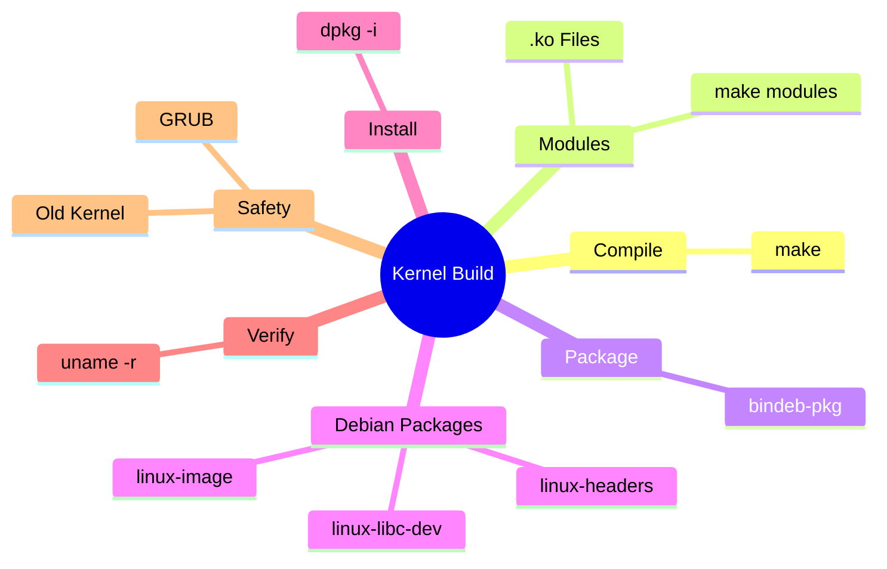

---

## What You Just Learned

The biggest idea of this section is:

```text
Traditional Linux:

make
make install

Debian/Kali:

make bindeb-pkg

↓

linux-image.deb

↓

dpkg -i
```

Debian turns even the Linux kernel into a normal package so that APT and dpkg can manage it cleanly.

---

Next we'll cover **Installing and Booting the New Kernel / Recovery & Troubleshooting**, where the book discusses:

```text
initrd

GRUB

Boot failures

Kernel panics

Recovery using older kernels

Why keeping old kernels is important
```

which is usually where first-time kernel builders run into problems.