# Section 10.2.5 — Installing, Booting, and Recovering From Kernel Problems

You've built:

```text
linux-image-custom.deb
linux-headers-custom.deb
```

Installed them:

```bash
sudo dpkg -i linux-image*.deb
```

Everything looks good.

Now comes the scary part:

```text
Reboot
```

---

# What Actually Happens During Boot?

Most people think:

```text
Power On

↓

Linux Starts
```

Not even close.

---

Actual flow:

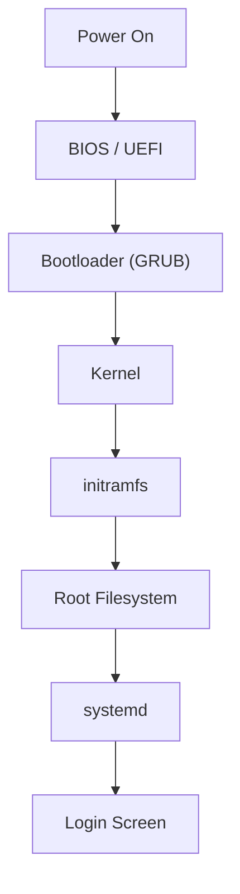

---

# Step 1 — BIOS / UEFI

Hardware starts.

Checks:

```text
CPU
RAM
Disk
Devices
```

Then loads:

```text
Bootloader
```

---

# Step 2 — GRUB

GRUB stands for:

```text
GRand Unified Bootloader
```

Think:

```text
Kernel Launcher
```

---

GRUB menu may show:

```text
Kali Linux

Advanced Options

Memory Test
```

---

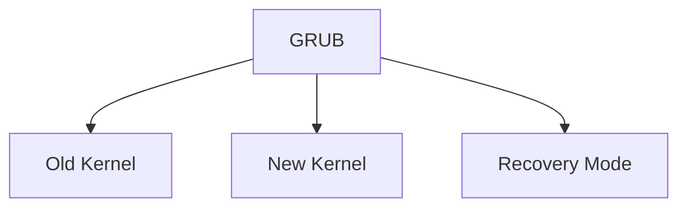

---

# Why GRUB Matters

When you install a new kernel:

```bash
dpkg -i linux-image-custom.deb
```

Debian automatically updates:

```text
GRUB Configuration
```

so GRUB knows about your new kernel.

---

# What Files Go Into /boot?

Example:

```bash
ls /boot
```

might show:

```text
vmlinuz-6.12.13

initrd.img-6.12.13

config-6.12.13

System.map-6.12.13
```

---

# Understanding Each File

## vmlinuz

The actual kernel.

---


---

## config

The `.config` used to build the kernel.

Useful later for:

```text
Rebuilding
Debugging
Comparisons
```

---

## System.map

Contains:

```text
Kernel Symbol Table
```

Think:

```text
Address Book
for Kernel Functions
```

Mostly useful for debugging.

---

## initrd.img

This is the one everyone gets confused about.

---

# What Is initrd / initramfs?

Let's imagine:

```text
Kernel Starts
```

and immediately needs:

```text
Read Root Filesystem
```

Problem:

```text
Root Filesystem Driver
May Not Be Loaded Yet
```

---

Example:

```text
Root Filesystem = EXT4

EXT4 Driver = Module
```

Kernel can't load the filesystem because:

```text
Filesystem Driver
is on the filesystem
```

😂

Chicken-and-egg problem.

---

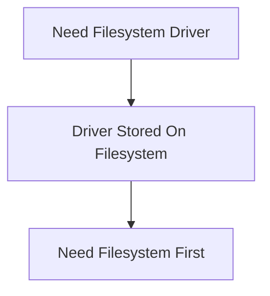

---

# Debian's Solution

Create a tiny temporary filesystem.

Called:

```text
initrd

or

initramfs
```

---

Contains:

```text
Drivers

Modules

Scripts

Storage Tools
```

needed during early boot.

---

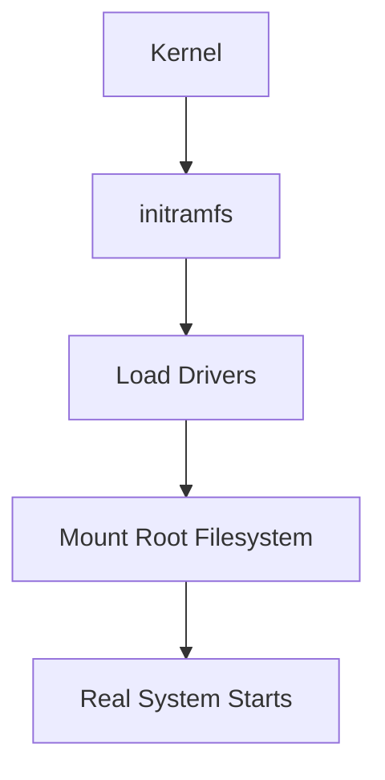

---

# Think Of initramfs As

```text
Emergency Toolkit
```

used before the real system becomes available.

---

# What Happens After Kernel Loads?

Kernel loads:

```text
initramfs
```

Then:

```text
Disk Drivers
Filesystem Drivers
RAID Drivers
LVM Drivers
Encryption Tools
```

become available.

---

Then kernel can finally mount:

```text
/
```

(root filesystem)

---

System startup continues.

---

# Common Problem #1 — Kernel Panic

One of the scariest Linux messages.

Example:

```text
Kernel panic
not syncing
unable to mount root fs
```

---

Meaning:

```text
Kernel Started

Could Not Continue
```

---

Most common reasons:

```text
Wrong Filesystem Driver

Broken initramfs

Missing Storage Driver

Bad Kernel Configuration
```

---

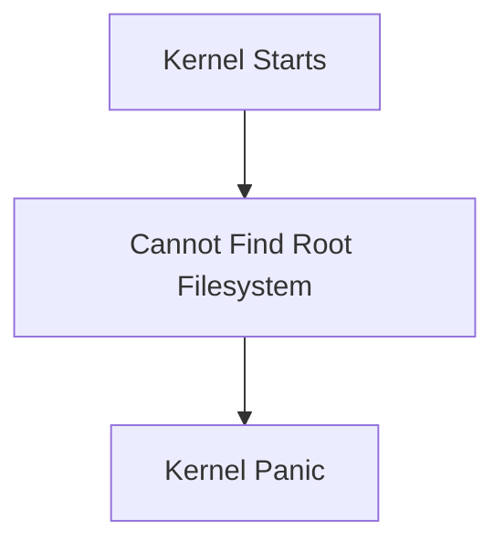

---

# Example

Suppose you disabled:

```text
CONFIG_EXT4
```

but root partition uses:

```text
EXT4
```

---

Kernel boots.

Needs EXT4.

EXT4 doesn't exist.

---

Result:

```text
Kernel Panic
```

---

# Why Keeping Old Kernels Matters

Imagine:

```text
Custom Kernel Fails
```

---

GRUB still contains:

```text
Previous Working Kernel
```

---

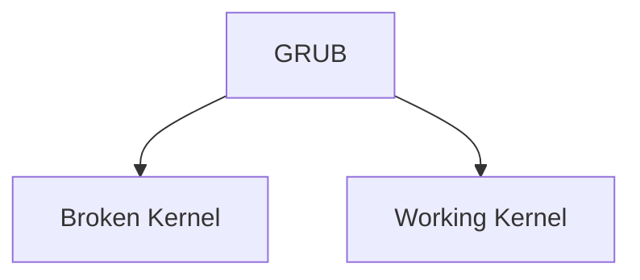

---

Simply choose:

```text
Advanced Options
```

and boot older kernel.

---

This is why Debian normally keeps multiple kernels installed.

---

# Advanced Options For Kali/Linux

In GRUB:

```text
Advanced options for Kali Linux
```

shows:

```text
Kernel A

Kernel B

Kernel C

Recovery Modes
```

---

Useful if latest kernel fails.

---

# Recovery Mode

Special boot option.

Boots with:

```text
Minimal Services

Root Access

Troubleshooting Environment
```

---

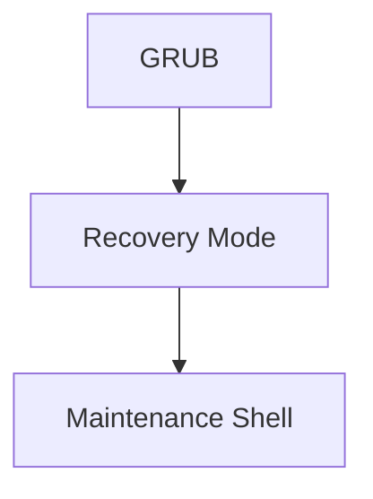

---

# Common Problem #2 — Missing Modules

Suppose:

```text
WiFi Driver = Module
```

but:

```bash
make modules_install
```

was forgotten.

---

Kernel boots.

WiFi doesn't work.

---

Why?

Because:

```text
Driver Exists

But Module Not Installed
```

---

# How To Check Running Kernel

After reboot:

```bash
uname -r
```

Example:

```text
6.12.13-custom
```

---

Confirms:

```text
New Kernel Running
```

---

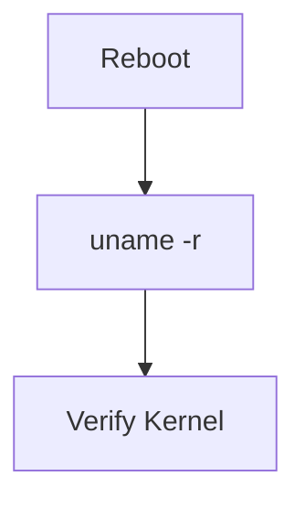

---

# How To Check Loaded Modules

Command:

```bash
lsmod
```

Example:

```text
bluetooth
iwlwifi
snd_hda_intel
```

---

Meaning:

```text
Currently Loaded Modules
```

---

# How To Load Module Manually

Example:

```bash
sudo modprobe bluetooth
```

---

Flow:

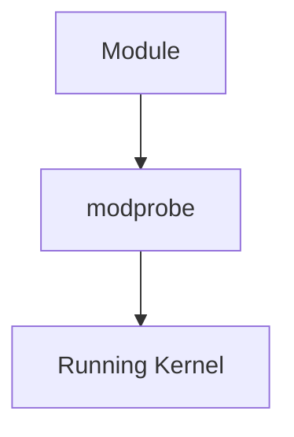

---

# How To See Boot Messages

Very useful after kernel changes.

Command:

```bash
dmesg
```

---

Shows:

```text
Hardware Detection

Driver Loading

Kernel Errors

Boot Messages
```

---

Think:

```text
Kernel Log
```

---

# If Custom Kernel Completely Fails

Boot old kernel.

Then remove broken one:

```bash
sudo dpkg -r linux-image-custom
```

or:

```bash
sudo apt remove linux-image-custom
```

---

Because remember:

```text
Kernel

=

Normal Debian Package
```

---

# Why Debian Packaging Helps

Traditional kernel installation:

```text
Files Everywhere

Manual Cleanup

Manual GRUB Changes
```

---

Debian packaging:

```text
Install = dpkg

Remove = dpkg

Upgrade = apt

Track Versions = dpkg
```

---

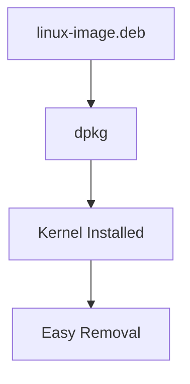

---

# Complete Boot Process Summary

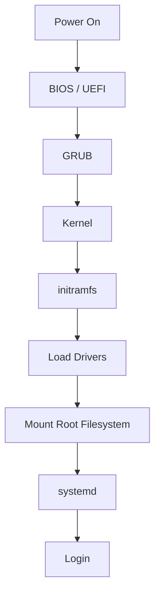

---

# Commands To Remember

Current kernel:

```bash
uname -r
```

Loaded modules:

```bash
lsmod
```

Load module:

```bash
sudo modprobe module_name
```

Kernel log:

```bash
dmesg
```

Installed kernels:

```bash
dpkg -l | grep linux-image
```

Remove kernel:

```bash
sudo apt remove linux-image-name
```

---

# Mental Model

```text
Build Kernel
      ↓

linux-image.deb
      ↓

Install
      ↓

GRUB Updated
      ↓

Reboot
      ↓

Kernel Loads
      ↓

initramfs Loads Drivers
      ↓

Root Filesystem Mounted
      ↓

Linux Starts
```

---

At this point you've covered the full kernel lifecycle:

```text
Get Source
↓
Install Build Tools
↓
Configure Kernel
↓
Compile Kernel
↓
Build Debian Package
↓
Install Package
↓
Boot New Kernel
↓
Recover If Something Breaks
```

This is the complete workflow Kali is teaching in the kernel recompilation chapter.