# Section 10.1.3 — Understanding the `debian/` Directory

So far you've learned:

```text
apt source nmap

↓

Source Code Downloaded

↓

apt build-dep nmap

↓

Build Environment Ready
```

Now comes the most important part:

```text
debian/
```

This directory is what transforms:

```text
Random Source Code

into

Professional Debian Package
```

---

# Big Picture

Suppose you download source from GitHub.

```text
nmap/

├── src/
├── docs/
├── Makefile
└── README
```

This is just software.

Nothing here tells Debian:

```text
Package Name

Dependencies

Version

How To Build

How To Install
```

---

That's what the Debian directory provides.

---

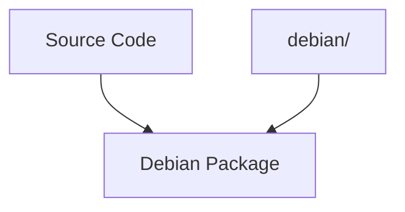

---

# Think Of It Like This

Source code says:

```text
How software works
```

---

Debian directory says:

```text
How software becomes a package
```

---

# Typical Debian Directory

```text
debian/

├── control
├── changelog
├── rules
├── copyright
├── patches/
├── source/
├── install
├── docs
└── *.install
```

---

# The Four Most Important Files

If you only remember four files:

```text
control
rules
changelog
patches
```

you're already ahead of most Linux users.

---

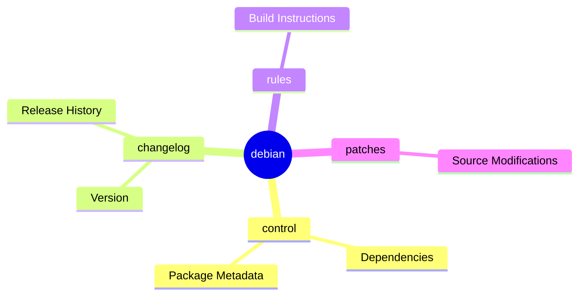

---

# File 1 — control

Most important file.

Think:

```text
Package Identity Card
```

---

Example:

```text
Source: nmap

Build-Depends:
 debhelper-compat (= 13)

Package: nmap

Depends:
 libc6,
 libssl3

Description:
 Network exploration tool
```

---

# What control Defines

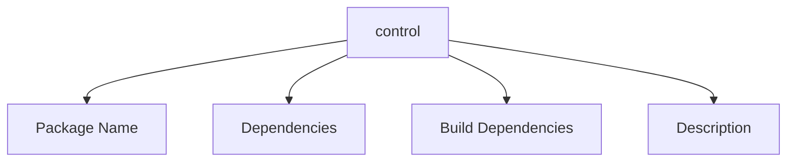

---

# Two Parts Of control

Most beginners miss this.

---

## Source Section

```text
Source:
Build-Depends:
Maintainer:
```

Information for building.

---

## Binary Package Section

```text
Package:
Depends:
Description:
```

Information for installed package.

---

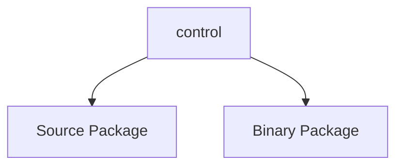

---

# File 2 — changelog

This file controls:

```text
Version Number
```

---

Example:

```text
nmap (7.95-1) kali-rolling;
```

---

When package gets built:

```text
Version
```

comes from:

```text
debian/changelog
```

---

# Why Developers Edit changelog

Suppose you modify package.

Original:

```text
7.95-1
```

Your version:

```text
7.95-1custom1
```

---

Otherwise dpkg can't distinguish them.

---

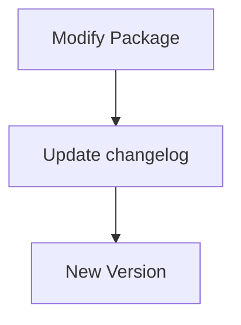

---

# File 3 — rules

This is the scary one.

Beginners think:

```text
rules
=
Huge Build Script
```

Historically yes.

Modern Debian:

```text
Very Small
```

---

Example:

```makefile
#!/usr/bin/make -f

%:
	dh $@
```

---

# What Is dh?

```text
Debhelper
```

Remember from previous section:

```text
Debhelper
=
Packaging Automation Framework
```

---

Without debhelper:

```text
Compile
Install Files
Generate Metadata
Compress Docs
Create Package
```

all done manually.

---

With debhelper:

```text
dh
```

does everything automatically.

---

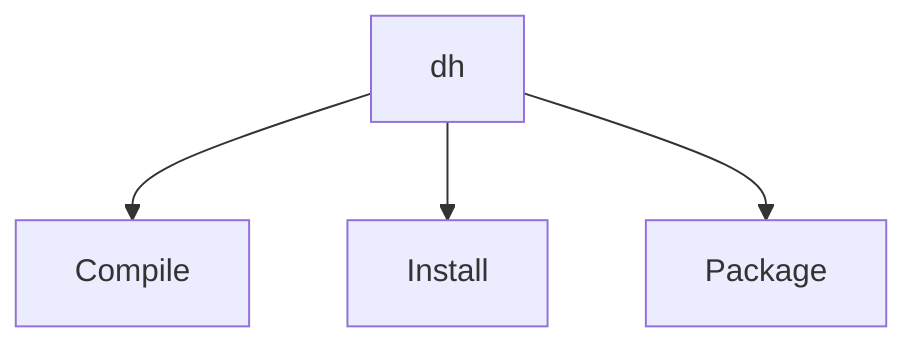

---

# Mental Model

Think:

```text
rules
=
Build Recipe
```

---

Similar to:

```text
Makefile
```

but for package creation.

---

# File 4 — copyright

Contains:

```text
License Information

Authors

Copyright Holders
```

---

Example:

```text
GPLv3
MIT
BSD
Apache
```

---

This is required for Debian packages.

---

# File 5 — patches/

This is where Debian modifications live.

---

Imagine:

Original upstream source:

```text
GitHub Version
```

contains bug.

---

Debian fixes it.

Instead of modifying source directly:

Debian stores fix in:

```text
debian/patches/
```

---

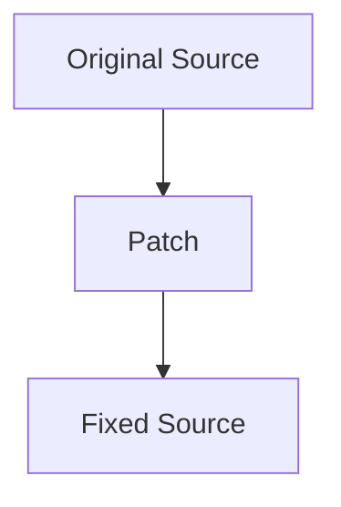

---

# Why Use Patches?

Because new upstream versions arrive.

---

If Debian changed source directly:

```text
Changes Lost
```

---

With patches:

```text
Reapply Automatically
```

---

# Typical Patch Directory

```text
debian/patches/

├── fix-crash.patch
├── security.patch
└── series
```

---

# series File

Very important.

Defines:

```text
Patch Order
```

---

Example:

```text
fix-crash.patch
security.patch
```

---

APT applies:

```text
Patch 1

Then

Patch 2
```

---

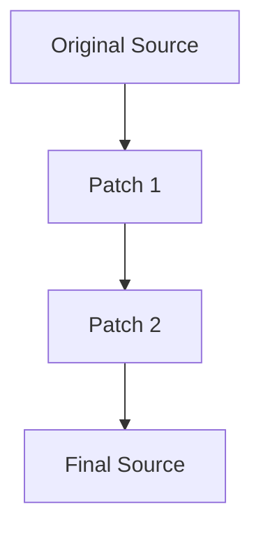

---

# File 6 — source/

Usually contains:

```text
format
```

---

Example:

```text
3.0 (quilt)
```

---

This tells Debian:

```text
Which Packaging Format Is Used
```

---

Most modern packages:

```text
3.0 (quilt)
```

---

# File 7 — *.install

Very practical.

Example:

```text
nmap.install
```

Contains:

```text
src/nmap usr/bin
docs/* usr/share/doc/nmap
```

---

Meaning:

```text
Copy These Files

Into Package
```

---

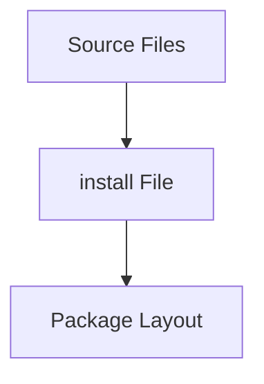

---

# File 8 — docs

Lists documentation files.

Example:

```text
README
CHANGELOG
AUTHORS
```

Debhelper installs them automatically.

---

# How Everything Works Together

Suppose:

```text
apt source nmap
```

You modify source.

---

Build process:

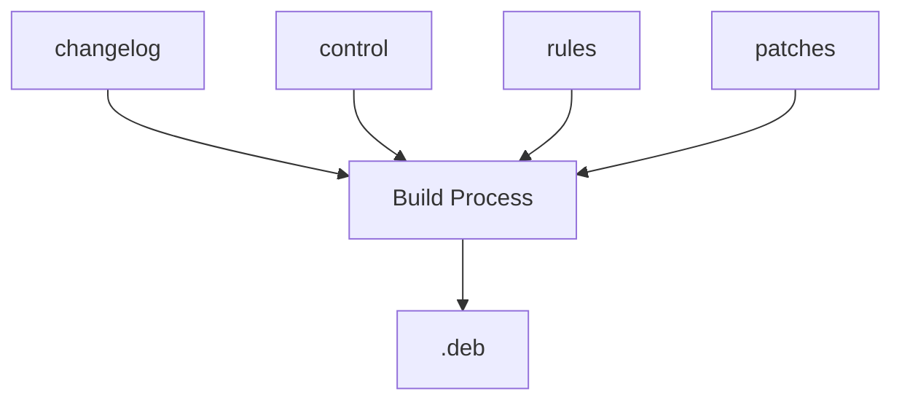

---

# Real Example Walkthrough

Suppose you want:

```text
Custom Nmap
```

Workflow:

---

Download source:

```bash
apt source nmap
```

---

Install build dependencies:

```bash
sudo apt build-dep nmap
```

---

Edit code:

```text
src/
```

---

Update version:

```text
debian/changelog
```

---

Build:

```bash
dpkg-buildpackage
```

---

Output:

```text
nmap-custom.deb
```

---

# Most Important Mental Model

Don't think:

```text
debian/
=
Part Of Software
```

---

Think:

```text
Software
=
Application

debian/
=
Packaging Instructions
```

---

# Real World Analogy

```text
Application
=
Product

debian/
=
Box
Barcode
Instructions
Shipping Label
Version Number
```

---

# Mindmap Summary

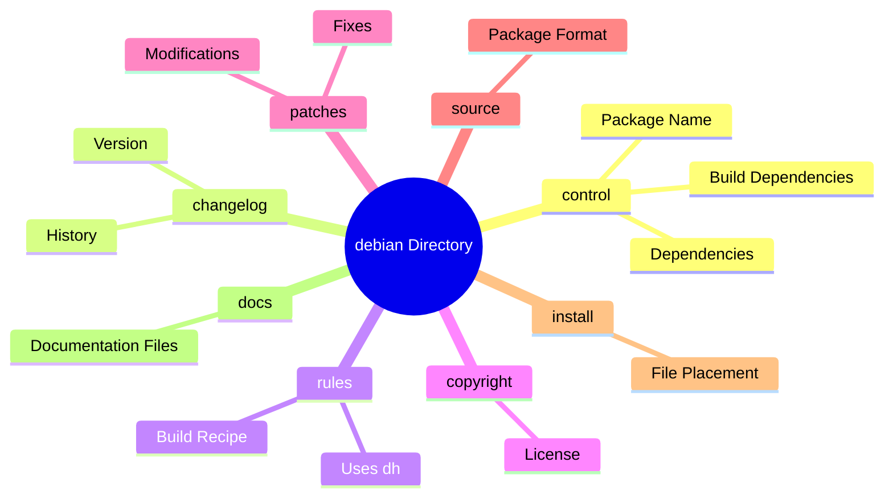

---

# The Three Files You'll Edit Most

As a package modifier, 90% of your work is usually:

```text
debian/control
    Dependencies

debian/changelog
    Version Changes

debian/patches
    Source Modifications
```

Once you understand those three, you're ready for the next step:

```text
Actually building packages
```

where we'll learn:

```bash
dpkg-buildpackage

debuild

fakeroot

debian/rules build

Binary vs Source Builds
```

and finally create our own `.deb` package.