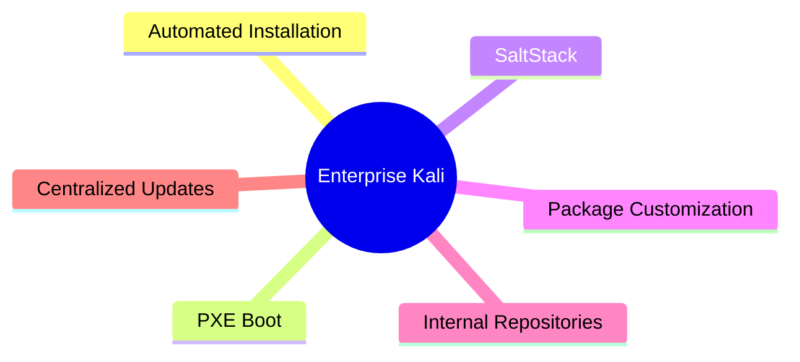
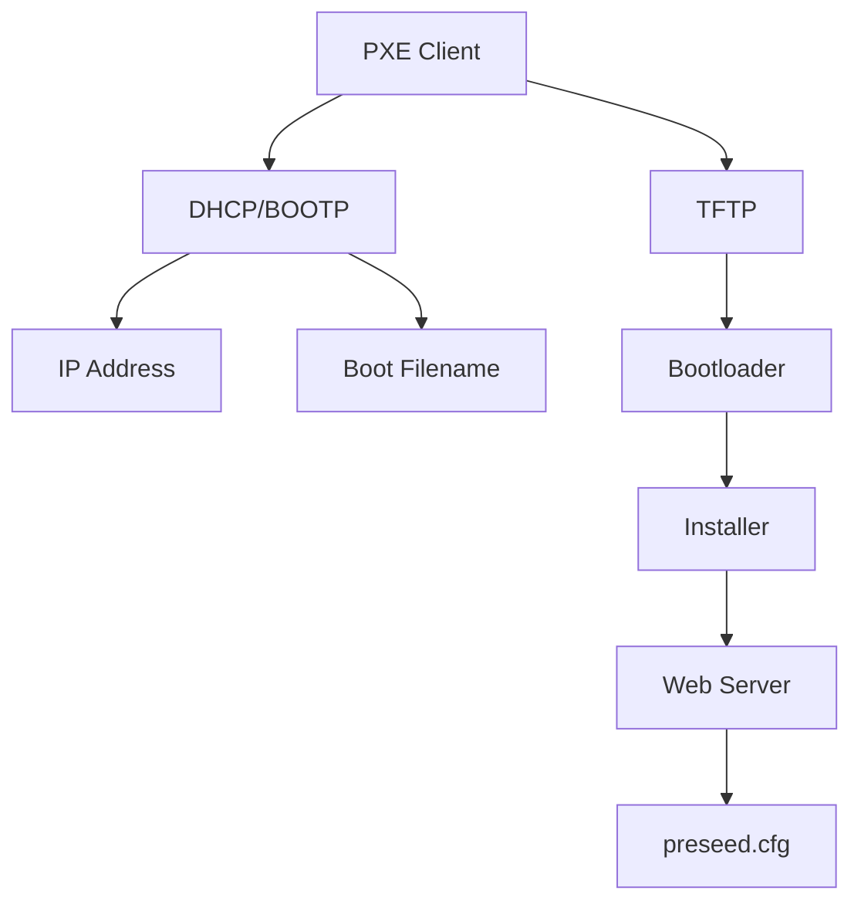
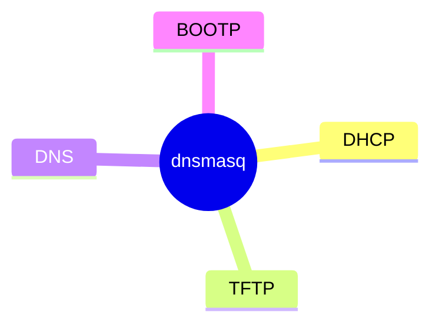
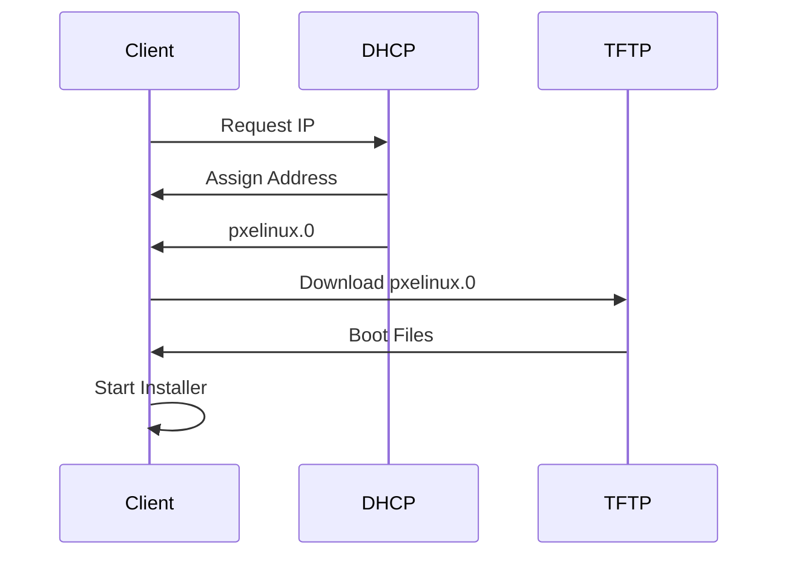
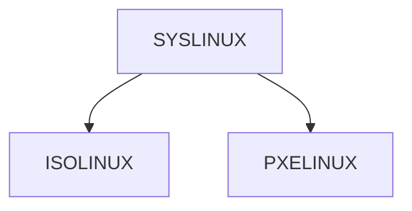
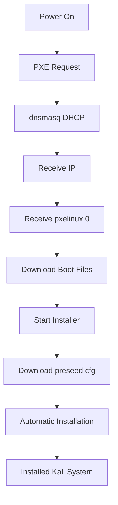
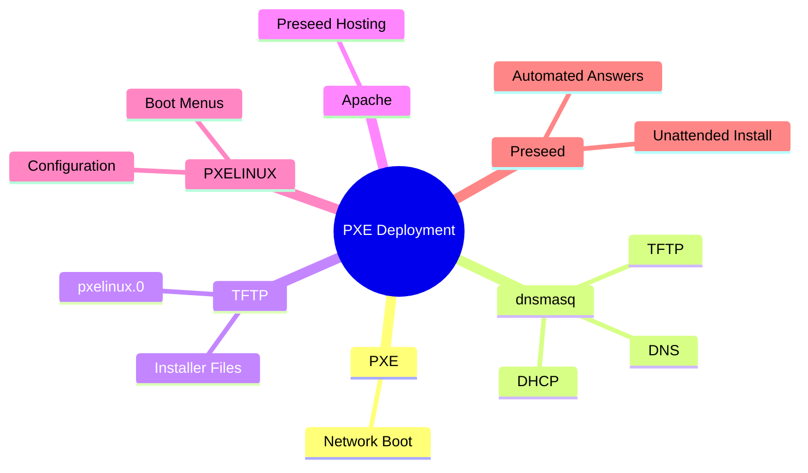

# PXE Boot

> Up to this point, Kali has been used as a workstation-oriented penetration testing distribution. However, Kali is equally capable of operating at enterprise scale. Enterprise environments require centralized deployment, configuration consistency, package control, and automated maintenance. This chapter introduces the building blocks needed to manage large numbers of Kali systems efficiently.

---

# Why Enterprise Kali?

When most people think of Kali Linux, they imagine:


This model works well for:

- Individual penetration testers
    
- Researchers
    
- Students
    
- Small labs
    

But enterprise environments require much more.

---

# Enterprise Challenges

Imagine deploying Kali on:

```text
10 systems
50 systems
100 systems
1000 systems
```

Manually installing and maintaining each system becomes impractical.

Problems include:

- Repeated installations
    
- Configuration drift
    
- Inconsistent tool versions
    
- Slow provisioning
    
- Manual updates
    
- Lack of centralized control
    

---

# Enterprise Kali Goals

The chapter focuses on enabling:



---

# Enterprise Deployment Lifecycle

The chapter introduces a complete deployment pipeline.


---

# Key Technologies Mentioned

The chapter specifically calls out:

|Technology|Purpose|
|---|---|
|PXE|Network Boot|
|SaltStack|Configuration Management|
|Package Forking|Customizing Kali Packages|
|Package Repository|Centralized Package Distribution|

The book jokingly mentions:

> "...we will throw in a crowd of minions to assist you in running your empire."

This refers to SaltStack's master/minion architecture that appears later in the chapter.

---

# 11.1 Installing Kali Linux Over the Network (PXE Boot)

---

# The Problem

Installing Kali from USB works fine once.

But imagine repeating:

```text
Create USB
Insert USB
Boot Machine
Install Kali
Answer Questions
Repeat
```

for dozens of systems.

PXE eliminates this requirement.

---

# What is PXE?

PXE stands for:

```text
Preboot eXecution Environment
```

PXE is a client/server framework that allows a computer to boot directly from the network.

A PXE-capable machine can boot even if:

- No operating system exists
    
- No local storage exists
    
- No USB device exists
    
- No DVD exists
    

---

# Traditional Boot


---

# PXE Boot


---

# PXE Components

The book states that PXE requires at least:

### DHCP/BOOTP Server

Provides:

- IP address
    
- Network configuration
    
- Boot information
    

---

### TFTP Server

Provides:

- PXE bootloader
    
- Installer files
    
- Network boot resources
    

---

### Optional Web Server

Used when:

```text
Debconf Preseeding
```

is required.

Provides:

- Preseed files
    
- Automated installation answers
    

---

# PXE Architecture



---

# Why dnsmasq?

Instead of deploying:

```text
DHCP Server
TFTP Server
DNS Server
```

individually, Kali recommends:

```text
dnsmasq
```

because it combines:



into a single service.

---

# Apache Web Server

The book explicitly notes:

> Apache is installed by default on Kali systems but is not enabled by default.

This is useful because:

- PXE uses dnsmasq
    
- Preseed files can be hosted with Apache
    

without needing additional software installation.

---

# Separate DHCP and TFTP Daemons

The book also mentions situations where dnsmasq may not be sufficient.

Examples:

### Large Networks

You may already have:

```text
Enterprise DHCP Infrastructure
```

---

### Complex Environments

You may need:

```text
Dedicated DHCP Service
Dedicated TFTP Service
```

---

# Alternative Services

The Debian Installation Guide covers:

```text
isc-dhcp-server
tftpd-hpa
```

for PXE environments.

---

# Configuring dnsmasq

Main configuration file:

```text
/etc/dnsmasq.conf
```

---

## Network Interface

```ini
interface=eth0
```

Specifies which interface serves PXE clients.

---

## DHCP Range

```ini
dhcp-range=192.168.101.100,192.168.101.200,12h
```

Meaning:

|Parameter|Value|
|---|---|
|Start IP|192.168.101.100|
|End IP|192.168.101.200|
|Lease|12 Hours|

---

## Gateway

```ini
dhcp-option=option:router,192.168.101.1
```

Sent to clients as:

```text
Default Gateway
```

---

## DNS Servers

```ini
dhcp-option=option:dns-server,8.8.8.8,8.8.4.4
```

Sent to PXE clients.

---

## PXE Boot File

```ini
dhcp-boot=pxelinux.0
```

This tells clients:

```text
Download pxelinux.0
```

from the TFTP server.

---

## Enable TFTP

```ini
enable-tftp
```

Activates the TFTP service.

---

## TFTP Root

```ini
tftp-root=/tftpboot/
```

All PXE resources will be served from:

```text
/tftpboot
```

---

# PXE Boot Sequence



---

# Obtaining Kali PXE Boot Files

Kali provides dedicated netboot archives.

These archives contain:

```text
PXELINUX
Installer Kernel
Initrd
Boot Menus
Configuration Files
```

---

# Available Netboot Variants

The book lists four archives.

---

## 64-bit Text Installer

```text
installer-amd64/current/images/netboot/netboot.tar.gz
```

---

## 64-bit GTK Installer

```text
installer-amd64/current/images/netboot/gtk/netboot.tar.gz
```

---

## 32-bit Text Installer

```text
installer-i386/current/images/netboot/netboot.tar.gz
```

---

## 32-bit GTK Installer

```text
installer-i386/current/images/netboot/gtk/netboot.tar.gz
```

---

# Installer Selection Matrix

|Architecture|Text|GTK|
|---|---|---|
|amd64|✓|✓|
|i386|✓|✓|

---

# Preparing the TFTP Directory

Create:

```bash
mkdir /tftpboot
```

Move into it:

```bash
cd /tftpboot
```

Download:

```bash
wget http://http.kali.org/.../netboot.tar.gz
```

Extract:

```bash
tar xf netboot.tar.gz
```

---

# Resulting Directory Layout

```text
/tftpboot
│
├── debian-installer/
├── ldlinux.c32
├── pxelinux.0
├── pxelinux.cfg
├── version.info
└── netboot.tar.gz
```

---

# Understanding the Extracted Files

---

## pxelinux.0

The PXE bootloader.

Downloaded first by PXE clients.

---

## pxelinux.cfg

Bootloader configuration.

Controls menu behavior.

---

## ldlinux.c32

PXELINUX support module.

Required by the bootloader.

---

## debian-installer

Contains:

```text
Kernel
Initrd
Installer Resources
Boot Screens
Menus
```

---

# PXELINUX and Other Bootloaders

The book notes:

PXELINUX uses the same configuration format as:

```text
SYSLINUX
ISOLINUX
```

This is important because customization techniques learned earlier for Live ISOs can be reused.

---

# Bootloader Family



---

# Customizing the Installer

The book modifies:

```text
debian-installer/amd64/txt.cfg
```

---

# Why Modify txt.cfg?

To pre-configure:

```text
Language
Country
Keyboard Layout
Hostname
Domain
```

and point to:

```text
preseed.cfg
```

---

# Example Boot Parameters

```text
language=en
country=US
keymap=us
hostname=kali
domain=
```

---

# Preseed File Location

```text
url=http://192.168.101.1/preseed.cfg
```

The installer automatically downloads:

```text
preseed.cfg
```

and uses it during installation.

---

# Important Note

The book explicitly reminds the reader:

```text
url
```

is simply an alias for:

```text
preseed/url
```

Both work.

---

# Why Use Preseed?

Without preseed:


---

With preseed:


---

# Modifying Boot Timeout

File:

```text
debian-installer/amd64/syslinux.cfg
```

---

Default PXE Behavior

```text
Wait For User Input
```

---

Enterprise Behavior

```text
Automatic Boot
```

---

Example

```text
timeout 50
```

Meaning:

```text
5 Seconds
```

before automatic boot.

---

# Complete Enterprise PXE Flow



---

# Relationship to Earlier Chapters

The book closes this section by connecting PXE with:

```text
Unattended Installations
```

PXE provides:

- Network boot
    
- Automatic installer launch
    
- Network-hosted preseed files
    

which together enable:

```text
Fully unattended Kali deployments
```

at scale.

---

# Section Summary



### Key Takeaway

PXE transforms Kali deployment from a manual installation process into a scalable provisioning system. By combining dnsmasq, TFTP, PXELINUX, Apache-hosted preseed files, and unattended installation techniques, an administrator can deploy large numbers of Kali systems with little or no physical interaction while maintaining consistency across the environment.