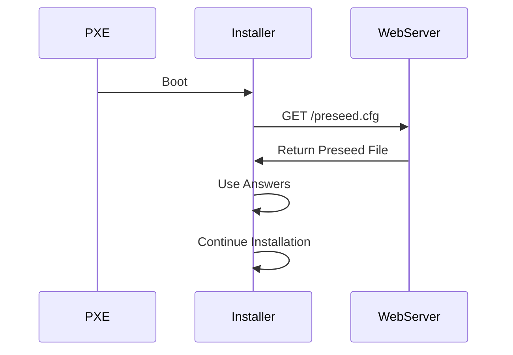

This section is actually showing how to turn a **PXE boot installation into a fully unattended installation**.

Before this change, the flow looks like this:

```text
Power On
↓
PXE Boot
↓
Debian Installer Starts
↓
Ask Language
↓
Ask Country
↓
Ask Keyboard Layout
↓
Ask Hostname
↓
Ask Domain Name
↓
Continue Installation
```

After these changes:

```text
Power On
↓
PXE Boot
↓
Installer Starts
↓
Downloads preseed.cfg
↓
Uses predefined answers
↓
Installs automatically
```

---

# Understanding txt.cfg

File:

```text
debian-installer/amd64/txt.cfg
```

This file defines **boot menu entries**.

Think of it like GRUB menu entries.

When PXELINUX displays:

```text
Install
Advanced Install
Graphical Install
Rescue Mode
```

those options come from configuration files like `txt.cfg`.

---

## Original Entry

A simplified install entry might look like:

```text
label install
    menu label ^Install
    kernel debian-installer/amd64/linux
    append initrd=debian-installer/amd64/initrd.gz
```

Meaning:

|Line|Purpose|
|---|---|
|label install|Internal name|
|menu label ^Install|What user sees|
|kernel|Kernel to boot|
|append|Kernel parameters|

---

# Breaking Down the Modified Entry

```text
label install
```

Internal identifier.

PXELINUX uses this name internally.

---

```text
menu label ^Install
```

Menu text displayed to user.

The `^` indicates the hotkey.

Pressing:

```text
i
```

selects Install.

---

```text
kernel debian-installer/amd64/linux
```

Specifies which kernel image to boot.

File location:

```text
/tftpboot/debian-installer/amd64/linux
```

This is the Debian Installer kernel.

---

```text
initrd=debian-installer/amd64/initrd.gz
```

Specifies the Initial RAM Disk.

The initrd contains:

```text
Installer components
Drivers
Hardware detection tools
Installer scripts
```

Before the real installation environment starts.

---

# What Does append Mean?

Everything after:

```text
append
```

becomes **kernel boot parameters**.

Equivalent to typing parameters manually at boot.

---

## vga=788

```text
vga=788
```

Controls console resolution.

Historically:

```text
788 = 800x600 16-bit color
```

Used to improve installer display appearance.

Not very important today.

---

## quiet

```text
quiet
```

Suppresses excessive boot messages.

Without:

```text
Lots of kernel messages
```

With:

```text
Cleaner screen
```

---

# Automatic Language Selection

```text
language=en
```

Normally installer asks:

```text
Select Language:
```

Now it automatically selects:

```text
English
```

---

# Automatic Country Selection

```text
country=US
```

Normally installer asks:

```text
Select Country:
```

Automatically becomes:

```text
United States
```

---

# Automatic Keyboard Layout

```text
keymap=us
```

Installer skips:

```text
Keyboard Layout?
```

Automatically chooses:

```text
US Keyboard
```

---

# Automatic Hostname

```text
hostname=kali
```

Instead of asking:

```text
Hostname:
```

Installer uses:

```text
kali
```

---

# Automatic Domain

```text
domain=
```

Normally installer asks:

```text
Domain Name:
```

This sets:

```text
Empty Domain
```

---

# The Most Important Parameter

```text
url=http://192.168.101.1/preseed.cfg
```

This is where the magic happens.

---

## What Is preseed.cfg?

A preseed file contains answers to installer questions.

Example:

```text
Language = English
Timezone = UTC
Partition Disk Automatically
Create User
Install Packages
```

---

Instead of asking:

```text
100 Questions
```

the installer reads:

```text
preseed.cfg
```

and uses those answers.

---

# Installation Flow With URL



---

# Why Use a Web Server?

Because one file can control many installations.

Instead of:

```text
USB #1
USB #2
USB #3
```

all systems use:

```text
http://192.168.101.1/preseed.cfg
```

---

# Understanding syslinux.cfg

Now look at:

```text
debian-installer/amd64/syslinux.cfg
```

This controls overall PXE menu behavior.

---

## path

```text
path debian-installer/amd64/boot-screens/
```

Tells PXELINUX where support modules exist.

Examples:

```text
vesamenu.c32
libutil.c32
libcom32.c32
```

---

## include

```text
include debian-installer/amd64/boot-screens/menu.cfg
```

Loads additional menu definitions.

Similar to:

```python
include "menu.cfg"
```

in a program.

---

## default

```text
default debian-installer/amd64/boot-screens/vesamenu.c32
```

Specifies which menu system starts.

Here:

```text
vesamenu.c32
```

provides the graphical boot menu.

---

## prompt 0

```text
prompt 0
```

Means:

```text
Do not show boot prompt
```

Without it:

```text
boot:
```

would appear.

---

## timeout 50

```text
timeout 50
```

This is important.

SYSLINUX counts in:

```text
1/10 second units
```

Therefore:

```text
50
```

means:

```text
5 seconds
```

---

# What Happens During Those 5 Seconds?

```text
PXE Menu Appears
↓
User Can Select Another Option
↓
No Key Pressed?
↓
Default Entry Starts
```

---

# Why Is This Useful?

In an enterprise deployment:

You don't want:

```text
Press Enter
Select Install
Choose Language
Choose Keyboard
Choose Country
```

for every machine.

You want:

```text
Power On
↓
PXE Boot
↓
Wait 5 Seconds
↓
Automatic Install
```

---

# Complete Flow

```text
Machine Powers On
↓
PXE Requests IP Address
↓
dnsmasq Responds
↓
pxelinux.0 Downloaded
↓
PXE Menu Appears
↓
5 Second Timeout
↓
Install Entry Selected
↓
Installer Kernel Boots
↓
Preseed File Downloaded
↓
Language=English
Country=US
Keyboard=US
Hostname=kali
↓
Remaining Answers Read From preseed.cfg
↓
Kali Installed Automatically
```

---

# preseed/url vs url

The book mentions:

```text
preseed/url=http://server/preseed.cfg
```

and

```text
url=http://server/preseed.cfg
```

Both work.

Why?

Because:

```text
url
```

is simply a shorthand alias for:

```text
preseed/url
```

These are equivalent:

```text
url=http://192.168.101.1/preseed.cfg
```

```text
preseed/url=http://192.168.101.1/preseed.cfg
```

Many administrators prefer the second form because it makes it obvious that the parameter belongs to the Debian Preseed subsystem.

---

## What the author is really teaching

The goal isn't just "boot Kali over PXE."

The goal is:

```text
PXE Boot
+
Preseed File
+
Automatic Timeout
=
Zero-Touch Kali Installation
```

Once configured, you can rack 50 bare-metal systems, power them on, and have them all install Kali automatically from the network without touching a keyboard or USB drive.