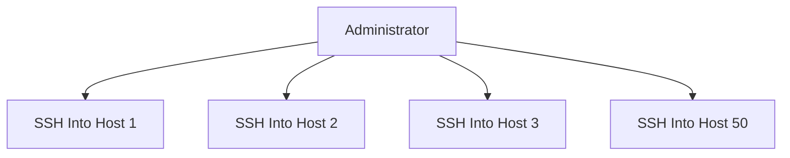
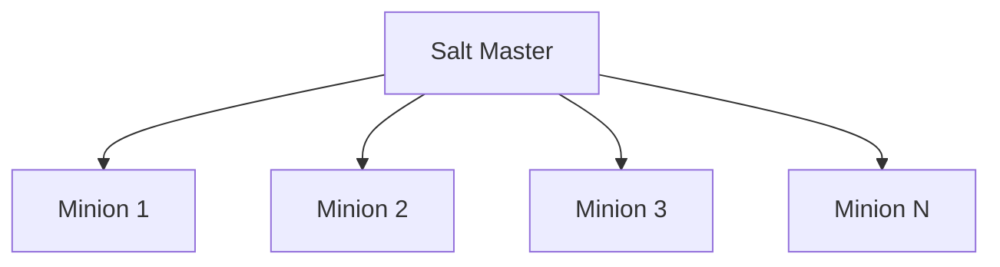
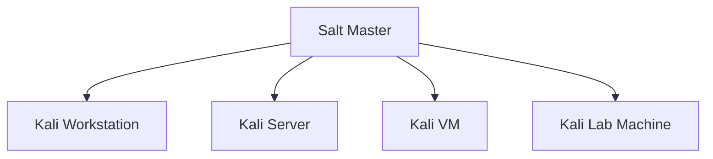
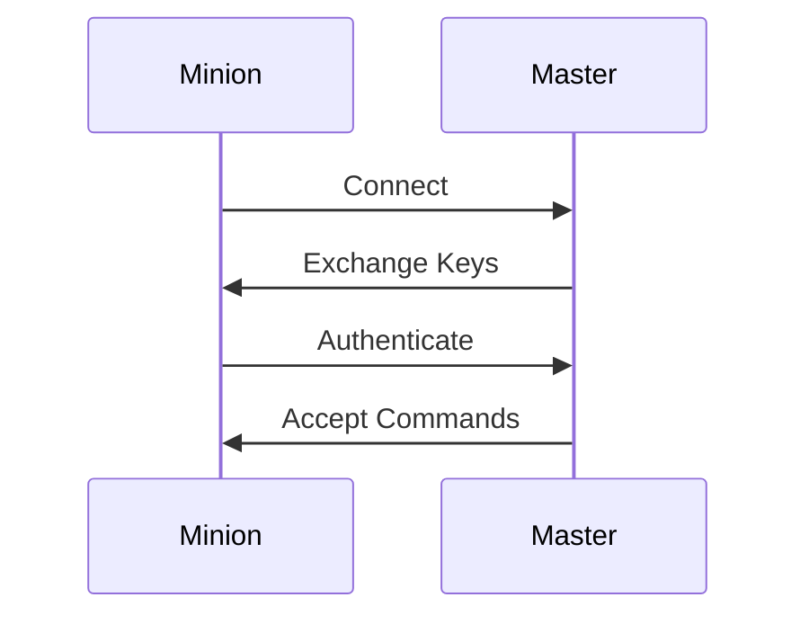
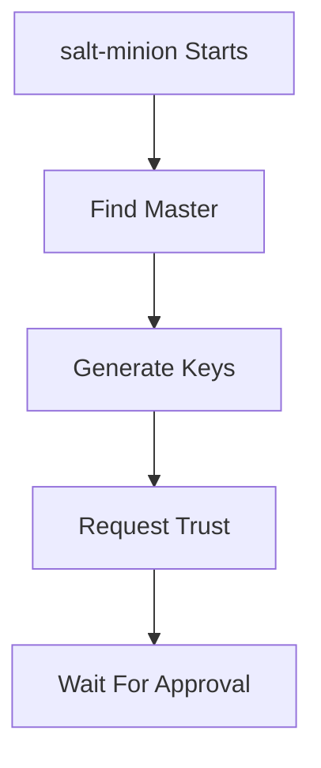
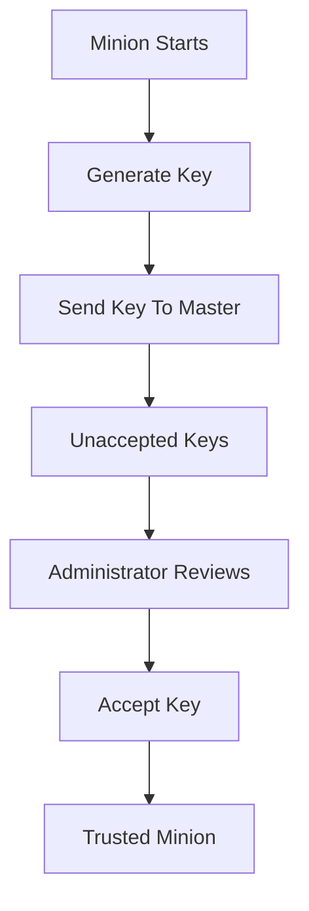

# Section 2 — Leveraging Configuration Management

> PXE solves the problem of installing many Kali systems. Configuration management solves the problem of maintaining them after installation. Instead of logging into every machine individually, an administrator manages systems centrally and continuously enforces the desired configuration across the infrastructure.

---

# The Problem After Installation

PXE and unattended installation make deployment easy.

But what happens after 50 Kali systems are installed?

Consider these common tasks:

```text
Install Nmap on all systems
Enable SSH everywhere
Update all packages
Deploy a custom script
Change a configuration file
Replace a failed workstation
```

Without configuration management:



The administrator repeats the same actions on every system.

This does not scale.

---

# What is Configuration Management?

Configuration management is the practice of defining the desired state of systems and automatically enforcing it.

Instead of:

```text
How do I configure this machine?
```

you think:

```text
What should every machine look like?
```

---

# Desired State Model

Example:

```text
All Kali systems must:
- Have SSH enabled
- Have Nmap installed
- Have latest updates installed
```

Configuration management continuously pushes systems toward that state.

---

# Configuration Management in Kali

Kali includes several popular tools:

```text
Ansible
Chef
Puppet
SaltStack
```

The book focuses on:

```text
SaltStack
```

---

# Why SaltStack?

SaltStack is a centralized configuration management platform.

It follows a:

```text
Master / Minion
```

architecture.

---

# SaltStack Architecture



---

# Core Components

## Salt Master

The central controller.

Responsibilities:

```text
Send commands
Store configuration
Manage minions
Accept authentication keys
Execute orchestration tasks
```

---

## Salt Minion

Managed host.

Responsibilities:

```text
Connect to master
Execute commands
Report results
Receive configuration
```

---

# Real Enterprise Example



One administrator can manage hundreds of systems.

---

# Section 11.2.1 — Setting Up SaltStack

---

# Installation Strategy

The book recommends:

|System|Package|
|---|---|
|Management Server|salt-master|
|Managed Hosts|salt-minion|

---

# Installing the Master

On the management server:

```bash
apt install salt-master
```

This system becomes the central controller.

---

# Installing Minions

On each managed host:

```bash
apt install salt-minion
```

Every machine that should be managed becomes a minion.

---

# Master Discovery

A minion must know:

```text
Where is my master?
```

This is configured in:

```text
/etc/salt/minion
```

---

# Important Note: YAML

The book specifically points out:

> Salt uses YAML as its configuration format.

Example:

```yaml
master: 192.168.122.105
```

This is valid YAML.

---

# Configuring the Master Address

Edit:

```text
/etc/salt/minion
```

Example:

```yaml
master: 192.168.122.105
```

Meaning:

```text
Salt Master IP = 192.168.122.105
```

The minion will attempt to connect to that address.

---

# How Connection Works



---

# Minion Identity

Every minion requires a unique identifier.

Stored in:

```text
/etc/salt/minion_id
```

---

# Default Behavior

By default:

```text
minion_id = hostname
```

Example:

```text
kali-workstation
```

---

# Why Minion IDs Matter

Salt targets systems using their IDs.

Examples later:

```bash
salt kali-scratch ...
```

or

```bash
salt '*' ...
```

Therefore:

```text
Minion IDs must be meaningful and unique.
```

---

# Setting a Custom Minion ID

Example:

```bash
echo kali-scratch >/etc/salt/minion_id
```

Result:

```text
Minion ID = kali-scratch
```

---

# Starting the Minion Service

Enable at boot:

```bash
systemctl enable salt-minion
```

Start immediately:

```bash
systemctl start salt-minion
```

---

# What Happens Next?

As soon as the service starts:



---

# Salt's Trust Model

Salt does not automatically trust new minions.

This prevents rogue systems from joining the infrastructure.

When a new minion connects:

```text
Connection is paused
Waiting for key approval
```

---

# Starting the Master

Enable:

```bash
systemctl enable salt-master
```

Start:

```bash
systemctl start salt-master
```

---

# Viewing Pending Keys

Command:

```bash
salt-key --list all
```

Example output:

```text
Accepted Keys:
Denied Keys:
Unaccepted Keys:
kali-scratch
Rejected Keys:
```

---

# Understanding Key States

## Accepted Keys

Trusted minions.

Can receive commands.

---

## Unaccepted Keys

Known but not trusted.

Waiting for approval.

---

## Denied Keys

Explicitly denied.

---

## Rejected Keys

Rejected by administrator.

---

# Accepting a Minion

Command:

```bash
salt-key --accept kali-scratch
```

Output:

```text
Proceed? [n/Y]
```

Answer:

```text
Y
```

---

# Result

```text
Key for minion kali-scratch accepted.
```

The minion is now trusted.

---

# Trust Establishment Workflow



---

# Why This Matters

Without this approval process:

```text
Any machine could impersonate a minion.
```

Salt uses cryptographic keys to establish trust.

---

# End State of Setup

After acceptance:


Bidirectional secure communication now exists.

The infrastructure is ready for the next stage:

```text
Executing commands on minions
Managing packages
Managing services
Running distributed tasks
```

---

# Section Summary

### Components

|Component|Purpose|
|---|---|
|salt-master|Central controller|
|salt-minion|Managed system|

---

### Important Files

```text
/etc/salt/minion
/etc/salt/minion_id
```

---

### Configure Master

```yaml
master: 192.168.122.105
```

---

### Configure Identity

```bash
echo kali-scratch >/etc/salt/minion_id
```

---

### Start Services

```bash
systemctl enable salt-master
systemctl start salt-master

systemctl enable salt-minion
systemctl start salt-minion
```

---

### Approve Minion

```bash
salt-key --list all

salt-key --accept kali-scratch
```

---

### Key Takeaway

SaltStack uses a master/minion architecture in which every managed Kali system authenticates to a central controller using cryptographic keys. Before any automation can occur, each minion must be configured with the master's address, assigned a unique identity, and explicitly trusted by the master. Once this trust relationship is established, the master gains the ability to centrally manage and automate operations across all connected Kali systems.