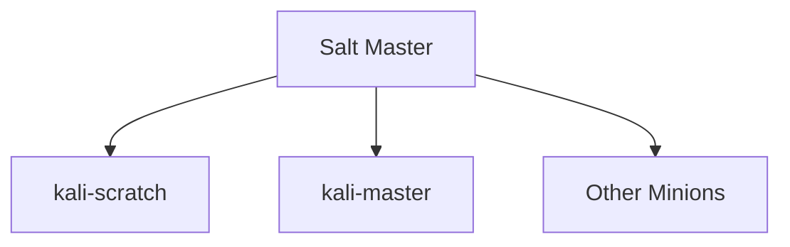
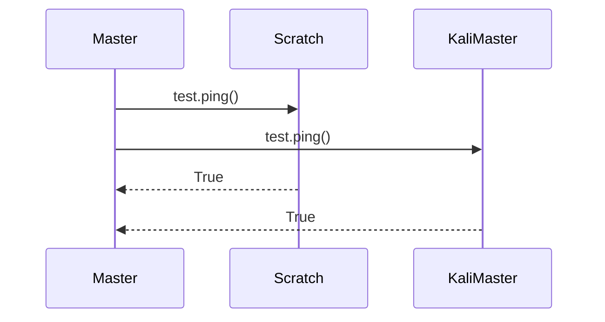
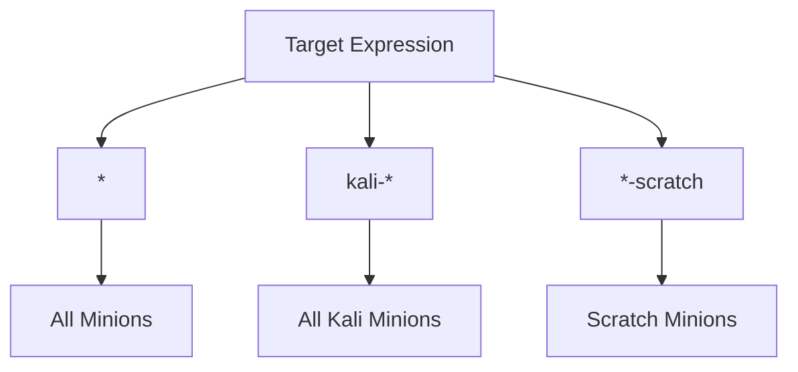
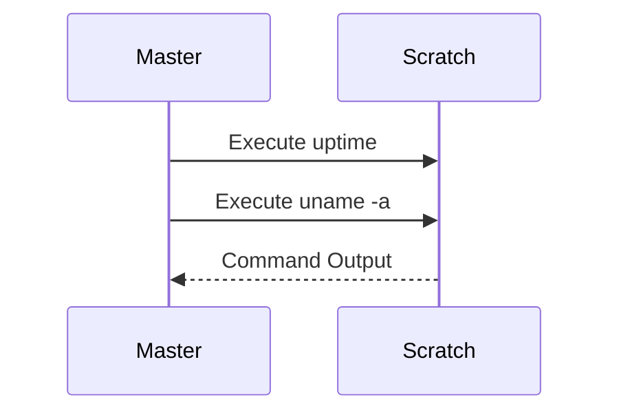
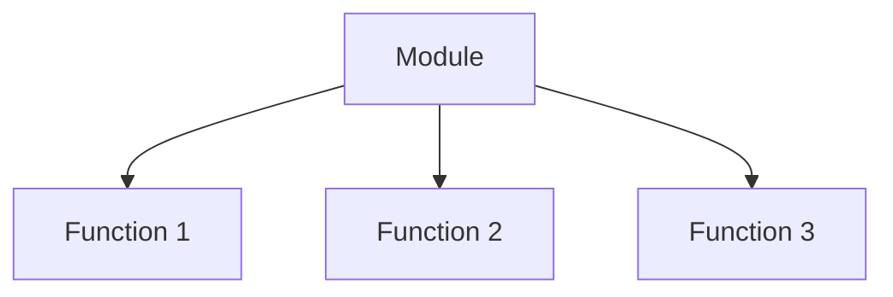
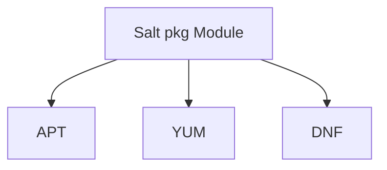
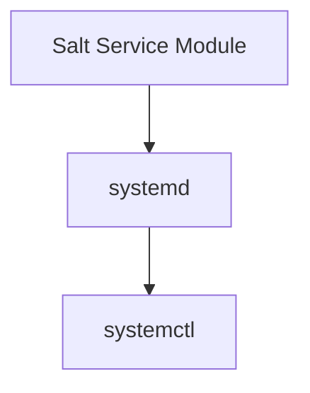
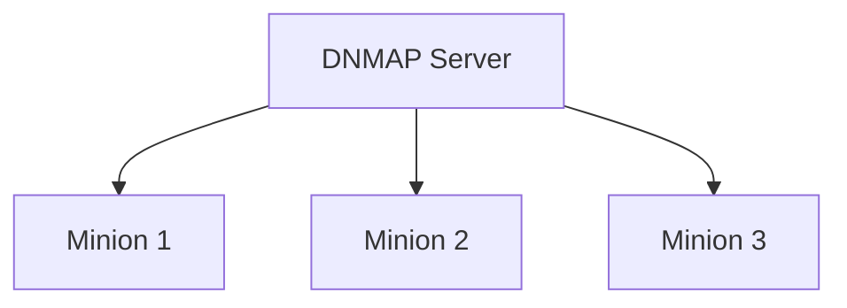
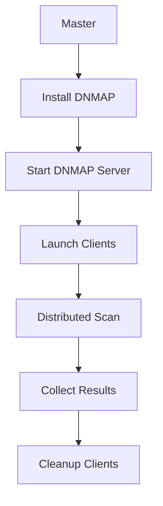

# Section 2.2 — Executing Commands on Minions

> Once a Salt minion has been configured, connected to the master, and its key has been accepted, the master can remotely execute commands on that minion. This is where SaltStack starts becoming powerful: instead of manually logging into each machine, the administrator can execute commands, manage packages, control services, and orchestrate distributed operations from a single central location.

---

# Life After Key Acceptance

At the end of Section 11.2.1, the architecture looked like this:



At this point:

```text
✓ Authentication Complete
✓ Encryption Established
✓ Trust Relationship Created
✓ Remote Execution Available
```

Now the master can start issuing commands.

---

# First Test: Is The Connection Working?

The book starts with:

```bash
master# salt '*' test.ping
```

Output:

```text
kali-scratch:
    True

kali-master:
    True
```

---

# Understanding This Command

Break it apart:

```bash
salt '*' test.ping
```

|Part|Meaning|
|---|---|
|salt|Salt command-line client|
|*|Target all minions|
|test.ping|Execute the ping function from the test module|

---

# What Is '*'?

The first argument is always:

```text
Target Expression
```

In this example:

```text
*
```

is a wildcard.

Meaning:

```text
Every Connected Minion
```

---

# Visualizing the Request



---

# What Does test.ping Actually Do?

Many newcomers assume:

```text
ICMP Ping
```

It does not.

Salt's:

```bash
test.ping
```

is an execution module function.

It simply verifies:

```text
Can the master communicate with the minion?
```

Success returns:

```text
True
```

---

# Why Use test.ping?

Before doing anything dangerous:

```text
Package Updates
Configuration Changes
Service Restarts
```

you first verify connectivity.

Equivalent idea:

```bash
ping server
```

before SSH.

---

# Targeting Specific Systems

You do not always want:

```text
All Minions
```

---

## Single Minion

```bash
salt kali-scratch test.ping
```

Targets:

```text
Only kali-scratch
```

---

## Wildcard Matching

Salt supports wildcard expressions.

Example:

```bash
salt '*-scratch' test.ping
```

Matches:

```text
web-scratch
db-scratch
kali-scratch
```

---

Example:

```bash
salt 'kali-*' test.ping
```

Matches:

```text
kali-master
kali-scratch
kali-lab
```

---

# Target Matching Concept



---

# Running Shell Commands

The book next demonstrates:

```bash
master# salt kali-scratch cmd.shell 'uptime; uname -a'
```

Output:

```text
05:25:48 up 44 min, 2 users, load average: 0.00, 0.01, 0.05

Linux kali-scratch 4.5.0-kali1-amd64 ...
```

---

# Breaking It Down

```bash
salt kali-scratch cmd.shell 'uptime; uname -a'
```

|Component|Meaning|
|---|---|
|salt|Salt client|
|kali-scratch|Target|
|cmd.shell|Execute shell command|
|uptime; uname -a|Command to run|

---

# What Happens Internally?



---

# The cmd Module

The command:

```bash
cmd.shell
```

belongs to:

```text
cmd Execution Module
```

This module allows arbitrary shell execution.

Think:

```text
Remote Bash
```

managed by Salt.

---

# What Did The Commands Show?

---

## uptime

```bash
uptime
```

Output:

```text
05:25:48 up 44 min
```

Shows:

```text
Current Time
Uptime
Logged-in Users
System Load
```

---

## uname -a

```bash
uname -a
```

Shows:

```text
Kernel Version
Architecture
Hostname
Build Information
```

---

# Salt Execution Modules

The book now introduces an important concept:

```text
Execution Modules
```

---

# What Is An Execution Module?

Salt functionality is organized into modules.

Examples:

```text
test
cmd
pkg
service
disk
network
user
file
```

Each module contains functions.

---

# Module Structure



Example:

```text
test.ping
```

means:

```text
Module: test
Function: ping
```

---

# Examples

|Module|Function|Purpose|
|---|---|---|
|test|ping|Connectivity test|
|cmd|shell|Execute shell commands|
|pkg|upgrade|Upgrade packages|
|service|restart|Restart services|
|disk|usage|Disk information|

---

# Discovering Available Modules

The book points to Salt's documentation.

But Salt can also describe itself.

Command:

```bash
salt kali-scratch sys.doc
```

This returns:

```text
Every Module
Every Function
Documentation
```

for that minion.

---

# Why Is This Useful?

Instead of searching online:

```text
"What does this module do?"
```

you ask the minion directly.

---

# Querying Specific Functions

Example:

```bash
salt kali-scratch sys.doc disk.usage
```

Output:

```text
disk.usage:

Return usage information for volumes mounted on this minion
```

---

# Understanding sys.doc

Think of it as:

```text
Built-In API Documentation
```

for Salt.

---

# Package Management with Salt

The book now introduces one of the most important modules:

```text
pkg
```

---

# Why pkg Exists

Different Linux distributions use different package managers:

|Distribution|Package Manager|
|---|---|
|Kali|apt|
|Debian|apt|
|Ubuntu|apt|
|RHEL|yum|
|Fedora|dnf|

Salt provides:

```text
One Interface
Many Backends
```

---

# Package Abstraction Layer



The administrator always uses:

```bash
pkg.*
```

Salt selects the correct backend.

---

# Refresh Package Database

Command:

```bash
salt '*' pkg.refresh_db
```

Equivalent to:

```bash
apt-get update
```

on Kali.

---

# What Happens?


---

# Listing Available Updates

Command:

```bash
salt '*' pkg.list_upgrades
```

Purpose:

```text
Show pending package updates
```

without installing them.

---

# Installing Updates

Command:

```bash
salt '*' pkg.upgrade dist_upgrade=True
```

Equivalent to:

```bash
apt-get dist-upgrade
```

or modern:

```bash
apt full-upgrade
```

---

# Understanding The Output

Example:

```text
base-files

old: 1:2020.2.0
new: 1:2020.2.1
```

Meaning:

```text
Package Updated
```

---

Another example:

```text
zaproxy

old: 2.4.3
new: 2.5.0
```

Meaning:

```text
OWASP ZAP upgraded
```

---

# Reading Salt Upgrade Results

Output fields:

```text
changes
comment
result
```

---

## changes

Packages modified.

---

## result

```text
True
```

means success.

---

# Service Management

Another extremely important module:

```text
service
```

---

# Why service Exists

Kali uses:

```text
systemd
```

But Salt provides a generic interface.

---

# Service Abstraction



---

# Available Functions

The book specifically lists:

```text
service.enable
service.disable
service.start
service.stop
service.restart
service.reload
```

---

# Enable SSH Everywhere

```bash
salt '*' service.enable ssh
```

Equivalent:

```bash
systemctl enable ssh
```

on every minion.

---

# Start SSH Everywhere

```bash
salt '*' service.start ssh
```

Equivalent:

```bash
systemctl start ssh
```

on every minion.

---

# Enterprise Benefit

Without Salt:

```text
Login to 50 Machines
Run systemctl start ssh
Repeat
```

With Salt:

```bash
salt '*' service.start ssh
```

One command.

---

# Distributed Nmap Example Using DNMAP

The book ends with a real-world example.

---

# What Is DNMAP?

DNMAP stands for:

```text
Distributed Nmap
```

It allows:

```text
One Nmap Scan
Many Workers
```

---

# Architecture



---

# Step 1: Install DNMAP Everywhere

```bash
salt '*' pkg.install dnmap
```

Salt installs:

```text
dnmap
```

on every minion.

---

# Step 2: Create Target List

```bash
vim dnmap.txt
```

Contains scan targets.

---

# Step 3: Start Server

```bash
dnmap_server -f dnmap.txt
```

Server begins distributing work.

---

# Step 4: Start Clients

Book example:

```bash
salt '*' cmd.run_bg template=jinja \
'dnmap_client -s 1.2.3.4 -a {{ grains.id }}'
```

---

# Breaking It Down

## cmd.run_bg

Run command in:

```text
Background
```

---

## -s 1.2.3.4

DNMAP server address.

---

## template=jinja

Enable Jinja templating.

---

## {{ grains.id }}

Salt variable.

Expands to:

```text
Minion Identifier
```

Example:

```text
kali-scratch
```

---

# Example Expansion

On kali-scratch:

```bash
dnmap_client -s 1.2.3.4 -a kali-scratch
```

On kali-lab:

```bash
dnmap_client -s 1.2.3.4 -a kali-lab
```

---

# What Are Grains?

Salt stores host-specific information called:

```text
Grains
```

Examples:

```text
Hostname
OS
Architecture
IP Addresses
CPU Information
```

The book only uses:

```text
grains.id
```

which corresponds to the minion ID.

---

# Why cmd.run_bg?

DNMAP clients run continuously.

Using:

```bash
cmd.shell
```

would block.

Instead:

```bash
cmd.run_bg
```

returns immediately.

Output:

```text
pid: 17137
```

showing the background process ID.

---

# Cleanup

The book notes an operational issue:

> dnmap_client does not always terminate properly when the server stops.

Therefore cleanup may be required.

---

# Kill All Clients

```bash
salt '*' cmd.shell 'pkill -f dnmap_client'
```

Equivalent to running:

```bash
pkill -f dnmap_client
```

on every minion.

---

# Complete Workflow



---

# Section Summary

### Connectivity Test

```bash
salt '*' test.ping
```

---

### Execute Commands

```bash
salt kali-scratch cmd.shell 'uptime; uname -a'
```

---

### View Documentation

```bash
salt kali-scratch sys.doc
salt kali-scratch sys.doc disk.usage
```

---

### Package Management

```bash
salt '*' pkg.refresh_db
salt '*' pkg.list_upgrades
salt '*' pkg.upgrade dist_upgrade=True
```

---

### Service Management

```bash
salt '*' service.enable ssh
salt '*' service.start ssh
```

---

### Distributed Nmap

```bash
salt '*' pkg.install dnmap

salt '*' cmd.run_bg template=jinja \
'dnmap_client -s 1.2.3.4 -a {{ grains.id }}'
```

---

### Cleanup

```bash
salt '*' cmd.shell 'pkill -f dnmap_client'
```

---

### Key Takeaway

Once a Salt minion is connected and trusted, the Salt master becomes a centralized execution platform capable of running commands, managing packages, controlling services, retrieving system information, and orchestrating distributed operations across large numbers of Kali systems simultaneously. This is the foundation upon which enterprise-scale automation is built.