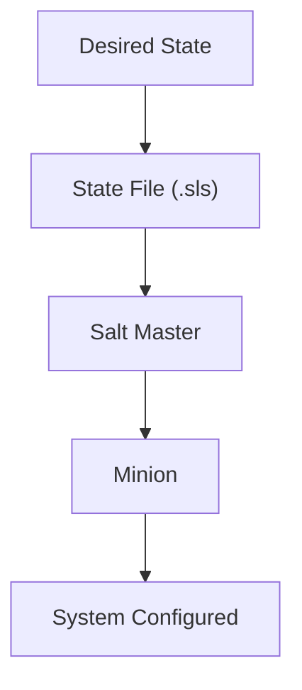
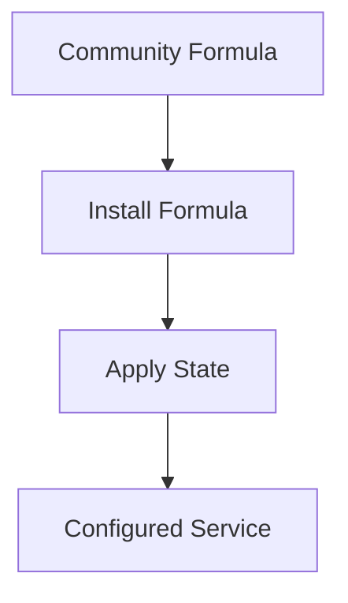
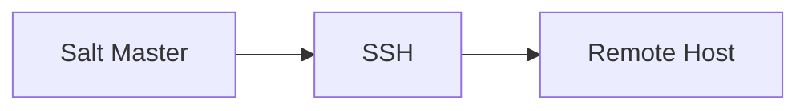
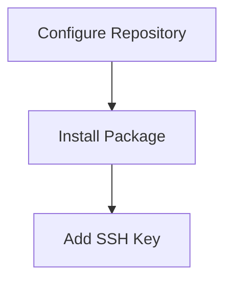
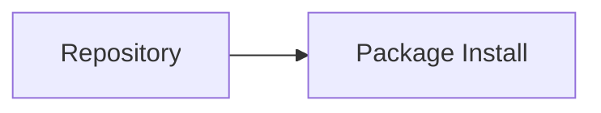
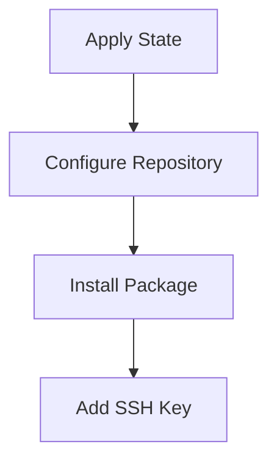
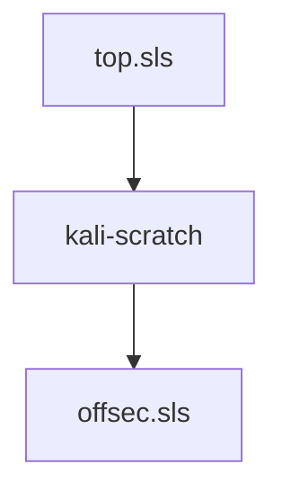
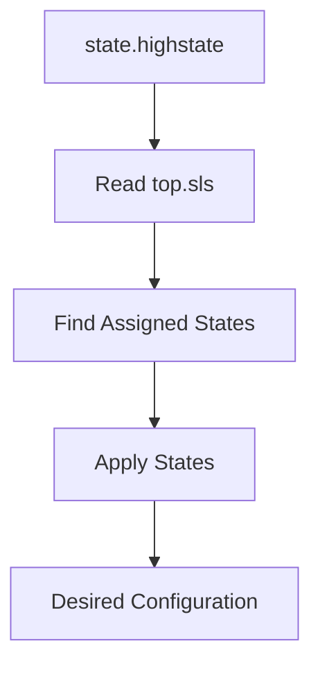
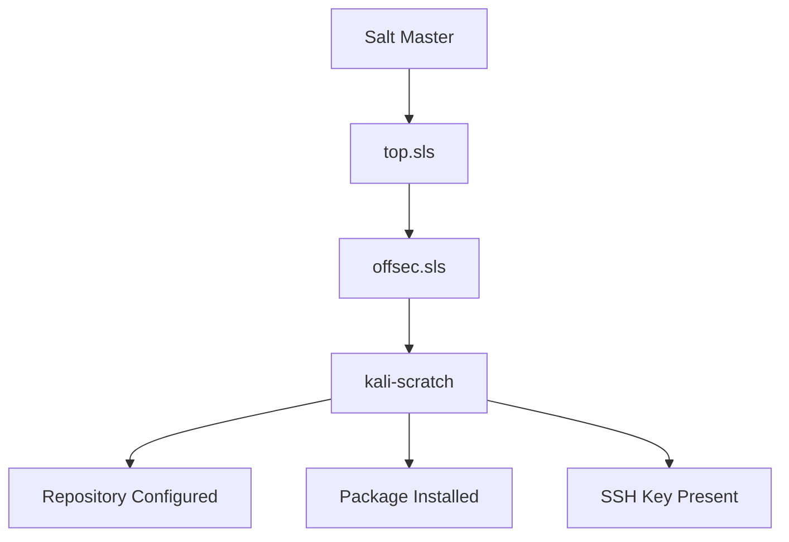

# Section 2.3 — Salt States and Other Features

> Remote command execution is often the first feature people use in SaltStack, but it is only a small part of the platform. The real power of Salt comes from its ability to describe the desired state of a system in reusable configuration files and then automatically enforce that state across hundreds or thousands of machines.

---

# Why Remote Commands Are Not Enough

Suppose you are building a new Kali workstation.

You might execute commands like:

```bash
apt update
apt install offsec-defaults
echo "repository" > /etc/apt/sources.list.d/offsec.list
mkdir /root/.ssh
echo "ssh-key" >> /root/.ssh/authorized_keys
```

This works once.

But imagine doing it for:

```text
10 systems
50 systems
500 systems
```

Problems quickly appear:

```text
Forgot a step
Executed commands in wrong order
Different systems configured differently
No documentation
Hard to reproduce
```

---

# Enter Salt States

Instead of storing procedures in your head:

```text
Run command A
Then command B
Then command C
```

You store them in:

```text
State Files
```

A state file describes:

```text
How the system should look
```

rather than:

```text
What commands should be executed
```

This is called:

```text
Declarative Configuration Management
```

---

# Imperative vs Declarative

---

## Imperative

Tell the system HOW to do something.

```bash
apt update
apt install nginx
systemctl start nginx
```

---

## Declarative

Tell the system WHAT should exist.

```text
nginx package installed
nginx service running
```

Salt figures out how to achieve that.

---

# State Management Workflow



---

# What Is a State File?

State files are reusable configuration templates.

They allow you to define:

```text
Packages
Repositories
Users
SSH Keys
Services
Files
Directories
Permissions
```

and much more.

---

# Applying a State

Instead of running 20 commands:

```bash
salt kali-scratch state.apply offsec
```

Salt reads:

```text
offsec.sls
```

and executes everything defined there.

---

# Salt Formulas

Writing state files from scratch is not always necessary.

The Salt community provides:

```text
Salt Formulas
```

which are pre-built reusable state collections.

Think of them as:

```text
Terraform Modules
Ansible Roles
Helm Charts
```

for Salt.

---

# Formula Concept



---

# Other Salt Features

The book briefly introduces many additional capabilities.

---

## Scheduled Actions

Salt can execute tasks automatically.

Examples:

```text
Daily Updates
Weekly Scans
Monthly Reports
```

---

## Event-Driven Automation

Actions can be triggered when:

```text
Service Stops
Disk Fills
Host Appears
Host Disappears
```

---

## Data Collection

Salt can gather information from minions.

Examples:

```text
Installed Packages
Disk Usage
Network Interfaces
Memory Statistics
```

---

## Orchestration

Salt can coordinate multiple systems.

Example:

```text
Update Database Server
Wait
Update Application Server
Wait
Update Load Balancer
```

in the correct order.

---

## Salt-SSH

Normally Salt requires:

```text
salt-minion
```

to be installed.

Salt-SSH allows management through SSH only.



No minion required.

---

## Cloud Provisioning

Salt can:

```text
Create VMs
Provision Instances
Configure Hosts
```

on cloud providers.

---

# Important Takeaway

The authors explicitly state:

> SaltStack is enormous.

Entire books are dedicated to Salt.

The chapter only introduces the fundamentals.

---

# Real Example: Creating an Enterprise State

The book demonstrates a realistic scenario.

Goal:

```text
Configure Internal Package Repository
Install Internal Package
Add Emergency SSH Key
```

to a new Kali system.

---
Your `/srv/salt/offsec.sls` file will call three of those modules:

```
offsec_repository:
  pkgrepo.managed:
    - name: deb http://pkgrepo.offsec.com offsec-internal main
    - file: /etc/apt/sources.list.d/offsec.list
    - key_url: salt://offsec-apt-key.asc
    - require_in:
      - pkg: offsec-defaults

offsec-defaults:
  pkg.installed

ssh_key_for_root:
  ssh_auth.present:
    - user: root
    - name: ssh-rsa AAAAB3NzaC1yc2...89C4N rhertzog@kali
```
# Salt State Storage Location

By default:

```text
/srv/salt
```

contains state files.

---

# File Extension

Salt state files use:

```text
.sls
```

Example:

```text
/srv/salt/offsec.sls
```

---

# Understanding the Example State File

File:

```yaml
/srv/salt/offsec.sls
```

Contains three states:

```text
offsec_repository
offsec-defaults
ssh_key_for_root
```

---

# High-Level View



---

# State 1: offsec_repository

```yaml
offsec_repository:
```

This is the state identifier.

Think of it as:

```text
State Name
```

or

```text
Resource Identifier
```

---

# pkgrepo.managed

```yaml
pkgrepo.managed:
```

Uses the:

```text
pkgrepo State Module
```

and the:

```text
managed
```

function.

Purpose:

```text
Manage APT Repository Configuration
```

---

# Repository Definition

```yaml
- name: deb http://pkgrepo.offsec.com offsec-internal main
```

Equivalent to:

```text
deb http://pkgrepo.offsec.com offsec-internal main
```

inside:

```text
sources.list
```

---

# Target File

```yaml
- file: /etc/apt/sources.list.d/offsec.list
```

Salt will create:

```text
/etc/apt/sources.list.d/offsec.list
```

---

# GPG Key

```yaml
- key_url: salt://offsec-apt-key.asc
```

This tells Salt:

```text
Fetch GPG Key
From Salt Master
Install Key
```

---

# Understanding salt://

This is not:

```text
http://
https://
ftp://
```

---

Instead:

```text
salt://
```

means:

```text
Fetch from Salt Master's File Server
```

---

# Where Does Salt Look?

```text
salt://offsec-apt-key.asc
```

maps to:

```text
/srv/salt/offsec-apt-key.asc
```

on the master.

---

# Why Is This Key Needed?

APT uses GPG signatures.

Without the key:

```text
Repository Not Trusted
Package Installation Fails
```

---

# require_in Dependency

```yaml
- require_in:
    - pkg: offsec-defaults
```

This is extremely important.

---

# Why?

Repository must exist before:

```text
Package Installation
```

can occur.

---

# Dependency Chain



Without this dependency:

```text
Package install could run first
Installation would fail
```

---

# State 2: offsec-defaults

```yaml
offsec-defaults:
```

State identifier.

---

# pkg.installed

```yaml
pkg.installed
```

Meaning:

```text
Ensure Package Is Installed
```

---

# Interesting Salt Convention

Notice:

```yaml
offsec-defaults:
  pkg.installed
```

The package name is omitted.

Salt assumes:

```text
Package Name = State Name
```

Therefore:

```text
Install Package:
offsec-defaults
```

---

# What Happens?

Equivalent to:

```bash
apt install offsec-defaults
```

but only if needed.

---

# Idempotency

This is important.

If already installed:

```text
Do Nothing
```

Salt avoids unnecessary work.

---

# State 3: ssh_key_for_root

Purpose:

```text
Ensure Emergency SSH Access Exists
```

---

# Module Used

```yaml
ssh_auth.present
```

Meaning:

```text
Ensure SSH Key Exists
```

---

# Target User

```yaml
- user: root
```

Salt modifies:

```text
/root/.ssh/authorized_keys
```

---

# Key Content

```yaml
- name: ssh-rsa AAAA...
```

The book shortens the key.

Real deployments must use:

```text
Full Public Key
```

---

# Result

Equivalent to:

```bash
echo key >> /root/.ssh/authorized_keys
```

but managed safely.

---

# Full State Execution Flow



---

# Applying the State

Command:

```bash
salt kali-scratch state.apply offsec
```

---

# What Happens?

Salt loads:

```text
/srv/salt/offsec.sls
```

and executes all states.

---

# Understanding The Output

Example:

```text
ID: offsec_repository
Function: pkgrepo.managed
Result: True
```

---

## ID

State Identifier.

```text
offsec_repository
```

---

## Function

State Module Function Used.

```text
pkgrepo.managed
```

---

## Result

Success Status.

```text
True = Success
False = Failure
```

---

## Changes

Shows exactly what changed.

Example:

```text
Repository Added
Package Installed
SSH Key Added
```

---

# Execution Results

```text
Succeeded: 3
Failed: 0
```

Meaning:

```text
All Three States Applied Successfully
```

---

# Making States Permanent

Running:

```bash
state.apply
```

is manual.

Salt provides:

```text
top.sls
```

to permanently associate states with minions.

---

# What Is top.sls?

Think of it as:

```text
Master State Assignment File
```

---

Location:

```text
/srv/salt/top.sls
```

---

# Example

```yaml
base:
  kali-scratch:
    - offsec
```

Meaning:

```text
For Minion:
kali-scratch

Apply State:
offsec
```

---

# State Assignment Architecture



---

# Applying Highstate

Instead of:

```bash
state.apply offsec
```

use:

```bash
salt kali-scratch state.highstate
```

---

# What Does highstate Mean?

Salt:

1. Reads `top.sls`
    
2. Finds assigned states
    
3. Applies all of them
    

Automatically.

---

# Highstate Workflow



---

# Why Second Run Is Faster

Notice the second output:

```text
Repository already configured
Package already installed
SSH key already present
```

---

Nothing changed.

Execution time:

```text
24 seconds
```

became:

```text
449 ms
```

---

# This Demonstrates Idempotency

One of Salt's most important concepts.

Running again:

```text
Produces Same Result
Makes No Unnecessary Changes
```

---

# Final Architecture



---

# Section Summary

### State Files

Stored in:

```text
/srv/salt
```

Extension:

```text
.sls
```

---

### Apply Specific State

```bash
salt kali-scratch state.apply offsec
```

---

### Apply All Assigned States

```bash
salt kali-scratch state.highstate
```

---

### Important State Modules Used

|Module|Purpose|
|---|---|
|pkgrepo.managed|Manage repositories|
|pkg.installed|Install packages|
|ssh_auth.present|Manage authorized_keys|

---

### Important Files

```text
/srv/salt/offsec.sls
/srv/salt/top.sls
/srv/salt/offsec-apt-key.asc
```

---

### Key Concepts

```text
Declarative Configuration
Idempotency
Dependencies
State Files
Highstate
Top File
Salt Formulas
```

### Key Takeaway

Remote command execution is only the foundation of SaltStack. The real power comes from state files, which describe the desired configuration of systems in a declarative, repeatable, and idempotent manner. By combining state files, top files, dependencies, formulas, and highstate execution, administrators can ensure that large fleets of Kali systems remain consistently configured and automatically converge toward the desired state whenever changes occur.