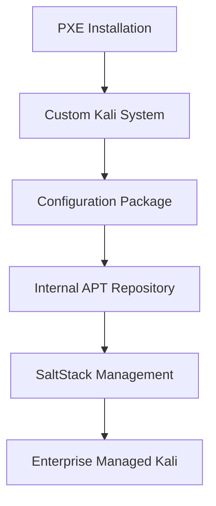
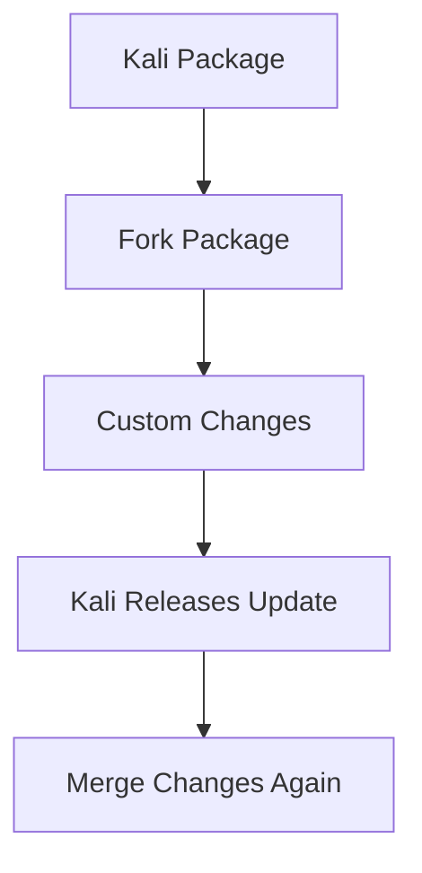

# Section 3 — Extending and Customizing Kali Linux

> Enterprise deployments rarely run stock operating systems forever. Organizations usually need custom branding, internal repositories, security configurations, desktop defaults, custom software, or integration with internal infrastructure. Kali supports this through package forking, configuration packages, and private APT repositories.

---

# The Big Picture

Everything learned so far:

```text
PXE Boot
↓
Automated Installation
↓
SaltStack Management
```

solves deployment and configuration.

But what if your organization needs:

```text
Custom wallpaper
Internal package repository
Custom software
Internal APT key
Custom desktop settings
Custom menu entries
```

You now need:

```text
Customization
```

---

# Enterprise Kali Architecture



---

# Why Not Modify Systems Manually?

Bad approach:

```bash
scp wallpaper.png machine1
scp wallpaper.png machine2
scp wallpaper.png machine3
```

Problems:

```text
Not repeatable
Not scalable
Hard to audit
Easy to forget systems
```

Enterprise approach:

```text
Create Package
Publish Package
Install Package
Manage Centrally
```

---

# 11.3.1 Forking Kali Packages

---

# What is Package Forking?

Forking means:

```text
Take Existing Package
↓
Modify It
↓
Maintain Your Own Version
```

---

# Example

Original package:

```text
kali-menu
```

Forked package:

```text
company-kali-menu
```

with custom modifications.

---

# Why Fork a Package?

The book gives two valid reasons.

---

## Reason 1 — Add Bug Fixes

Example:

```text
Package contains bug
You create patch
```

---

### Recommended Practice

```text
Patch Package
↓
Submit Patch Upstream
↓
Get Fix Merged
```

This avoids maintaining the patch forever.

---

## Reason 2 — Different Compilation Options

Example:

```text
Kali compiled tool with:
Feature A Disabled
```

Your organization needs:

```text
Feature A Enabled
```

So you rebuild the package.

---

# Important Warning

Forking has a maintenance cost.

Every time Kali updates:

```text
Original Package Updated
↓
Your Fork Becomes Outdated
↓
You Must Merge Changes
```

---

# Fork Maintenance Cycle



---

# Bad Reasons To Fork

The book explicitly warns against several common mistakes.

---

# Bad Reason #1: Modifying Configuration Files

Many people think:

```text
I want a different config file.
I'll fork the package.
```

Wrong.

---

# Better Solutions

---

## SaltStack

Deploy configuration automatically.

```text
Master
↓
Push Config
↓
All Systems Updated
```

---

## Configuration Packages

Package only the configuration file.

Example:

```text
company-defaults.deb
```

---

## File Diversions

Using:

```text
dpkg-divert
```

to replace files cleanly.

---

# Bad Reason #2: Newer Version

Some administrators want:

```text
Tool Version 2.0
Kali Provides 1.9
```

and immediately fork.

The book recommends:

```text
Work With Debian/Kali Maintainers
```

because Kali Rolling usually updates quickly.

---

# Important Kali Packages Worth Forking

---

# kali-meta

Most important package.

---

## Purpose

Builds all:

```text
kali-linux-*
kali-tools-*
```

metapackages.

---

# Why Fork It?

Because:

```text
kali-linux-default
```

defines what gets installed by default.

---

# Example

Default Kali installs:

```text
100 Packages
```

Company wants:

```text
80 Packages
```

Fork:

```text
kali-meta
```

and adjust dependencies.

---

# desktop-base

Contains:

```text
Backgrounds
Themes
Desktop Assets
```

---

# Why Fork It?

Company branding.

Example:

```text
Replace Kali Dragon Wallpaper
With Corporate Wallpaper
```

---

# kali-menu

Defines:

```text
Kali Menu Structure
.desktop Files
Application Categories
```

---

# Why Fork It?

Customize:

```text
Menu Layout
Internal Applications
Tool Categories
```

---

# Enterprise Rule

The fewer packages you fork:

```text
Less Maintenance
Less Work
Fewer Problems
```

---

# Section Summary

### Good Reasons To Fork

```text
Bug Fixes
New Features
Compile-Time Changes
```

### Bad Reasons To Fork

```text
Configuration Changes
Simple Version Updates
```

### Common Fork Targets

```text
kali-meta
desktop-base
kali-menu
```

---

## Next Section (11.3.2)

The next section is the most important part of the chapter:

```text
Creating Configuration Packages
```

where the book shows how to build:

```text
offsec-defaults.deb
```

containing:

```text
APT Repository Configuration
GPG Keys
Salt Configuration
Desktop Background
GNOME Defaults
```

This is essentially the blueprint for creating your organization's own enterprise Kali package.

We'll cover **11.3.2 Creating Configuration Packages** in the next section because it's large and contains actual Debian packaging internals (`dh_make`, `control`, `rules`, `copyright`, `.install`, `gsettings`, `dpkg-buildpackage`, etc.).