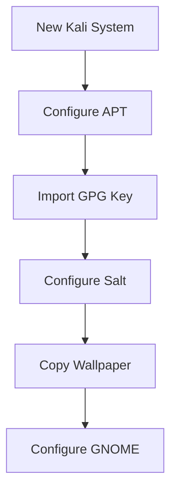
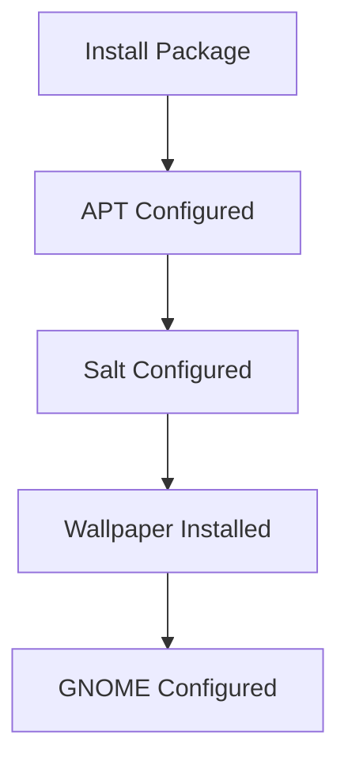
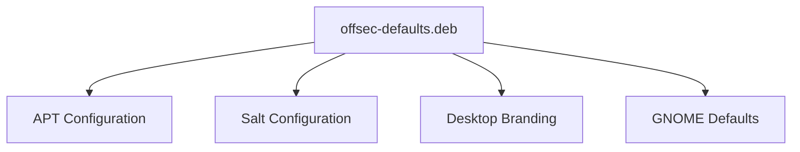
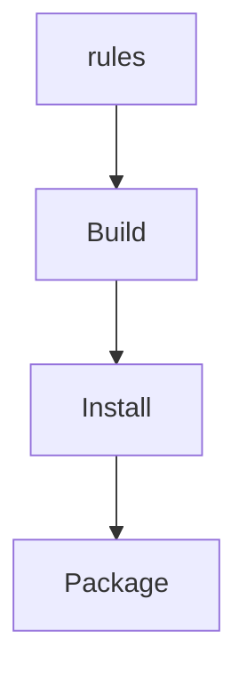

# Section 3.2 — Creating Configuration Packages

> The book now moves from theory to practice. Instead of manually configuring every Kali machine after installation, we package our organization's configuration into a Debian package that can be installed automatically on every system. This package becomes the organization's "baseline configuration" and can be distributed through APT, SaltStack, PXE installations, or custom ISOs.

---

# Why Create a Configuration Package?

Imagine you want every Kali system to have:

```text
Internal APT Repository
Corporate GPG Key
SaltStack Configuration
Custom Wallpaper
Default GNOME Settings
```

Without a configuration package:



You repeat this process on every machine.

---

# Better Approach

Package everything into:

```text
offsec-defaults.deb
```

Then:



One installation performs everything.

---

# What Will The Package Contain?

The book creates:

```text
offsec-defaults
```

containing five files.

---

## File 1

```text
/etc/apt/sources.list.d/offsec.list
```

Purpose:

```text
Enable Internal APT Repository
```

---

## File 2

```text
/etc/apt/trusted.gpg.d/offsec.gpg
```

Purpose:

```text
Trust Company's Package Repository
```

---

## File 3

```text
/etc/salt/minion.d/offsec.conf
```

Purpose:

```text
Tell Salt Minions Where Master Exists
```

---

## File 4

```text
/usr/share/images/offsec/background.png
```

Purpose:

```text
Custom Corporate Wallpaper
```

---

## File 5

```text
/usr/share/glib-2.0/schemas/
90_offsec-defaults.gschema.override
```

Purpose:

```text
Override GNOME Defaults
```

---

# Resulting Architecture



---

# Creating The Package Structure

Create working directory:

```bash
mkdir offsec-defaults-1.0
cd offsec-defaults-1.0
```

Convention:

```text
package-name-version
```

---

# Using dh_make

Debian provides:

```text
dh_make
```

to create package skeletons.

Command:

```bash
dh_make --native
```

---

# What Does dh_make Do?

Creates:

```text
debian/
```

directory containing:

```text
control
rules
copyright
changelog
compat
examples
```

---

# Understanding --native

Two common source package types:

|Type|Purpose|
|---|---|
|Native|Maintained only by you|
|Non-native|Based on upstream project|

The book uses:

```bash
dh_make --native
```

because:

```text
This package is entirely internal
No upstream project exists
```

---

# Package Type Selection

Prompt:

```text
single
indep
library
python
```

Book chooses:

```text
indep
```

---

# Why indep?

Because package contains:

```text
Configuration Files
Images
Text Files
```

and no compiled binaries.

---

# Architecture Concepts

## Architecture: all

Works everywhere.

```text
amd64
i386
arm64
armhf
```

Same package.

---

## Architecture: any

Requires compilation.

Different binaries per architecture.

---

# Examples

|Package|Architecture|
|---|---|
|Firefox Binary|any|
|Wallpaper Package|all|
|Configuration Package|all|

---

# Maintainer Information

dh_make asks:

```text
Name
Email
Version
License
```

---

# Useful Environment Variables

The book recommends:

```bash
export EMAIL="buxy@kali.org"
export DEBFULLNAME="Raphael Hertzog"
```

Add them to:

```bash
~/.bashrc
```

to avoid retyping.

---

# Debian Directory Layout

After running dh_make:

```text
offsec-defaults-1.0/
│
├── debian/
│   ├── control
│   ├── rules
│   ├── changelog
│   ├── copyright
│   ├── compat
│   └── *.ex
```

---

# Important Files

The book explicitly states:

```text
rules
control
changelog
copyright
```

are required.

---

# Example Files (.ex)

Files ending in:

```text
.ex
```

are templates.

Example:

```text
postinst.ex
```

Meaning:

```text
Sample file
```

---

# Recommended Practice

Remove unused examples.

Keep:

```text
compat
```

because debhelper needs it.

---

# Understanding copyright

This file documents:

```text
Authors
Licenses
Ownership
```

---

# Example Metadata

```text
Upstream-Name: offsec-defaults
Copyright: 2020 OffSec
License: GPL-3.0+
```

---

# Why This Matters

Debian packages require license tracking.

Every distributed file should have:

```text
Author
License
Copyright
```

information.

---

# Understanding changelog

Default entry:

```text
Initial Release
```

Book changes it.

---

# Example

```text
Add Salt configuration
Add APT repository
Add trusted GPG key
Add desktop settings
```

---

# Why Changelog Exists

Tracks:

```text
Version History
Bug Fixes
Feature Additions
```

---

# Understanding control File

The control file is the package's metadata.

Think:

```text
package.json
pom.xml
Cargo.toml
```

for Debian.

---

# Example

```text
Source: offsec-defaults
Section: misc
Priority: optional
```

---

# Package Section

Book changes:

```text
Section: misc
```

Meaning:

```text
General Package
```

---

# Architecture

```text
Architecture: all
```

Again means:

```text
No Compiled Binaries
```

---

# Dependencies

```text
Depends: ${misc:Depends}
```

Automatically generated dependency list.

---

# Description

Shown when users run:

```bash
apt show offsec-defaults
```

---

# What Is rules?

The book now introduces:

```text
debian/rules
```

This is the heart of package building.

---

# Simplified View



---

# The Book's Important Point

Everything eventually gets installed into:

```text
debian/offsec-defaults/
```

before packaging.

---

# Example

If you want package to install:

```text
/etc/apt/sources.list.d/offsec.list
```

during build you place it here:

```text
debian/offsec-defaults/etc/apt/sources.list.d/offsec.list
```

Later Debian packs it automatically.

---

# What Is a Makefile?

The book pauses here to explain Makefiles.

General format:

```make
target: dependency1 dependency2
    command1
    command2
```

---

# Example

```make
program: main.c
    gcc main.c -o program
```

Meaning:

```text
If main.c changes
Rebuild program
```

---

# Critical Detail

Commands MUST begin with:

```text
TAB
```

not spaces.

---

# Ignore Errors

A command beginning with:

```make
-rm file
```

means:

```text
Ignore Failure
```

---

# Why Mention Makefiles?

Because:

```text
debian/rules
```

is essentially a specialized Makefile.

---

This completes the first half of **11.3.2 Creating Configuration Packages**.

The next part covers the most practical and important section:

```text
debian/offsec-defaults.install
GSettings Overrides
dh_installgsettings
Building the Package
dpkg-buildpackage
Understanding Every Build Step
```

which is where the actual package gets assembled into:

```text
offsec-defaults_1.0_all.deb
```

and is worth a separate section because that's where most Debian packaging concepts come together.