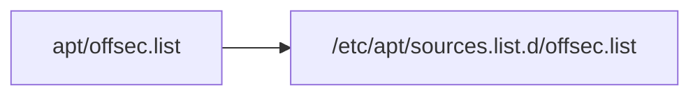
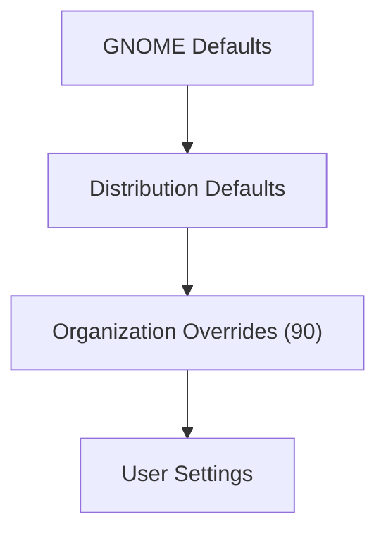
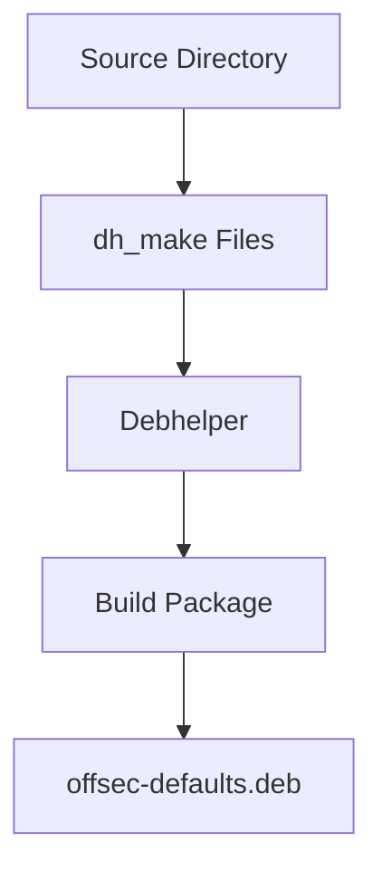

# Section 3.2 (Part 2) — Installing Files, GNOME Overrides, and Building the Package

> In the previous section, we created the package skeleton and understood the purpose of the `debian/` directory. Now we will actually teach Debian how to package our files, customize GNOME settings, and build the final `.deb` package.

---

# How Debian Knows Which Files To Install

At this point we have:

```text
offsec-defaults-1.0/
│
├── apt/
│   ├── offsec.list
│   └── offsec.gpg
│
├── salt/
│   └── offsec.conf
│
├── images/
│   └── background.png
│
└── debian/
```

Question:

```text
How does dpkg know where these files belong?
```

Answer:

```text
debian/offsec-defaults.install
```

---

# The .install File

The book recommends creating:

```text
debian/offsec-defaults.install
```

This file maps:

```text
Source File
↓
Destination Directory
```

inside the final package.

---

# File Contents

```text
apt/offsec.list etc/apt/sources.list.d/

apt/offsec.gpg etc/apt/trusted.gpg.d/

salt/offsec.conf etc/salt/minion.d/

images/background.png usr/share/images/offsec/
```

---

# Understanding The Syntax

General format:

```text
source destination
```

---

# Example 1

```text
apt/offsec.list etc/apt/sources.list.d/
```

means:

```text
Take:
apt/offsec.list

Install As:
/etc/apt/sources.list.d/offsec.list
```

---

# Visual Representation



---

# Example 2

```text
images/background.png

↓

/usr/share/images/offsec/background.png
```

---

# During Package Build

Debhelper automatically copies:

```text
apt/offsec.list
```

to:

```text
debian/offsec-defaults/etc/apt/sources.list.d/offsec.list
```

before generating the package.

---

# Why This Is Powerful

Instead of writing:

```bash
mkdir -p ...
cp ...
chmod ...
```

you simply define mappings.

Debhelper handles the rest.

---

# GNOME Configuration Overrides

The book now introduces something slightly different.

Instead of installing a file directly:

```text
GNOME settings require special handling.
```

---

# What Is GSettings?

Modern GNOME stores configuration in:

```text
GSettings
```

rather than plain configuration files.

Examples:

```text
Wallpaper
Theme
Desktop Behavior
Lock Screen Settings
```

---

# Goal

Set company wallpaper automatically.

---

# Create Override File

File:

```text
debian/offsec-defaults.gsettings-override
```

Contents:

```ini
[org.gnome.desktop.background]

picture-options='zoom'

picture-uri='file:///usr/share/images/offsec/background.png'
```

---

# Breaking It Down

---

## Section Header

```ini
[org.gnome.desktop.background]
```

GNOME schema being modified.

---

## picture-options

```ini
picture-options='zoom'
```

Wallpaper behavior.

Possible values include:

```text
zoom
stretch
center
scaled
```

Book uses:

```text
zoom
```

---

## picture-uri

```ini
picture-uri='file:///usr/share/images/offsec/background.png'
```

Wallpaper location.

Result:

```text
All Users
↓
Default Wallpaper
↓
Corporate Background
```

---

# Why Not Just Copy A Config File?

Because GNOME settings are managed through:

```text
glib schemas
```

and should be registered properly.

---

# dh_installgsettings

Debhelper includes:

```text
dh_installgsettings
```

specifically for handling GSettings overrides.

---

# Important Enterprise Detail

GNOME settings have priorities.

Higher priority overrides lower priority.

---

# Default Behavior

Normally:

```text
dh_installgsettings
```

uses a lower priority.

---

# The Book's Goal

Ensure:

```text
Company Settings
```

override:

```text
System Defaults
```

---

# Modifying debian/rules

The book replaces the default behavior.

File:

```make
#!/usr/bin/make -f

%:
        dh $@

override_dh_installgsettings:
        dh_installgsettings --priority=90
```

---

# Understanding This File

---

## Standard Rule

```make
%:
        dh $@
```

Means:

```text
Run standard debhelper workflow
```

for every target.

---

## Override Section

```make
override_dh_installgsettings:
```

Special rule.

Whenever:

```text
dh_installgsettings
```

would execute,

run our custom version instead.

---

# Priority 90

```make
dh_installgsettings --priority=90
```

creates:

```text
90_offsec-defaults.gschema.override
```

---

# Why 90?

Book explicitly notes:

```text
90
```

is the recommended priority for:

```text
Organization-Level Overrides
```

---

# Configuration Hierarchy



Higher levels override lower ones.

---

# Package Is Now Ready

At this stage we have:

```text
APT Repository Config

GPG Key

Salt Config

Wallpaper

GNOME Defaults

Packaging Metadata
```

Everything required to build.

---

# Building The Package

The book uses:

```bash
dpkg-buildpackage -us -uc
```

---

# Understanding The Flags

---

## -us

```text
Do Not Sign Source Package
```

---

## -uc

```text
Do Not Sign Changes File
```

---

# Why?

This is an internal package.

Signing is unnecessary during development.

---

# Build Workflow



---

# Understanding Build Output

The book shows many internal steps.

Most people ignore them.

For enterprise work, understanding them helps troubleshooting.

---

# Step 1

```text
dpkg-source --before-build
```

Purpose:

```text
Validate Source Tree
```

---

# Step 2

```text
fakeroot debian/rules clean
```

Runs cleanup.

Equivalent concept:

```text
make clean
```

---

# Why fakeroot?

Package builds need:

```text
root ownership
root permissions
```

without actually being root.

---

# Step 3

```text
dh_clean
```

Removes previous build artifacts.

---

# Step 4

```text
dpkg-source -b
```

Creates source package.

Outputs:

```text
offsec-defaults_1.0.tar.xz

offsec-defaults_1.0.dsc
```

---

# What Is .dsc?

Debian Source Control File.

Contains:

```text
Package Metadata
Checksums
Version Info
```

---

# Step 5

```text
debian/rules build
```

Build phase starts.

---

# Debhelper Workflow

Book shows:

```text
dh_auto_configure
dh_auto_build
dh_auto_test
```

---

# Meaning


For configuration packages:

```text
Mostly No-Op
```

because nothing is compiled.

---

# Binary Package Creation

Later:

```text
fakeroot debian/rules binary
```

begins package generation.

---

# Important Debhelper Stages

---

## dh_install

Reads:

```text
offsec-defaults.install
```

Copies files.

---

## dh_installdocs

Installs documentation.

---

## dh_installchangelogs

Installs changelog.

---

## dh_installgsettings

Processes GNOME overrides.

---

## dh_gencontrol

Creates package metadata.

---

## dh_md5sums

Creates integrity checksums.

---

## dh_builddeb

Actually generates:

```text
.deb
```

file.

---

# Final Output

Book shows:

```text
dpkg-deb: building package 'offsec-defaults'
```

Output:

```text
../offsec-defaults_1.0_all.deb
```

---

# Why "_all"?

Because earlier we selected:

```text
Package Type = indep
Architecture = all
```

Therefore:

```text
One Package
All Architectures
```

---

# Files Produced

After build:

```text
offsec-defaults_1.0_all.deb

offsec-defaults_1.0.tar.xz

offsec-defaults_1.0.dsc

offsec-defaults_1.0_amd64.changes
```

---

# What Each File Is

|File|Purpose|
|---|---|
|.deb|Installable package|
|.tar.xz|Source archive|
|.dsc|Source metadata|
|.changes|Build/change summary|

---

# End Result

We started with:

```text
APT Config
Wallpaper
Salt Config
GNOME Settings
```

and converted them into:

```text
offsec-defaults_1.0_all.deb
```

which can now be:

```text
Installed via dpkg
Installed via APT
Distributed by Salt
Included in PXE Installs
Added to Custom Kali ISOs
```

---

# Key Takeaways

### Important Files

```text
debian/offsec-defaults.install

debian/offsec-defaults.gsettings-override

debian/rules
```

### Important Tools

```text
dh_install

dh_installgsettings

dpkg-buildpackage
```

### Build Command

```bash
dpkg-buildpackage -us -uc
```

### Final Artifact

```text
offsec-defaults_1.0_all.deb
```

This package becomes the foundation of an enterprise Kali deployment because it allows organizational configuration, branding, repository settings, SaltStack configuration, and desktop defaults to be delivered as a single version-controlled package. Next, the book uses this package to build a complete **private APT repository with `reprepro`**, which is the final piece needed for centralized enterprise package distribution.