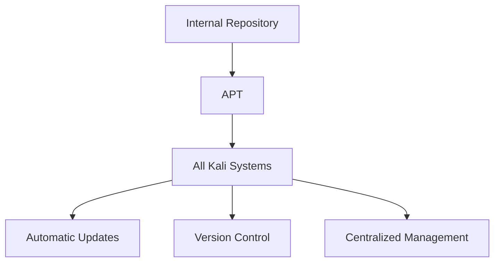
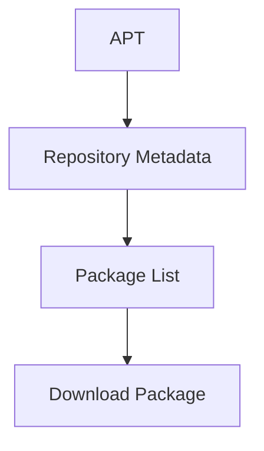
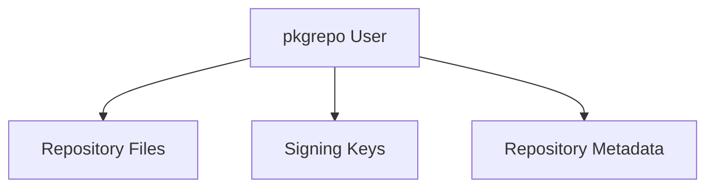
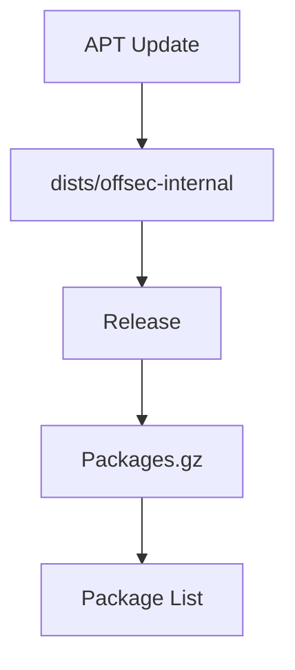
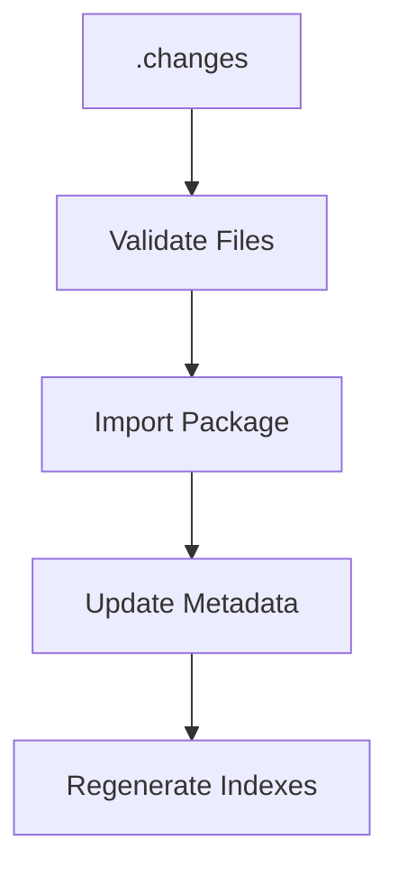
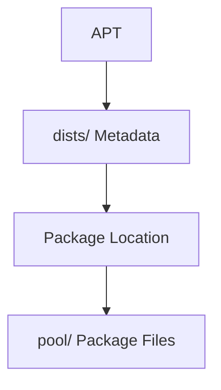
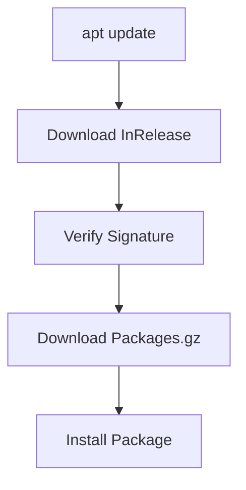
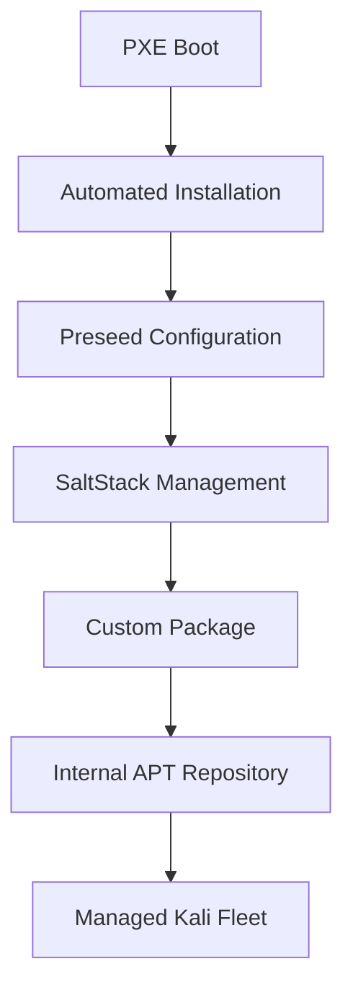

# Section 3.3 — Creating a Package Repository for APT

> Building a custom package is only half the solution. The real power comes when you can distribute that package automatically to hundreds or thousands of systems through a centralized APT repository. This is exactly how Debian, Ubuntu, and Kali distribute software—and now you will build your own internal repository using `reprepro`.

---

# Why Create Your Own Repository?

Suppose you built:

```text
offsec-defaults_1.0_all.deb
```

Without a repository, deployment looks like:


Problems:

```text
Manual
Not Scalable
No Version Control
No Automatic Updates
```

---

# Enterprise Approach

Create:

```text
Internal APT Repository
```

Then:



This is exactly how:

```text
Kali Repository
Debian Repository
Ubuntu Repository
```

operate.

---

# Tool Used: reprepro

The book uses:

```text
reprepro
```

Purpose:

```text
Create Debian Repositories
Manage Packages
Generate Metadata
Sign Releases
```

Think of it as:

```text
GitHub Packages
Artifactory
Nexus Repository
APT Edition
```

---

# Repository Architecture

A Debian repository consists of:

```text
Packages
Metadata
Signatures
Indexes
```

APT never directly searches `.deb` files.

Instead:



---

# Step 1 — Install Required Packages

```bash
apt install reprepro gnupg
```

---

## reprepro

Repository management tool.

---

## gnupg

Required for:

```text
Repository Signing
Package Verification
Trust Validation
```

---

# Why Signing Matters

Without signatures:

```text
Anyone Could Modify Packages
APT Cannot Verify Authenticity
```

With signatures:

```text
Package Integrity
Repository Trust
Tamper Detection
```

---

# Step 2 — Create Dedicated Repository User

The book recommends:

```bash
adduser --system --group pkgrepo
```

---

# Why Not Use Root?

Bad:

```text
Repository Files
Apache Files
GPG Keys

All Managed By Root
```

---

# Better

```text
Dedicated Service Account
```



---

# Result

Home directory:

```text
/home/pkgrepo
```

becomes repository workspace.

---

# Step 3 — Terminal Ownership

Book executes:

```bash
chown pkgrepo $(tty)
```

---

# Why?

Initially:

```text
Root Logged In
```

Terminal belongs to:

```text
root
```

Then we switch:

```bash
su - -s /bin/bash pkgrepo
```

---

# Important Detail

GPG requires:

```text
Write Access To Terminal
```

for secure prompts.

Without ownership change:

```text
Passphrase Prompt Problems
```

may occur.

---

# Step 4 — Generate Repository Signing Key

Command:

```bash
gpg --gen-key
```

---

# Purpose

Create:

```text
Repository Identity
```

used to sign:

```text
Release Files
InRelease Files
Metadata
```

---

# Information Entered

Book example:

```text
Real Name:
OffSec Repository Signing Key

Email:
repoadmin@offsec.com
```

---

# Generated Artifacts

GPG creates:

```text
pubring.kbx
trustdb.gpg
revocation certificate
public key
private key
```

---

# Important Security Detail

The book explicitly states:

> Leave the passphrase empty.

---

# Why?

Normally:

```text
Private Key Protected
```

requires:

```text
Enter Passphrase
```

every time.

---

# Problem

Repository signing happens automatically.

APT repositories are updated:

```text
Frequently
Non-Interactively
```

No human present.

---

# Therefore

Repository signing key:

```text
No Passphrase
```

so:

```text
reprepro
```

can sign automatically.

---

# Trade-Off

```text
More Automation
Less Key Protection
```

This is why repository servers should be highly secured.

---

# Understanding The Output

Book shows:

```text
pub rsa2048/B4EF2D0D
```

---

# Components

```text
RSA 2048
Signing Key
```

---

# Fingerprint

```text
F8FE 22F7 4F1B 714E
38DA 6181 B27F 74F7 B4EF 2D0D
```

This uniquely identifies the key.

---

# Important Best Practice

The book specifically warns:

Use:

```text
Full Fingerprint
```

not:

```text
Short Key ID
```

---

# Why?

Short IDs can collide.

Example:

```text
B4EF2D0D
```

is not globally unique.

Fingerprint is.

---

# Step 5 — Create Repository Structure

Create directory:

```bash
mkdir -p reprepro/conf
cd reprepro
```

---

# Repository Layout

Initially:

```text
~/reprepro
│
├── conf
```

---

# Most Important File

```text
conf/distributions
```

---

# Purpose

Defines:

```text
Available Distributions
Architectures
Components
Signing Keys
```

---

# Think Of It As

Equivalent to:

```text
Kubernetes YAML
Terraform Variables
Docker Compose File
```

for the repository.

---

# Required Fields

The book explicitly lists:

---

## Codename

Repository name.

Example:

```text
offsec-internal
```

---

APT later uses:

```bash
deb http://server offsec-internal main
```

---

## Architectures

Accepted architectures.

Example:

```text
amd64
i386
```

---

## Components

Repository sections.

Example:

```text
main
```

Possible future examples:

```text
main
testing
security
internal
```

---

## Origin

Informational.

Appears in Release file.

---

## Description

Informational.

Also appears in Release file.

---

## SignWith

Most important field.

Specifies:

```text
GPG Fingerprint
```

used for signing.

---

## AlsoAcceptFor

Optional.

Allows:

```text
Additional Distribution Names
```

inside `.changes` files.

---

# Step 6 — Generate Repository Metadata

Command:

```bash
reprepro export
```

---

# What Happens?

reprepro generates:

```text
Metadata
Indexes
Release Files
Databases
```

---

# Repository Structure Created

The book shows:

```text
db/
conf/
dists/
```

---

# Understanding Each Directory

---

## conf/

Configuration.

Contains:

```text
distributions
```

---

## db/

Internal database.

Used by:

```text
reprepro
```

to track packages.

---

Files:

```text
references.db
packages.db
checksums.db
```

---

## dists/

Repository metadata exposed to clients.

---

# Why dists Exists

APT first downloads:

```text
dists/<distribution>/
```

before any package.

---

# Example



---

# Important Files Created

---

## Release

Contains:

```text
Checksums
Repository Info
Metadata
```

---

## Release.gpg

Detached signature.

---

## InRelease

Combined:

```text
Release + Signature
```

modern APT prefers this.

---

## Packages.gz

Compressed package catalog.

APT reads this to know:

```text
Package Name
Version
Dependencies
Location
```

---

# Step 7 — Add Your Package

Copy build artifacts:

```text
offsec-defaults_1.0.dsc
offsec-defaults_1.0.tar.xz
offsec-defaults_1.0_all.deb
offsec-defaults_1.0_amd64.changes
```

to repository server.

---

# Import Command

```bash
reprepro include offsec-internal \
/tmp/offsec-defaults_1.0_amd64.changes
```

---

# Why Use .changes File?

Many beginners think:

```text
Import .deb
```

---

Actually:

```text
.changes
```

contains:

```text
Package Metadata
Checksums
Version Information
Referenced Files
```

making imports safer.

---

# What Happens Internally?



---

# pool Directory

After import:

```text
pool/
```

appears.

---

# Purpose

Stores actual package files.

---

# Structure

```text
pool/main/o/offsec-defaults/
```

contains:

```text
offsec-defaults_1.0.dsc
offsec-defaults_1.0.tar.xz
offsec-defaults_1.0_all.deb
```

---

# Understanding dists vs pool

This is extremely important.

---

## dists/

Contains:

```text
Metadata
Indexes
Release Files
```

---

## pool/

Contains:

```text
Actual Packages
```

---

# Visual Relationship



---

# Step 8 — Publish Over HTTP

APT speaks:

```text
HTTP
HTTPS
```

Therefore:

```text
dists/
pool/
```

must be accessible through a web server.

---

# Apache Configuration

The book creates:

```text
pkgrepo.offsec.com
```

virtual host.

---

# Critical Setting

```apache
DocumentRoot /home/pkgrepo/reprepro
```

This exposes:

```text
dists/
pool/
```

to clients.

---

# Result

Clients can download:

```text
http://pkgrepo.offsec.com/dists/
http://pkgrepo.offsec.com/pool/
```

---

# Step 9 — Configure Clients

Add repository:

```bash
deb http://pkgrepo.offsec.com offsec-internal main
```

---

# Source Packages

Optional:

```bash
deb-src http://pkgrepo.offsec.com offsec-internal main
```

---

# Difference

|Entry|Purpose|
|---|---|
|deb|Binary packages|
|deb-src|Source packages|

---

# Client Workflow



---

# Final Enterprise Architecture

By this point the chapter has built a complete enterprise Kali deployment pipeline:



---

# Heavy Lifting Completed

The book concludes that you now have the ability to:

### Deploy

```text
PXE Boot
Network Install
Preseeded Installations
```

### Configure

```text
SaltStack
Configuration Packages
```

### Customize

```text
Forked Packages
Custom Branding
Custom Defaults
```

### Distribute

```text
Private APT Repository
Centralized Updates
Version Control
```

### Maintain

```text
Semi-Automatic Package Updates
Enterprise-Wide Consistency
```

---

# Key Commands To Remember

```bash
apt install reprepro gnupg

adduser --system --group pkgrepo

gpg --gen-key

reprepro export

reprepro include offsec-internal package.changes
```

---

# Key Directories

```text
~/reprepro/conf
~/reprepro/db
~/reprepro/dists
~/reprepro/pool
```

---

# Key Concepts

```text
Repository Signing
GPG Fingerprints
dists vs pool
Release Files
InRelease Files
Packages.gz
Repository Metadata
Private Package Distribution
```

### Final Takeaway

A custom package is useful. A private APT repository is transformative. Once packages are published through a signed internal repository, Kali systems can consume organization-specific software exactly the same way they consume official Kali packages. Combined with PXE booting, preseeding, SaltStack, and configuration packages, this creates a complete enterprise-grade lifecycle for deploying, managing, updating, and standardizing large numbers of Kali Linux systems.