# 2.1.1 Driving Hardware

## 1. What is the Role of the Kernel?

- The Linux Kernel is responsible for managing and controlling hardware devices.
    
- It detects hardware:
    
    - During system boot.
        
    - When devices are connected (USB, keyboard, mouse, etc.).
        
- It provides a standardized interface so applications don't need to know hardware-specific details.
    
- Acts as a translator between software and hardware.
    

### Mermaid Diagram

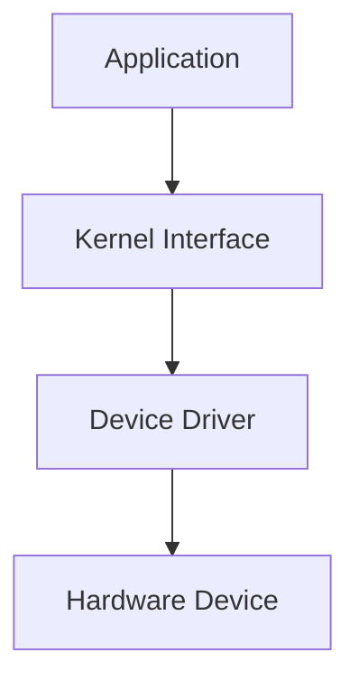

---

## 2. Hardware Abstraction

- Different hardware vendors use different commands.
    
- Applications should not need to understand every hardware model.
    
- Kernel provides a common interface and translates requests into hardware-specific instructions.
    

### Example: Webcam Access

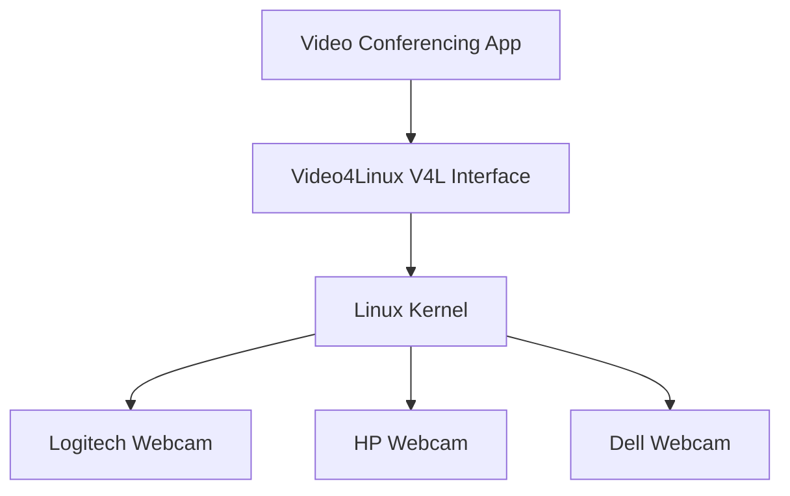

### Key Point

- Application talks to **V4L**.
    
- Kernel talks to the actual webcam driver.
    

---

## 3. Virtual Filesystems for Hardware Information

### `/proc`

- Virtual filesystem.
    
- Contains runtime system information.
    
- Created dynamically by the kernel.
    

Examples:

```bash
/proc/cpuinfo
/proc/meminfo
/proc/version
```

### `/sys`

- Contains information about hardware devices.
    
- Used for device management and configuration.
    

Examples:

```bash
/sys/class/
/sys/devices/
/sys/block/
```

### Mermaid Diagram

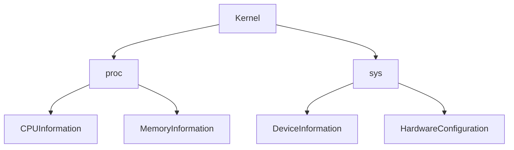

---

## 4. Device Files

- Linux treats devices as files.
    
- Device files are located in:
    

```bash
/dev
```

Examples:

|Device|File|
|---|---|
|Disk|/dev/sda|
|Partition|/dev/sda1|
|Mouse|/dev/input/mouse0|
|Keyboard|/dev/input/event0|
|Serial Port|/dev/ttyS0|

### Mermaid Diagram

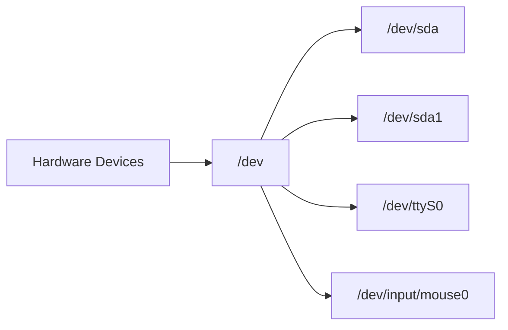

---

## 5. Types of Device Files

### 5.1 Block Devices

#### Characteristics

- Store data in blocks.
    
- Random access is possible.
    
- Fixed size.
    
- Can jump directly to any location.
    

#### Examples

```bash
/dev/sda
/dev/sda1
/dev/nvme0n1
```

#### Typical Devices

- Hard Drives
    
- SSDs
    
- USB Storage
    

### Mermaid Diagram

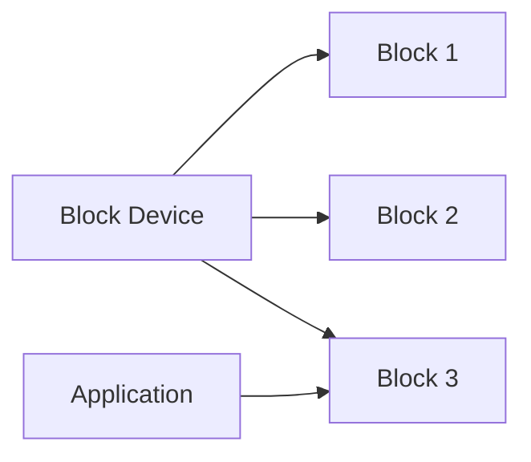

---

### 5.2 Character Devices

#### Characteristics

- Stream of characters.
    
- Sequential access.
    
- No random access.
    

#### Examples

```bash
/dev/ttyS0
/dev/input/mouse0
```

#### Typical Devices

- Keyboard
    
- Mouse
    
- Serial Ports
    

### Mermaid Diagram


---

## 6. Identifying Device Types

Command:

```bash
ls -l
```

Example:

```bash
ls -l /dev/sda /dev/ttyS0
```

Output:

```text
brw-rw---- /dev/sda
crw-rw---- /dev/ttyS0
```

### Interpretation

|First Letter|Meaning|
|---|---|
|b|Block Device|
|c|Character Device|

---

## 7. ioctl System Call

- Used for device-specific operations.
    
- Standard read/write may not be sufficient.
    
- Allows applications to send special commands to hardware.
    

Examples:

- Configure serial port speed.
    
- Change webcam settings.
    
- Configure network interfaces.
    

### Mermaid Diagram

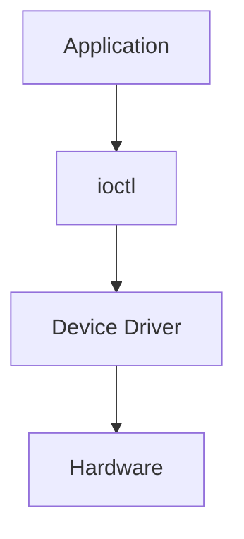

---

# 2.1.2 Unifying File Systems

## 1. Single Filesystem Hierarchy

### Linux Approach

- Linux has one unified directory structure.
    
- Everything starts from a single root directory.
    

Root:

```bash
/
```

### Windows Approach

```text
C:\
D:\
E:\
```

### Linux Approach

```text
/
```

### Mermaid Diagram

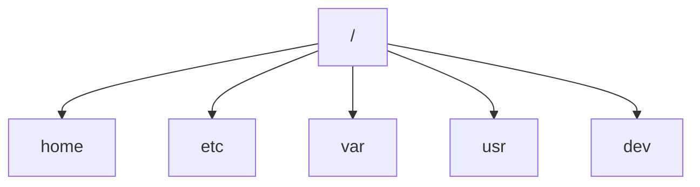

---

## 2. File Paths

Example:

```bash
/home/kali/Desktop/hello.txt
```

Breakdown:

- `/` → Root directory
    
- `home` → Home directory container
    
- `kali` → User directory
    
- `Desktop` → Desktop folder
    
- `hello.txt` → File
    

### Mermaid Diagram

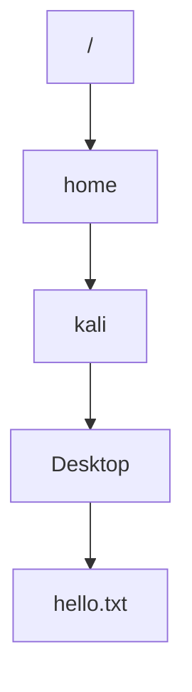

---

## 3. How the Kernel Finds Files

- User provides a path.
    
- Kernel maps the path to actual disk blocks.
    

### Mermaid Diagram


---

## 4. Mounting

### Definition

Mounting is the process of attaching a filesystem to a directory in the Linux directory tree.

Command:

```bash
mount
```

### Key Idea

- Multiple disks.
    
- One directory structure.
    

### Mermaid Diagram

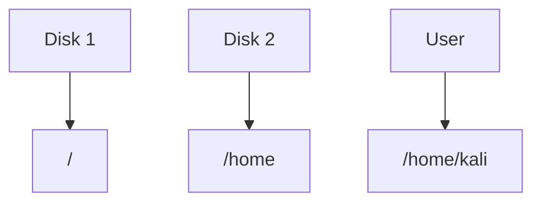

---

## 5. Mount Points

### Example

Disk 2 contains:

```text
kali/
john/
alice/
```

Mounted at:

```bash
/home
```

Accessible as:

```bash
/home/kali
/home/john
/home/alice
```

### Mermaid Diagram

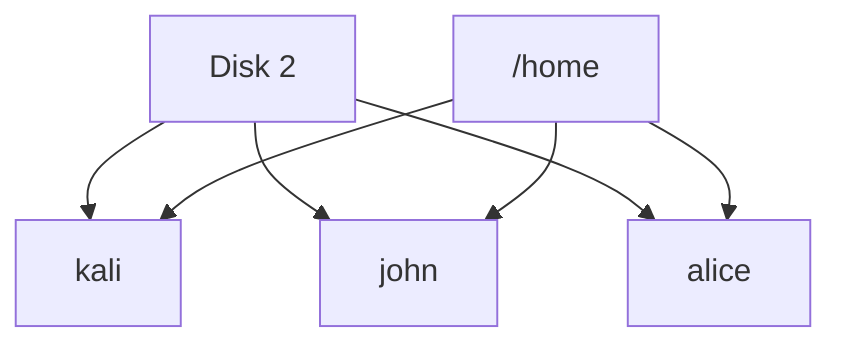

---

## 6. Filesystem Types

### ext2

- Older Linux filesystem.
    
- No journaling.
    
- Simple design.
    

### ext3

- Successor to ext2.
    
- Added journaling.
    

### ext4

- Most common Linux filesystem.
    
- Better performance.
    
- Supports larger volumes.
    

### VFAT

- DOS and Windows compatible.
    
- Commonly used on USB drives.
    

### Mermaid Diagram

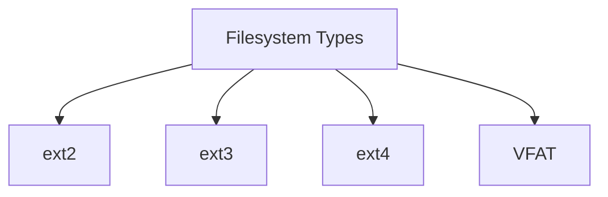

---

## 7. Formatting a Disk

### Definition

Formatting creates a filesystem on a partition.

Command:

```bash
mkfs.ext4 /dev/sda1
```

### Meaning

|Component|Meaning|
|---|---|
|mkfs|Make File System|
|ext4|Filesystem Type|
|/dev/sda1|Target Partition|

### Workflow


---

## 8. Network Filesystems (NFS)

### Definition

- Files are stored on a remote server.
    
- Accessed over the network.
    
- Appears as a normal local directory.
    

### Example

```bash
/home/kali/Documents
```

May physically reside on:

```text
Remote NFS Server
```

### Mermaid Diagram


---

# Quick Revision

## Hardware Flow

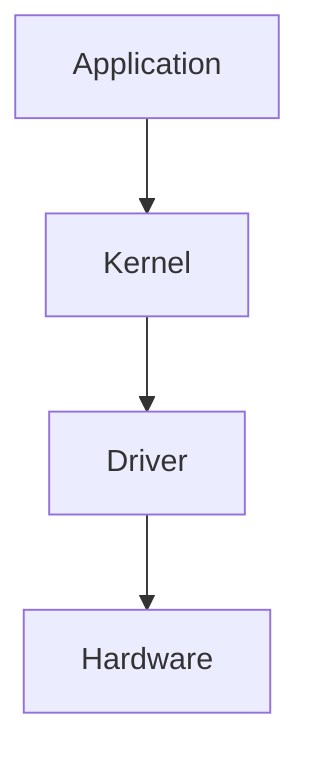

- `/proc` = Runtime system information
    
- `/sys` = Hardware information
    
- `/dev` = Device files
    
- Block devices = Storage
    
- Character devices = Streams
    
- `ioctl()` = Special device commands
    

---

## Filesystem Flow

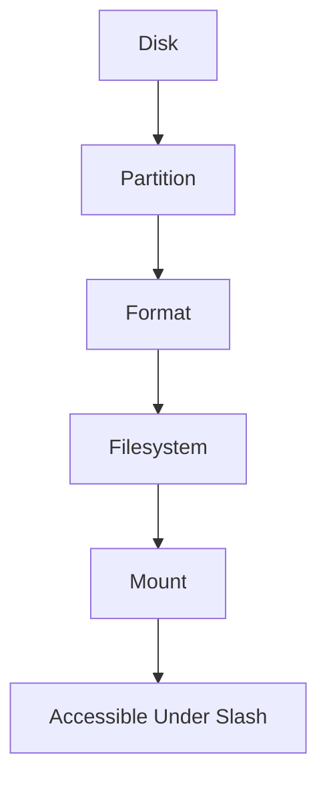

- Linux has one root (`/`)
    
- Everything exists under the same hierarchy
    
- Mounting connects filesystems into that hierarchy
    
- Common filesystems:
    
    - ext2
        
    - ext3
        
    - ext4
        
    - VFAT
        
    - NFS (network filesystem)