# Thought Experiment Part 1

# A Brand New Computer with Only One Hard Drive

## Initial State

You buy a computer.

Inside it there is only:

- CPU
    
- RAM
    
- Motherboard
    
- 1 HDD (1 TB)
    

No USB connected.  
No SSD connected.  
No ESXi datastore mounted.

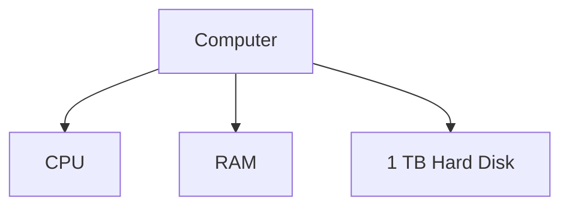

---

# Question 1

What does the hard disk look like right now?

Answer:

The disk is just magnetic storage.

Imagine it as a giant empty notebook.

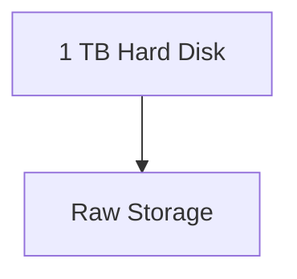

The disk itself does NOT know:

- Files
    
- Directories
    
- Users
    
- Linux
    
- Windows
    

It only knows:

```text
0s and 1s
```

---

# Question 2

Can Linux store files on it immediately?

No.

Because Linux needs a filesystem.

Think:

```text
Hard Disk = Empty Land

Filesystem = City Map
```

Without roads and addresses:

```text
House exists
But nobody knows where it is
```

---

# Formatting

The first thing we do is create a filesystem.

Example:

```bash
mkfs.ext4 /dev/sda
```

What happens?

Before:

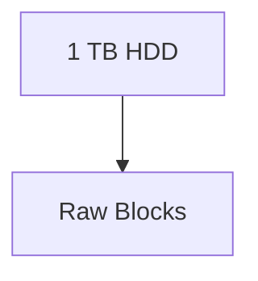

After:

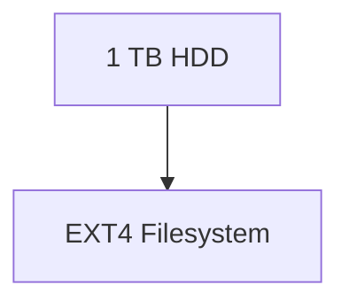

The filesystem creates:

- Metadata
    
- Block tables
    
- Inode tables
    
- Free space maps
    

Now Linux knows where files can live.

---

# Important Realization

Formatting does NOT create files.

Formatting creates rules.

Think:

Before formatting:

```text
Empty Land
```

After formatting:

```text
Roads
Addresses
Plot Numbers
```

Nobody lives there yet.

---

# What Does the Kernel See?

After booting Kali:

Kernel detects:

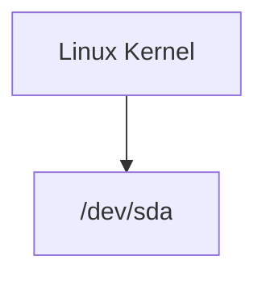

Notice:

The kernel does not see:

```text
Documents
Downloads
Photos
```

It only sees:

```text
A storage device
```

---

# Device File Creation

The kernel creates:

```bash
/dev/sda
```

Think of this as:

```text
A telephone number to reach the disk
```

Applications never talk directly to the HDD.

Instead:


---

# Creating Partitions

Now suppose we decide:

```text
200 GB for System
200 GB for Data
600 GB for Backup
```

We partition the disk.

Before:

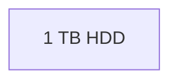

After:

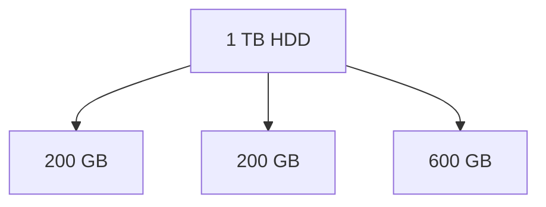

Linux creates:

```bash
/dev/sda1
/dev/sda2
/dev/sda3
```

---

# Very Important

Partitioning is NOT formatting.

Many people confuse these.

## Partitioning

Creates sections.

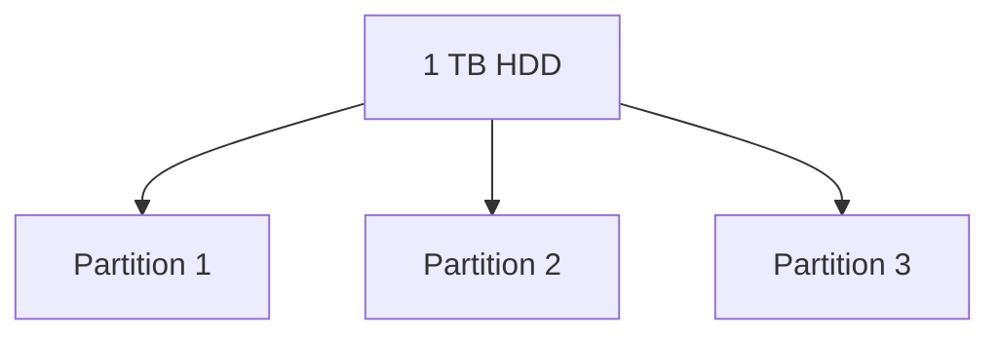

---

## Formatting

Creates a filesystem inside a partition.

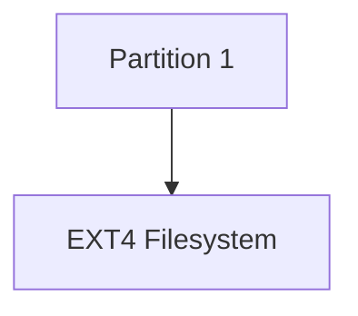

---

# Full Process

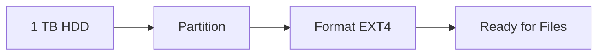

---

# What Does Linux Actually Mount?

Suppose:

```bash
mkfs.ext4 /dev/sda1
```

Now:

```text
/dev/sda1
```

contains an ext4 filesystem.

But Linux still cannot access files.

Why?

Because the filesystem must be mounted.

---

# Mounting

Suppose we mount it at:

```bash
/
```

Now:

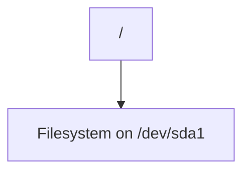

The filesystem becomes visible.

---

# What Does the User See?

User sees:

```text
/
├── home
├── etc
├── var
└── usr
```

But physically:

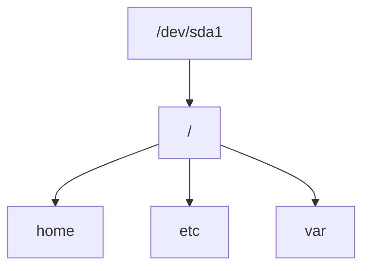

---

# What the Kernel Knows So Far

At this stage:

### Hardware Layer


### Device Layer

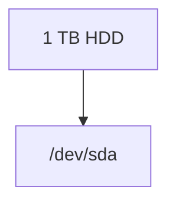

### Partition Layer

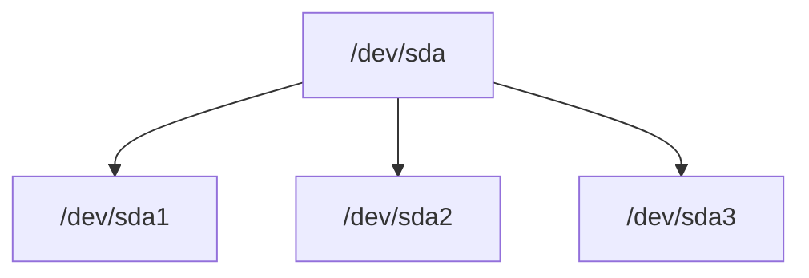

### Filesystem Layer

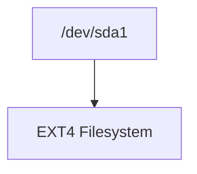

### Mount Layer

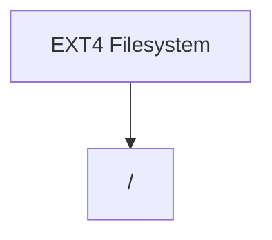

---

# Mental Model

Always think in these 5 layers:

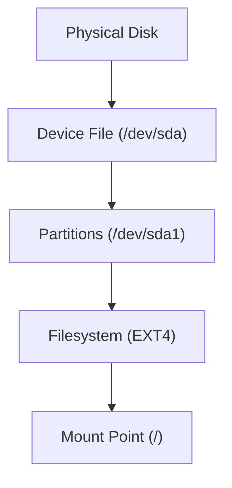

This single diagram explains almost the entire chapter.

---

# What Does "Mount" Mean?

The word **mount** comes from the English verb:

> "To attach something onto something else."

Examples:

- Mounting a TV on a wall.
    
- Mounting a camera on a tripod.
    
- Mounting a horse.
    
- Mounting a hard drive into a computer chassis.
    

The common idea is:

```text
Take an object
+
Attach it somewhere useful
```

---

# Why Did Unix Use The Word "Mount"?

Back in the 1970s, Unix systems had removable storage:

- Tape drives
    
- Floppy disks
    
- Removable disk packs
    

An operator would physically:

1. Take a disk.
    
2. Insert it into a drive.
    
3. Tell Unix:
    

```bash
mount ...
```

Meaning:

> "Attach this filesystem to my directory tree."

So the word survived from early Unix.

---

# The Core Problem Mount Solves

Imagine Linux without mounting.

You have:

```text
Disk A
Disk B
Disk C
```

How would users access them?

Windows chose:

```text
C:
D:
E:
```

Each disk gets its own namespace.

---

Unix chose something different.

Unix says:

> There is only ONE filesystem tree.

```text
/
```

Everything must appear somewhere under it.

---

# Think of Linux as a Giant Tree

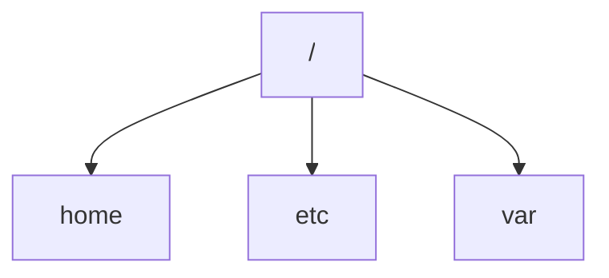

There is only one root.

No C:.

No D:.

No E:.

---

# So Where Does A New Disk Go?

Suppose you buy a new disk.

Linux asks:

```text
Where should I attach it?
```

You answer:

```bash
/home
```

or

```bash
/mnt/storage
```

or

```bash
/data
```

That attachment process is called:

```text
Mounting
```

---

# Visual Example

Before mounting:

```mermaid
flowchart TD
    ROOT["/"]

    ROOT --> HOME["home"]
    ROOT --> ETC["etc"]
```

A separate disk exists:

```mermaid
flowchart TD
    DISK["Disk B"]

    DISK --> FS["EXT4 Filesystem"]
```

They are not connected.

---

After mounting:

```mermaid
flowchart TD
    ROOT["/"]

    ROOT --> HOME["home"]

    HOME --> DISK["Disk B Filesystem"]

    ROOT --> ETC["etc"]
```

Now the filesystem becomes reachable.

---

# What Does Mount Actually Do?

Many people think:

> Mount copies data.

Wrong.

It copies nothing.

---

Imagine:

Before:

```text
Filesystem exists on disk
```

After mounting:

```text
Filesystem becomes visible
```

The data never moves.

Linux simply connects it into the directory tree.

---

# Real Life Analogy

Imagine a shopping mall.

You build a new shop.

The shop already exists.

Customers cannot enter because no door connects it to the mall.

Mounting is:

```text
Creating the doorway
```

The shop wasn't moved.

You simply attached it.

---

# Example

Suppose:

```bash
/dev/sdb1
```

contains:

```text
movies
music
photos
```

Filesystem already exists.

---

Before mount:

```mermaid
flowchart TD
    SDB["/dev/sdb1"]

    SDB --> MOVIES["movies"]
    SDB --> MUSIC["music"]
    SDB --> PHOTOS["photos"]
```

Linux users cannot access it.

---

You run:

```bash
mount /dev/sdb1 /mnt
```

---

Now:

```mermaid
flowchart TD
    ROOT["/"]

    ROOT --> MNT["/mnt"]

    MNT --> MOVIES["movies"]
    MNT --> MUSIC["music"]
    MNT --> PHOTOS["photos"]
```

The files suddenly appear.

---

# What Is A Mount Point?

A mount point is simply:

> A directory where another filesystem will be attached.

Example:

```bash
/mnt
```

Before mount:

```text
/mnt
(empty directory)
```

After mount:

```text
/mnt
├── movies
├── music
└── photos
```

The directory becomes the entry point into the filesystem.

---

# What Happens To Existing Files?

This is a common interview question.

Suppose:

```text
/mnt
├── file1
├── file2
```

already exists.

---

Then you mount:

```bash
mount /dev/sdb1 /mnt
```

Now:

```text
/mnt
├── movies
├── music
└── photos
```

You no longer see:

```text
file1
file2
```

They are hidden.

Not deleted.

Hidden.

---

Unmount:

```bash
umount /mnt
```

and they reappear.

---

# Why "umount" and not "unmount"?

Historical Unix trivia.

The original command was named:

```bash
mount
```

The opposite became:

```bash
umount
```

The name stuck.

---

# What Happens Inside The Kernel?

Suppose:

```bash
mount /dev/sdb1 /mnt
```

Kernel performs roughly:

### Step 1

Read filesystem metadata.

```text
Is this EXT4?
Is this XFS?
Is this FAT32?
```

---

### Step 2

Load appropriate filesystem driver.

```text
ext4 driver
xfs driver
vfat driver
```

---

### Step 3

Connect filesystem to mount point.

```mermaid
flowchart LR
    DEV["/dev/sdb1"]

    DEV --> FS["EXT4"]

    FS --> MNT["/mnt"]
```

---

### Step 4

Update kernel mount table.

You can view it:

```bash
mount
```

or

```bash
findmnt
```

or

```bash
cat /proc/mounts
```

---

# In Your Future Scenario

We'll eventually have:

- HDD (1 TB)
    
- SSD (500 GB)
    
- USB (4 GB)
    
- ESXi Datastore (2 TB)
    

Linux might present them like:

```mermaid
flowchart TD
    ROOT["/"]

    ROOT --> HOME["home (HDD)"]

    ROOT --> DATA["data (SSD)"]

    ROOT --> USB["media/usb"]

    ROOT --> NFS["mnt/datastore"]
```

To applications:

```text
Everything looks like one filesystem.
```

Applications don't care whether the data comes from:

- HDD
    
- SSD
    
- USB
    
- Network Storage
    

because mounting hides those details.

---

# The One-Sentence Definition

**Mounting is the process by which the Linux kernel attaches a filesystem to a directory (mount point) so that its files become accessible through the single Linux directory tree rooted at `/`.**


Let's continue the story.

---

# Current State

Your system currently has:

```mermaid
flowchart TD
    HDD["1 TB HDD"]

    HDD --> P1["/dev/sda1"]
    P1 --> EXT4["EXT4 Filesystem"]
    EXT4 --> ROOT["Mounted at /"]
```

Kali is running successfully.

---

# New Event

You find an old SSD in your drawer.

```text
500 GB SSD
```

You plug it into your computer.

---

# What Happens First?

The kernel detects new hardware.

```mermaid
flowchart TD
    KERNEL["Kernel"]

    KERNEL --> SDA["/dev/sda (HDD)"]

    KERNEL --> SDB["/dev/sdb (SSD)"]
```

Notice:

At this point the kernel only knows:

```text
A new storage device exists.
```

It does NOT yet know:

- What's inside it
    
- Which filesystem it uses
    
- Whether it's empty
    
- Whether it contains data
    

---

# Question: Do We Need Formatting?

The answer is:

> It depends on what's already on the SSD.

Let's examine several scenarios.

---

# Scenario 1 - Brand New SSD

Suppose the SSD was never used.

```mermaid
flowchart TD
    SSD["500 GB SSD"]

    SSD --> RAW["Raw Storage"]
```

No partitions.

No filesystem.

No data.

---

Can Linux mount it?

No.

Why?

Because there's nothing to mount.

Remember:

```text
Mounting attaches a filesystem.
```

No filesystem exists.

Therefore:

```text
No filesystem
=
Nothing to mount
```

---

## Required Steps

### Partition

```bash
fdisk /dev/sdb
```

Create:

```text
/dev/sdb1
```

---

### Format

```bash
mkfs.ext4 /dev/sdb1
```

---

### Mount

```bash
mount /dev/sdb1 /data
```

---

Workflow:

```mermaid
flowchart LR
    RAW["Raw SSD"]
    --> PART["Partition"]
    --> FORMAT["Format"]
    --> MOUNT["Mount"]
```

Formatting is REQUIRED.

---

# Scenario 2 - Old Linux SSD

Suppose the SSD was previously used on another Linux machine.

It already contains:

```text
/dev/sdb1
EXT4 Filesystem
Photos
Movies
Documents
```

---

Kernel discovers SSD.

```bash
lsblk
```

might show:

```text
sdb
└─sdb1 ext4
```

Linux can read the filesystem immediately.

---

Now:

```bash
mount /dev/sdb1 /data
```

works.

---

Do we need formatting?

No.

Because:

```text
Filesystem already exists.
```

Formatting would erase everything.

---

Workflow:

```mermaid
flowchart LR
    SSD["Existing EXT4 Filesystem"]
    --> MOUNT["Mount Directly"]
```

No formatting needed.

---

# Scenario 3 - Old Windows SSD

Suppose SSD previously belonged to a Windows machine.

Contains:

```text
NTFS Filesystem
```

---

Kernel detects:

```bash
/dev/sdb1
```

Filesystem:

```text
NTFS
```

---

Can Linux mount it?

Usually yes.

Modern Linux supports NTFS.

```bash
mount /dev/sdb1 /data
```

---

Do we need formatting?

No.

If you want to keep the data.

---

Workflow:

```mermaid
flowchart LR
    NTFS["NTFS Filesystem"]
    --> MOUNT["Mount"]
```

---

# Scenario 4 - Corrupted Filesystem

Suppose:

```text
Filesystem exists
But metadata is damaged
```

---

Kernel tries:

```bash
mount /dev/sdb1 /data
```

and gets:

```text
wrong filesystem
filesystem corrupted
```

---

Now you have options:

### Option A

Repair filesystem.

Preferred.

---

### Option B

Reformat.

```bash
mkfs.ext4 /dev/sdb1
```

Everything gets erased.

---

Formatting is only needed if:

```text
You don't care about existing data
```

or

```text
Filesystem is unusable
```

---

# Key Mental Model

Many beginners think:

```text
New Disk Attached
=
Must Format
```

Wrong.

---

Linux actually checks:

```mermaid
flowchart TD
    SSD["SSD Found"]

    SSD --> FS{"Filesystem Exists?"}

    FS -->|Yes| MOUNT["Mount"]

    FS -->|No| FORMAT["Format First"]
```

---

# What Does Mount Actually Look For?

When mounting:

```bash
mount /dev/sdb1 /data
```

Kernel reads the beginning of the partition.

Something like:

```text
I am EXT4
```

or

```text
I am NTFS
```

or

```text
I am XFS
```

This signature is called a **filesystem superblock** (simplified explanation).

---

The kernel then says:

```text
Great.
I know how to read this filesystem.
```

and attaches it.

---

# In Your Thought Experiment

Let's assume the SSD came from an old Linux server.

Current state:

```mermaid
flowchart TD
    HDD["1 TB HDD"]

    HDD --> ROOT["/"]

    SSD["500 GB SSD"]

    SSD --> EXT4["Existing EXT4 Filesystem"]
```

You plug it in.

Kernel creates:

```bash
/dev/sdb
/dev/sdb1
```

You run:

```bash
mount /dev/sdb1 /data
```

Now:

```mermaid
flowchart TD
    ROOT["/"]

    ROOT --> HOME["home"]

    ROOT --> ETC["etc"]

    ROOT --> DATA["data"]

    DATA --> SSD["500 GB SSD Filesystem"]
```

No formatting was required because the filesystem already existed.

---

## Golden Rule

**Formatting is not required when a usable filesystem already exists and you want to keep the data.**

Formatting is required only when:

- The disk is new.
    
- No filesystem exists.
    
- You intentionally want to erase everything.
    
- The filesystem is damaged and you choose to rebuild it.


At this point your system looks like:

```mermaid
flowchart TD
    ROOT["/"]

    ROOT --> HDD["1 TB HDD (Kali Installed)"]

    ROOT --> DATA["/data"]

    DATA --> SSD["500 GB SSD"]
```

Now you find a USB stick.

---

# Step 1: Plug in the USB

You insert the USB.

Immediately the kernel receives an event:

```text
New USB Device Connected
```

The USB controller notifies the kernel.

```mermaid
flowchart LR
    USB["USB Stick"]

    USB --> USBCTRL["USB Controller"]

    USBCTRL --> KERNEL["Kernel"]
```

---

# Step 2: Kernel Detects the Device

Kernel loads:

```text
USB Driver
USB Storage Driver
```

Then creates a new device file.

Suppose before plugging:

```bash
lsblk
```

showed:

```text
sda    1T
sdb  500G
```

After plugging:

```text
sda    1T
sdb  500G
sdc   32G
```

Kernel has now discovered:

```text
A new storage device
```

---

# Step 3: Check What's Inside

The first thing Linux wants to know:

```text
Does this USB already contain a filesystem?
```

You run:

```bash
lsblk -f
```

Example:

```text
NAME   FSTYPE
sda    ext4
sdb    ext4
sdc
└─sdc1 vfat
```

Notice:

```text
sdc = Device
sdc1 = Partition
vfat = Filesystem
```

---

# Scenario 1: USB Already Has a Filesystem

Most USB drives come preformatted.

Usually:

```text
FAT32
exFAT
NTFS
```

Example:

```mermaid
flowchart TD
    USB["USB"]

    USB --> PART["sdc1"]

    PART --> VFAT["VFAT Filesystem"]
```

In this case:

No formatting required.

---

# Step 4: Mount It

Create a mount point.

```bash
mkdir /usb
```

Mount:

```bash
mount /dev/sdc1 /usb
```

Now:

```mermaid
flowchart TD
    ROOT["/"]

    ROOT --> USBDIR["/usb"]

    USBDIR --> FILES["USB Files"]
```

---

# Step 5: Access Files

Now:

```bash
cd /usb
ls
```

might show:

```text
photos
movies
documents
```

The files were already there.

You simply made them visible.

---

# What Did Mount Actually Do?

Before mount:

```mermaid
flowchart TD
    USB["USB Filesystem"]

    ROOT["Linux Tree"]
```

No connection.

---

After mount:

```mermaid
flowchart TD
    ROOT["/"]

    ROOT --> USBDIR["/usb"]

    USBDIR --> USB["USB Filesystem"]
```

Nothing moved.

Nothing copied.

A connection was created.

---

# Scenario 2: Brand New USB

Suppose:

```text
No Partition
No Filesystem
```

Kernel sees:

```bash
/dev/sdc
```

but

```bash
lsblk -f
```

shows:

```text
sdc
```

No filesystem.

---

Then you must:

### Create Partition

```bash
fdisk /dev/sdc
```

Creates:

```text
/dev/sdc1
```

---

### Format

For Linux:

```bash
mkfs.ext4 /dev/sdc1
```

For sharing with Windows:

```bash
mkfs.vfat /dev/sdc1
```

or

```bash
mkfs.exfat /dev/sdc1
```

---

### Mount

```bash
mount /dev/sdc1 /usb
```

Now it becomes usable.

---

# How Do Modern Desktop Linux Systems Work?

You usually don't type mount manually.

For example:

- Kali GUI
    
- Ubuntu
    
- GNOME
    
- KDE
    

When USB is inserted:

1. Kernel detects USB.
    
2. Filesystem detected.
    
3. Desktop automatically mounts it.
    

You suddenly see:

```text
Kingston USB
```

in the file manager.

Behind the scenes Linux did:

```bash
mount /dev/sdc1 /media/kali/Kingston
```

for you.

---

# What Happens When You Remove It?

Before removing:

```bash
umount /usb
```

or

```bash
umount /dev/sdc1
```

This tells the kernel:

```text
Flush all pending writes
Disconnect filesystem safely
```

Then remove the USB.

---

# Your Current Mental Model

Every storage device follows the same chain:

```mermaid
flowchart TD
    DEVICE["Physical Device"]

    DEVICE --> DEVFILE["/dev/sdX"]

    DEVFILE --> PARTITION["Partition"]

    PARTITION --> FS["Filesystem"]

    FS --> MOUNT["Mount Point"]

    MOUNT --> FILES["Accessible Files"]
```

For your USB:

```mermaid
flowchart TD
    USB["USB Stick"]

    USB --> SDC["/dev/sdc"]

    SDC --> SDC1["/dev/sdc1"]

    SDC1 --> VFAT["VFAT"]

    VFAT --> USBDIR["/usb"]

    USBDIR --> FILES["Your Files"]
```

Notice how this is **exactly the same process** as the HDD and SSD. The kernel doesn't care whether the storage is:

- HDD
    
- SSD
    
- USB
    

It always thinks in terms of:

```text
Device → Partition → Filesystem → Mount Point
```


# Full Combined View

This is probably the most important diagram in the whole chapter.

```mermaid
flowchart TD

    HDD["1 TB HDD"]
    HDD --> SDA["/dev/sda"]
    SDA --> SDA1["/dev/sda1"]
    SDA1 --> ROOTFS["EXT4 Root Filesystem"]

    SSD["500 GB SSD"]
    SSD --> SDB["/dev/sdb"]
    SDB --> SDB1["/dev/sdb1"]
    SDB1 --> DATAFS["EXT4 Data Filesystem"]

    USBDEV["USB Drive"]
    USBDEV --> SDC["/dev/sdc"]
    SDC --> SDC1["/dev/sdc1"]
    SDC1 --> USBFS["VFAT Filesystem"]

    ROOTFS --> ROOT["/"]

    ROOT --> HOME["home"]
    ROOT --> ETC["etc"]
    ROOT --> VAR["var"]
    ROOT --> USR["usr"]

    ROOT --> DATA["data"]
    ROOT --> USB["usb"]

    DATA --> DATAFS
    USB --> USBFS
```


---

# New Situation

You have an ESXi server somewhere on your network.

```mermaid
flowchart LR
    PC["Your Kali Machine"]

    NETWORK["Network"]

    ESXI["ESXi Server"]

    DATASTORE["Datastore1 (2 TB)"]

    PC --- NETWORK
    NETWORK --- ESXI
    ESXI --- DATASTORE
```

Notice:

The datastore is **not physically attached** to your computer.

No SATA cable.

No USB cable.

Nothing.

---

# First Question

Can Linux create:

```bash
/dev/sdd
```

for the datastore?

No.

Why?

Because `/dev/*` is generally for devices the kernel can directly control.

The datastore is not a local block device.

It lives on another machine.

---

# How Can Linux Access It Then?

The ESXi server must expose the storage somehow.

Common methods:

```text
NFS
SMB/CIFS
iSCSI
SSHFS
```

For learning purposes, let's use **NFS** because it's closest to the chapter.

---

# What is NFS?

NFS = Network File System

Instead of:

```text
Read block from local HDD
```

Linux does:

```text
Send request over network
```

---

# Imagine This Conversation

```text
Kali:
Give me file report.pdf

NFS Server:
Here you go.
```

The file travels across the network.

---

# Before Mounting

Current Linux tree:

```mermaid
flowchart TD
    ROOT["/"]

    ROOT --> DATA["/data (SSD)"]

    ROOT --> USB["/usb (USB)"]
```

The ESXi datastore exists but is not attached.

```mermaid
flowchart TD
    ROOT["/"]

    ESXI["ESXi Datastore"]
```

No connection.

---

# Creating a Mount Point

Let's create:

```bash
mkdir /mnt/datastore
```

Now Linux has an empty directory.

```mermaid
flowchart TD
    ROOT["/"]

    ROOT --> MNT["/mnt"]

    MNT --> DATASTOREDIR["datastore (empty)"]
```

---

# Mounting NFS

Suppose ESXi exports:

```text
10.10.10.20:/datastore1
```

You run:

```bash
mount -t nfs 10.10.10.20:/datastore1 /mnt/datastore
```

---

# What Does The Kernel Do?

The kernel now connects:

```text
Remote Filesystem
```

to

```text
Local Directory
```

---

# New View

```mermaid
flowchart TD
    ROOT["/"]

    ROOT --> DATA["/data"]

    ROOT --> USB["/usb"]

    ROOT --> MNT["/mnt"]

    MNT --> DATASTORE["datastore"]
```

Looks normal.

---

# Hidden Reality

What the user sees:

```bash
cd /mnt/datastore
ls
```

Output:

```text
ISO
Backups
VMs
Templates
```

Looks local.

---

What's actually happening:

```mermaid
flowchart LR
    USER["User"]

    USER --> PATH["/mnt/datastore"]

    PATH --> NETWORK["Network"]

    NETWORK --> ESXI["ESXi Server"]

    ESXI --> STORAGE["Datastore1"]
```

Every read goes over the network.

---

# The Amazing Part

Let's compare all storage now.

|Path|Actual Location|
|---|---|
|/etc|HDD|
|/home|HDD|
|/data|SSD|
|/usb|USB|
|/mnt/datastore|ESXi Server|

But applications don't care.

---

# Example

Suppose you run:

```bash
cp file.txt /mnt/datastore
```

The command does NOT know:

```text
Local HDD?
USB?
Network?
SSD?
```

It simply writes to a path.

---

# Why?

Because Linux hides the details.

```mermaid
flowchart TD
    APP["Application"]

    APP --> PATH["Filesystem Path"]

    PATH --> KERNEL["Kernel"]

    KERNEL --> HDD["HDD"]
    KERNEL --> SSD["SSD"]
    KERNEL --> USB["USB"]
    KERNEL --> NFS["Remote NFS Storage"]
```

This abstraction is one of the most important ideas in Unix.

---

# Your Final System

```mermaid
flowchart TD

    ROOT["/"]

    ROOT --> ETC["etc (HDD)"]
    ROOT --> HOME["home (HDD)"]

    ROOT --> DATA["data (SSD)"]

    ROOT --> USB["usb (USB Drive)"]

    ROOT --> MNT["mnt"]

    MNT --> DATASTORE["datastore (ESXi NFS Share)"]
```

---

# The Physical Reality Behind It

```mermaid
flowchart TD

    HDD["1 TB HDD"]
    SSD["500 GB SSD"]
    USB["USB Drive"]

    ESXI["ESXi Server"]

    DATASTORE["2 TB Datastore"]

    ESXI --> DATASTORE
```

---

# The User's Reality

```mermaid
flowchart TD

    ROOT["/"]

    ROOT --> HOME["home"]
    ROOT --> ETC["etc"]
    ROOT --> DATA["data"]
    ROOT --> USB["usb"]
    ROOT --> DATASTORE["mnt/datastore"]
```

The user sees one tree.

The kernel knows the truth.

This is exactly what the book means when it says:

> "Linux possesses only one hierarchy, and it can integrate data from several disks."

The same statement extends beyond disks:

- HDDs
    
- SSDs
    
- USB drives
    
- NFS shares
    
- Cloud storage
    
- SAN storage
    
- iSCSI volumes
    

Everything can ultimately be attached somewhere under `/` and accessed using normal file paths.

# Final Tree Structure
```mermaid
flowchart TD

    HDD["1 TB HDD"]
    HDD --> SDA["/dev/sda"]
    SDA --> SDA1["/dev/sda1"]
    SDA1 --> ROOTFS["EXT4 Root Filesystem"]

    SSD["500 GB SSD"]
    SSD --> SDB["/dev/sdb"]
    SDB --> SDB1["/dev/sdb1"]
    SDB1 --> DATAFS["EXT4 Data Filesystem"]

    USBDEV["USB Drive"]
    USBDEV --> SDC["/dev/sdc"]
    SDC --> SDC1["/dev/sdc1"]
    SDC1 --> USBFS["VFAT Filesystem"]

    ROOTFS --> ROOT["/"]

    ROOT --> HOME["home"]
    ROOT --> ETC["etc"]
    ROOT --> VAR["var"]
    ROOT --> USR["usr"]

    ROOT --> DATA["data"]
    ROOT --> USB["usb"]
    ROOT --> MNT["mnt"]

    MNT --> DATASTOREMOUNT["datastore"]

    DATA --> DATAFS
    USB --> USBFS

    ESXI["ESXi Server"]
    ESXI --> DATASTORE["Datastore1 (2 TB)"]

    DATASTORE --> NFS["NFS Export"]

    NFS -. "mounted at /mnt/datastore" .-> DATASTOREMOUNT
```