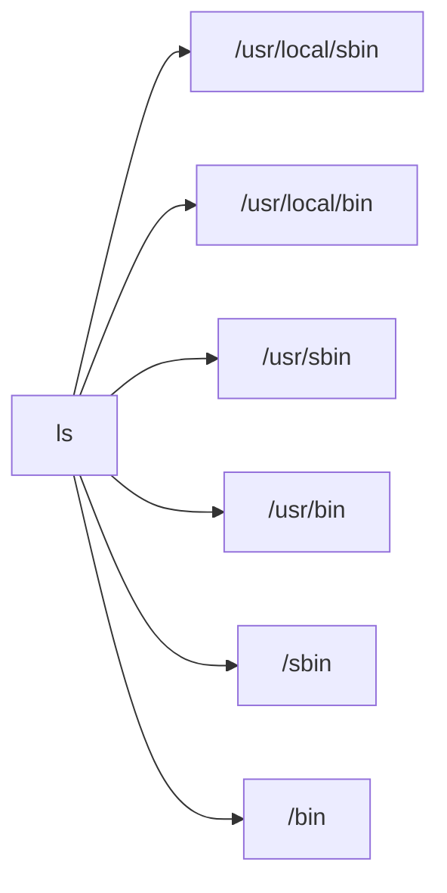
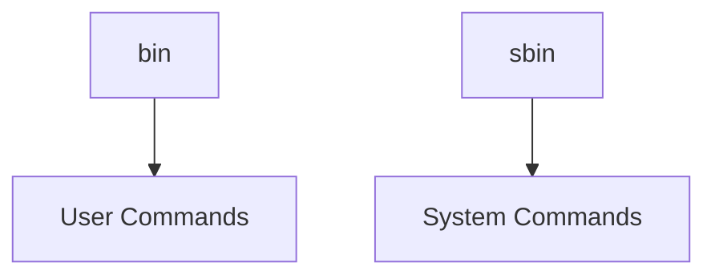
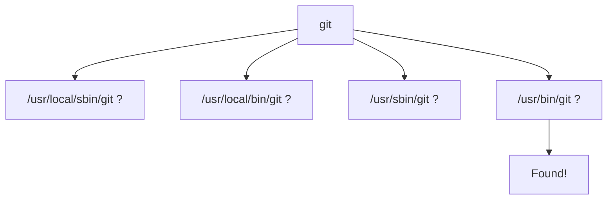

# What is `$PATH`?

When you type:

```bash
nmap
```

or

```bash
ls
```

the shell needs to answer:

> "Where is the executable file named `nmap` or `ls`?"

It searches the directories listed in `$PATH`.

Your PATH is:

```bash
/usr/local/sbin:/usr/local/bin:/usr/sbin:/usr/bin:/sbin:/bin
```

Think of it as:



The shell searches from left to right.

---

# Example

Suppose:

```bash
which ls
```

returns:

```bash
/usr/bin/ls
```

When you type:

```bash
ls
```

the shell actually runs:

```bash
/usr/bin/ls
```

---

# Why Not Put Everything In One Folder?

Historical Unix design.

Programs were categorized by purpose.

---

# The Meaning of `bin`

`bin` = **binaries**

A binary is simply:

```text
An executable program
```

Examples:

```bash
/bin/ls
/bin/cat
/bin/mv
/bin/cp
```

---

# Why Is It Called Binary?

Originally Unix programs were compiled machine code files.

Not scripts.

Not text.

Actual binary machine instructions.

Hence:

```text
bin = binary executables
```

---

# What is `/bin`?

Contains essential commands needed for the system to function.

Examples:

```bash
/bin/ls
/bin/cp
/bin/mv
/bin/cat
/bin/bash
```

Think:

> Commands needed even if only the root filesystem is available.

---

# What is `/sbin`?

`sbin` = **system binaries**

These are primarily administrative commands.

Examples:

```bash
/sbin/fsck
/sbin/reboot
/sbin/shutdown
/sbin/mkfs.ext4
```

Think:

```text
bin   = regular commands

sbin  = system administration commands
```

---

# Historical View



---

# What is `/usr`?

This confuses almost everyone.

Most people think:

```text
/usr = user
```

Historically, that's not what it meant.

---

Originally:

```text
/      = minimal system
/usr   = additional software
```

Over time it evolved.

Today:

```text
/usr
```

contains most installed programs.

---

# What is `/usr/bin`?

Most application binaries live here.

Examples:

```bash
/ usr/bin/python3
/usr/bin/git
/usr/bin/vim
/usr/bin/ssh
```

(Without the space after `/`.)

---

Think:

```text
/bin
    Essential commands

/usr/bin
    Most user applications
```

---

# What is `/usr/sbin`?

Administrative programs that are not critical during early boot.

Examples:

```bash
/usr/sbin/apache2
/usr/sbin/nginx
/usr/sbin/useradd
```

---

Think:

```text
/sbin
    Essential admin tools

/usr/sbin
    Additional admin tools
```

---

# What is `/usr/local`?

This is for software installed manually.

Historically:

```text
Vendor software -> /usr

Local software -> /usr/local
```

---

Example:

You compile a tool yourself.

Instead of overwriting:

```bash
/usr/bin/python
```

you install it into:

```bash
/usr/local/bin
```

---

# `/usr/local/bin`

User-installed programs.

Examples:

```bash
/usr/local/bin/customtool
/usr/local/bin/myapp
```

---

# `/usr/local/sbin`

User-installed admin tools.

Examples:

```bash
/usr/local/sbin/myscript
```

---

# Your PATH Explained

```bash
/usr/local/sbin
```

Check here first for local admin tools.

↓

```bash
/usr/local/bin
```

Then local user tools.

↓

```bash
/usr/sbin
```

Then system admin tools.

↓

```bash
/usr/bin
```

Then standard applications.

↓

```bash
/sbin
```

Then essential admin tools.

↓

```bash
/bin
```

Then essential user tools.

---

# Let's See Real Examples

Try:

```bash
which ls
```

Probably:

```bash
/usr/bin/ls
```

---

Try:

```bash
which bash
```

Probably:

```bash
/bin/bash
```

or

```bash
/usr/bin/bash
```

depending on distribution.

---

Try:

```bash
which python3
```

Likely:

```bash
/usr/bin/python3
```

---

# How the Shell Uses PATH

Suppose:

```bash
git status
```

Shell internally does:



Then executes:

```bash
/usr/bin/git
```

---

# Modern Linux Trivia

On modern systems (including Kali), many of these directories are actually linked together.

For example:

```bash
ls -l /bin
```

may show:

```bash
/bin -> usr/bin
```

and

```bash
/sbin -> usr/sbin
```

This is called the **usr merge**.

Historically they were separate.

Today they're often unified.

---

# Quick Memory Trick

```text
bin          = user commands
sbin         = system/admin commands

/usr/bin     = most applications
/usr/sbin    = most admin applications

/usr/local/bin
             = locally installed apps

/usr/local/sbin
             = locally installed admin tools
```

So when you see:

```bash
/usr/local/sbin:/usr/local/bin:/usr/sbin:/usr/bin:/sbin:/bin
```

you're looking at the shell's **search order** for executable programs. It is effectively a list of directories the shell checks whenever you type a command.