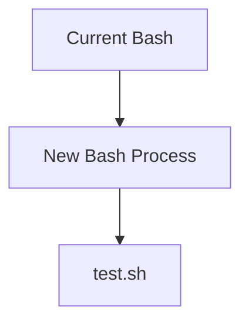
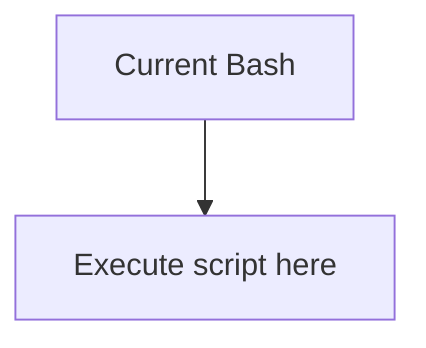
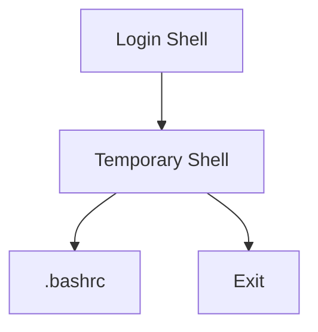
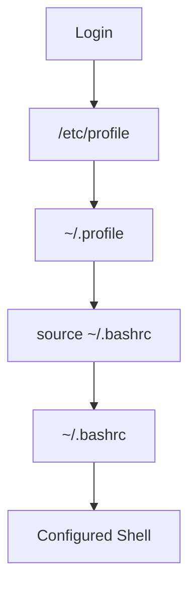

# What is `.bashrc`?

Think of `.bashrc` as:

> A configuration file that Bash executes whenever an interactive shell starts.

When you open a terminal, Bash doesn't magically know:

- Aliases
    
- Prompt colors
    
- Custom functions
    
- Environment variables
    

It reads `.bashrc` to configure itself.

---

## Example

Create:

```bash
nano ~/.bashrc
```

Add:

```bash
alias ll='ls -lah'
```

Save.

Now reload it:

```bash
source ~/.bashrc
```

After that:

```bash
ll
```

works.

Without loading `.bashrc`, Bash doesn't know about the alias.

---

# Why Is It Named ".bashrc"?

Historically:

```text
bash  = Bourne Again Shell
rc    = Run Commands
```

So:

```text
.bashrc
=
"Bash Run Commands"
```

or

```text
Commands Bash should execute when it starts
```

---

# Think of It Like Startup Scripts

Windows:

```text
Startup Folder
Registry Startup Entries
```

Bash:

```text
~/.bashrc
```

---

# What Typically Lives in .bashrc?

Aliases:

```bash
alias ll='ls -lah'
alias cls='clear'
```

---

Environment Variables:

```bash
export EDITOR=vim
```

---

Prompt Customization:

```bash
PS1='\u@\h:\w\$ '
```

Produces:

```text
root@kali:/tmp#
```

---

Functions:

```bash
myip() {
    ip addr show
}
```

Now:

```bash
myip
```

works like a command.

---

# What is `source`?

Suppose you have:

```bash
cat test.sh
```

```bash
export MYVAR=hello
```

---

## Method 1: Execute It

```bash
./test.sh
```

Bash creates:



The variable exists only inside the child shell.

After script exits:

```bash
echo $MYVAR
```

Output:

```text
(empty)
```

---

# Method 2: Source It

```bash
source test.sh
```

or

```bash
. test.sh
```

(Dot and source are equivalent.)

---

Now:



No child shell is created.

The commands run inside the current shell.

---

Now:

```bash
echo $MYVAR
```

Output:

```text
hello
```

because the variable was created in your current shell.

---

# Why Does ~/.profile Use Source?

You saw:

```bash
if [ -f ~/.bashrc ]; then
    . ~/.bashrc
fi
```

The dot means:

```bash
source ~/.bashrc
```

---

Why?

Because we want aliases and variables to affect the current shell.

If it executed:

```bash
~/.bashrc
```

instead:



All changes would disappear when the child shell exits.

---

# Real Example

Current shell:

```bash
echo $TEST
```

Output:

```text
(empty)
```

---

Create:

```bash
echo 'export TEST=KALI' > test.sh
```

---

Run:

```bash
source test.sh
```

---

Check:

```bash
echo $TEST
```

Output:

```text
KALI
```

---

# Login Flow Revisited

When you log in:



This is why your aliases, prompt settings, PATH changes, functions, and exports appear automatically every time you open a terminal.

---

# Quick Mental Model

### `.bashrc`

```text
Configuration file for interactive Bash shells
```

Contains:

- aliases
    
- functions
    
- exports
    
- prompt settings
    

---

### `source file`

```text
Run commands from a file
inside the current shell
```

Equivalent:

```bash
source file
```

and

```bash
. file
```

---

### Difference

```bash
./script.sh
```

➡ Creates a new process

```bash
source script.sh
```

➡ Uses the current shell

This distinction is one of the most important shell concepts because it explains why changes to variables and aliases sometimes "stick" and sometimes disappear.