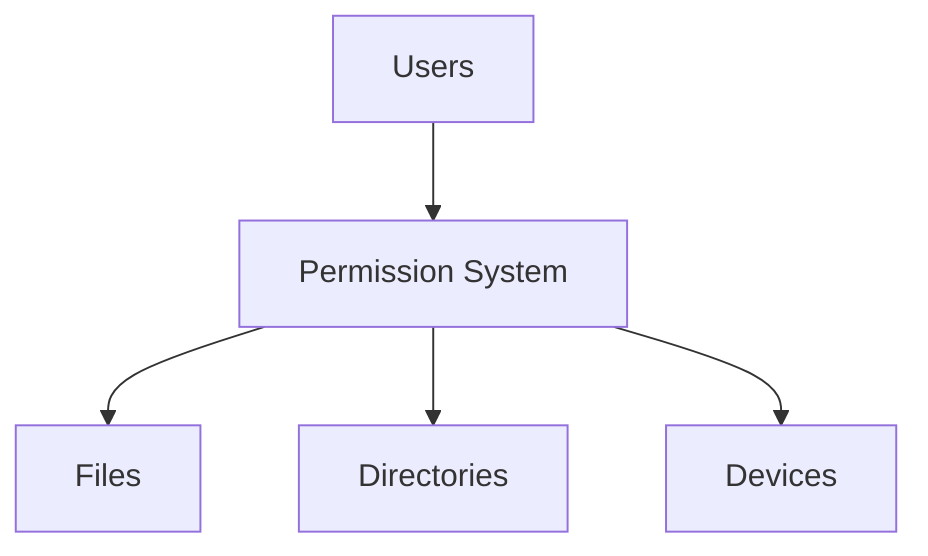
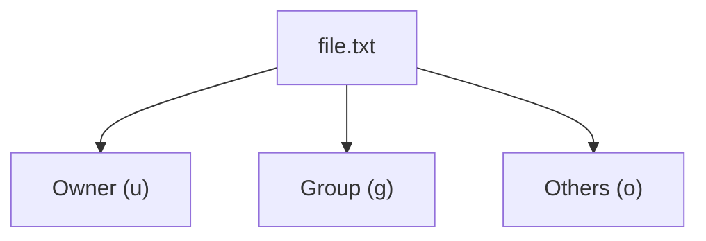
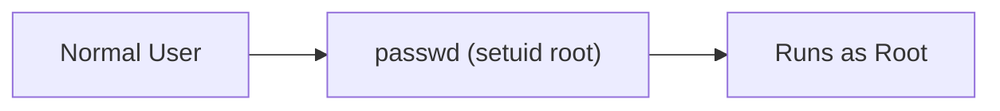
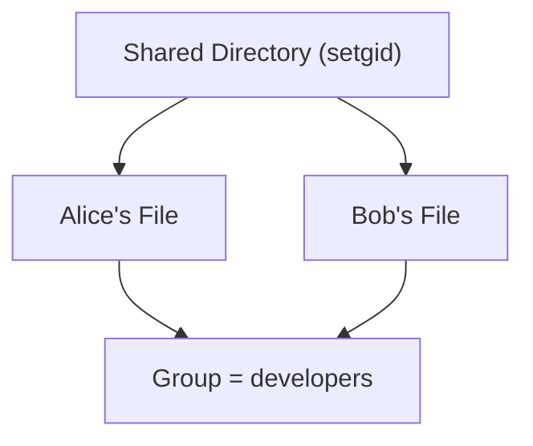
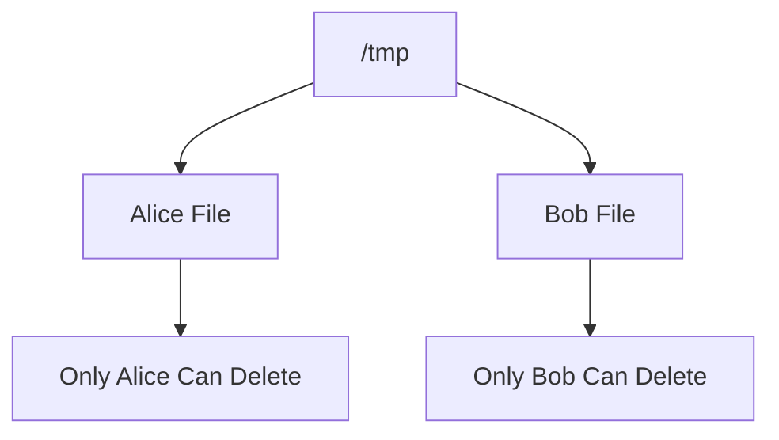
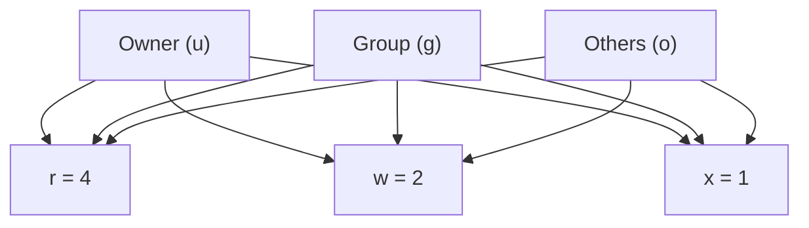

# 2.4.4 Managing Rights (Permissions)

> Linux is a multi-user operating system, so it needs a permission system to control who can access files, directories, and devices. In Linux, even hardware devices are represented as files.

---

# 1. Why Do Permissions Exist?

Imagine a server with multiple users:

```text
Alice
Bob
Charlie
```

Questions Linux must answer:

- Can Bob read Alice's files?
    
- Can Charlie modify system files?
    
- Can Alice execute a script?
    

Permissions solve these problems.



---

# 2. Permission Categories

Every file/directory has permissions for 3 categories:

|Symbol|Meaning|
|---|---|
|u|User (Owner)|
|g|Group|
|o|Others|

Example:

```text
Owner = alice
Group = developers
Others = everyone else
```



---

# 3. Permission Types

There are 3 basic permissions:

|Symbol|Name|Value|
|---|---|---|
|r|Read|4|
|w|Write|2|
|x|Execute|1|

---

## Read (r)

Allows:

```text
View file contents
Copy file contents
```

Example:

```bash
cat file.txt
```

Requires read permission.

---

## Write (w)

Allows:

```text
Modify file
Append content
Delete contents
```

Example:

```bash
echo "hello" >> file.txt
```

Requires write permission.

---

## Execute (x)

Allows:

```text
Run a program or script
```

Example:

```bash
./script.sh
```

Requires execute permission.

---

# 4. Viewing Permissions

Command:

```bash
ls -l
```

Example:

```text
-rwxr-xr--
```

Break it down:

```text
- rwx r-x r--
  |   |   |
  |   |   +-- Others
  |   +------ Group
  +---------- Owner
```

Meaning:

```text
Owner  = rwx
Group  = r-x
Others = r--
```

---

# 5. Directory Permissions Work Differently

Files and directories interpret permissions differently.

---

## Directory Read (r)

Allows:

```text
See contents of directory
```

Example:

```bash
ls /shared
```

---

## Directory Write (w)

Allows:

```text
Create files
Delete files
Rename files
```

---

## Directory Execute (x)

Allows:

```text
Enter directory
Access files inside
```

Example:

```bash
cd /shared
```

---

### Interesting Case

Directory:

```text
--x
```

You can:

```bash
cd directory
```

if you know filenames.

But:

```bash
ls directory
```

won't work.

---

# 6. Symbolic Permissions

Human-readable format.

Example:

```bash
chmod u=rwx,g=rx,o=r file
```

Meaning:

```text
Owner  = rwx
Group  = r-x
Others = r--
```

---

## Add Permissions

```bash
chmod g+w file
```

Adds:

```text
Write permission to group
```

---

## Remove Permissions

```bash
chmod o-r file
```

Removes:

```text
Read permission from others
```

---

## All Users

```bash
chmod a+x script.sh
```

Meaning:

```text
Add execute permission for everyone
```

---

# 7. Numeric (Octal) Permissions

Linux converts permissions into numbers.

|Permission|Value|
|---|---|
|r|4|
|w|2|
|x|1|

Add them together.

---

## Examples

### rwx

```text
4 + 2 + 1 = 7
```

### rw-

```text
4 + 2 = 6
```

### r-x

```text
4 + 1 = 5
```

### r--

```text
4
```

---

## chmod 754

```bash
chmod 754 file
```

Breakdown:

```text
7 = rwx
5 = r-x
4 = r--
```

Result:

```text
Owner  = rwx
Group  = r-x
Others = r--
```

---

## Common Permissions

|Value|Meaning|
|---|---|
|755|Executable files/directories|
|644|Normal files|
|600|Private files|
|777|Everyone full access (avoid)|

---

# 8. Changing Ownership

---

## Change Owner

```bash
chown alice file.txt
```

Changes owner to:

```text
alice
```

---

## Change Group

```bash
chgrp developers file.txt
```

Changes group.

---

## Change Both

```bash
chown alice:developers file.txt
```

Changes:

```text
Owner = alice
Group = developers
```

---

# 9. Special Permissions

Linux has 3 special permission bits.

---

## setuid (4)

Normally:

```text
User runs program
Program uses user's permissions
```

With setuid:

```text
User runs program
Program uses owner's permissions
```

---

### Example

```bash
passwd
```

Normal user can change password because:

```text
passwd runs as root
```

via setuid.

---

### Diagram



---

## Security Risk

If a setuid-root program is vulnerable:

```text
User
 ↓
Exploit
 ↓
Root Access
```

This is a common privilege escalation technique in penetration testing.

---

## setgid (2)

For files:

```text
Program runs with group's permissions
```

---

## setgid on Directories

Very useful for team folders.

Without setgid:

```text
Alice creates file
Group = Alice's primary group

Bob creates file
Group = Bob's primary group
```

Messy.

---

With setgid:

```text
Shared Directory Group = developers

Every new file
↓
Group = developers
```

---

### Diagram



---

## Sticky Bit (1)

Used mainly on:

```bash
/tmp
```

Without sticky bit:

```text
Anyone can delete anyone's files
```

Bad.

---

With sticky bit:

```text
Only file owner
or
Directory owner

can delete file
```

---

### Example

```bash
ls -ld /tmp
```

Usually:

```text
drwxrwxrwt
```

Notice:

```text
t
```

at the end.

---

### Diagram



---

# 10. Special Permission Numbers

|Permission|Value|
|---|---|
|setuid|4|
|setgid|2|
|sticky|1|

Added as a 4th digit.

Example:

```bash
chmod 4755 file
```

Meaning:

```text
4 = setuid
755 = rwxr-xr-x
```

---

# 11. umask

Controls default permissions for newly created files.

---

Check current value:

```bash
umask
```

Example:

```text
0022
```

Meaning:

```text
Remove write permission
for group and others
```

---

### Creation Process


---

# 12. Recursive Permission Changes

Apply permissions to entire directory trees.

```bash
chmod -R 755 project
```

```bash
chown -R kali:kali project
```

---

# 13. Capital X Permission

Special symbolic permission.

```bash
chmod -R a+X project
```

Meaning:

```text
Add execute permission
only to directories

and files that already had execute permission
```

Useful because:

```text
Directories need execute permission to enter them.
Normal text files usually do not.
```

---

# Quick Revision



### Common Commands

```bash
ls -l
chmod 755 file
chmod u+x script.sh
chown user file
chgrp group file
umask
```

### Special Bits

```text
setuid = 4
setgid = 2
sticky = 1
```

### Common Values

```text
755 = rwxr-xr-x
644 = rw-r--r--
600 = rw-------
777 = rwxrwxrwx (avoid)
```