> A process is simply a running program. Every command you execute becomes one or more processes.

---

# 1. What is a Process?

Suppose you run:

```bash
firefox
```

Linux loads the program into memory and starts executing it.

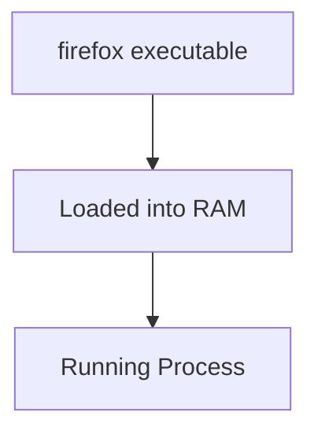

---

## Program vs Process

### Program

```text
A file stored on disk
```

Example:

```bash
/usr/bin/bash
```

---

### Process

```text
A running instance of a program
```

Example:

```bash
bash
```

running in memory.

---

# 2. Every Process Has a PID

PID = Process ID

Linux gives every running process a unique number.

Example:

```text
PID 1      systemd
PID 500    sshd
PID 1234   bash
PID 5678   firefox
```

Think:

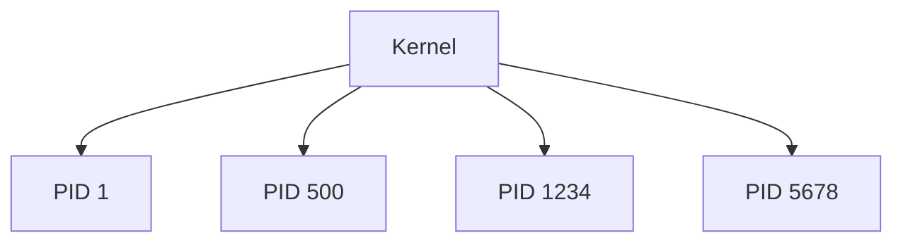

---

# 3. Viewing Processes

## ps

Basic:

```bash
ps
```

Shows processes attached to your terminal.

---

## ps aux

Most commonly used:

```bash
ps aux
```

Example:

```text
USER       PID %CPU %MEM COMMAND
root         1  0.1  0.2 systemd
root       500  0.0  0.1 sshd
kali      1234  0.0  0.5 bash
kali      5678  5.0 10.0 firefox
```

---

### What Does aux Mean?

Historical Unix syntax.

```text
a = all users
u = user format
x = include processes without terminal
```

Just remember:

```bash
ps aux
```

means:

```text
Show almost everything
```

---

# 4. Process Lifecycle

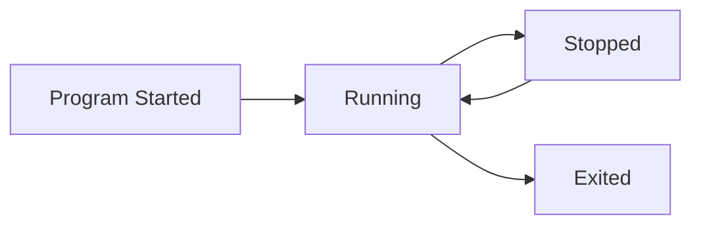

---

# 5. Signals

Linux doesn't usually "kill" processes directly.

Instead it sends signals.

Think:

```text
Kernel sending messages
to processes
```

---

# Common Signals

|Signal|Number|Meaning|
|---|---|---|
|TERM|15|Please exit|
|KILL|9|Die immediately|
|STOP|19|Pause|
|CONT|18|Continue|
|INT|2|Ctrl+C|

---

# TERM (Graceful Stop)

```bash
kill -TERM 1234
```

or

```bash
kill 1234
```

(default is TERM)

---

Process receives:

```text
Please shut down cleanly
```

Process can:

- Save files
    
- Close connections
    
- Exit gracefully
    

---

# KILL (Force Stop)

```bash
kill -9 1234
```

or

```bash
kill -KILL 1234
```

---

Kernel says:

```text
You are dead.
```

No cleanup.

No saving.

Immediate termination.

---

## Rule of Thumb

Use:

```bash
kill PID
```

first.

Only use:

```bash
kill -9 PID
```

if absolutely necessary.

---

# 6. Finding PIDs

Useful commands not mentioned in the book:

## pgrep

```bash
pgrep firefox
```

Output:

```text
5678
```

---

## pidof

```bash
pidof firefox
```

Output:

```text
5678
```

---

## ps + grep

```bash
ps aux | grep firefox
```

---

# 7. Foreground Processes

Normal command:

```bash
ping google.com
```

Terminal becomes occupied.

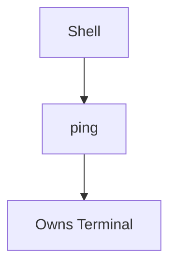

You can't type new commands.

---

# 8. Background Processes

Add:

```bash
&
```

Example:

```bash
ping google.com &
```

Output:

```text
[1] 3456
```

Meaning:

```text
Job Number = 1
PID = 3456
```

---

Now terminal is free.

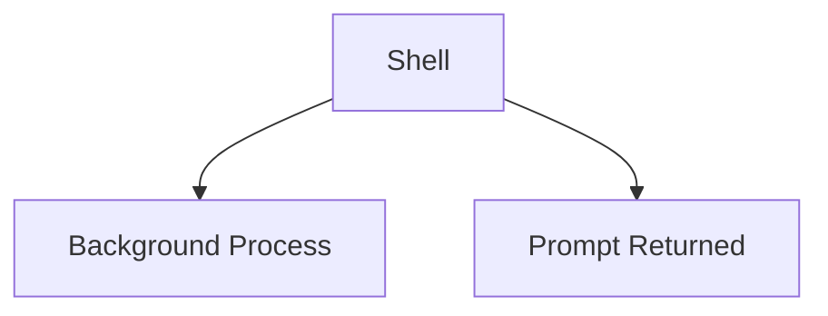

---

# 9. jobs Command

Show background jobs:

```bash
jobs
```

Example:

```text
[1]+ Running ping google.com &
```

---

Notice:

```text
Job Number = 1
```

This is NOT the PID.

---

# PID vs Job Number

Example:

```text
PID = 3456

Job Number = 1
```

Different things.

|Item|Meaning|
|---|---|
|PID|Kernel process ID|
|Job Number|Shell tracking number|

---

# 10. Bringing Job Back

## fg

Foreground

```bash
fg %1
```

Now:

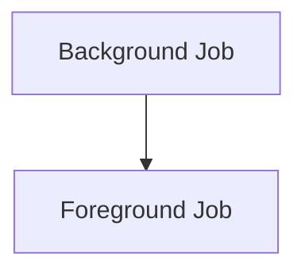

Terminal becomes occupied again.

---

# 11. Suspending a Process

Suppose:

```bash
ping google.com
```

is running.

Press:

```text
Ctrl + Z
```

---

Process becomes:

```text
Stopped
```

Not killed.

Just paused.

---

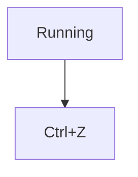

---

# 12. Resuming in Background

After Ctrl+Z:

```bash
bg %1
```

Now:

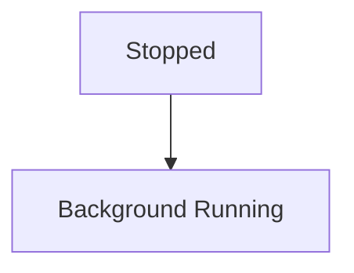

---

# Complete Job Control Flow

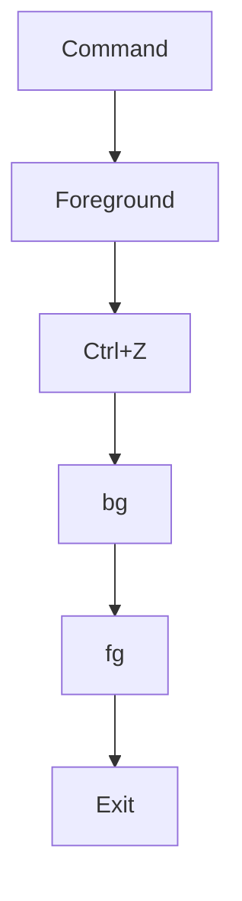

---

# Things Reddit Users Constantly Recommend

These are often considered more practical than the textbook commands.

---

# 13. top

Real-time process monitor.

```bash
top
```

Shows:

- CPU usage
    
- Memory usage
    
- Running processes
    

---

Think:

```text
Task Manager for Linux
```

---

# 14. htop

Much better version of top.

Install:

```bash
apt install htop
```

Run:

```bash
htop
```

Features:

- Colored interface
    
- Mouse support
    
- Search
    
- Easy process killing
    

---

Reddit consensus:

```text
Use htop instead of top whenever possible.
```

---

# 15. pstree

Shows process hierarchy.

```bash
pstree
```

Example:

```text
systemd
 ├─sshd
 │   └─bash
 │       └─vim
 └─cron
```

---

Visual:

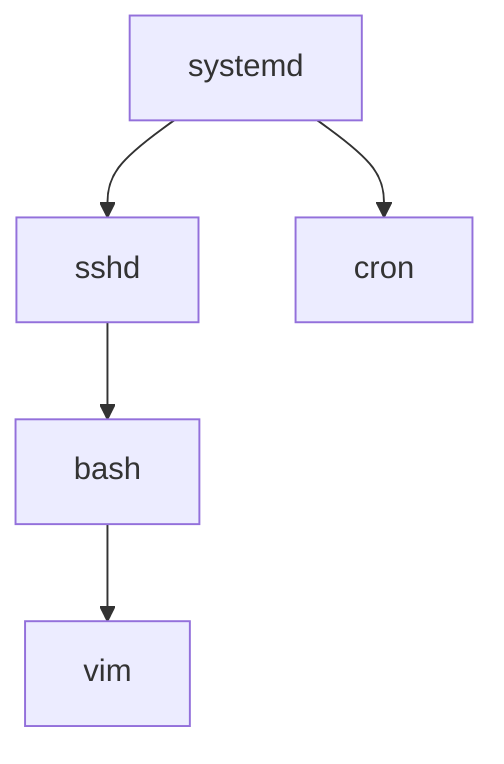

---

# 16. Process Parent and Child

Every process has a parent.

Example:

```bash
bash
```

creates:

```bash
vim file.txt
```

Relationship:

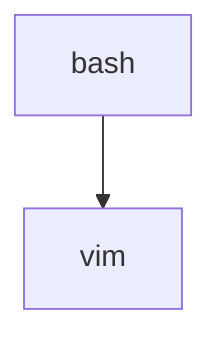

---

Useful command:

```bash
ps -ef --forest
```

Shows parent-child relationships.

---

# 17. The Special PID 1

Historically:

```text
init
```

Modern Linux:

```text
systemd
```

PID:

```text
1
```

---

Every process ultimately descends from PID 1.

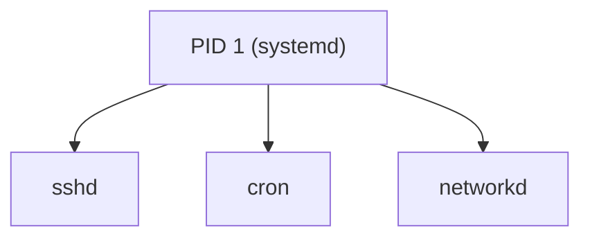

---

# 18. Kill By Name

Instead of finding PID.

Use:

```bash
pkill firefox
```

or

```bash
killall firefox
```

Reddit users often prefer:

```bash
pkill
```

because it's flexible.

---

# 19. nohup

Common real-world command.

Problem:

```bash
python script.py &
```

Log out.

Process may die.

---

Solution:

```bash
nohup python script.py &
```

Meaning:

```text
Keep running even after logout
```

---

# 20. Screen and tmux (Must Know)

Very commonly recommended.

Install:

```bash
apt install tmux
```

Start:

```bash
tmux
```

Run:

```bash
nmap ...
```

Disconnect:

```text
Ctrl+b d
```

Reconnect later:

```bash
tmux attach
```

Process keeps running.

---

## Why Pentesters Love tmux

```text
SSH to server
Start scan
Lose internet
Reconnect
Scan still running
```

---

# Quick Revision

### Process Commands

```bash
ps aux
pgrep
pidof
top
htop
pstree
```

### Signals

```bash
kill PID
kill -9 PID
```

### Job Control

```bash
command &
jobs
fg %1
bg %1
Ctrl+Z
```

### Long Running Tasks

```bash
nohup command &
tmux
```

### Mental Model

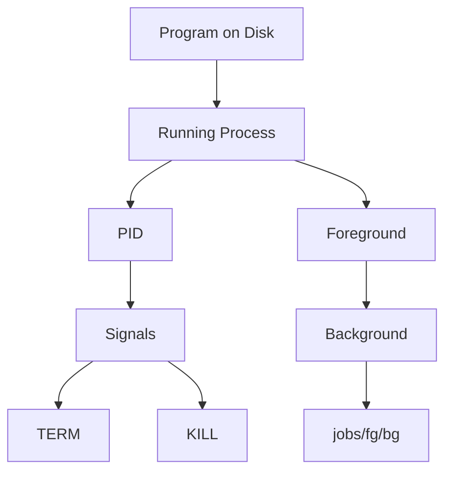

This covers not only the book section but also the practical process-management commands Linux administrators, pentesters, and Reddit power users rely on daily.