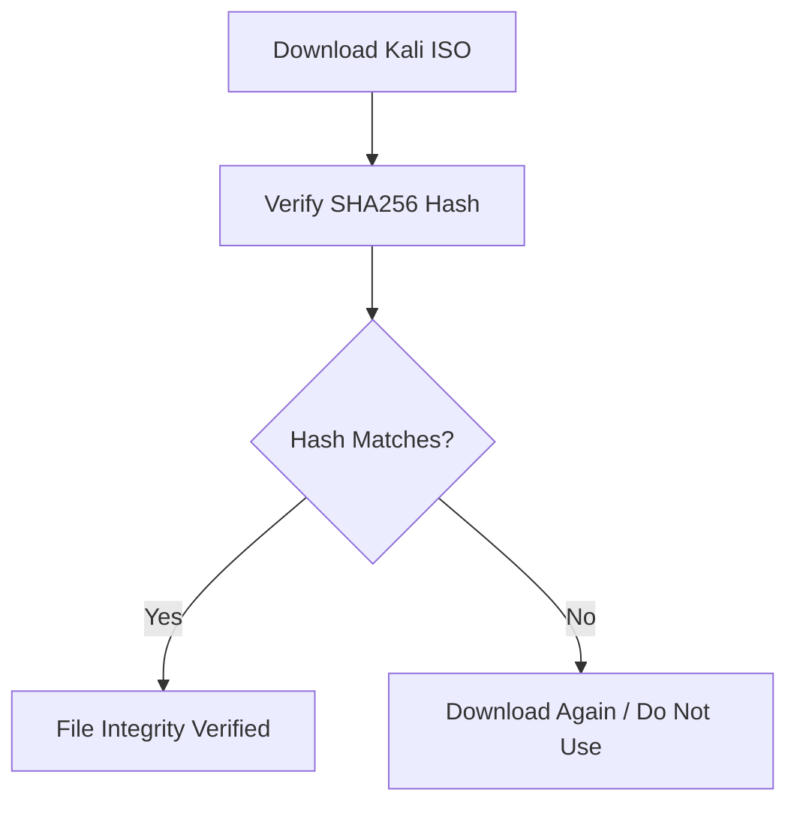
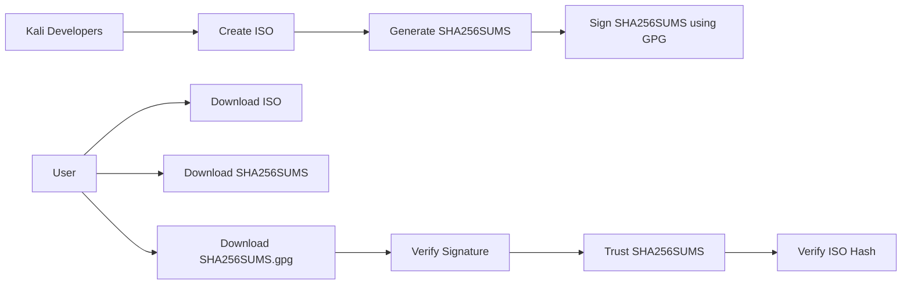
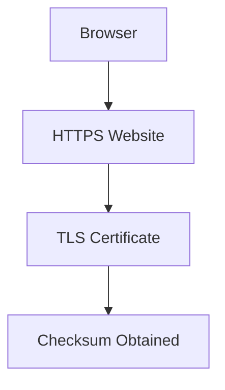
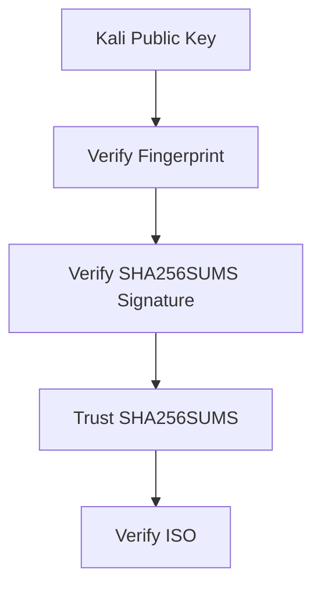
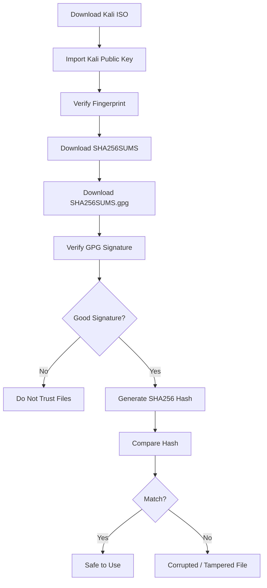
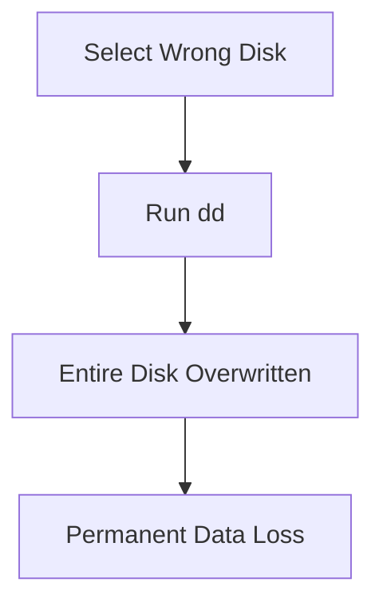
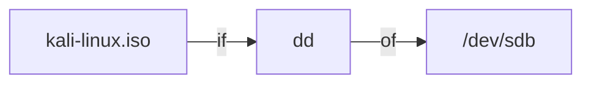
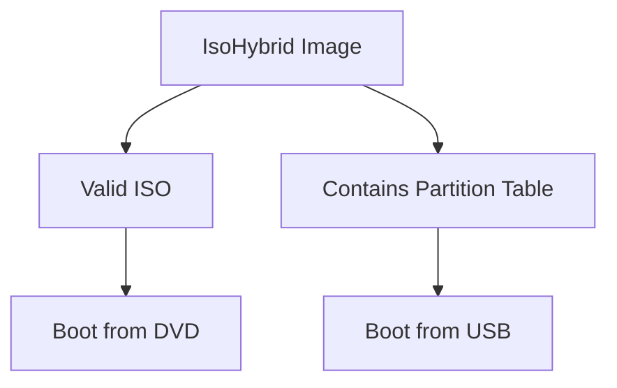
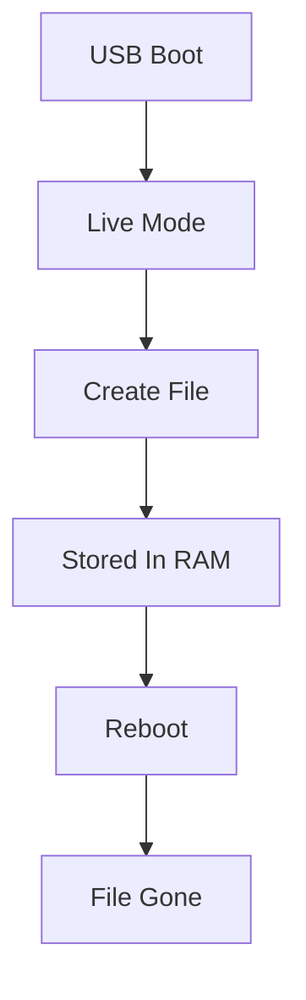

# Kali Linux Notes: Verifying ISO Integrity & Creating Bootable USB

> These notes explain **why we verify Kali downloads**, **how SHA256 and GPG work**, and **how to create a bootable USB on Linux/macOS/Windows**. Based on the uploaded course material.

---

# Why Verify a Kali ISO?

When you download Kali Linux, the ISO may come from a mirror server.

Problems that can happen:

- Download corruption
    
- Compromised mirror
    
- Man-in-the-middle attack
    
- Maliciously modified ISO
    

If you install a modified ISO, your entire system could be compromised.



---

# Two Security Checks

## 1. Integrity Check

Question:

> "Is the file unchanged?"

Tool used:

- SHA256 checksum
    

Example:

```bash
sha256sum kali-linux.iso
```

Output:

```bash
1a0b2ea83f48861dd3f3babd5a2892a14b30a7234c8c9b5013a6507d1401874f
```

Compare this with the checksum published by Kali.

If both match:

✅ File is intact

If different:

❌ File changed or corrupted

---

## 2. Authenticity Check

Question:

> "Did Kali developers really publish this checksum?"

Tool used:

- GPG Signature
    

Because:

Even if SHA256 matches, an attacker could publish a fake ISO AND a fake checksum.

We must verify the checksum file itself.



---

# Trust Models

## HTTPS Trust

You trust:

- TLS certificate
    
- Browser
    
- Certificate Authorities
    



This is usually sufficient.

---

## GPG Trust

You trust:

- Public key fingerprint
    

Instead of trusting a website.



---

# Kali GPG Key

Example fingerprint:

```text
44C6 513A 8E4F B3D3 0875 F758 ED44 4FF0 7D8D 0BF6
```

This fingerprint identifies the official Kali signing key.

---

# Download Kali Public Key

Method 1

```bash
wget -q -O - https://archive.kali.org/archive-key.asc | gpg --import
```

Method 2

```bash
gpg --keyserver hkps://keys.openpgp.org \
--recv-key 44C6513A8E4FB3D30875F758ED444FF07D8D0BF6
```

---

# Verify Fingerprint

```bash
gpg --fingerprint \
44C6513A8E4FB3D30875F758ED444FF07D8D0BF6
```

Expected:

```text
44C6 513A 8E4F B3D3 0875 F758 ED44 4FF0 7D8D 0BF6
```

---

# Download Checksum Files

```bash
wget https://cdimage.kali.org/current/SHA256SUMS
```

```bash
wget https://cdimage.kali.org/current/SHA256SUMS.gpg
```

---

# Verify Signature

```bash
gpg --verify SHA256SUMS.gpg SHA256SUMS
```

Good output:

```text
Good signature from
"Kali Linux Repository <devel@kali.org>"
```

Meaning:

✅ Kali signed this file

❌ If not, do not trust it.

---

# Complete Verification Workflow



---

# Verify ISO Against SHA256SUMS

Instead of manually comparing:

```bash
grep kali-linux.iso SHA256SUMS | sha256sum -c
```

Expected:

```text
kali-linux.iso: OK
```

Meaning:

✅ Downloaded ISO matches official release.

---

# Creating a Bootable USB

## Big Warning

```text
dd can completely erase the wrong disk.
Double-check the target device.
```



---

# Windows Method

Tool:

- Win32 Disk Imager
    

Steps:

1. Insert USB
    
2. Open Win32 Disk Imager
    
3. Select Kali ISO
    
4. Select USB drive letter
    
5. Click Write
    


---

# Linux Method (GUI)

Tool:

- GNOME Disks
    

Steps:

1. Insert USB
    
2. Open Disks utility
    
3. Select USB
    
4. Restore Disk Image
    
5. Choose ISO
    
6. Start Restoring
    

---

# Linux Method (CLI)

## Find USB Device

Insert USB and run:

```bash
dmesg
```

Example:

```text
[sdb] 16 GB USB Drive
```

Device:

```text
/dev/sdb
```

---

## Write ISO

```bash
sudo dd if=kali-linux.iso of=/dev/sdb
```

Meaning:

|Parameter|Meaning|
|---|---|
|if|Input File|
|of|Output File|



Example output:

```text
3138400256 bytes copied
```

USB is now bootable.

---

# macOS Method

## Find USB Device

Before inserting USB:

```bash
diskutil list
```

After inserting USB:

```bash
diskutil list
```

Find new device:

```text
/dev/disk2
```

---

## Unmount USB

```bash
diskutil unmountDisk /dev/disk2
```

---

## Write ISO

```bash
sudo dd if=kali-linux.iso of=/dev/rdisk2 bs=4m
```

### Why rdisk?

```text
disk2  = buffered
rdisk2 = raw access
```

Raw access is faster.

---

# Why Can an ISO Boot Directly from USB?

Normally:

```text
ISO -> CD/DVD
USB -> Requires partitions
```

Kali uses an **IsoHybrid** image.



Because it contains:

- ISO filesystem
    
- Bootloader
    
- Partition table
    

The same file works on:

- DVD
    
- USB
    

No conversion needed.

---

# Kali Live Mode

Live Mode:

```text
Runs directly from USB
```

Characteristics:

- No installation
    
- Temporary environment
    
- Changes stored in RAM
    
- Changes disappear after reboot
    



---

# Good Uses of Kali Live

✅ Carry Kali on a USB

✅ Test Kali without installing

✅ Forensics investigations

✅ Temporary penetration testing environment

---

# Bad Uses of Kali Live

❌ Permanent workstation

❌ Long-term storage

❌ Saving important files

❌ Large disk-intensive work

Reason:

Everything is temporary and RAM-based.

---

# Exam / Interview Summary

|Concept|Purpose|
|---|---|
|SHA256|Verify integrity|
|GPG|Verify authenticity|
|Fingerprint|Verify public key|
|SHA256SUMS|Official hashes|
|SHA256SUMS.gpg|Signed hash file|
|dd|Copy ISO to USB|
|dmesg|Identify USB device|
|diskutil list|Find USB on macOS|
|IsoHybrid|Same ISO works on DVD & USB|
|Live Mode|Runs from RAM|
|Forensics Mode|No swap + no automount|

**Golden Rule:**

```text
1. Verify GPG Signature
2. Verify SHA256 Hash
3. Create Bootable USB
4. Boot Kali
```
