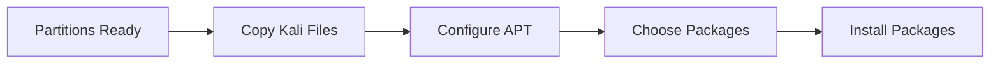
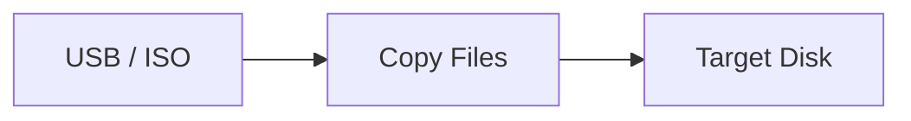
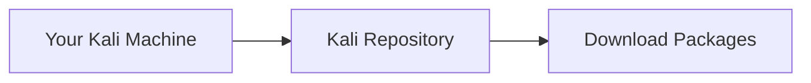
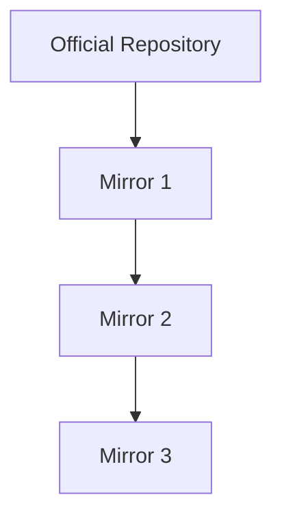
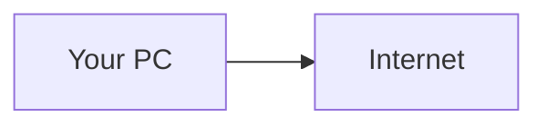
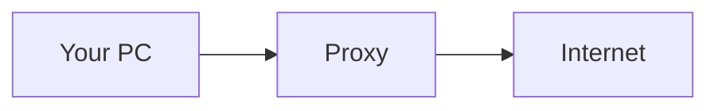
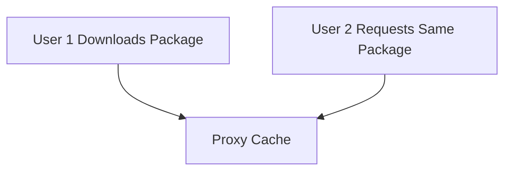
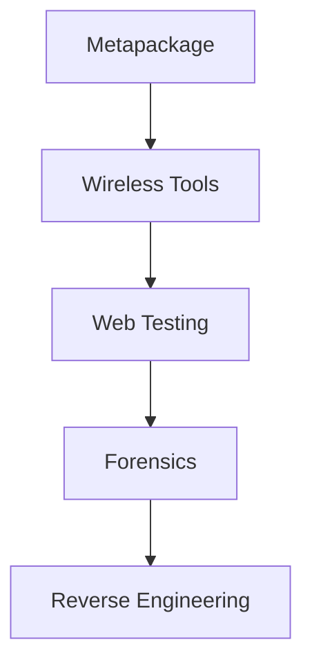
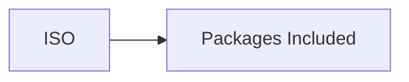
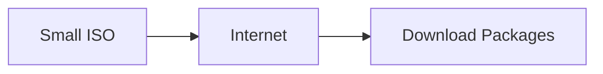

This section is actually much simpler than partitioning. The installer has already done the hard work. Now it's basically:



---

# Copying the Live Image

After partitioning is complete, the installer copies Kali files from the installation media to the target disk.



Think:

```text
Source:
Kali ISO

Destination:
Your SSD/HDD
```

No user interaction is required.

---

## What Is Being Copied?

The installer copies:

```text
Kernel
System Files
Libraries
Tools
Desktop Environment
```

Essentially:

```text
Everything needed
to run Kali
```

---

# Configuring APT

APT =

```text
Advanced Package Tool
```

Package manager used by:

```text
Kali
Debian
Ubuntu
```

APT is responsible for:

```text
Installing software
Updating software
Removing software
Resolving dependencies
```

Example:

```bash
sudo apt install nmap
```

APT downloads and installs Nmap.

---

# What Is A Repository?

APT downloads packages from repositories.

Think:

```text
Linux App Store
```

Example:

```text
http.kali.org
```



---

# What Is A Mirror?

A mirror is simply another copy of the repository.



Purpose:

```text
Faster Downloads
Load Balancing
Geographic Availability
```

Example:

Instead of:

```text
http.kali.org
```

you might use:

```text
mirror.company.com
```

---

# What Is An HTTP Proxy?

A proxy sits between you and the internet.

Normal flow:



Using proxy:



---

## Why Use A Proxy?

### Corporate Networks

Many companies require:

```text
All internet traffic
through company proxy
```

---

### Caching

Proxy may save downloaded files.



Result:

```text
Faster Download
Less Internet Usage
```

---

## Home Lab?

Leave proxy blank.

```text
Proxy = None
```

Installer connects directly to internet.

---

# Packages.xz and Sources.xz

APT downloads package metadata.

Think:

```text
Package Catalog
```

Not actual software.

Just information about:

```text
Available Packages
Versions
Dependencies
Descriptions
```

Similar to:

```text
Refreshing App Store Catalog
```

before installing apps.

---

# Installing Metapackages

This is the most important part of this section.

---

## What Is A Package?

Package:

```text
Single Software Component
```

Examples:

```text
nmap
wireshark
burpsuite
```

---

## What Is A Metapackage?

Metapackage contains:

```text
No actual software
```

Instead:

```text
List Of Other Packages
```

Think:

```text
Shopping List
```

---

Example:

```text
kali-linux-default
```

might tell APT:

```text
Install:

nmap
wireshark
hydra
john
aircrack-ng
...
```

---

## Why Use Metapackages?

Instead of:

```bash
apt install tool1
apt install tool2
apt install tool3
apt install tool4
```

Install:

```bash
apt install kali-linux-default
```

and everything comes automatically.

---

# Desktop Environment Selection

Installer may ask:

```text
Which Desktop?
```

Examples:

```text
Xfce
GNOME
KDE
```

---

Most common:

```text
Xfce
```

Reason:

```text
Lightweight
Fast
Default Kali Desktop
```

---

# Tool Selection

Installer may ask:

```text
Which Tool Collection?
```

Examples:

```text
Default Tools
Large Toolset
Specific Categories
```



---

# Netinstaller vs Live Installer

## Live Installer

Contains most packages already.



Less internet required.

---

## Netinstaller

Very small ISO.



Requires network connectivity.

---

# Exam Notes

## APT

```text
Advanced Package Tool
```

Package manager for Kali.

---

## Repository

```text
Server containing packages
```

Example:

```text
http.kali.org
```

---

## Mirror

```text
Copy of a repository
```

Used for faster downloads.

---

## Proxy

```text
Middleman between client and internet
```

Used in corporate networks.

---

## Package

```text
Single software component
```

Example:

```text
nmap
```

---

## Metapackage

```text
Package that installs many packages
```

Example:

```text
kali-linux-default
```

---

## Typical Home Lab Setup

```text
Mirror:
Default

Proxy:
None

Desktop:
Xfce

Metapackage:
kali-linux-default
```

That's honestly all you need to remember from this section. The next important topic is **GRUB Boot Loader Installation**, because that ties together BIOS, UEFI, MBR, GPT, booting, and dual boot.