# 5.2.2 Installation on a Fully Encrypted File System

> Full Disk Encryption protects your data if your laptop, SSD, or hard drive is lost or stolen. Without the encryption passphrase, the data remains unreadable.

---

# Why Encrypt a Disk?

Without encryption:

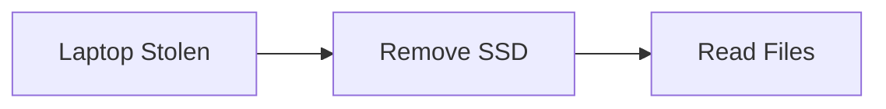

Attacker can access:

- Documents
    
- Password databases
    
- Browser data
    
- SSH keys
    
- Company data
    

---

With encryption:

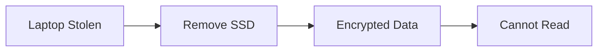

Without the passphrase:

```text
Data = Useless
```

---

# Technologies Used

Encrypted Kali installation combines:

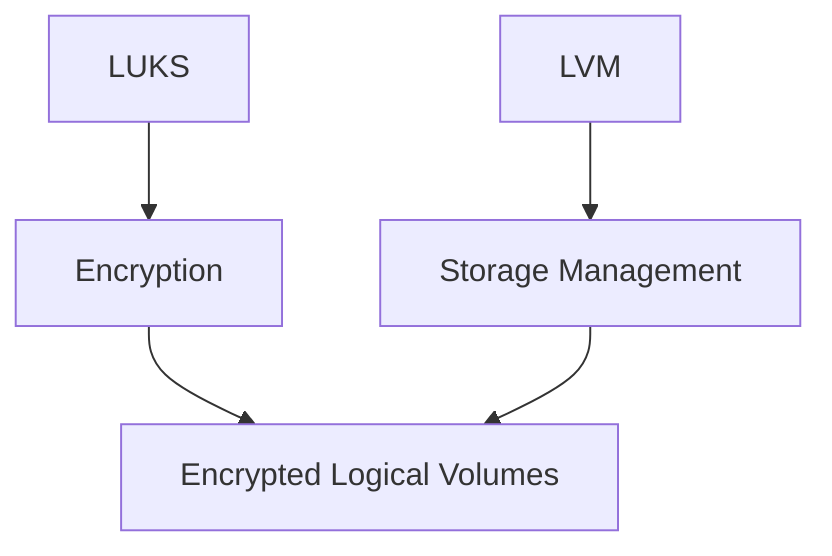

Components:

|Technology|Purpose|
|---|---|
|LUKS|Encrypt data|
|LVM|Manage storage|
|ext4|Filesystem|

---

# LVM Refresher

LVM introduces another layer between partitions and filesystems.

Normal setup:

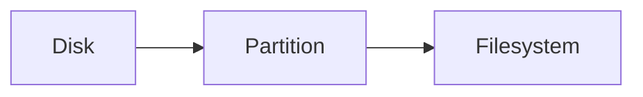

LVM setup:

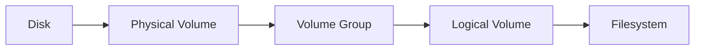

---

## LVM Terminology

### Physical Volume (PV)

Actual storage.

Examples:

```text
/dev/sda3
/dev/nvme0n1p3
```

---

### Volume Group (VG)

Pool of storage.

Think:

```text
Storage Container
```

---

### Logical Volume (LV)

Virtual partition created from the storage pool.

Examples:

```text
root
home
swap
```

---

# Why Use LVM?

Without LVM:

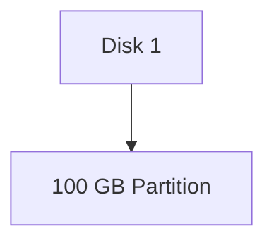

Partition size is fixed.

---

With LVM:

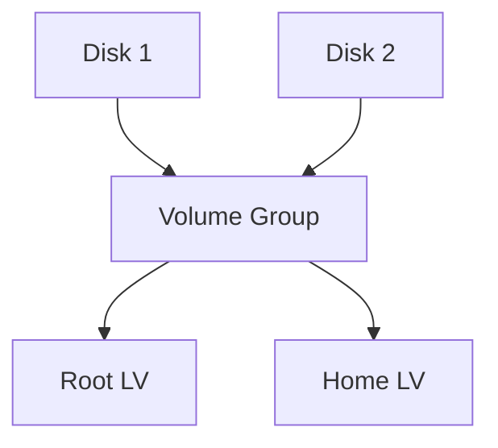

Benefits:

- Combine multiple disks
    
- Resize volumes
    
- Expand storage later
    

---

# LUKS (Linux Unified Key Setup)

LUKS provides encryption.

Without LUKS:

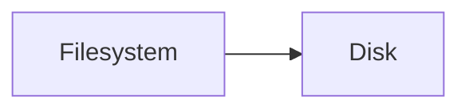

Data stored as plain text.

---

With LUKS:

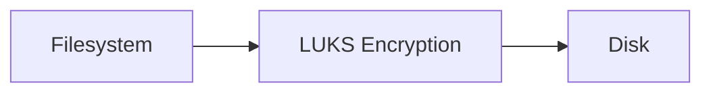

Data stored in encrypted form.

---

# Encryption Layer Visualization

Normal disk:

```text
Files
↓
Filesystem
↓
Disk
```

Encrypted disk:

```text
Files
↓
Filesystem
↓
LUKS
↓
Disk
```

LUKS encrypts everything before it reaches disk.

---

# Why LVM + LUKS Together?

The installer creates:

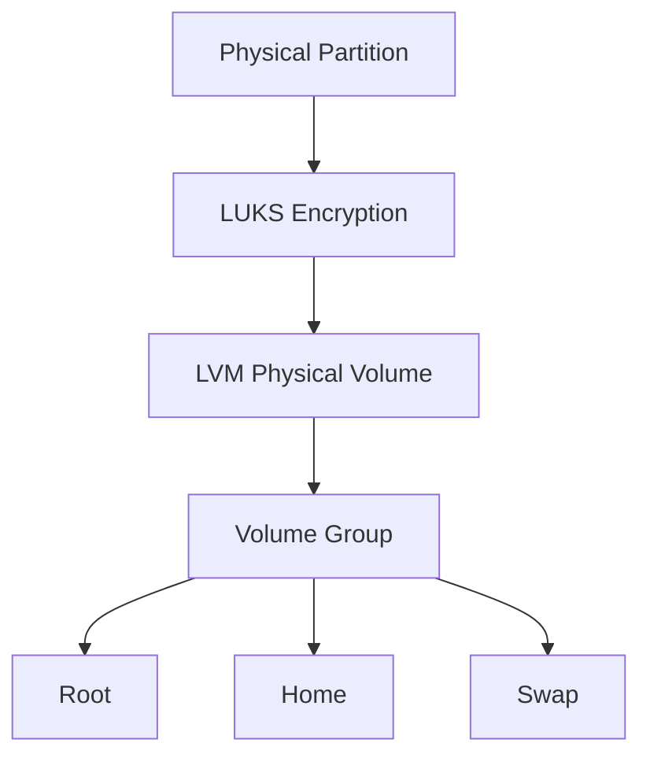

Benefits:

- One passphrase
    
- Multiple logical volumes
    
- Entire system protected
    

---

# Encrypted Swap Partition

This is a commonly overlooked security issue.

---

## Problem

Encryption key lives in RAM.

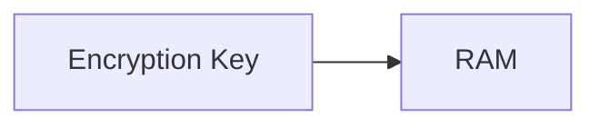

During hibernation:

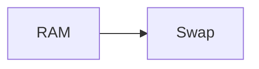

The key may be written to disk.

---

If swap is not encrypted:

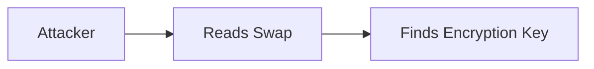

Potentially compromising encrypted data.

---

## Solution

Encrypt swap too.

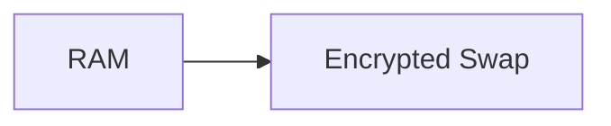

Installer warns if:

```text
Encrypted Disk
+
Unencrypted Swap
```

is detected.

---

# Guided Encrypted Installation

Select:

```text
Guided
→ Use Entire Disk
→ Set Up Encrypted LVM
```

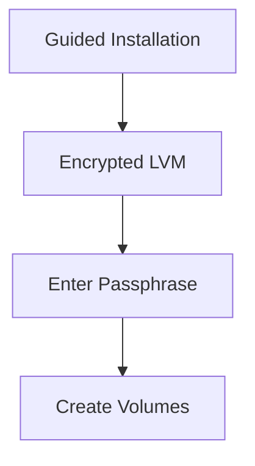

---

# Random Data Initialization

Installer fills encrypted partition with random data.

Why?

Without randomization:

```text
Used Blocks = Obvious
Unused Blocks = Obvious
```

Attacker learns information.

---

With randomization:

```text
Everything Looks Random
```

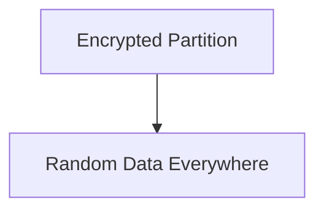

Makes analysis more difficult.

---

# Encryption Passphrase

Installer asks for:

```text
Encryption Passphrase
```

Every boot:

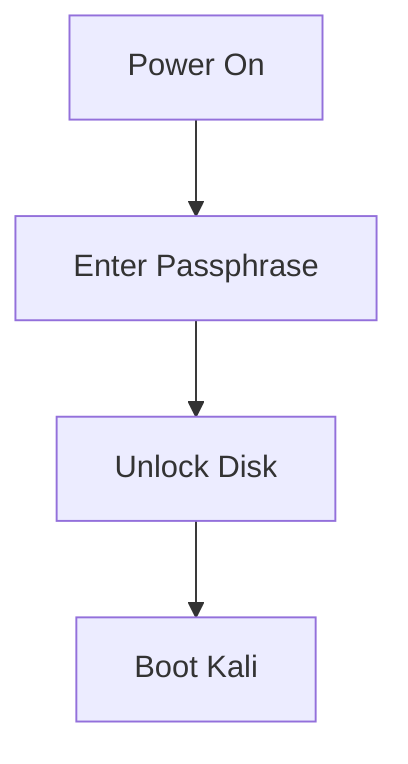

Without passphrase:

```text
No Access
```

---

# What Happens During Boot?

Normal system:


Encrypted system:


---

# Partition Layout After Encryption

Typical result:

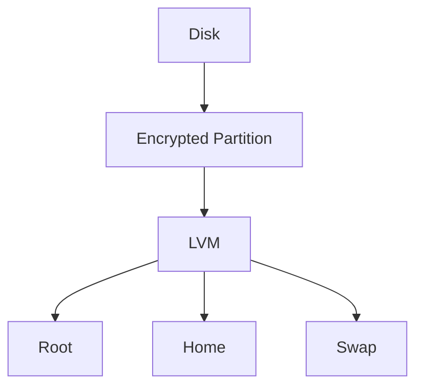

Everything inside the encrypted container is protected.

---

# Advantages

✅ Protects stolen laptops

✅ Protects removable drives

✅ Protects sensitive files

✅ Protects swap

✅ Transparent after login

---

# Disadvantages

❌ Must enter passphrase at boot

❌ Slight performance overhead

❌ Forgotten passphrase = data loss

```text
No Backdoor
No Recovery
No Passphrase = No Data
```

---

# Exam / Interview Notes

|Component|Purpose|
|---|---|
|LUKS|Disk encryption|
|LVM|Flexible storage management|
|PV|Physical Volume|
|VG|Volume Group|
|LV|Logical Volume|
|Swap|Disk-based overflow RAM|
|Encrypted Swap|Protects keys/data written from RAM|
|Passphrase|Unlocks encrypted storage|

---

# Quick Memory Diagram

```mermaid
flowchart TD

A["Disk"]

--> B["LUKS"]

--> C["LVM"]

C --> D["Root"]

C --> E["Home"]

C --> F["Swap"]

```

### Remember

```text
LUKS = Security
LVM  = Flexibility
```

Together they provide:

```text
Secure + Flexible Storage
```