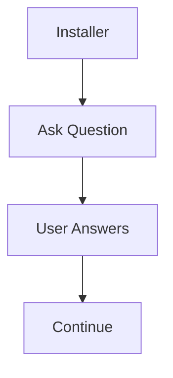
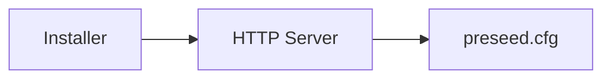
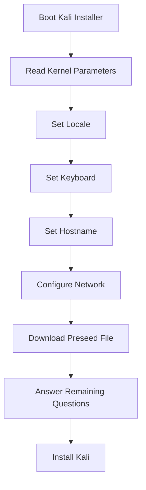
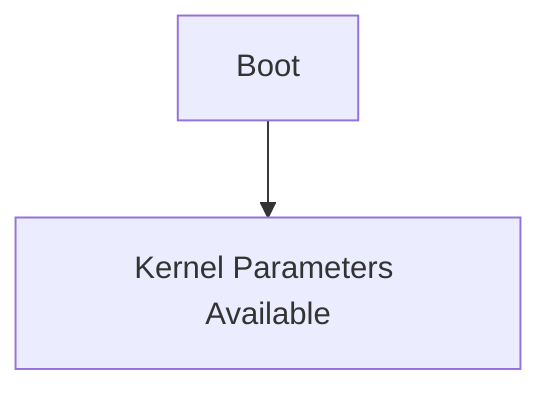
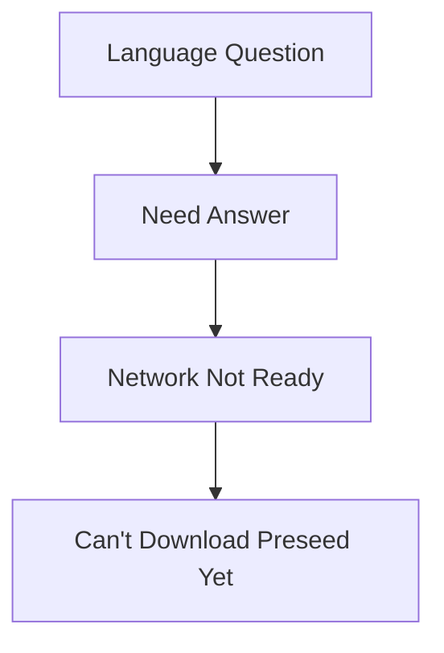
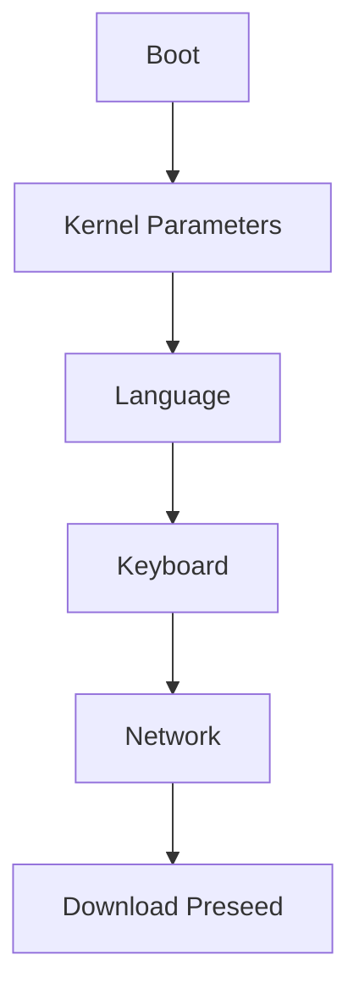
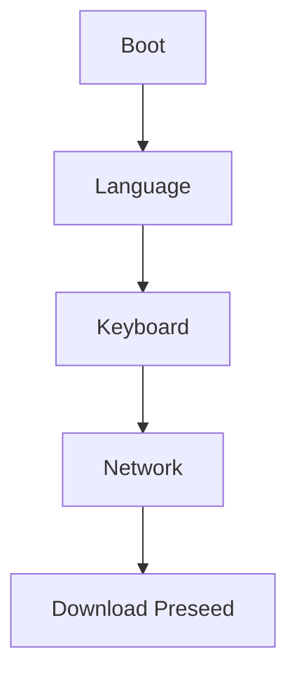
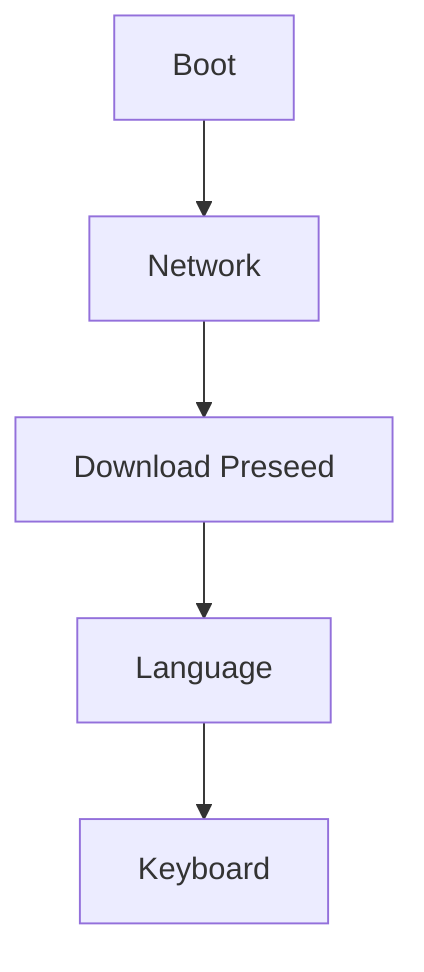
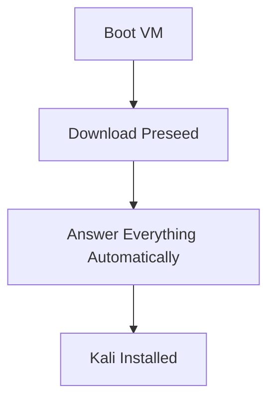

This exercise is actually testing whether you truly understand **how preseeding works**, not whether you can install Kali.

---

# Goal of the Exercise

Create a VM:

|Resource|Requirement|
|---|---|
|RAM|2 GB|
|Disk|20 GB|

Then perform:

```text
Fully Unattended Kali Installation
```

Meaning:

```text
No Clicking
No Typing
No Next-Next-Finish
```

You start installation and walk away.

---

# What Normally Happens?

Installer asks:

```text
Language?
Country?
Keyboard?
Hostname?
Domain?
User?
Password?
Partitioning?
```

Human answers.



---

# What This Exercise Does

Instead of asking you:

```text
Language?
```

Installer reads:

```text
language=en
```

from a predefined source.

---

# Where Are Answers Stored?

Inside:

```text
preseed.cfg
```

Think:

```text
Answer Sheet For Installer
```

Example:

```text
Language = English
User = kali
Partitioning = Automatic
Timezone = UTC
```

---

# Why Is The Preseed File Hosted On HTTP?

Instead of storing answers on:

```text
USB
DVD
ISO
```

they are stored on:

```text
https://server/preseed.cfg
```

Installer downloads it.



---

# Boot Parameters Used

```text
preseed/url=https://static.offsec.com/offsec-courses/KLR/Binaries/preseed.cfg

locale=en_US

keymap=us

hostname=kali

domain=local.lan
```

---

# What Happens During Boot?



---

# Why Not Put Everything In preseed.cfg?

This is the interview question hidden inside the exercise.

The book even asks:

> Why can't the preseed file handle locale, keymap, hostname, and domain?

---

# The Timeline Explains Everything

Think about installation chronologically.

---

## Step 1

Machine boots.



At this point:

Installer can already read:

```text
locale=en_US
hostname=kali
```

because they're on the command line.

---

## Step 2

Installer asks:

```text
Language?
Keyboard?
```

---

## Step 3

Network gets configured.

---

## Step 4

Installer downloads:

```text
preseed.cfg
```

from:

```text
https://server/preseed.cfg
```

---

Notice the problem?



The preseed file arrives:

```text
TOO LATE
```

for those early questions.

---

# That's Why Kernel Parameters Are Used

Kernel parameters are available immediately.



Thus:

```text
locale=en_US
keymap=us
hostname=kali
domain=local.lan
```

must be provided at boot time.

---

# What Does auto=true Do?

Normally:



Problem:

Preseed arrives too late.

---

With:

```text
auto=true
```

Installer delays those questions.



Now preseed can answer them.

---

# What Does priority=critical Do?

Debconf normally asks:

```text
Language
Country
Keyboard
Timezone
Mirror
...
```

Lots of questions.

---

With:

```text
priority=critical
```

Only important questions remain.

Everything else:

```text
Uses Defaults
```

This helps achieve:

```text
Fully Unattended Installation
```

---

# Alternative Boot Parameters

Instead of:

```text
preseed/url=...
locale=en_US
keymap=us
hostname=kali
domain=local.lan
```

You can use:

```text
preseed/url=https://static.offsec.com/offsec-courses/KLR/Binaries/preseed.cfg
auto=true
priority=critical
```

Because:

```text
auto=true
```

delays the early questions until after the preseed file is downloaded.

---

# Real-Life Use Case

Imagine Cisco wants:

```text
500 Kali VMs
```

All should have:

```text
Language = English
Hostname = kali
Timezone = UTC
Partitioning = Automatic
```

Without preseed:

```text
500 manual installations
```

With preseed:



No engineer needed.

---

# One-Line Summary

```text
The exercise is teaching that a network-hosted preseed file is downloaded AFTER networking is configured.

Therefore early questions like locale, keyboard, hostname, and domain must either:

1. Be provided as kernel boot parameters

OR

2. Be delayed using auto=true so the preseed file can answer them later.
```

That's the entire lesson hidden behind the exercise. 🚀