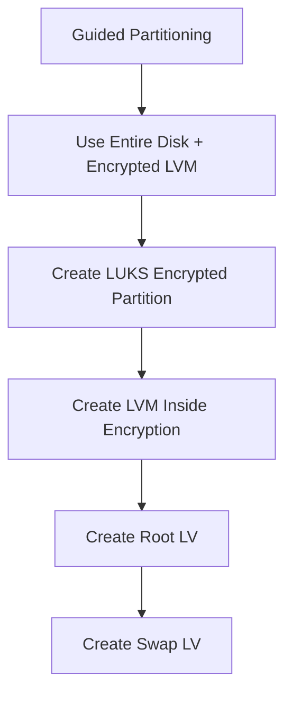
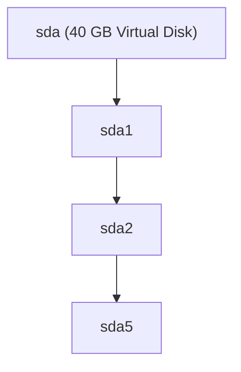
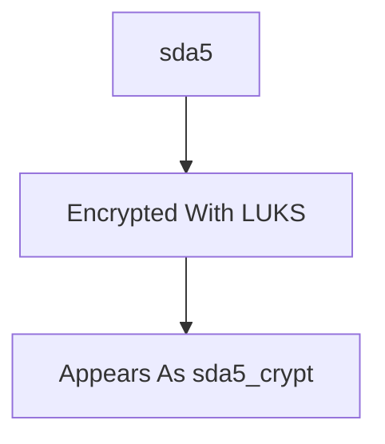
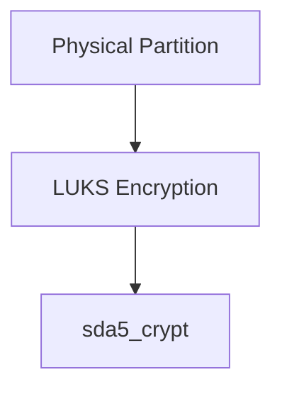
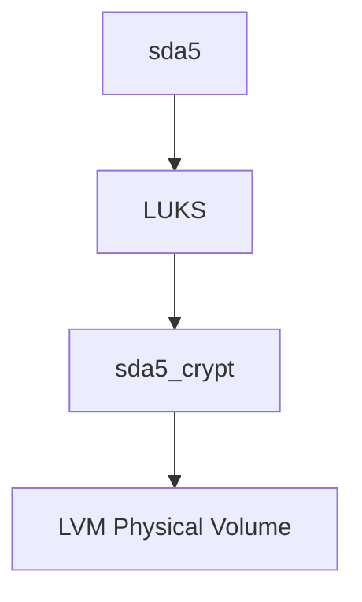
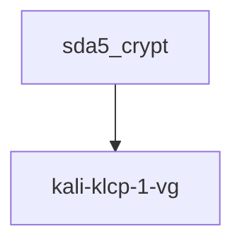
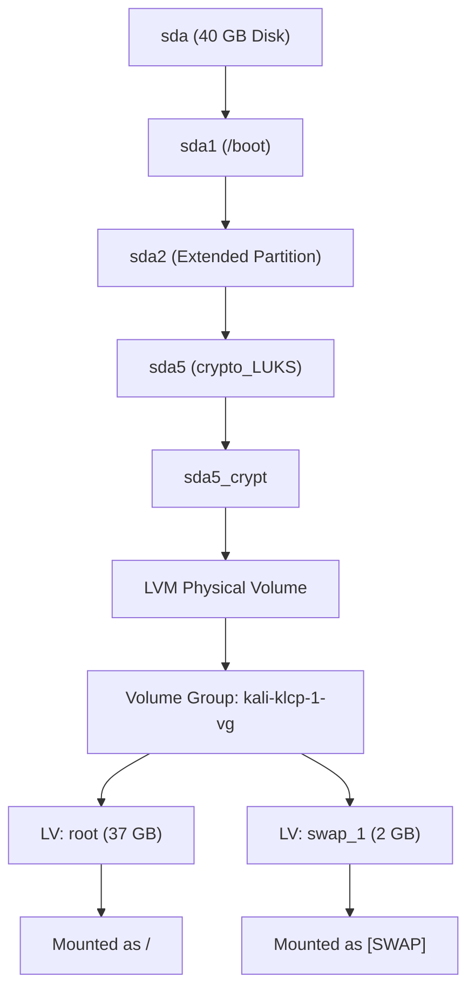

# Kali Installation Analysis (My Actual VM)

**Environment**

```text
Hypervisor : VMware ESXi / vCenter
OS         : Kali Linux
Installation Type:
    Guided Partitioning
    → Use Entire Disk
    → Set Up Encrypted LVM

Disk Size  : ~40 GB
Filesystem : ext4
Encryption : LUKS
Storage    : LVM
```

---

# What I Chose During Installation

During installation I selected:

```text
Guided Partitioning
    ↓
Use Entire Disk
    ↓
Set Up Encrypted LVM
    ↓
Default Partition Layout
```

This corresponds to:



---
![[Screenshot 2026-06-04 at 11.55.05 PM.png]]

![[Screenshot 2026-06-04 at 11.55.11 PM.png]]
# Actual Disk Layout

From:

```bash
lsblk -f
```

I got:

```text
sda
├─sda1     ext4
├─sda2
└─sda5     crypto_LUKS
    └─sda5_crypt
        ├─root
        └─swap
```

---

# Understanding Each Partition

## sda

```text
Entire Virtual Disk
≈ 40 GB
```



---

# sda1

Mounted as:

```text
/boot
```

From:

```bash
mount | grep sda
```

Output:

```text
/dev/sda1 on /boot
```

---

Purpose:

```text
Stores:
Kernel
initrd
GRUB files
```

---

Why Is /boot Separate?

Because:

```text
LUKS Encryption
cannot be unlocked yet
during early boot
```

GRUB must first load:

```text
Kernel
Initramfs
```

before encryption can be unlocked.

Therefore:


---

# sda2

This is likely:

```text
Extended Partition
```

created because installer used:

```text
MBR Partition Table
```

instead of GPT.

Think:

```text
Container Partition
```

holding logical partitions.

---

# sda5

Filesystem:

```text
crypto_LUKS
```

This is the actual encrypted partition.

Output:

```text
sda5 crypto_LUKS
```

---

Everything important lives here.



---

# What Is sda5_crypt?

After entering passphrase:

```text
Encrypted Partition
↓
Unlocked
↓
Mapped Device
```

Linux creates:

```text
/dev/mapper/sda5_crypt
```

---

Think:

```text
Encrypted Safe
↓
Unlocked Safe
```

---

# LUKS Layer



---

# LVM Layer

Inside the unlocked partition:

```bash
sudo pvs
```

Output:

```text
PV
/dev/mapper/sda5_crypt
```

This means:

```text
LVM uses
the decrypted partition
as a Physical Volume
```

---

Actual Flow:



---

# Volume Group (VG)

Output:

```bash
sudo vgs
```

```text
VG
kali-klcp-1-vg
```

---

Meaning:

```text
VG = Storage Pool
```

Think:

```text
Big Bucket Of Storage
```

---



---

# Logical Volumes (LV)

Output:

```bash
sudo lvs
```

```text
root
swap_1
```

---

These are virtual partitions.

---

## Root LV

```text
root
≈ 37 GB
```

Mounted:

```text
/
```

Contains:

```text
Kali OS
Programs
Libraries
Tools
Users
```

---

## Swap LV

```text
swap_1
≈ 2 GB
```

Used as:

```text
Virtual Memory
```

when RAM fills up.

---

# Complete Storage Hierarchy

This is the most important diagram.



---

# Boot Process For This Installation

Since encryption is enabled:

Normal boot process changes.

---

## What Happens At Startup


---

# Why /boot Is Not Encrypted

Question:

```text
Why isn't everything encrypted?
```

Because:

```text
GRUB must load
Kernel + Initramfs
before Linux starts
```

If kernel itself was encrypted:

```text
Chicken and Egg Problem
```

Need kernel to decrypt.

Need decryption to access kernel.

Therefore:

```text
/boot remains unencrypted
```

while everything else stays encrypted.

---

# What The Installer Built For Me

The installer automatically chose:

```text
/boot          ext4

LUKS Encryption
    ↓

LVM
    ↓

root
swap
```

This is the standard Kali encrypted installation.

Equivalent installer choice:

```text
Guided
→ Use Entire Disk
→ Set Up Encrypted LVM
→ Default Layout
```

---

# Mapping To Installation Concepts

|Installation Concept|Actual Device|
|---|---|
|Physical Disk|sda|
|Boot Partition|sda1|
|Encrypted Partition|sda5|
|LUKS Mapping|sda5_crypt|
|Physical Volume|sda5_crypt|
|Volume Group|kali-klcp-1-vg|
|Root Logical Volume|root|
|Swap Logical Volume|swap_1|
|Root Mount Point|/|
|Swap Mount Point|[SWAP]|

---

# One-Line Summary

```text
My Kali installation uses:

sda
 → /boot
 → LUKS Encryption
 → LVM
 → root filesystem
 → swap

This means the operating system and swap are encrypted,
while GRUB and the kernel remain accessible in /boot so the machine can start and later unlock the encrypted storage.
```

This is essentially the **reference architecture of a Guided "Entire Disk + Encrypted LVM" Kali installation**, and your screenshots confirm that the installer built it exactly as expected.