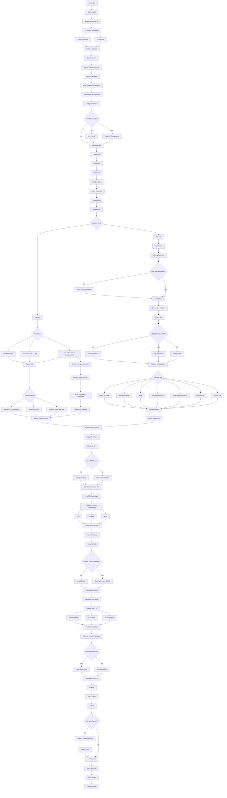

```mermaid
flowchart TD

A["Power On"]
--> B["BIOS / UEFI"]

B --> C["Boot From USB/DVD"]

C --> D["ISOLINUX Boot Menu"]

D --> E["Graphical Install"]
D --> F["Text Install"]

E --> G["Select Language"]
F --> G

G --> H["Select Country"]

H --> I["Select Keyboard Layout"]

I --> J["Detect Hardware"]

J --> K["Load Installer Components"]

K --> L["Detect Network Hardware"]

L --> M["Configure Network"]

M --> N{"DHCP Successful?"}

N -->|Yes| O["Network Ready"]

N -->|No| P["Retry DHCP"]

N -->|No| Q["Static IP Configuration"]

P --> O
Q --> O

O --> R["Create User"]

R --> S["Username"]

S --> T["Password"]

T --> U["Configure Clock"]

U --> V["Select Timezone"]

V --> W["Detect Disks"]

W --> X["Partitioning"]

%% PARTITIONING

X --> Y{"Partition Mode"}

Y --> Z["Guided"]

Y --> AA["Manual"]

%% GUIDED

Z --> AB{"Guided Type"}

AB --> AC["Use Entire Disk"]

AB --> AD["Use Entire Disk + LVM"]

AB --> AE["Use Entire Disk + Encrypted LVM"]

AC --> AF["Select Disk"]
AD --> AF
AE --> AF

AF --> AG{"Partition Layout"}

AG --> AH["All Files In One Partition"]

AG --> AI["Separate Home"]

AG --> AJ["Separate Home Var Tmp"]

AH --> AK["Review Partition Table"]
AI --> AK
AJ --> AK

AK --> AL["Write Changes To Disk"]

%% ENCRYPTED PATH

AE --> EM["Create Encrypted Partition"]

EM --> EN["Initialize Random Data"]

EN --> EO["Enter Encryption Passphrase"]

EO --> EP["Create LVM Volumes"]

EP --> AK

%% MANUAL

AA --> BA["View Disks"]

BA --> BB["Existing Partitions"]

BB --> BC{"Free Space Available?"}

BC -->|No| BD["Shrink Existing Partition"]

BD --> BE["Free Space"]

BC -->|Yes| BE

BE --> BF["Create New Partition"]

BF --> BG["Choose Size"]

BG --> BH{"MSDOS Partition Table?"}

BH -->|Yes| BI["Primary Partition"]

BH -->|Yes| BJ["Logical Partition"]

BH -->|No| BK["GPT Partition"]

BI --> BL["Partition Configuration"]
BJ --> BL
BK --> BL

BL --> BM{"Partition Use"}

BM --> BN["Mount As Root /"]

BM --> BO["Mount As Home"]

BM --> BP["Swap"]

BM --> BQ["Encryption Volume"]

BM --> BR["LVM Physical Volume"]

BM --> BS["RAID Device"]

BM --> BT["Do Not Use"]

BN --> BU["Review Layout"]
BO --> BU
BP --> BU
BQ --> BU
BR --> BU
BS --> BU
BT --> BU

BU --> BV["Finish Partitioning"]

BV --> AL

%% POST PARTITIONING

AL --> CA["Copy Live Image"]

CA --> CB["Configure APT"]

CB --> CC{"Use HTTP Proxy?"}

CC -->|Yes| CD["Configure Proxy"]

CC -->|No| CE["Direct Internet Access"]

CD --> CF["Download Package Lists"]

CE --> CF

CF --> CG["Install Metapackages"]

CG --> CH["Choose Desktop Environment"]

CH --> CI["Xfce"]

CH --> CJ["GNOME"]

CH --> CK["KDE"]

CI --> CL["Choose Tool Selection"]
CJ --> CL
CK --> CL

CL --> CM["Install Packages"]

%% GRUB

CM --> DA["Install GRUB"]

DA --> DB{"Existing Linux Bootloader?"}

DB -->|No| DC["Install GRUB"]

DB -->|Yes| DD["Optional Existing GRUB"]

DC --> DE["Select Boot Device"]

DD --> DE

DE --> DF["Generate Boot Menu"]

DF --> DG["Detect Other OS"]

DG --> DH["Windows Entry"]

DG --> DI["Linux Entry"]

DG --> DJ["Recovery Entry"]

%% FINISH

DH --> EA["Finalize Installation"]
DI --> EA
DJ --> EA

EA --> EB["Cleanup Installer Packages"]

EB --> EC{"Running Inside VM?"}

EC -->|Yes| ED["Install Guest Tools"]

EC -->|No| EE["Skip Guest Tools"]

ED --> EF["Remove USB/DVD"]
EE --> EF

EF --> EG["Reboot"]

%% FIRST BOOT

EG --> EH["BIOS / UEFI"]

EH --> EI["GRUB"]

EI --> EJ{"Encrypted System?"}

EJ -->|Yes| EK["Enter LUKS Passphrase"]

EK --> EL["Unlock Disk"]

EL --> EM2["Load Kernel"]

EJ -->|No| EM2["Load Kernel"]

EM2 --> EN2["Start Kali Linux"]

EN2 --> EO2["Login Screen"]

EO2 --> EP2["Desktop Ready"]

```
