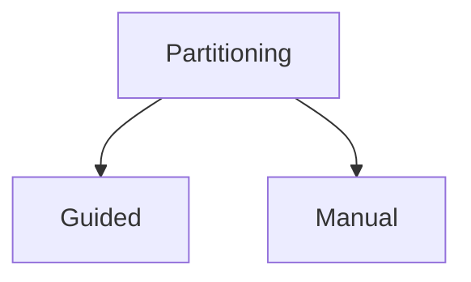
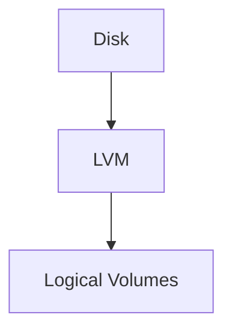
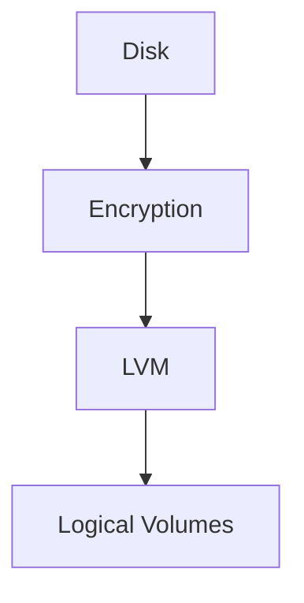
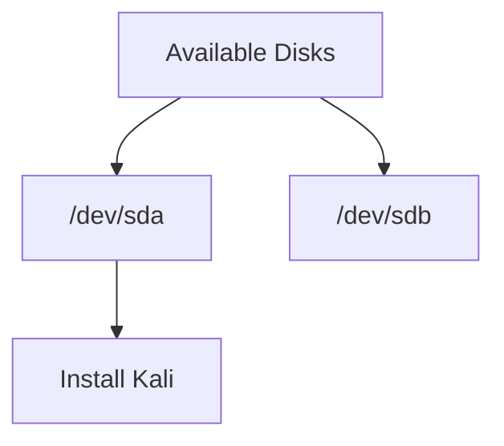
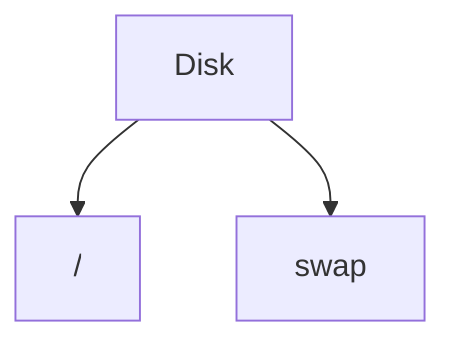
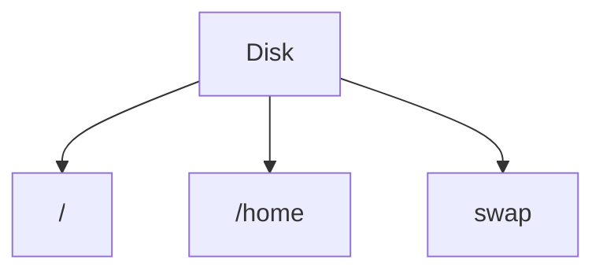
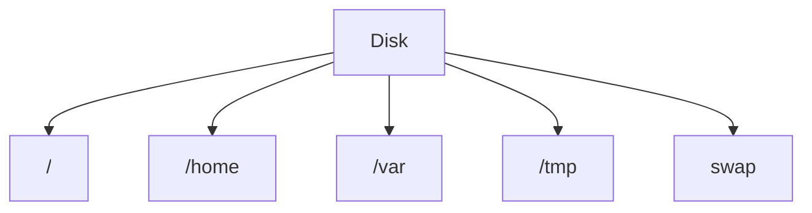

---

# 5.2.1 Partitioning

Partitioning divides a disk into separate sections (partitions) and defines the filesystem to use on each partition.

Partitioning affects:

- Performance
    
- Data security
    
- System administration
    
- Dual boot setups
    

> Partitioning forms the foundation of the Linux system. Once the OS is installed, changing it later is much harder.

---

# Partitioning Modes

The Kali installer provides two modes:



## Guided

- Recommended for most users
    
- Installer creates partitions automatically
    
- Faster and safer
    
- Good for VMs and lab environments
    

## Manual

- Full control
    
- Required for advanced setups
    
- Useful for:
    
    - Dual boot
        
    - Custom partition layouts
        
    - RAID
        
    - Special storage requirements
        

---

# Guided Partitioning Options

## 1. Guided - Use Entire Disk


- Most common option
    
- Entire disk allocated to Kali
    
- Existing data is erased
    

Best for:

- Virtual machines
    
- Dedicated Kali systems
    
- Lab environments
    

⚠️ Deletes everything on the selected disk.

---

## 2. Guided - Use Entire Disk and Set Up LVM



Uses:

- Logical Volume Manager (LVM)
    

Benefits:

- Easier resizing later
    
- More flexible storage management
    

---

## 3. Guided - Use Entire Disk and Set Up Encrypted LVM



Adds:

- Full disk encryption
    
- LVM flexibility
    

Best for:

- Laptops
    
- Sensitive data
    
- Security-focused deployments
    

---

## 4. Manual

Used when:

- Installing alongside Windows
    
- Custom partition sizes
    
- Dual boot environments
    
- Advanced configurations
    

---

# Selecting the Target Disk

Example:

```text
/dev/sda - 21.5 GB VMware Disk
```

Choose the disk where Kali will be installed.



⚠️ The selected disk will be modified.

⚠️ Guided mode may erase all existing data.

---

# Guided Partition Layouts

After selecting a disk, Kali asks how to organize partitions.

---

## Option 1: All Files In One Partition



Creates:

- Root partition (`/`)
    
- Swap partition
    

Everything lives under `/`.

Best for:

- Personal systems
    
- VMs
    
- Beginners
    
- Kali labs
    

Recommended choice for most users.

---

## Option 2: Separate /home Partition



Creates:

- `/`
    
- `/home`
    
- `swap`
    

Benefits:

- User data separated from OS
    
- Easier OS reinstallation
    
- Personal files survive reinstall
    

Good for:

- Daily-use Linux systems
    

---

## Option 3: Separate /home, /var, and /tmp



Creates separate partitions for:

|Partition|Purpose|
|---|---|
|`/`|Operating System|
|`/home`|User Files|
|`/var`|Logs, databases, service data|
|`/tmp`|Temporary files|
|`swap`|Virtual memory|

Benefits:

- Better isolation
    
- Better server management
    
- Prevent logs from filling root filesystem
    

Best for:

- Servers
    
- Multi-user systems
    

---

# Partition Summary Screen

Installer shows a partition map before making changes.

Example:

```text
/
swap
/home
```

You can:

- Review layout
    
- Change filesystem type
    
- Modify partitions
    

Default filesystem:

```text
ext4
```

Usually leave it unchanged.

Select:

```text
Finish partitioning and write changes to disk
```

to continue.

⚠️ Changes will be written to disk.

⚠️ Existing data may be erased.

---

# Exam / Lab Recommendation

For:

- VMware
    
- VirtualBox
    
- CML Labs
    
- Learning Kali
    

Choose:

```text
Guided
→ Use Entire Disk
→ All Files In One Partition
```

Simple.

Fast.

No maintenance headaches. 🚀