# Installing the GRUB Boot Loader

After Kali is copied to disk and packages are installed, the final critical step is installing a **bootloader**.

Without a bootloader:

```text
Kali exists on disk
But the computer doesn't know how to start it
```

---

# What is a Bootloader?

A bootloader is a small program that loads the operating system.

Boot sequence:

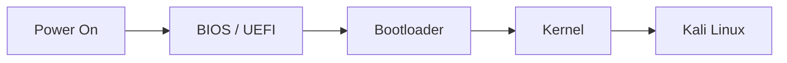

Responsibilities:

- Find installed operating systems
    
- Display boot menu
    
- Load kernel into memory
    
- Pass control to kernel
    

---

# What is GRUB?

GRUB =

```text
GRand Unified Bootloader
```

Default bootloader used by:

```text
Kali
Ubuntu
Debian
Many Linux Distributions
```

---

# Why GRUB?

GRUB understands many filesystems:

```text
ext4
xfs
btrfs
fat32
ntfs
```

Because GRUB can read filesystems directly:

```text
Find Kernel
↓
Load Kernel
↓
Boot Linux
```

without needing manual updates every time a new kernel is installed.

---

# GRUB Boot Process

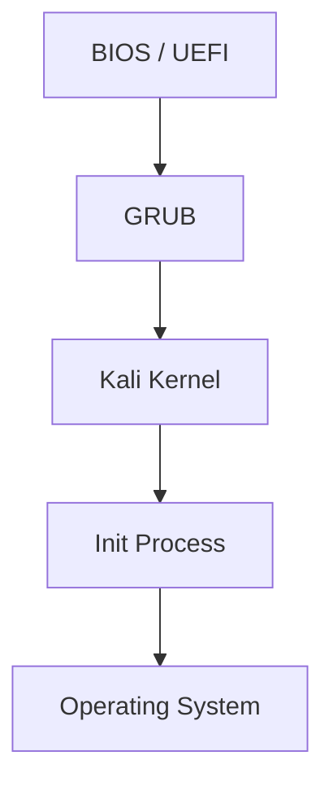

---

# Why Install GRUB?

Because after installation:

```text
Disk Contains Kali
```

but:

```text
BIOS/UEFI
does not know

which file
is the kernel
```

GRUB solves that problem.

---

# Where Is GRUB Installed?

Depends on boot mode.

## BIOS + MBR


GRUB boot code is stored in:

```text
Master Boot Record (MBR)
```

---

## UEFI + GPT

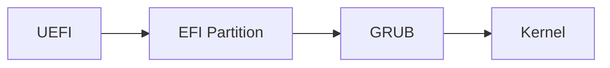

GRUB is stored in:

```text
EFI System Partition
```

Usually:

```text
/boot/efi
```

---

# Why Does Installer Ask Where To Install GRUB?

Example:

```text
/dev/sda
```

may be your boot disk.

Installer asks:

```text
Which disk should contain GRUB?
```

Usually:

```text
Choose current boot disk
```

Example:

```text
/dev/sda
```

---

# GRUB Menu

GRUB normally displays:

```text
Kali Linux
Advanced Options
Recovery Mode
Windows
Ubuntu
```

Example:

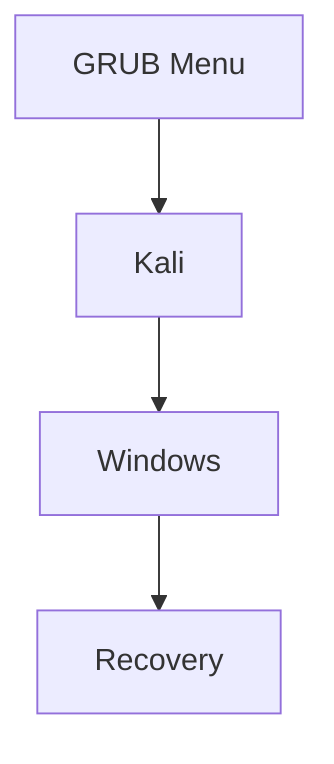

---

# Why Keep Older Kernels?

Suppose:

```text
Kernel 6.1
```

works.

You update:

```text
Kernel 6.2
```

but it breaks your hardware.

GRUB may show:

```text
Kali 6.2
Kali 6.1
```

You can boot the older kernel.

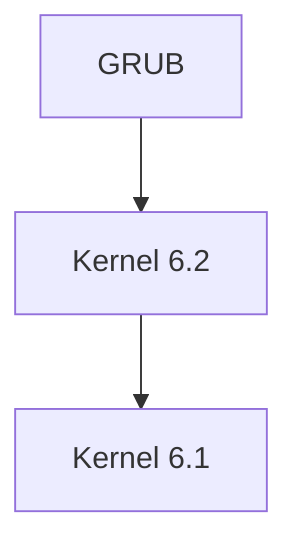

This is why Linux often keeps old kernels installed.

---

# GRUB and Dual Boot

Suppose:

```text
Windows
+
Kali
```

exist on same machine.

GRUB detects both.

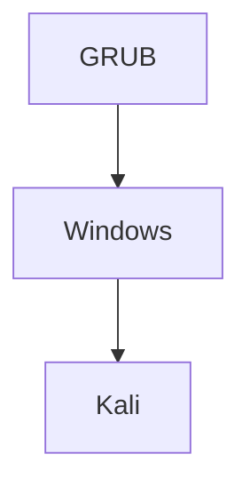

At startup:

You choose what to boot.

---

# Why Installing Windows Later Breaks Linux

Most Linux installers:

```text
Detect Windows
Add Windows Entry
```

Windows installers usually do:

```text
Replace Existing Bootloader
```

Result:

Before:


After reinstalling Windows:

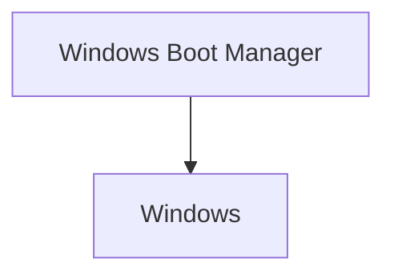

Kali still exists.

But GRUB is gone.

So:

```text
Kali becomes unreachable
```

until GRUB is reinstalled.

---

# Does Kali Get Deleted?

No.

Only the bootloader is overwritten.

Think:

```text
House Still Exists

Front Door Removed
```

Kali files remain intact.

---

# Why GRUB Is Optional During Installation

This confuses many people.

---

## Scenario 1: Fresh Disk

```text
Empty Disk
```

Need GRUB?

```text
YES
```

Otherwise:

```text
Nothing boots Kali
```

---

## Scenario 2: Existing Linux System

Current state:

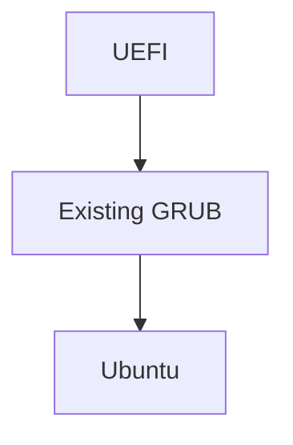

Install Kali.

Do we need another GRUB?

Not necessarily.

Existing GRUB can be updated:

```bash
sudo update-grub
```

Result:

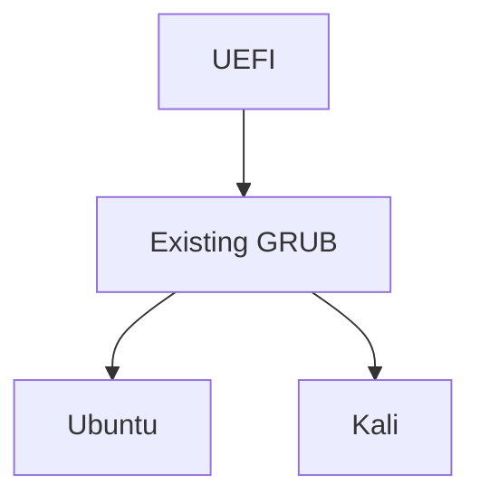

One GRUB manages both systems.

---

# Alternatives to GRUB

GRUB is not the only bootloader.

---

## 1. systemd-boot

Popular on modern UEFI systems.

Advantages:

```text
Simple
Fast
Minimal
```

Flow:

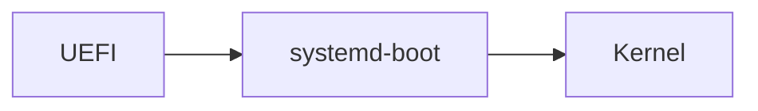

Common in:

```text
Arch Linux
```

---

## 2. rEFInd

Very popular for:

```text
Dual Boot
Multi Boot
Mac Systems
```

Automatically detects operating systems.

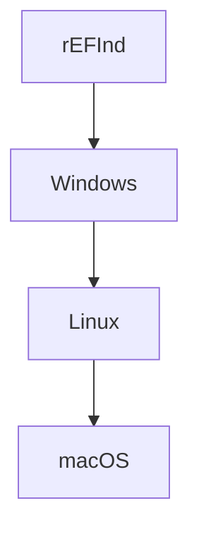

---

## 3. LILO

Historical Linux bootloader.

```text
Linux Loader
```

Older than GRUB.

Rarely used today.

Limitation:

```text
Required manual updates
```

after kernel changes.

---

## 4. Windows Boot Manager

Used by Windows.

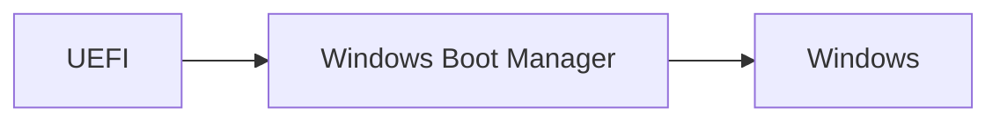

Not designed for managing Linux distributions.

---

# Why GRUB Became The Standard

Because it can:

✅ Boot Linux

✅ Boot Windows

✅ Boot Multiple Kernels

✅ Understand Filesystems

✅ Work with BIOS

✅ Work with UEFI

✅ Support Recovery Mode

That's why almost every Debian-based distribution ships with GRUB by default.

---

# Finishing Installation

After GRUB is installed:


Installer may also:

- Remove temporary installation packages
    
- Detect VMware/VirtualBox
    
- Install guest integration tools automatically
    

---

# Exam Notes

|Term|Meaning|
|---|---|
|Bootloader|Loads OS kernel|
|GRUB|Default Linux bootloader|
|MBR|Legacy location for GRUB on BIOS systems|
|EFI Partition|Location for GRUB on UEFI systems|
|Kernel|Loaded by GRUB|
|Dual Boot|Multiple OS choices in GRUB|
|update-grub|Refresh GRUB entries|
|systemd-boot|Lightweight UEFI bootloader|
|rEFInd|Auto-detecting graphical boot manager|
|Windows Boot Manager|Windows bootloader|

### One-Line Summary

```text
BIOS/UEFI starts GRUB
GRUB starts Kernel
Kernel starts Linux
```
