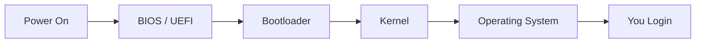
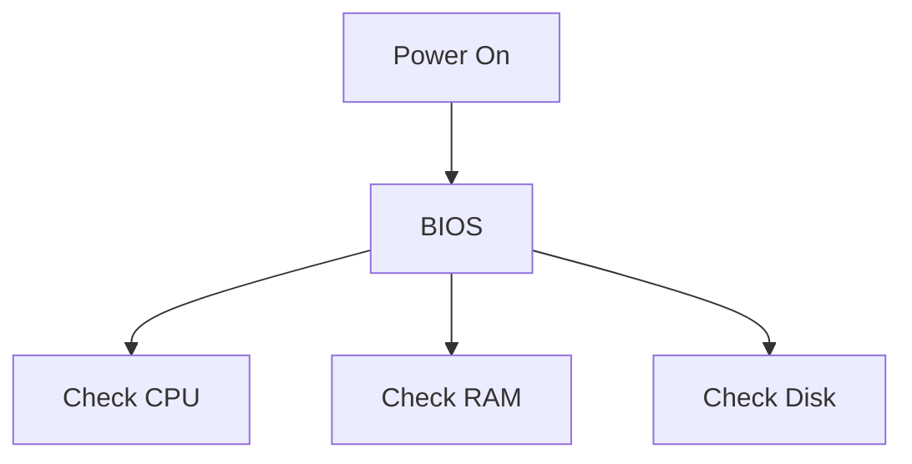
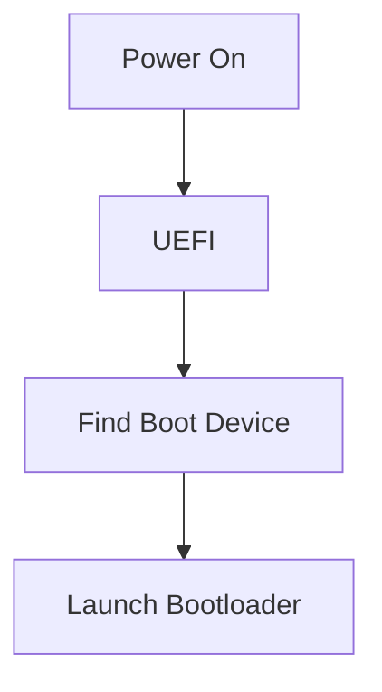
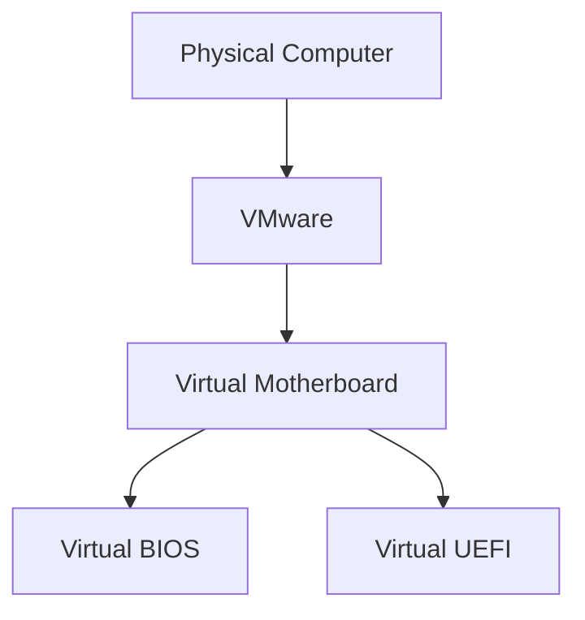
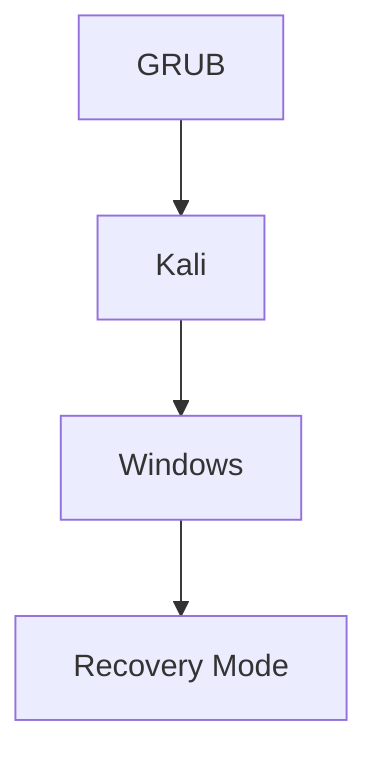
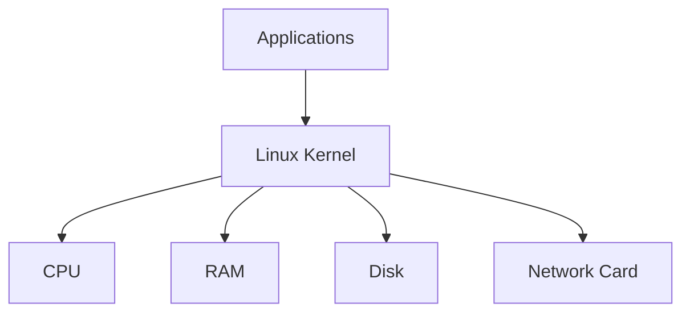
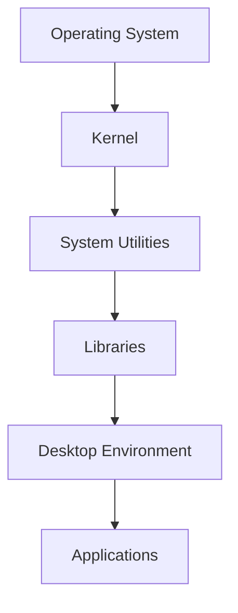
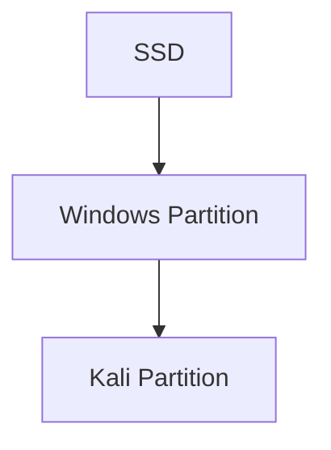
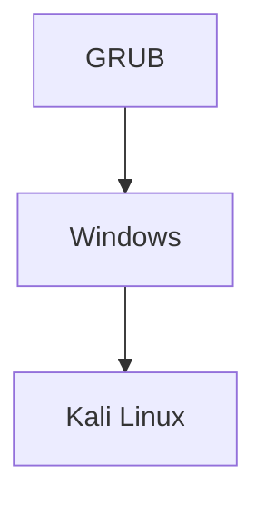
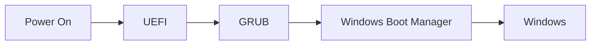

# The Big Picture

When you press the power button:



Every single computer follows roughly this flow.

---

# 1. BIOS

**BIOS = Basic Input Output System**

Old firmware stored on the motherboard.

Think:

```text
BIOS = Tiny operating system
that wakes the computer up.
```

When you press power:

BIOS does:

```text
Check RAM
Check CPU
Check Keyboard
Check Storage
```

This is called:

```text
POST
(Power On Self Test)
```

Example:



After checks complete:

BIOS asks:

> "Which disk should I boot from?"

---

# Problem with BIOS

BIOS was created in the 1980s.

Limitations:

- Slow
    
- Old partitioning schemes
    
- Max 2 TB boot disk
    
- No secure boot
    
- Primitive interface
    

So UEFI was invented.

---

# 2. UEFI

**UEFI = Unified Extensible Firmware Interface**

Modern replacement for BIOS.

Think:

```text
BIOS 2.0 on steroids
```

It does the same job:



But better.

Benefits:

|BIOS|UEFI|
|---|---|
|Old|Modern|
|MBR|GPT|
|Slow|Faster|
|No Secure Boot|Secure Boot|
|Text Only|GUI Possible|

Today:

```text
Windows 11
Modern Linux
Modern Servers
```

all prefer UEFI.

---

# Why VMware Asks BIOS or UEFI?

Because VMware is pretending to be a motherboard.

Your VM needs firmware too.



When creating VM:

VMware asks:

```text
Should I emulate
BIOS
or
UEFI?
```

---

# Which One Should You Use?

For modern Kali:

```text
UEFI ✅
```

For old systems:

```text
BIOS
```

Sometimes labs specifically require BIOS because the course was written years ago.

---

# 3. Bootloader

After BIOS/UEFI finds a bootable disk:

It doesn't load Linux directly.

Instead it loads:

```text
Bootloader
```

Example:

```text
GRUB
```

Kali's default bootloader.

---

Think of GRUB as:

```text
Operating System Selector
```

Example:



This menu appears before Linux starts.

---

# Why Do We Need A Bootloader?

Kernel files live deep inside the filesystem.

BIOS/UEFI doesn't know:

```text
Where Linux lives
Which kernel version
Which parameters
```

GRUB knows.

---

# 4. Kernel

This is the MOST important component.

Linux Kernel:

```text
The actual Linux operating system core.
```

---

Kernel talks directly to hardware.



Without kernel:

```text
No Linux
```

---

Kernel responsibilities:

- Memory Management
    
- Process Management
    
- Hardware Drivers
    
- Networking
    
- Filesystems
    

Everything goes through the kernel.

---

# Analogy

Think of a company.

```text
Applications = Employees

Kernel = CEO

Hardware = Factory
```

Employees never directly control the factory.

The CEO does.

---

# 5. Operating System

Many people say:

```text
Linux
```

when they actually mean:

```text
Kali Linux
Ubuntu
Debian
Red Hat
```

These are not just kernels.

They contain:



Example:

Kali Linux =

```text
Linux Kernel
+
APT
+
Bash
+
Xfce
+
Pentesting Tools
```

---

# What Is Dual Boot?

Imagine:

```text
Windows
+
Kali Linux
```

installed on same disk.

---

Disk layout:



At startup:

GRUB appears.



You choose one.

Only one runs.

---

# Complete Dual Boot Flow

Suppose you choose Kali.


Suppose you choose Windows.



---

# Where Does GRUB Live?

Remember the installer asking:

```text
Install GRUB?
```

GRUB is usually installed in:

### BIOS Systems

```text
MBR
(Master Boot Record)
```

### UEFI Systems

```text
EFI System Partition
```

Usually:

```text
/boot/efi
```

---

# Entire Boot Process In One Diagram


---

# Interview Answer (30 Seconds)

### BIOS

Old firmware that initializes hardware and starts booting.

### UEFI

Modern replacement for BIOS with GPT support, Secure Boot, and better features.

### Bootloader

Program (GRUB) that loads an operating system.

### Kernel

Core of Linux that manages hardware, memory, processes, networking, and filesystems.

### Operating System

Kernel + utilities + applications + desktop environment.

### Dual Boot

Multiple operating systems installed on the same machine, selected at boot time.

### VMware BIOS vs UEFI

VMware emulates a motherboard. You choose whether the virtual machine behaves like an older BIOS-based system or a modern UEFI-based system. For modern Kali installations, use **UEFI** unless a lab specifically requires BIOS.