# First: Where Does The Computer Find The OS?

Imagine a new disk.

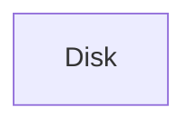

The computer knows:

```text
I found a disk
```

But it doesn't know:

```text
Where Windows is
Where Kali is
Where GRUB is
```

It needs a map.

That's where **MBR** and **GPT** come in.

---

# MBR (Master Boot Record)

Old partitioning scheme.

Created in the 1980s.

The first sector of the disk contains:

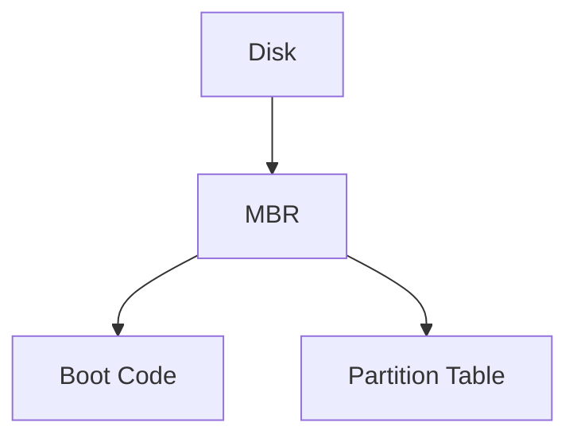

MBR stores:

1. Tiny boot code
    
2. Partition table
    

Think:

```text
MBR = Disk table of contents
```

---

## MBR Limitations

### Only 4 Primary Partitions

```text
Partition 1
Partition 2
Partition 3
Partition 4
```

Want a 5th?

Pain begins.

---

### Maximum 2 TB Disk

If disk size:

```text
8 TB
```

MBR can't properly use it.

---

### Single Point of Failure

Everything is stored in one place.

```text
MBR Corrupted
=
System May Not Boot
```

---

# GPT (GUID Partition Table)

Modern replacement for MBR.

Used with UEFI.

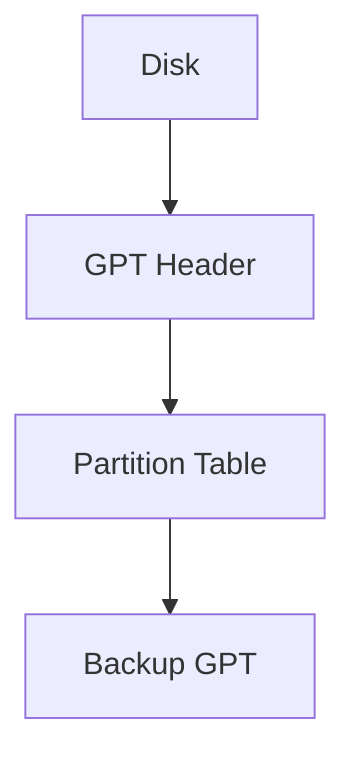

Notice:

```text
Backup GPT
```

GPT keeps a backup copy.

Much safer.

---

## GPT Advantages

### More Partitions

Practically:

```text
128 partitions
```

without tricks.

---

### Huge Disk Support

Supports:

```text
2 TB ❌ MBR

9.4 Zettabytes ✅ GPT
```

You'll never hit this limit.

---

### Redundancy

GPT stores:

```text
Primary Copy
Backup Copy
```

Much more reliable.

---

# MBR vs GPT

|Feature|MBR|GPT|
|---|---|---|
|Age|Old|Modern|
|Max Disk Size|2 TB|Extremely Large|
|Partitions|4 Primary|~128|
|Backup Table|No|Yes|
|Used With|BIOS|UEFI|

---

# So Where Does GRUB Fit?

Let's revisit booting.


GRUB is the bridge between:

```text
Firmware
and
Operating System
```

---

# What Exactly Is GRUB?

GRUB =

```text
GRand Unified Bootloader
```

Its job:

```text
Find Linux
Load Linux Kernel
Pass Control To Kernel
```

---

Without GRUB:

BIOS/UEFI can find the disk.

But not necessarily:

```text
Which OS?
Which kernel?
Which version?
```

GRUB knows.

---

# Why Does Installer Ask To Install GRUB?

Because there may already be another bootloader.

Example:

You already have:

```text
Windows
```

installed.

Windows already has:

```text
Windows Boot Manager
```

---

Disk:

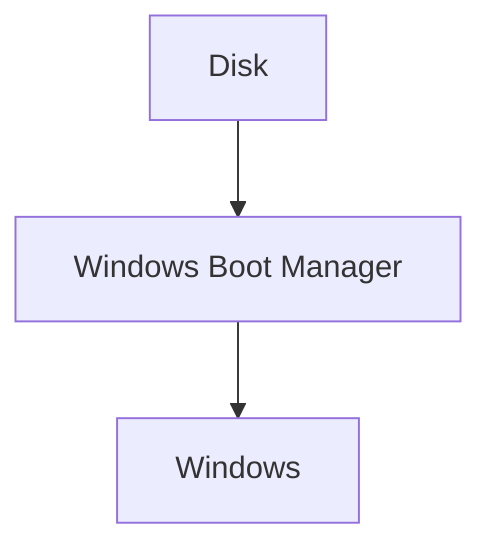

When Kali asks:

```text
Install GRUB?
```

It is really asking:

> "Should I become the main bootloader?"

---

# Scenario 1: Fresh Kali Installation

Empty disk.

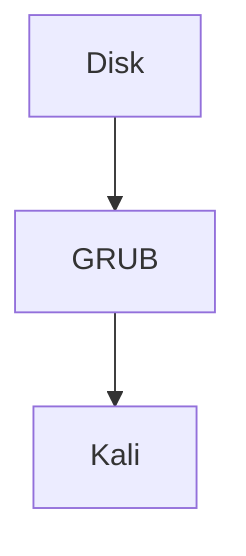

Answer:

```text
YES
```

Otherwise:

```text
Nothing boots Kali
```

---

# Scenario 2: Kali + Windows

Before installation:


After GRUB installation:

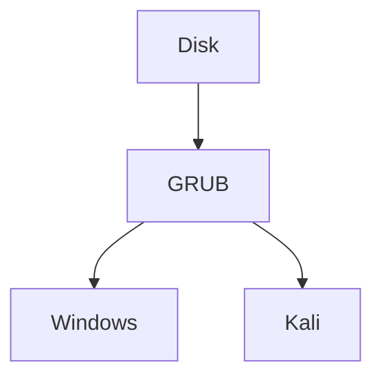

GRUB becomes the traffic controller.

---

# Why Isn't GRUB Needed If Linux Already Exists?

This is the subtle point.

Suppose you already have Ubuntu.

Current situation:

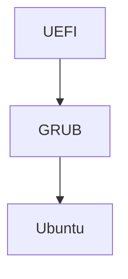

Ubuntu already installed GRUB.

---

Now install Kali.

Do we absolutely need another GRUB?

No.

Existing GRUB can simply be updated.

Result:

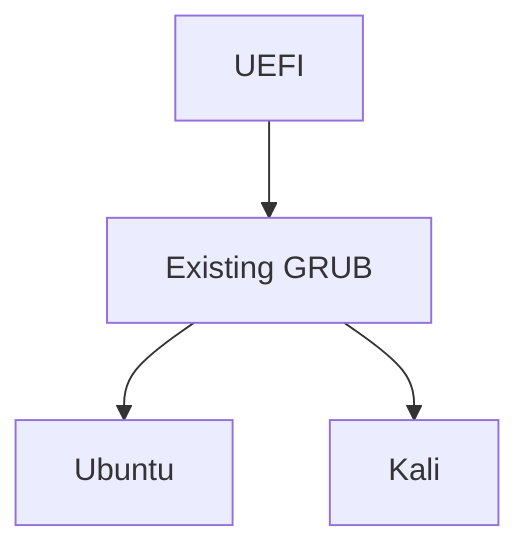

One GRUB controls both systems.

---

That's why installers ask.

They don't want to blindly overwrite an already working bootloader.

---

# Real Example

Suppose:

```text
Disk:
/dev/sda
```

Contains:

```text
Ubuntu
```

Boot process:

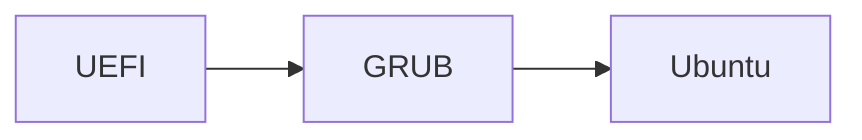

Now install Kali.

Options:

### Install GRUB

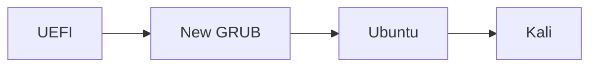

---

### Don't Install GRUB

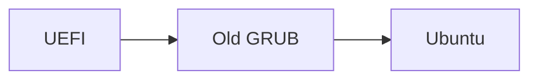

Then you must manually update the old GRUB:

```bash
sudo update-grub
```

to detect Kali.

---

# Where Is GRUB Stored?

Depends on BIOS vs UEFI.

---

## BIOS + MBR

GRUB lives in:

```text
MBR
```

Boot flow:

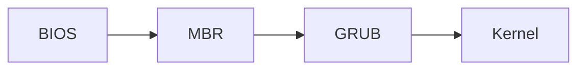

---

## UEFI + GPT

GRUB lives in:

```text
EFI System Partition
```

Usually:

```text
/boot/efi
```

Boot flow:

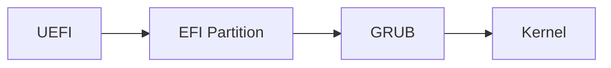

---

# The Complete Relationship

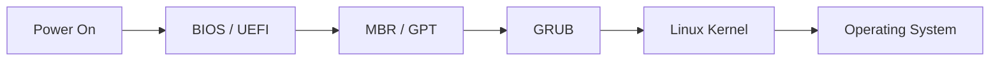

### One-line Summary

- **MBR/GPT** = How the disk is organized.
    
- **BIOS/UEFI** = Firmware that starts the boot process.
    
- **GRUB** = Bootloader that chooses and loads an OS.
    
- **Kernel** = Core of Linux.
    
- **OS** = Kernel + tools + applications.
    
- **Dual Boot** = Multiple OSes sharing the same machine, usually managed by GRUB.