# Misc Concepts (Partitioning Prerequisites)

---

# What is LVM?

**LVM = Logical Volume Manager**

Normally:

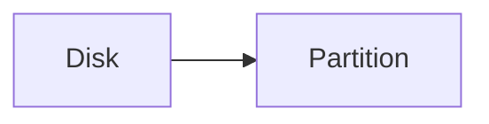

Example:

```text
100 GB Disk
├── Partition 1 = 50 GB
└── Partition 2 = 50 GB
```

Changing sizes later can be painful.

With LVM:

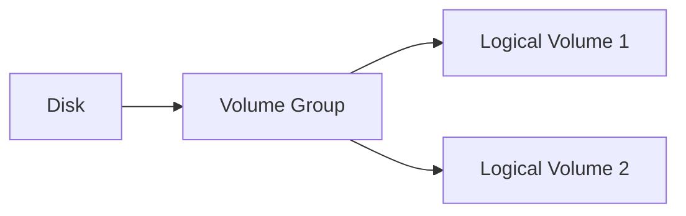

Think of LVM as:

> A storage management layer between the disk and filesystem.

Benefits:

- Resize partitions more easily
    
- Add new disks later
    
- Better storage management
    

Analogy:

```text
Normal Partition = Fixed room

LVM = Movable walls
```

---

# What is Swap?

Swap is **disk space used as extra RAM**.

Example:

```text
RAM = 8 GB
Swap = 4 GB
```

If RAM becomes full:

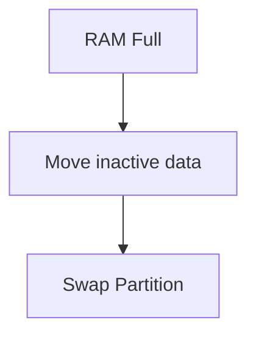

Important:

```text
Swap ≠ RAM
```

Disk is much slower than RAM.

Swap is only an emergency overflow area.

---

# What Does "Everything on /" Mean?

Linux has one giant directory tree.

Root directory:

```text
/
```

Everything starts here.

```text
/
├── home
├── var
├── tmp
├── etc
├── usr
```

When installer says:

```text
All files in one partition
```

It means:

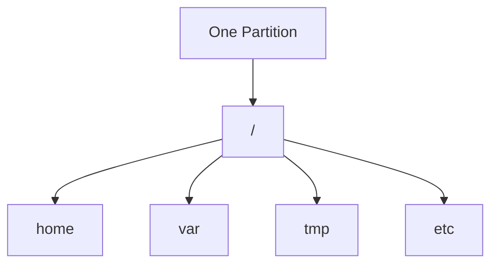

Everything is stored in the same partition.

---

# What Are User Files?

Files belonging to users.

Usually stored in:

```text
/home
```

Example:

```text
/home/aditya

├── Downloads
├── Documents
├── Pictures
└── Videos
```

Think:

- Personal documents
    
- Downloads
    
- Projects
    
- Pictures
    

---

# What Are Server Files?

Files used by services and applications.

Usually stored under:

```text
/var
```

Examples:

```text
Logs
Databases
Web server files
Mail queues
Application data
```

Example:

```text
/var/log
```

contains system logs.

---

# Why Store Data In Different Partitions?

Suppose everything is on one partition.

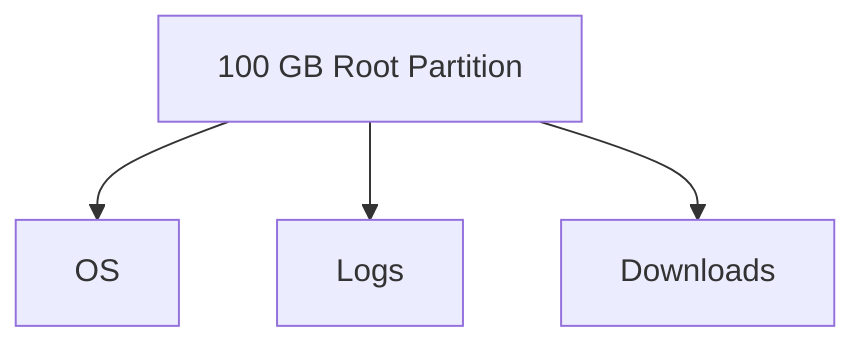

Now imagine logs grow endlessly.

```text
/var/log = 100 GB
```

Result:

```text
Disk Full
```

Operating system may stop functioning properly.

---

If `/var` is a separate partition:

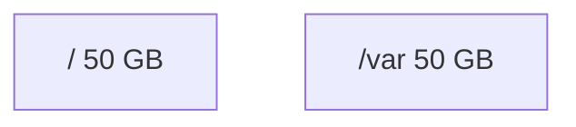

Logs can only fill `/var`.

Root filesystem remains safe.

This is why servers often separate:

```text
/
/var
/home
/tmp
```

---

# How Are Directories Related To Partitions?

This is the concept that confuses most beginners.

Directory:

```text
/home
```

Partition:

```text
/dev/sda3
```

Linux can connect them together.

Example:

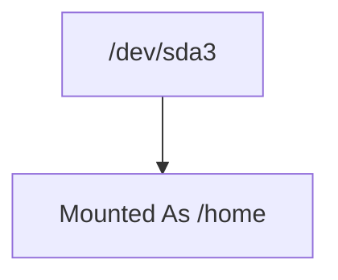

Now whenever someone accesses:

```text
/home
```

they are actually using:

```text
/dev/sda3
```

This is called a **mount point**.

---

# What is Booting?

Booting = Starting a computer.

Process:

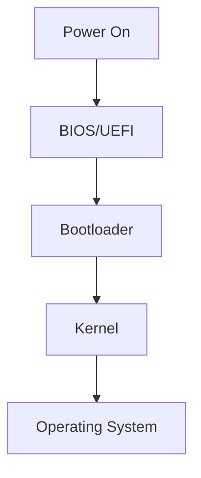

When you press the power button:

1. Hardware starts
    
2. BIOS/UEFI runs
    
3. Bootloader runs
    
4. Linux kernel loads
    
5. Kali starts
    

---

# What is Dual Boot?

Two operating systems on the same computer.

Example:

```text
Windows
Kali Linux
```

At startup:

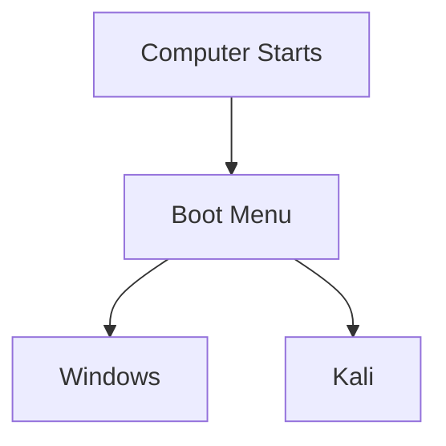

You choose which OS to run.

Only one runs at a time.

---

# What is RAID?

**RAID = Redundant Array of Independent Disks**

Multiple disks combined together.

Example:

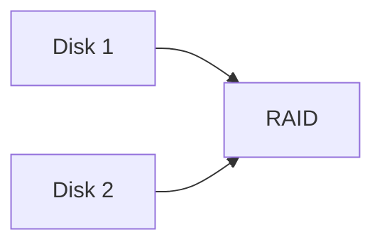

Reasons:

- Redundancy
    
- Speed
    
- High availability
    

Example RAID 1:

```text
Disk 1 = Copy
Disk 2 = Copy
```

If one disk dies:

```text
Data survives
```

---

# What is BIOS?

**BIOS = Basic Input/Output System**

Firmware stored on the motherboard.

Its job:

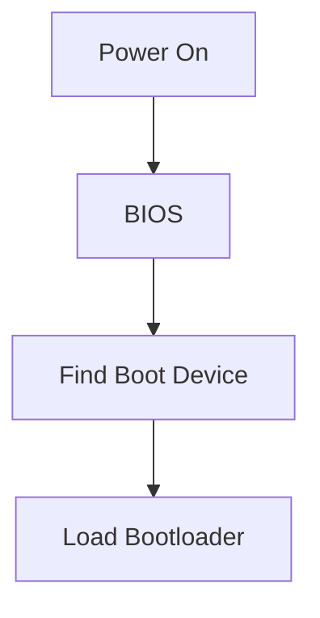

Modern systems often use:

```text
UEFI
```

instead of BIOS.

---

# What is Disk Encryption?

Encryption protects data stored on disk.

Without encryption:

```text
Steal Laptop
↓
Read Disk
↓
Read Files
```

With encryption:

```text
Steal Laptop
↓
Read Disk
↓
Encrypted Garbage
```

Example:

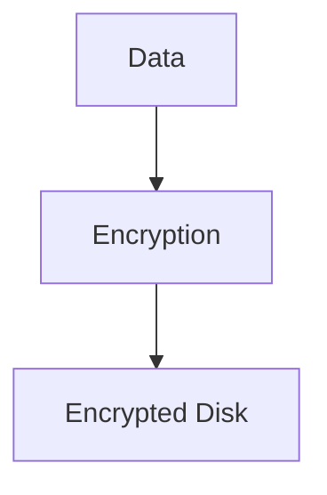

You need a password/key to access it.

---

# What is a Logical Volume?

Normal partition:

```text
/dev/sda1
```

Logical volume:

```text
/home
```

created through LVM.

Example:

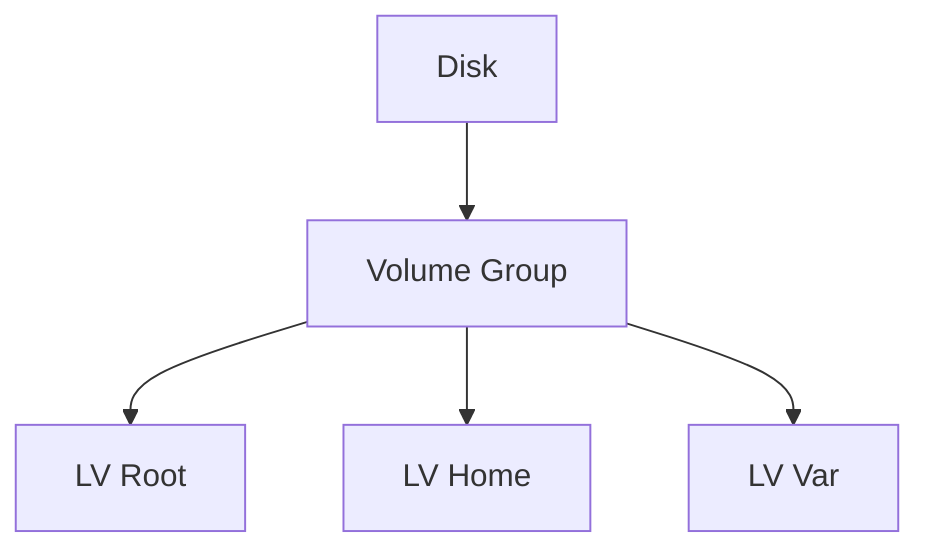

A logical volume behaves like a partition but is more flexible.

Benefits:

- Resize later
    
- Move between disks
    
- Easier management
    

Think:

```text
Partition = Physical Room

Logical Volume = Virtual Room
```

The walls can be moved without rebuilding the house.

---

# Quick Revision

| Term            | One-Line Meaning                      |
| --------------- | ------------------------------------- |
| LVM             | Flexible partition management         |
| Swap            | Disk used as overflow RAM             |
| `/`             | Root of Linux filesystem              |
| `/home`         | User files                            |
| `/var`          | Logs, databases, service data         |
| Mount Point     | Directory connected to a partition    |
| Booting         | Starting the operating system         |
| Dual Boot       | Two OSes on one machine               |
| RAID            | Multiple disks working together       |
| BIOS/UEFI       | Firmware that starts the boot process |
| Disk Encryption | Protects data at rest                 |
| Logical Volume  | Flexible LVM-based partition          |