Perfect. For Obsidian notes, I'd focus on **what Manual Partitioning gives you**, **when to use it**, and **what options you get for each partition**.

---

# Manual Partitioning

Manual partitioning gives full control over:

- Partition sizes
    
- Mount points
    
- Filesystems
    
- Dual boot layouts
    
- RAID
    
- LVM
    
- Encryption
    

Unlike Guided mode, the installer does **not** automatically create partitions.

You decide everything.

---

# When To Use Manual Partitioning

Use Manual mode when you need:

```text
Dual Boot
Custom Partition Sizes
RAID
LVM
Encryption
Resize Existing Partitions
```

Examples:

- Install Kali alongside Windows
    
- Separate `/home`
    
- Create custom swap size
    
- Use multiple disks
    

⚠️ Easier to make mistakes and lose data.

---

# Common Dual Boot Scenario

If Windows already occupies the entire disk:

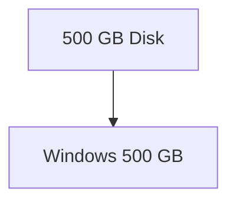

You first shrink Windows:

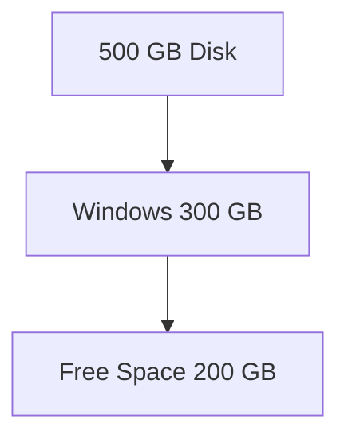

Then install Kali into the new free space.

The installer can resize Windows FAT/NTFS partitions automatically.

---

# Manual Partitioning Workflow

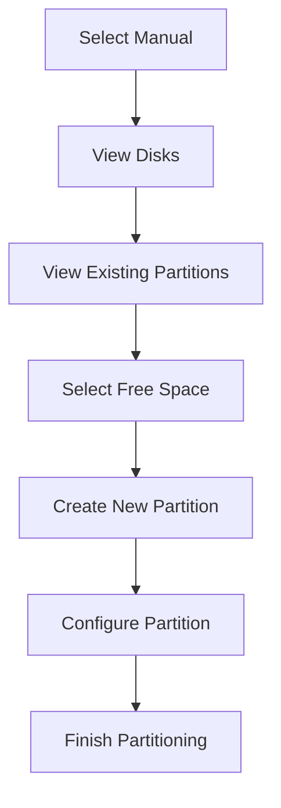

---

# New Disk Scenario

If the disk is empty:

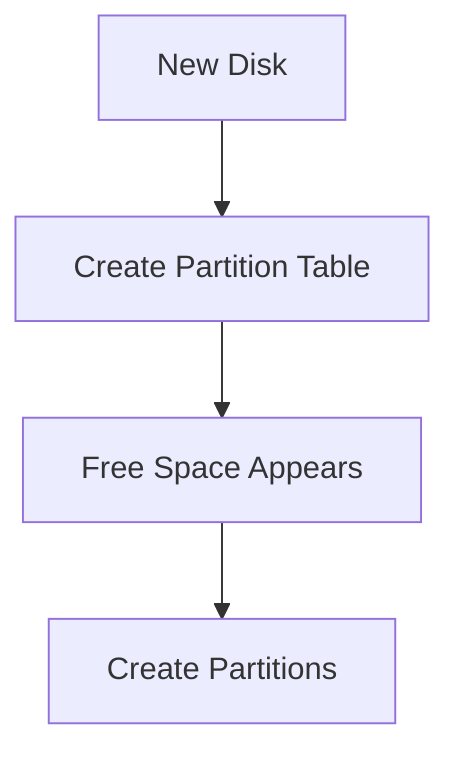

Before partitions can exist:

```text
Disk
→ Partition Table
→ Partitions
→ Filesystem
```

---

# Free Space Options

When free space is selected:

## Option 1

Create a single partition.

Example:

```text
100 GB Free Space
↓
Create 50 GB Partition
```

---

## Option 2

Use guided partitioning inside the free space.

Example:

```text
Windows
+
200 GB Free Space

↓
Guided Partitioning
```

Installer creates:

```text
/
/home
swap
```

inside that free space automatically.

Useful for dual boot systems.

---

# Primary vs Logical Partitions

(MSDOS / MBR only)

## Primary Partition

Direct partition on disk.

Maximum:

```text
4 Primary Partitions
```

---

## Logical Partition

Created inside an Extended Partition.

Allows many more partitions.

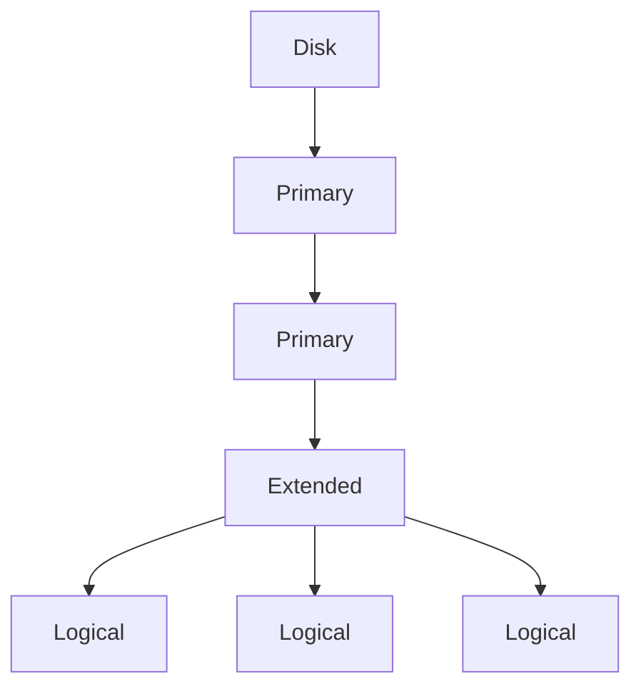

Historically:

```text
/boot
```

needed to be on a primary partition.

---

# Partition Configuration Options

After creating a partition, you choose what it will be used for.

---

## 1. Root Partition (/)

Mount Point:

```text
/
```

Contains:

```text
Kernel
System Files
Applications
Libraries
```

This is the actual Kali installation.

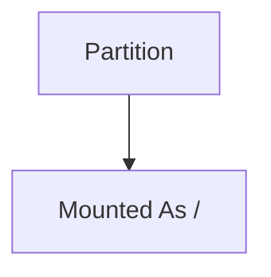

---

## 2. Home Partition (/home)

Mount Point:

```text
/home
```

Contains:

```text
Downloads
Documents
Pictures
Projects
```

User data is separated from OS files.

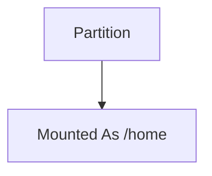

---

## 3. Swap Partition

Used when RAM becomes full.

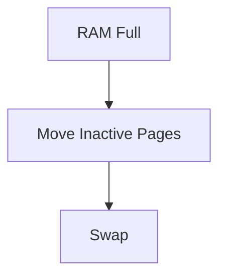

Acts as overflow memory.

Linux uses a dedicated swap partition instead of a swap file by default.

---

## 4. Physical Volume For Encryption

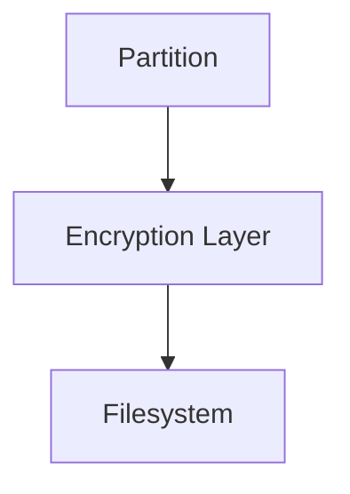

Protects stored data if disk is stolen.

Requires decryption during boot.

---

## 5. Physical Volume For LVM

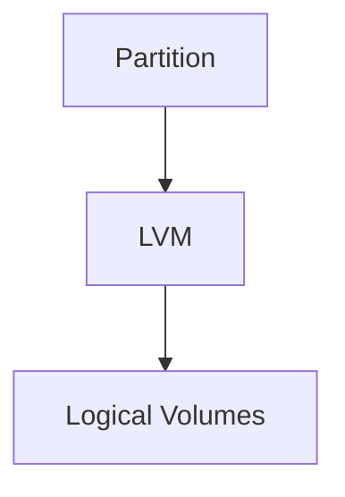

Used for flexible storage management.

Allows resizing more easily later.

---

## 6. RAID Device

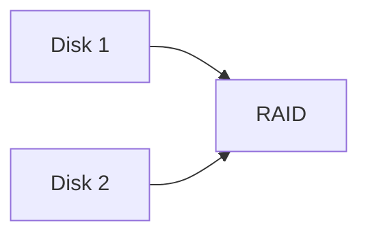

Used for:

- Redundancy
    
- Fault tolerance
    
- Performance
    

Requires multiple disks.

---

## 7. Do Not Use

Partition remains untouched.

Useful when:

- Preserving Windows partitions
    
- Keeping recovery partitions
    
- Leaving storage unused
    

---

# Finish Or Undo

After reviewing partitions:

### Save Changes

```text
Finish partitioning and write changes to disk
```

Writes changes permanently.

---

### Cancel Changes

```text
Undo changes to partitions
```

Reverts all pending partition modifications.

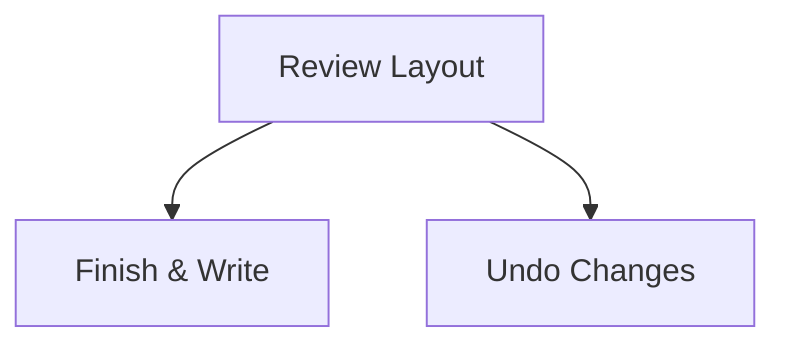

---

# Exam / Lab Summary

|Option|Purpose|
|---|---|
|`/`|Kali OS|
|`/home`|User files|
|`swap`|Overflow RAM|
|Encryption|Protect disk data|
|LVM|Flexible storage|
|RAID|Multiple-disk redundancy|
|Primary Partition|Direct partition on disk|
|Logical Partition|Partition inside extended partition|
|Manual Mode|Full partition control|
|Guided Mode|Automatic partition creation|