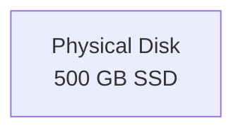
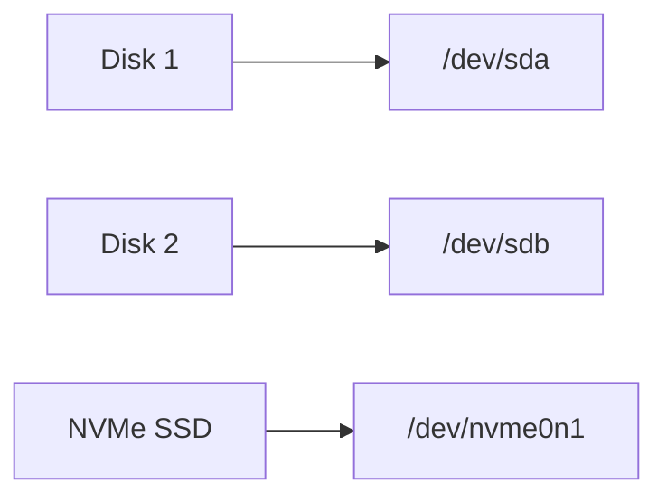
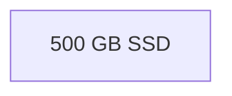
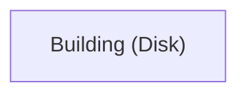
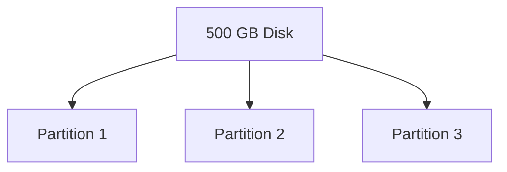
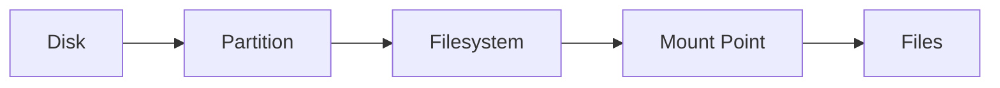

# Partitioning Fundamentals

Before touching the Kali installer screens, we need to understand **how Linux views storage**.

Most confusion happens because people memorize installer screens without understanding disks, partitions, filesystems, and mount points.

---

# Step 1: What is a Disk?

A disk is the physical storage device.

Examples:

- HDD (Hard Disk Drive)
    
- SSD (Solid State Drive)
    
- NVMe SSD
    
- USB Drive
    

Think of a disk as an **empty piece of land**.



Or:

```text
500 GB SSD
```

At this point:

- No operating system
    
- No files
    
- No folders
    

Just raw storage.

---

# How Linux Names Disks

Linux doesn't use:

```text
C:
D:
E:
```

like Windows.

Instead it creates device files inside:

```text
/dev
```

Examples:

|Device|Meaning|
|---|---|
|/dev/sda|First SATA/SCSI disk|
|/dev/sdb|Second SATA/SCSI disk|
|/dev/sdc|Third SATA/SCSI disk|
|/dev/nvme0n1|First NVMe SSD|

Example:



---

# Real Example

Suppose your laptop contains:

```text
512 GB SSD
```

Linux may detect:

```text
/dev/nvme0n1
```

If you attach a USB:

```text
16 GB USB
```

Linux may detect:

```text
/dev/sdb
```

This is exactly what you saw earlier with:

```text
[sdb] Attached removable disk
```

during the `dmesg` output.

---

# Why Does Linux Put Disks Under /dev?

In Linux:

> Everything is treated like a file.

Disk?

```text
/dev/sda
```

USB?

```text
/dev/sdb
```

Keyboard?

```text
/dev/input/*
```

This allows tools like:

```bash
dd
fdisk
parted
```

to directly interact with hardware.

---

# Visualizing a Disk

Imagine buying a brand-new SSD.



No partitions.

No filesystems.

No folders.

Just storage.

---

# Analogy: Apartment Building

Think of a disk as an empty apartment building.



The building exists.

But:

- No rooms
    
- No furniture
    
- Nobody living there
    

We need to divide it into usable sections.

That's where partitions come in.

---

# Why Can't Linux Install Directly On The Disk?

Imagine trying to store:

- OS files
    
- User files
    
- Logs
    
- Temporary files
    

on a giant undefined block of storage.

Chaos.

We first organize the disk.

```text
Disk
↓
Partitions
↓
Filesystems
↓
Folders
↓
Files
```

This entire process starts with partitioning.

---

# Important Interview Question

### Is a Disk and a Partition the same thing?

**No.**

Disk:

```text
Physical storage device
```

Partition:

```text
Logical section of that storage
```

Example:



One disk can contain many partitions.

---

# Key Takeaways

### Disk

```text
Physical storage device
```

Examples:

```text
SSD
HDD
NVMe
USB
```

---

### Linux Disk Names

```text
/dev/sda
/dev/sdb
/dev/sdc
/dev/nvme0n1
```

---

### Important Concept

```text
Disk = Physical Storage

Partition = Logical Division
```

---

### Installation Flow



# Next Topic

**What exactly is a Partition?**

This is where most people coming from Windows finally understand why Linux uses `/`, `/home`, swap, and separate partitions.