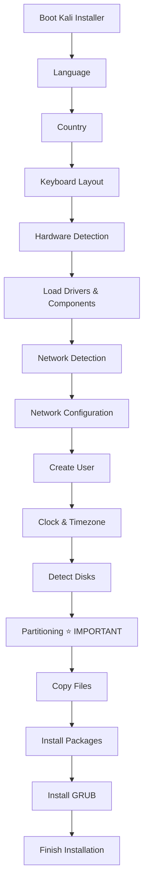
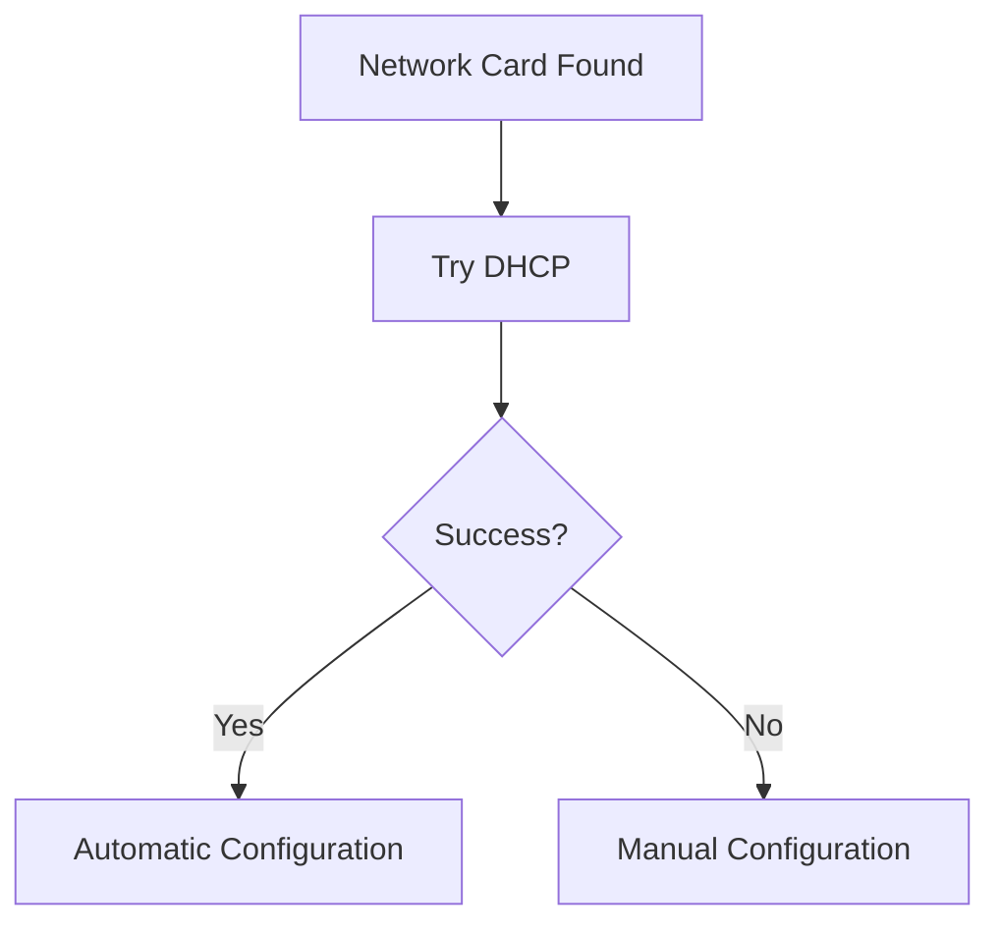
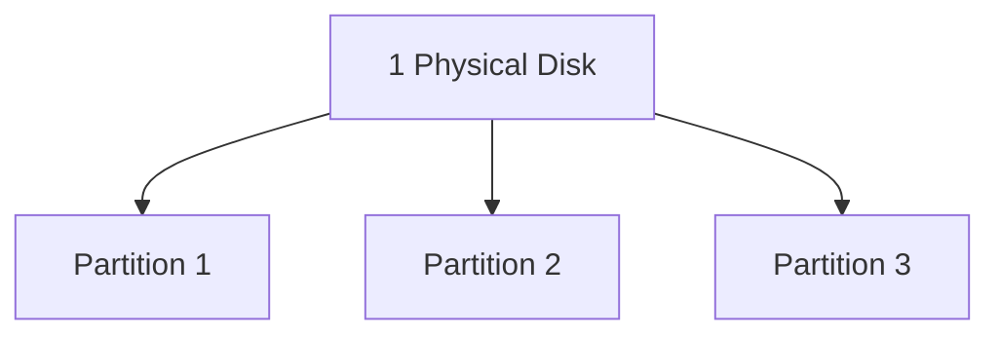

# 5.2.1 Plain Installation

> For notes, don't spend much time memorizing the screens before partitioning. Most of them are simple setup questions. The important topic starts at **Partitioning**.

---

# Installation Flow Overview



---

# Everything Before Partitioning (Quick Notes)

## 1. Booting the Installer

When booting from USB/DVD, Kali shows a boot menu.

Options:

- Graphical Install
    
- Install (Text Mode)
    

Both do the same thing.

```text
Graphical = GUI
Install = Text Mode

Same questions
Same result
```

You can press **Tab** to edit kernel boot parameters before booting.

---

## 2. Language, Country & Keyboard

Installer asks:

1. Language
    
2. Country
    
3. Keyboard Layout
    

Purpose:

- Select language for installer
    
- Select timezone defaults
    
- Select correct keyboard mapping
    

Example:

```text
Language = English
Country = India
Keyboard = US QWERTY
```

Nothing complicated here.

---

## 3. Hardware Detection

Installer automatically detects:

- CPU
    
- Storage
    
- USB devices
    
- Graphics hardware
    
- Other peripherals
    

Think of it as:

```text
"Let's see what hardware exists
before installing Linux."
```

Usually requires no user action.

---

## 4. Network Detection & Configuration

Installer tries:

```text
DHCP
```

to automatically obtain:

- IP Address
    
- Gateway
    
- DNS Server
    

If DHCP fails:

You can manually enter:

- IP
    
- Subnet Mask
    
- Gateway
    
- Hostname
    
- Domain Name
    



Important for:

- Netinstall images
    
- Downloading packages during installation
    

---

## 5. User Creation

Kali creates a normal user account.

That user is automatically added to:

```text
sudo group
```

Meaning:

```text
Normal User
+
sudo
=
Administrator Access
```

Choose:

- Username
    
- Strong Password
    

Avoid:

```text
123456
password
kali123
birthday
family names
```

Use long passwords.

---

## 6. Clock & Timezone

If internet is available:

Kali contacts an:

```text
NTP Server
```

to synchronize time.

Benefits:

- Accurate logs
    
- Correct timestamps
    
- Easier troubleshooting
    

If country has multiple timezones:

Installer asks which timezone to use.

---

## 7. Detecting Disks and Other Devices

Before partitioning, installer scans:

- HDDs
    
- SSDs
    
- NVMe drives
    
- USB storage
    

Goal:

```text
Find all storage devices
available for installation.
```

After detection, Kali enters the most important stage:

# ⭐ Partitioning

---

# What Is Partitioning? (Preview)

Think of a hard disk as an empty apartment building.



Example:

```text
500 GB SSD

├── C: Windows      200 GB
├── Kali Root       250 GB
└── Swap             50 GB
```

A partition is simply:

> A logical division of a physical disk.

---

# Why Partitioning Matters

Partitioning decides:

- Where Kali will live
    
- Where user files will live
    
- How Linux manages storage
    
- Whether Windows and Kali can coexist
    
- Whether encryption can be enabled
    

Bad partitioning decisions can:

❌ Waste space

❌ Cause reinstall headaches

❌ Cause dual-boot issues

❌ Increase risk of data loss

Good partitioning decisions can:

✅ Make upgrades easier

✅ Protect user data

✅ Improve organization

✅ Support encryption

---

# The Big Topics We'll Cover Next

Partitioning is where most beginners get confused.

We'll break it down in detail:

1. What is a Disk?
    
2. What is a Partition?
    
3. What is a Filesystem?
    
4. What is Mounting?
    
5. What is `/` (root)?
    
6. What is `/home`?
    
7. What is `/var`?
    
8. What is `/tmp`?
    
9. What is Swap?
    
10. Guided vs Manual Partitioning
    
11. LVM
    
12. Encryption
    
13. Dual Boot with Windows
    
14. How Linux actually sees disks (`/dev/sda`, `/dev/nvme0n1`, etc.)
    

Once you understand those concepts, the actual Kali partitioning screens become extremely easy.