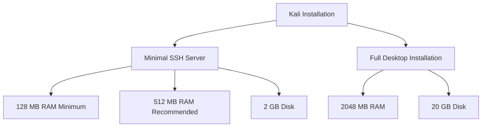
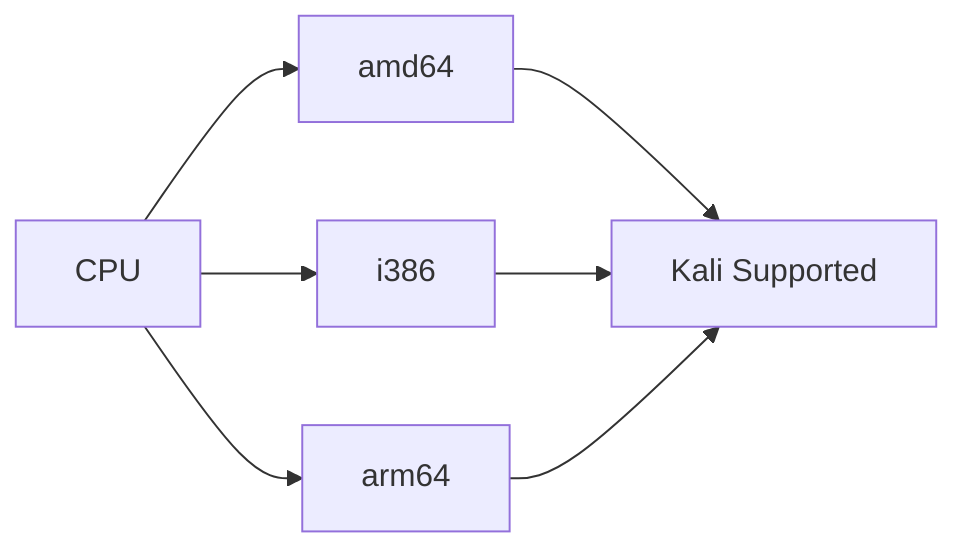
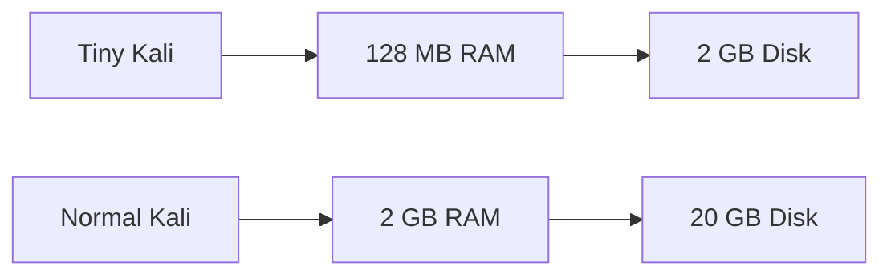

## 5.1 Minimal Installation Requirements

Before installing Kali Linux, ensure your system meets the minimum hardware requirements.

---

# Why Requirements Matter

The resources required depend on **how Kali will be used**.

A minimal SSH-only server requires very little hardware.

A full desktop installation with all default tools requires significantly more resources.



---

# Minimum Requirements

## Option 1: SSH Server Only

Use this when:

- Learning Linux remotely
    
- Running Kali on very old hardware
    
- Using Kali as a lightweight server
    

### Requirements

|Resource|Requirement|
|---|---|
|RAM|128 MB Minimum|
|RAM|512 MB Recommended|
|Disk Space|2 GB|

---

## Option 2: Full Kali Desktop

Use this when:

- Running Kali normally
    
- Following training courses
    
- Performing penetration testing
    
- Using the Xfce desktop environment
    

### Requirements

|Resource|Requirement|
|---|---|
|RAM|2048 MB (2 GB)|
|Disk Space|20 GB|

---

# CPU Architecture Requirements

Kali Linux only works on supported CPU architectures.

Supported architectures:

|Architecture|Description|
|---|---|
|amd64|Modern 64-bit Intel/AMD CPUs|
|i386|Older 32-bit CPUs|
|arm64|ARM-based systems (Raspberry Pi, Apple Silicon VMs, etc.)|



---

# Recommended Lab Setup

For learning Kali in:

- VMware
    
- VirtualBox
    
- UTM
    
- Parallels
    

Use:

|Resource|Recommended|
|---|---|
|CPU|2 vCPU|
|RAM|4 GB|
|Disk|40 GB|
|Network|NAT|

This exceeds the minimum requirements and provides a smoother experience.

---

# Exam / Interview Notes

### Minimum SSH Installation

```text
RAM: 128 MB minimum
RAM: 512 MB recommended
Disk: 2 GB
```

### Full Desktop Installation

```text
RAM: 2048 MB (2 GB)
Disk: 20 GB
```

### Supported Architectures

```text
amd64
i386
arm64
```

---

# Quick Memory Trick



### Remember

```text
SSH Server  = 128 MB + 2 GB
Desktop Kali = 2 GB + 20 GB
```

Source: Kali Linux Chapter 5.1 Minimal Installation Requirements.

---