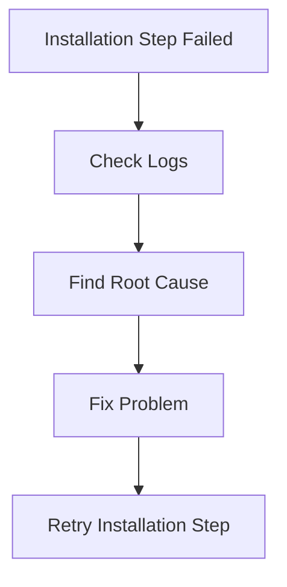
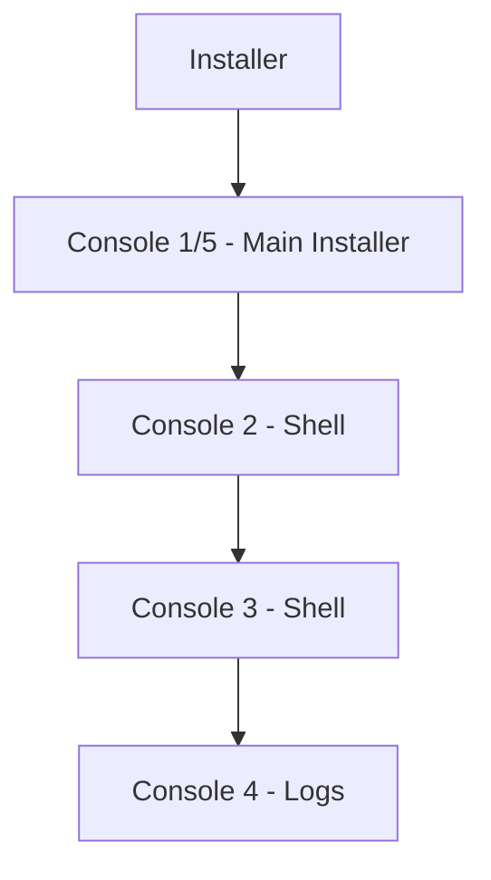
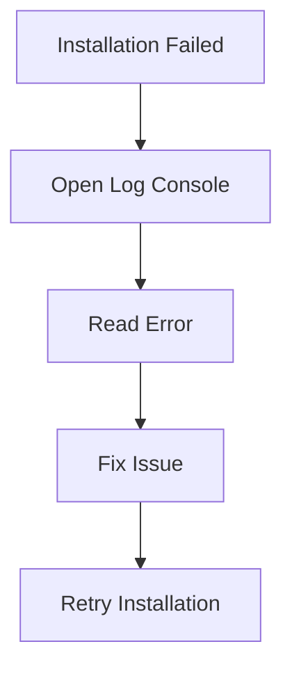
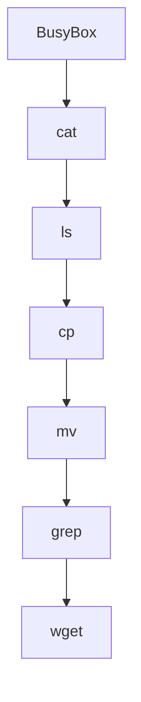
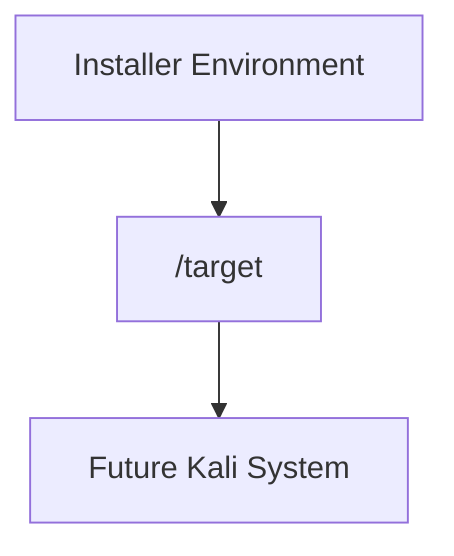
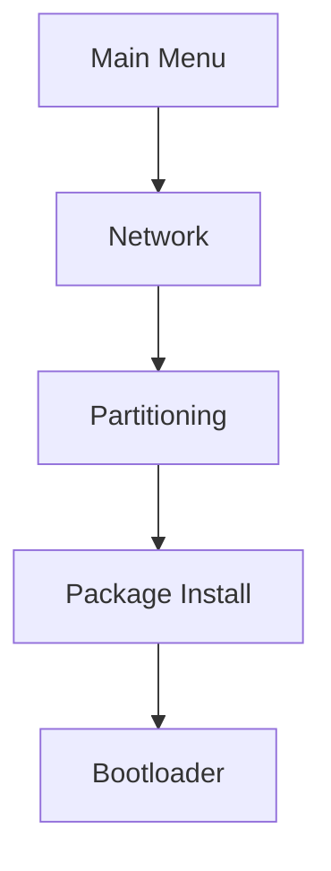
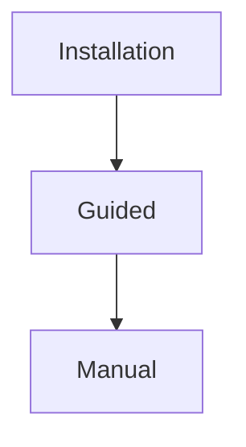

# 5.5 Troubleshooting Installations

> Even though the Kali installer is reliable, installation can fail due to network issues, bad mirrors, insufficient disk space, hardware issues, or installer bugs.

---

# When Installation Fails

You may see:

```text
Installation Step Failed
```

Unfortunately this screen usually doesn't tell you the real problem.



---

# Virtual Consoles

The Kali installer runs multiple consoles simultaneously.

Think of them as multiple terminals running in parallel.



---

# Important Console Shortcuts

|Console|Purpose|
|---|---|
|CTRL+ALT+F1|Text Installer|
|CTRL+ALT+F5|Graphical Installer|
|CTRL+ALT+F2|Troubleshooting Shell|
|CTRL+ALT+F3|Troubleshooting Shell|
|CTRL+ALT+F4|Installation Logs|

---

# First Thing To Check: Logs

When installation fails:

```text
CTRL + ALT + F4
```

This opens:

```text
Installer Logs
```

Example:

```text
No space left on device
```

instead of the generic:

```text
Installation Failed
```

message.

---

# Troubleshooting Workflow



---

# Installer Shell

Two shell consoles are available:

```text
CTRL + ALT + F2
CTRL + ALT + F3
```

These provide Linux shell access while installation is running.

Think:

```text
Emergency Terminal
```

for debugging.

---

# What Is BusyBox?

The installer shell is not a full Kali system.

Instead it uses:

```text
BusyBox
```

---

## What Is BusyBox?

BusyBox is often called:

```text
Swiss Army Knife of Linux
```

It combines many Linux commands into a single small executable.



---

## Why BusyBox?

During installation:

```text
No full OS exists yet
```

So installer uses a lightweight toolkit.

Advantages:

- Tiny size
    
- Fast
    
- Works in RAM
    
- Contains essential tools
    

---

# Useful Commands In Installer Shell

## View Files

```bash
cat filename
```

or

```bash
less filename
```

Example:

```bash
less /var/log/syslog
```

---

## Edit Files

```bash
nano filename
```

Example:

```bash
nano /etc/hosts
```

---

## Download Files

```bash
wget URL
```

Example:

```bash
wget http://example.com/file.txt
```

---

## Network Testing

```bash
nc
```

(Netcat)

Useful for:

- Testing ports
    
- Sending data
    
- Debugging network issues
    

---

# What Is /var/log/syslog?

Main installer log file.

```text
/var/log/syslog
```

Contains:

- Installer events
    
- Errors
    
- Warnings
    
- Package installation logs
    

Think:

```text
Black Box Recorder
```

for the installation process.

---

# What Is /target?

After partitioning completes:

```text
/target
```

appears.

---

## Why?

Remember:

Kali isn't running yet.

The installer is running.

Your future Kali system is being built elsewhere.



---

Example:

```text
/target/etc/passwd
```

is the passwd file of the system being installed.

Not the installer itself.

---

# Debconf Debugging

You learned earlier:

```text
Debconf
=
Question & Answer Engine
```

Installer answers are stored in a database.

---

## View Values

```bash
debconf-get
```

Example:

```text
Show current installer answers
```

---

## Change Values

```bash
debconf-set
```

Example:

```text
Modify installer answer
```

Very useful when testing:

```text
Preseed Files
Unattended Installations
```

---

# Retrying Failed Steps

After clicking:

```text
Continue
```

you reach:

```text
Main Menu
```

Normally hidden during installation.

---

## Main Menu Allows



You can rerun only the failed step instead of restarting the entire installation.

---

# Save Debug Logs

If problem cannot be fixed:

```text
Save Debug Logs
```

from installer menu.

---

# Best Method

Installer can start a temporary web server.


This exports:

- Log files
    
- Screenshots
    
- Debug information
    

for bug reports.

---

# Common Installation Problems

## 1. Insufficient Disk Space

Symptoms:

```text
Installation stops
```

Check:

```text
CTRL + ALT + F4
```

Look for:

```text
No space left on device
```

---

## 2. Network Problems

Symptoms:

```text
Cannot Download Packages
```

Check:

```bash
ip addr
ping
wget
```

---

## 3. Bad Mirror

Symptoms:

```text
Package Download Failures
```

Fix:

```text
Choose another mirror
```

---

## 4. Wrong Partitioning

Symptoms:

```text
Installation Cannot Continue
```

Fix:

```text
Review disk layout
```

---

# Chapter Summary

## Minimum Requirements

|Installation Type|RAM|Disk|
|---|---|---|
|SSH Only|128 MB|2 GB|
|Recommended SSH|512 MB|2 GB|
|Desktop Kali|2 GB|20 GB|

---

## Storage Technologies

|Technology|Purpose|
|---|---|
|LUKS|Encryption|
|LVM|Flexible Storage|
|Swap|Overflow RAM|
|RAID|Multiple-Disk Storage|

---

## Installation Types



---

## Unattended Installation

```text
Debconf
+
Preseed File
=
Automatic Installation
```

---

## Troubleshooting Cheatsheet

|Action|Shortcut|
|---|---|
|Main Installer|CTRL+ALT+F1 or F5|
|Shell 1|CTRL+ALT+F2|
|Shell 2|CTRL+ALT+F3|
|Logs|CTRL+ALT+F4|

---

# Quick Exam Notes

```text
Debconf = Installer Question Engine

Preseed = Automated Answers

BusyBox = Lightweight Linux Toolkit

/target = Future Installed System

/var/log/syslog = Main Installer Log

CTRL+ALT+F4 = Most Useful Troubleshooting Screen
```