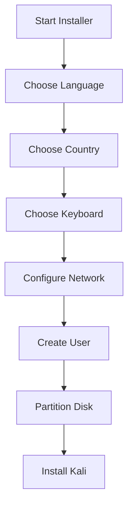
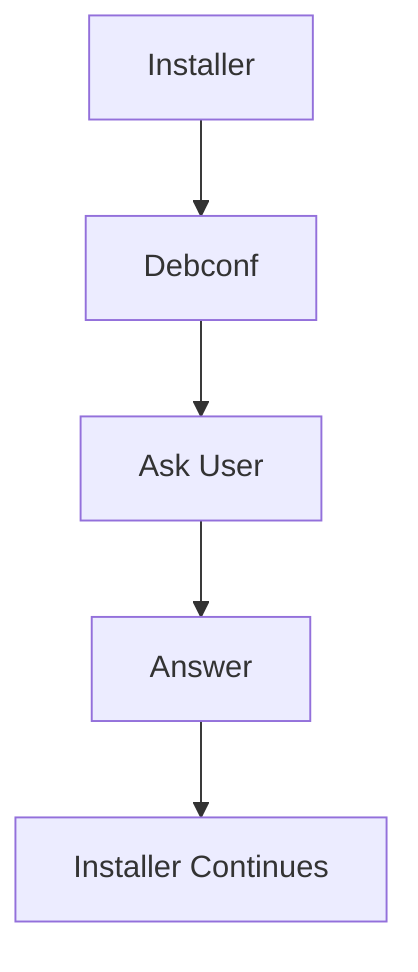
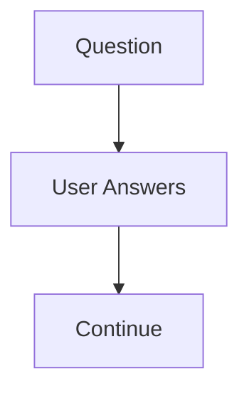
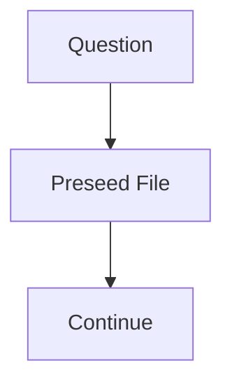
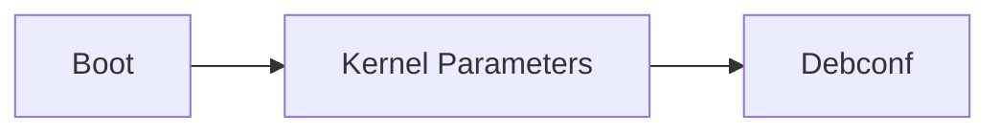
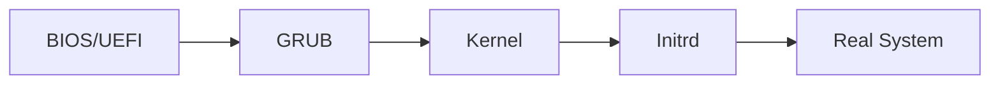
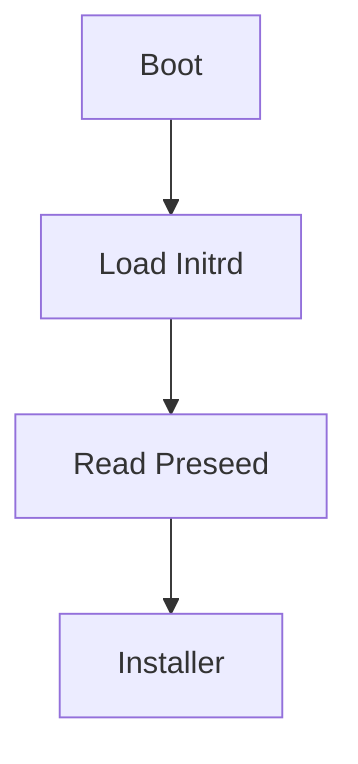
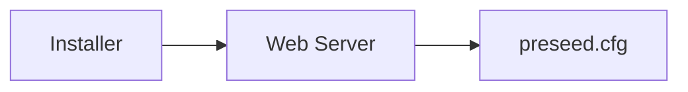
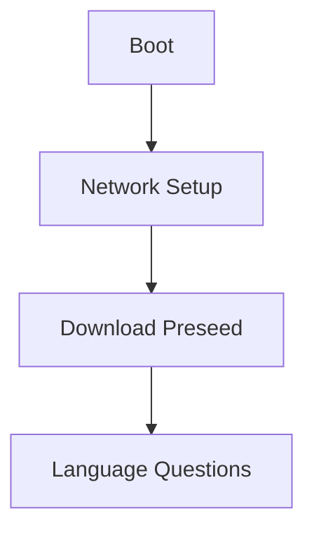

---

# The Real Problem

Normal installation:



Human answers every question.

Works fine for:

```text
1 laptop
1 VM
```

Terrible for:

```text
100 laptops
1000 servers
Cloud deployments
```

---

# What Is Debconf?

Think of Debconf as:

```text
Question & Answer Engine
for Debian/Kali
```

The installer itself doesn't really know:

```text
Language?
Country?
Hostname?
Timezone?
Disk Layout?
```

Instead it asks Debconf.

---

# Normal Installation



Example:

```text
Language?
```

You answer:

```text
English
```

Debconf stores:

```text
language = English
```

and installer continues.

---

# Important Realization

The Kali installer is basically:

```text
Lots of scripts
+
Debconf
```

The book mentions:

```text
Installer
=
Many small scripts (udebs)
+
Debconf
```

Each script asks Debconf for information.

---

# What Is a udeb?

Normal package:

```text
.deb
```

Installer package:

```text
.udeb
```

Think:

```text
Tiny installation package
```

Used only during installation.

Example:

```text
Network Detection Script
Partitioning Script
User Creation Script
```

---

# What Is Preseeding?

Preseeding means:

```text
Answer installer questions
before they are asked
```

---

Normal install:

```text
Language?
Country?
Keyboard?
Hostname?
```

---

Preseeded install:

```text
Language = English
Country = India
Keyboard = US
Hostname = kali
```

Installer already knows answers.

No questions asked.

---

# Normal vs Preseeded

Normal:



Preseed:



---

# Real Example

Normally:

```text
Language?
```

You type:

```text
English
```

Preseed:

```text
language=en
```

Installer already knows.

No interaction required.

---

# What Is An Unattended Installation?

Unattended installation means:

```text
Start Install
Walk Away
Come Back Later
Kali Installed
```

No user interaction.

---

# Ways To Preseed Answers

There are four major methods.

---

# Method 1: Boot Parameters

You pass answers at boot time.

Example:

```text
language=en
hostname=kali
```

Boot flow:



Example:

```text
debian-installer/language=en
```

or shorter:

```text
language=en
```

---

## Advantage

Available immediately.

Can answer:

```text
Language
Country
Keyboard
```

---

## Disadvantage

Kernel command line is limited.

Too many answers become messy.

---

# Method 2: Preseed Inside Initrd

First understand Initrd.

---

# What Is Initrd?

Remember boot process:



Initrd:

```text
Initial RAM Disk
```

Tiny temporary filesystem loaded before Linux starts.

---

Think:

```text
Emergency Toolkit
used during boot
```

---

If preseed.cfg exists inside initrd:



Advantages:

```text
Available immediately
```

Can answer every question.

---

# Method 3: Preseed From USB/DVD

Place:

```text
preseed.cfg
```

on installation media.

Example:

```text
USB
├── Kali ISO
└── preseed.cfg
```

Installer loads it after USB is mounted.

---

Limitation:

Cannot answer:

```text
Language
Country
Keyboard
```

because those questions happen first.

---

# Method 4: Preseed From Network

Installer downloads:

```text
http://server/preseed.cfg
```

Example:



Advantages:

```text
Centralized
Easy Updates
```

Perfect for enterprises.

---

Limitation:

Network must already work.

Therefore can't answer:

```text
Language
Country
Keyboard
Hostname
```

because networking isn't configured yet.

---

# What Is auto=true?

Problem:

Network preseed can't answer:

```text
Language
Country
Keyboard
```

because those questions happen before networking.

---

Solution:

```text
auto=true
```

or

```text
auto-install/enable=true
```

This delays those questions.



Now the downloaded file can answer them.

---

# What Is A Preseed File?

Just a text file.

Example:

```text
d-i netcfg/get_hostname string kali
d-i passwd/username string aditya
d-i time/zone string Asia/Kolkata
```

Each line answers one question.

---

# Structure of a Preseed Line

Example:

```text
d-i mirror/suite string kali-rolling
```

Split:

|Part|Meaning|
|---|---|
|d-i|Installer component|
|mirror/suite|Question|
|string|Data type|
|kali-rolling|Answer|

---

# Real Enterprise Example

Imagine Cisco wants:

```text
1000 Kali VMs
```

All should have:

```text
Language = English
Timezone = UTC
User = analyst
Partition = Automatic
```

Without preseed:

```text
1000 manual installs
```

With preseed:

```text
Boot VM
↓
Install Automatically
↓
Done
```

---

# What Is priority=critical?

Normally Debconf asks:

```text
Language
Country
Keyboard
...
```

Many questions.

With:

```text
priority=critical
```

Debconf asks only critical questions.

Everything else:

```text
Uses Defaults
```

---

# One-Line Summary

```text
Debconf = Question Engine

Preseed = Answer File

Unattended Installation =
Debconf Reads Preseed
Instead Of Asking Human
```

That's the entire chapter in one sentence. 🚀