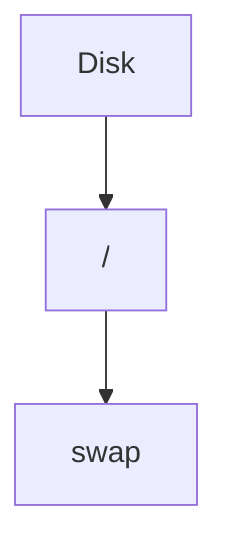
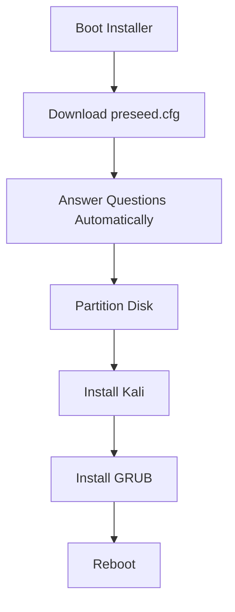

```
d-i debian-installer/locale string en_US.UTF-8
d-i console-keymaps-at/keymap select us
d-i mirror/country string enter information manually
d-i mirror/http/hostname string http.kali.org
d-i mirror/http/directory string /kali
d-i keyboard-configuration/xkb-keymap select us
d-i mirror/http/proxy string
d-i mirror/suite string kali-rolling
d-i mirror/codename string kali-rolling

d-i clock-setup/utc boolean true
d-i time/zone string US/Eastern

# Disable security, volatile and backports
d-i apt-setup/services-select multiselect 

# Enable contrib and non-free
d-i apt-setup/non-free boolean true
d-i apt-setup/contrib boolean true

# Disable source repositories too
d-i apt-setup/enable-source-repositories boolean false

# Partitioning
d-i partman-auto/method string regular
d-i partman-lvm/device_remove_lvm boolean true
d-i partman-md/device_remove_md boolean true
d-i partman-lvm/confirm boolean true
d-i partman-auto/choose_recipe select atomic
d-i partman-auto/disk string /dev/sda
d-i partman/confirm_write_new_label boolean true
d-i partman/choose_partition select finish
d-i partman/confirm boolean true
d-i partman/confirm_nooverwrite boolean true
d-i partman-partitioning/confirm_write_new_label boolean true

# Disable CDROM entries after install
d-i apt-setup/disable-cdrom-entries boolean true

# Upgrade installed packages
d-i pkgsel/upgrade select full-upgrade

# Change default hostname
d-i netcfg/get_hostname string kali
d-i netcfg/get_domain string unassigned-domain

#d-i netcfg/choose_interface select auto
d-i netcfg/choose_interface select eth0
d-i netcfg/dhcp_timeout string 60
d-i hw-detect/load_firmware boolean false

# Do not create a normal user account
d-i passwd/make-user boolean false
d-i passwd/root-password password toor
d-i passwd/root-password-again password toor

d-i apt-setup/use_mirror boolean true
d-i grub-installer/only_debian boolean true
d-i grub-installer/with_other_os boolean false
d-i grub-installer/bootdev string /dev/sda
d-i finish-install/reboot_in_progress note

# Disable popularity-contest
popularity-contest popularity-contest/participate boolean false

kismet kismet/install-setuid boolean false
kismet kismet/install-users string

sslh sslh/inetd_or_standalone select standalone

mysql-server-5.5 mysql-server/root_password_again password
mysql-server-5.5 mysql-server/root_password password
mysql-server-5.5 mysql-server/error_setting_password error
mysql-server-5.5 mysql-server-5.5/postrm_remove_databases boolean false
mysql-server-5.5 mysql-server-5.5/start_on_boot boolean true
mysql-server-5.5 mysql-server-5.5/nis_warning note
mysql-server-5.5 mysql-server-5.5/really_downgrade boolean false
mysql-server-5.5 mysql-server/password_mismatch error
mysql-server-5.5 mysql-server/no_upgrade_when_using_ndb error
```
---

# What Is This File?

This file is basically:

```text
A giant answer sheet
for the Kali installer
```

Normally installer asks:

```text
Language?
Keyboard?
Timezone?
Partitioning?
Hostname?
Root Password?
Install GRUB?
```

This file answers all of them automatically.

---

# General Format

Every line follows:

```text
Owner Question Type Value
```

Example:

```text
d-i debian-installer/locale string en_US.UTF-8
```

Breakdown:

|Field|Meaning|
|---|---|
|d-i|Debian Installer|
|debian-installer/locale|Question|
|string|Data Type|
|en_US.UTF-8|Answer|

Think:

```text
Question:
What locale?

Answer:
en_US.UTF-8
```

---

# Locale

```text
d-i debian-installer/locale string en_US.UTF-8
```

Means:

```text
Language = English (US)
```

Installer won't ask:

```text
Select Language
```

---

# Keyboard

```text
d-i console-keymaps-at/keymap select us

d-i keyboard-configuration/xkb-keymap select us
```

Means:

```text
Use US Keyboard Layout
```

No keyboard selection screen.

---

# Repository Configuration

```text
d-i mirror/http/hostname string http.kali.org
```

Means:

```text
Use Kali Official Repository
```

Equivalent to:

```text
https://http.kali.org
```

---

```text
d-i mirror/http/directory string /kali
```

Repository path.

Result:

```text
http.kali.org/kali
```

---

```text
d-i mirror/suite string kali-rolling
```

Use:

```text
kali-rolling
```

branch.

This is Kali's rolling release.

---

# Time Configuration

```text
d-i clock-setup/utc boolean true
```

Means:

```text
Store hardware clock in UTC
```

Common Linux practice.

---

```text
d-i time/zone string US/Eastern
```

Timezone:

```text
US/Eastern
```

No timezone prompt.

---

# Repository Features

```text
d-i apt-setup/non-free boolean true

d-i apt-setup/contrib boolean true
```

Enable:

```text
contrib
non-free
```

repositories.

Why?

Many drivers require:

```text
Firmware
Wireless Drivers
NVIDIA Drivers
```

which are not fully open source.

---

# Partitioning Section

This is the important part.

---

## Partition Method

```text
d-i partman-auto/method string regular
```

Means:

```text
No LVM
No Encryption
Normal Partitioning
```

---

## Remove Existing LVM

```text
d-i partman-lvm/device_remove_lvm boolean true
```

If old LVM exists:

```text
Delete It
```

---

## Remove Existing RAID

```text
d-i partman-md/device_remove_md boolean true
```

If old RAID exists:

```text
Delete It
```

---

## Partition Recipe

```text
d-i partman-auto/choose_recipe select atomic
```

This is important.

---

### What Is "atomic"?

In Debian/Kali:

```text
atomic
```

means:

```text
Everything In One Partition
```

Equivalent to installer option:

```text
Guided
→ All Files In One Partition
```

Creates roughly:



Simple setup.

---

## Which Disk?

```text
d-i partman-auto/disk string /dev/sda
```

Means:

```text
Install On First Disk
```

Installer will not ask.

---

## Confirm Everything

```text
d-i partman/confirm boolean true

d-i partman/confirm_nooverwrite boolean true
```

Means:

```text
Yes
Yes
Yes
Proceed
Erase Disk
Continue
```

Automatically.

---

# Package Upgrade

```text
d-i pkgsel/upgrade select full-upgrade
```

After installation:

```text
Run Full Upgrade
```

Equivalent to:

```bash
apt full-upgrade
```

---

# Hostname

```text
d-i netcfg/get_hostname string kali
```

Machine name:

```text
kali
```

---

# Domain

```text
d-i netcfg/get_domain string unassigned-domain
```

Domain name.

Result:

```text
kali.unassigned-domain
```

---

# Network Interface

```text
d-i netcfg/choose_interface select eth0
```

Use:

```text
eth0
```

network interface.

---

# DHCP Timeout

```text
d-i netcfg/dhcp_timeout string 60
```

Wait:

```text
60 seconds
```

for DHCP.

---

# Disable Firmware Prompts

```text
d-i hw-detect/load_firmware boolean false
```

Means:

```text
Don't stop
asking for firmware files
```

during installation.

---

# User Creation

This is interesting.

---

```text
d-i passwd/make-user boolean false
```

Means:

```text
Do NOT create normal user
```

---

Instead:

```text
d-i passwd/root-password password toor

d-i passwd/root-password-again password toor
```

creates only:

```text
root
```

with password:

```text
toor
```

(`root` backwards)

---

Modern Kali normally creates:

```text
kali user
```

instead of root.

This preseed is using older behavior.

---

# GRUB Installation

```text
d-i grub-installer/bootdev string /dev/sda
```

Means:

```text
Install GRUB To Disk 1
```

No prompt.

---

```text
d-i grub-installer/only_debian boolean true
```

Means:

```text
Only manage Debian/Kali systems
```

---

# Automatic Reboot

```text
d-i finish-install/reboot_in_progress note
```

Means:

```text
Installation Finished
↓
Reboot Automatically
```

---

# Disable Popularity Contest

```text
popularity-contest popularity-contest/participate boolean false
```

Means:

```text
Don't send package usage statistics
```

to Debian.

---

# Weird Stuff At Bottom

Example:

```text
mysql-server-5.5 ...
```

These are package-specific answers.

Remember:

Debconf is not only for installer.

Packages can also ask questions.

Example:

```text
MySQL Password?
```

Instead of asking:

```text
Use This Answer
```

---

# What This Installation Actually Does

If we summarize the entire file:

```text
Language: English US
Keyboard: US
Timezone: US/Eastern

Repository: kali-rolling

Disk: /dev/sda

Partitioning:
Guided
All Files In One Partition

Hostname: kali

Network:
eth0
DHCP

User:
root

Password:
toor

Install GRUB:
/dev/sda

Reboot Automatically
```

---

# The Coolest Part

Once the installer reads this file:



No human interaction is required.

That's why it's called an **Unattended Installation**. 🚀